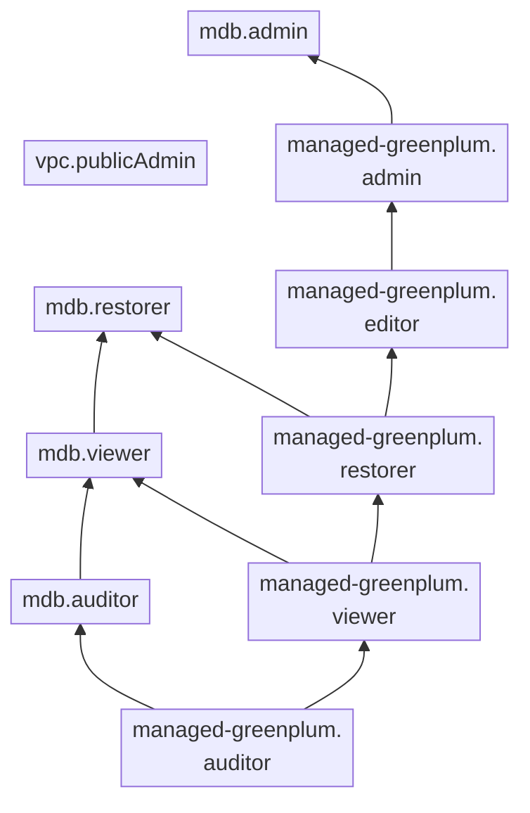

```mermaid
%%{init: { "flowchart": { "padding": 4 } } }%%
flowchart BT
    vpc.publicAdmin ~~~ mdb.admin
    mdb.auditor --> mdb.viewer
    mdb.viewer --> mdb.restorer   
    managed-greenplum.auditor["`managed-greenplum.
    auditor`"] --> mdb.auditor
    managed-greenplum.viewer["`managed-greenplum.
    viewer`"] --> mdb.viewer
    managed-greenplum.restorer["`managed-greenplum.
    restorer`"] --> mdb.restorer
    managed-greenplum.admin["`managed-greenplum.
    admin`"] --> mdb.admin
    managed-greenplum.auditor --> managed-greenplum.viewer
    managed-greenplum.viewer --> managed-greenplum.restorer
    managed-greenplum.editor["`managed-greenplum.
    editor`"] --> managed-greenplum.admin
    managed-greenplum.restorer --> managed-greenplum.editor
```