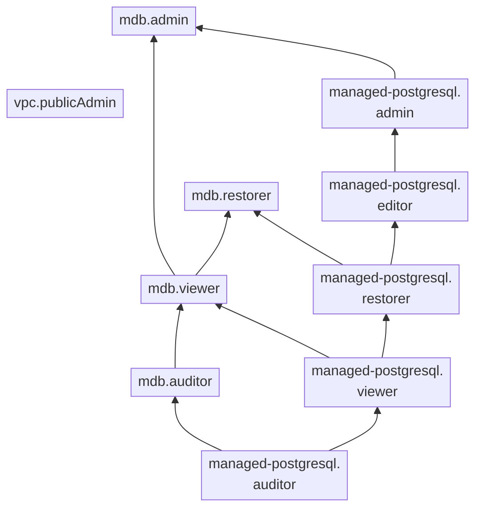

```mermaid
%%{init: { "flowchart": { "padding": 4 } } }%%
flowchart BT
    vpc.publicAdmin ~~~ mdb.admin
    mdb.viewer --> mdb.admin
    mdb.auditor --> mdb.viewer
    mdb.viewer --> mdb.restorer
    managed-postgresql.auditor["`managed-postgresql.
    auditor`"] --> mdb.auditor
    managed-postgresql.viewer["`managed-postgresql.
    viewer`"] --> mdb.viewer
    managed-postgresql.restorer["`managed-postgresql.
    restorer`"] --> mdb.restorer
    managed-postgresql.admin["`managed-postgresql.
    admin`"] --> mdb.admin
    managed-postgresql.editor["`managed-postgresql.
    editor`"] --> managed-postgresql.admin
    managed-postgresql.viewer --> managed-postgresql.restorer
    managed-postgresql.restorer --> managed-postgresql.editor
    managed-postgresql.auditor --> managed-postgresql.viewer
```