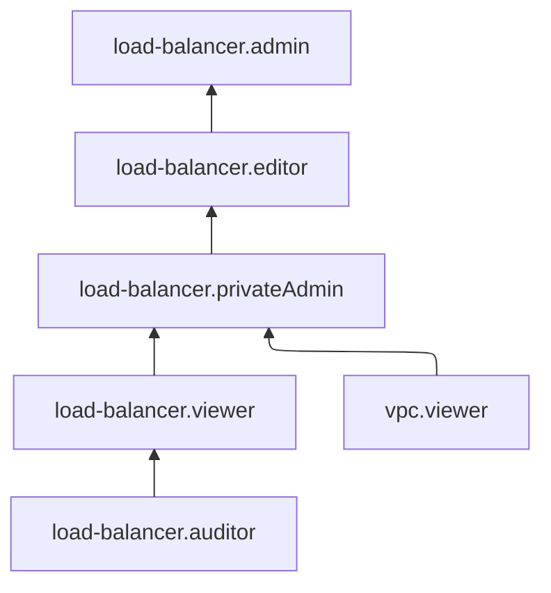
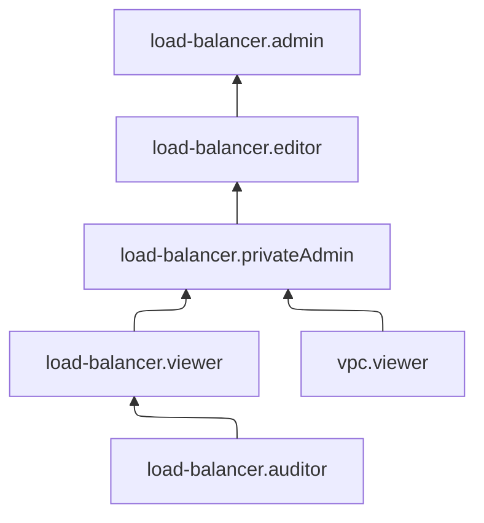

```mermaid
%%{init: {"flowchart": {'defaultRenderer': 'elk'}} }%%
flowchart BT
    load-balancer.auditor --> load-balancer.viewer
    load-balancer.viewer --> load-balancer.privateAdmin
    load-balancer.privateAdmin --> load-balancer.editor
    load-balancer.editor --> load-balancer.admin

    vpc.viewer --> load-balancer.privateAdmin
```

```mermaid
%%{
  init: {
    "flowchart": { "defaultRenderer": "elk" },
    "elk": { "nodePlacementStrategy": "NETWORK_SIMPLEX" }
  }
}%%
flowchart BT
    load-balancer.auditor --> load-balancer.viewer
    load-balancer.viewer --> load-balancer.privateAdmin
    load-balancer.privateAdmin --> load-balancer.editor
    load-balancer.editor --> load-balancer.admin

    vpc.viewer --> load-balancer.privateAdmin
```

```mermaid
%%{
  init: {
    "flowchart": { "defaultRenderer": "elk" },
    "elk": { "nodePlacementStrategy": "SIMPLE" }
  }
}%%
flowchart BT
    load-balancer.auditor --> load-balancer.viewer
    load-balancer.viewer --> load-balancer.privateAdmin
    load-balancer.privateAdmin --> load-balancer.editor
    load-balancer.editor --> load-balancer.admin

    vpc.viewer --> load-balancer.privateAdmin
```
