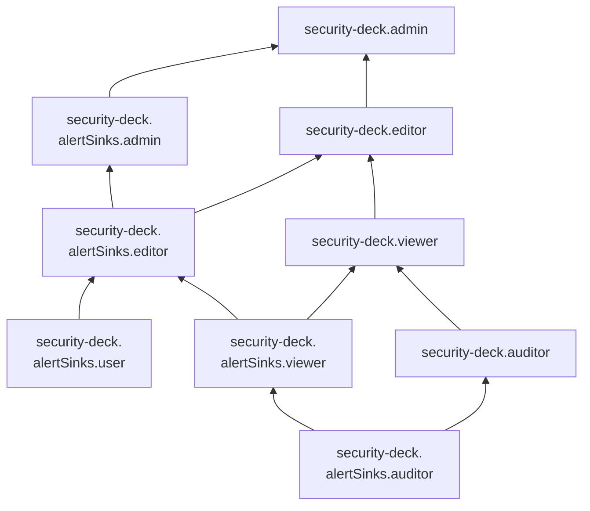

```mermaid
flowchart BT
    security-deck.alertSinks.admin["security-deck.<br>alertSinks.admin"] --> security-deck.admin
    security-deck.alertSinks.editor["security-deck.<br>alertSinks.editor"] --> security-deck.alertSinks.admin["security-deck.<br>alertSinks.admin"]
    security-deck.alertSinks.editor["security-deck.<br>alertSinks.editor"] --> security-deck.editor
    security-deck.alertSinks.user["security-deck.<br>alertSinks.user"] --> security-deck.alertSinks.editor["security-deck.<br>alertSinks.editor"]
    security-deck.alertSinks.viewer["security-deck.<br>alertSinks.viewer"] --> security-deck.alertSinks.editor["security-deck.<br>alertSinks.editor"]
    security-deck.alertSinks.viewer["security-deck.<br>alertSinks.viewer"] --> security-deck.viewer
    security-deck.alertSinks.auditor["security-deck.<br>alertSinks.auditor"] --> security-deck.alertSinks.viewer["security-deck.<br>alertSinks.viewer"]
    security-deck.alertSinks.auditor["security-deck.<br>alertSinks.auditor"] --> security-deck.auditor

    security-deck.auditor --> security-deck.viewer
    security-deck.viewer --> security-deck.editor
    security-deck.editor --> security-deck.admin

    security-deck.auditor ~~~ security-deck.admin
```
