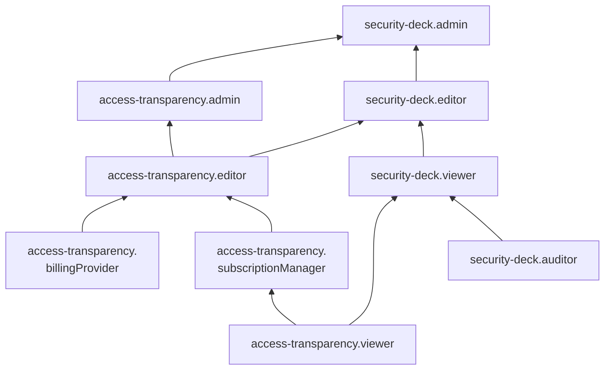

```mermaid
flowchart BT
    access-transparency.admin --> security-deck.admin
    access-transparency.editor --> security-deck.editor
    access-transparency.editor --> access-transparency.admin
    access-transparency.billingProvider["access-transparency.<br>billingProvider"] --> access-transparency.editor
    access-transparency.subscriptionManager["access-transparency.<br>subscriptionManager"] --> access-transparency.editor
    access-transparency.viewer --> security-deck.viewer
    access-transparency.viewer --> access-transparency.subscriptionManager["access-transparency.<br>subscriptionManager"]

    security-deck.auditor --> security-deck.viewer
    security-deck.viewer --> security-deck.editor
    security-deck.editor --> security-deck.admin

    security-deck.auditor ~~~ security-deck.admin
```