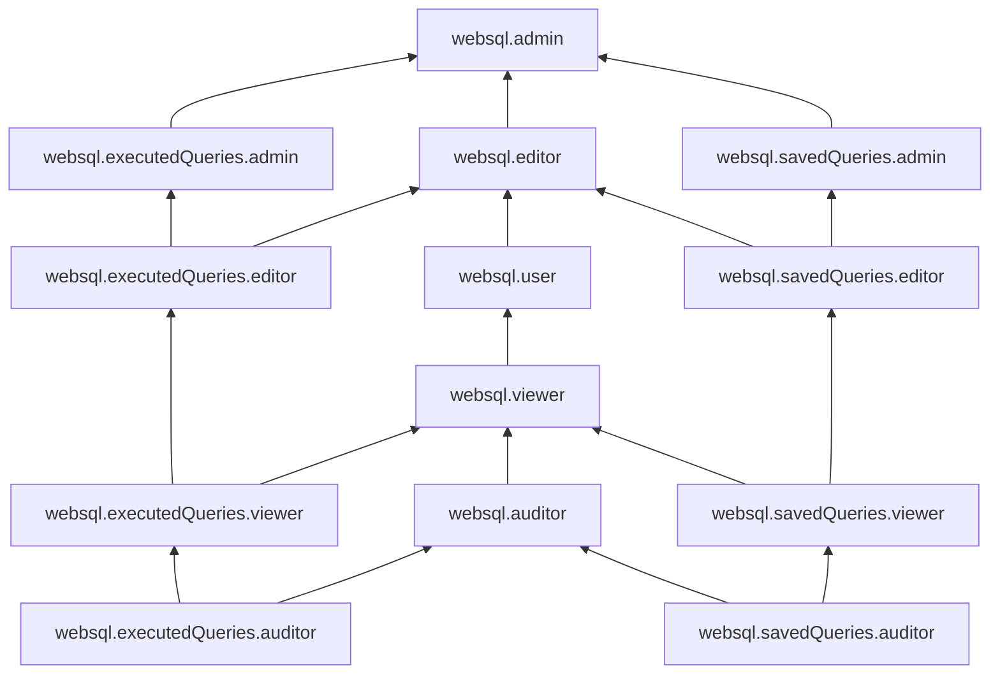

```mermaid
flowchart BT
    websql.executedQueries.editor --> websql.editor
    websql.user --> websql.editor
    websql.savedQueries.editor --> websql.editor
    websql.executedQueries.admin --> websql.admin
    websql.editor --> websql.admin
    websql.savedQueries.admin --> websql.admin
    websql.executedQueries.viewer --> websql.viewer
    websql.viewer --> websql.user
    websql.executedQueries.auditor --> websql.auditor
    websql.auditor --> websql.viewer
    websql.savedQueries.auditor --> websql.auditor
    websql.savedQueries.viewer --> websql.viewer
    websql.executedQueries.editor --> websql.executedQueries.admin
    websql.savedQueries.editor --> websql.savedQueries.admin
    websql.executedQueries.viewer --> websql.executedQueries.editor
    websql.savedQueries.viewer --> websql.savedQueries.editor
    websql.executedQueries.auditor --> websql.executedQueries.viewer
    websql.savedQueries.auditor --> websql.savedQueries.viewer
```