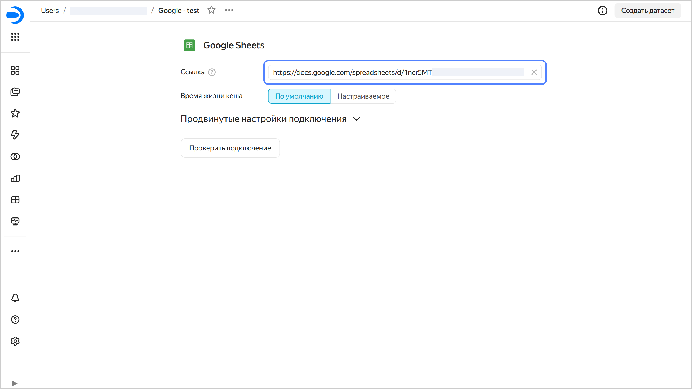
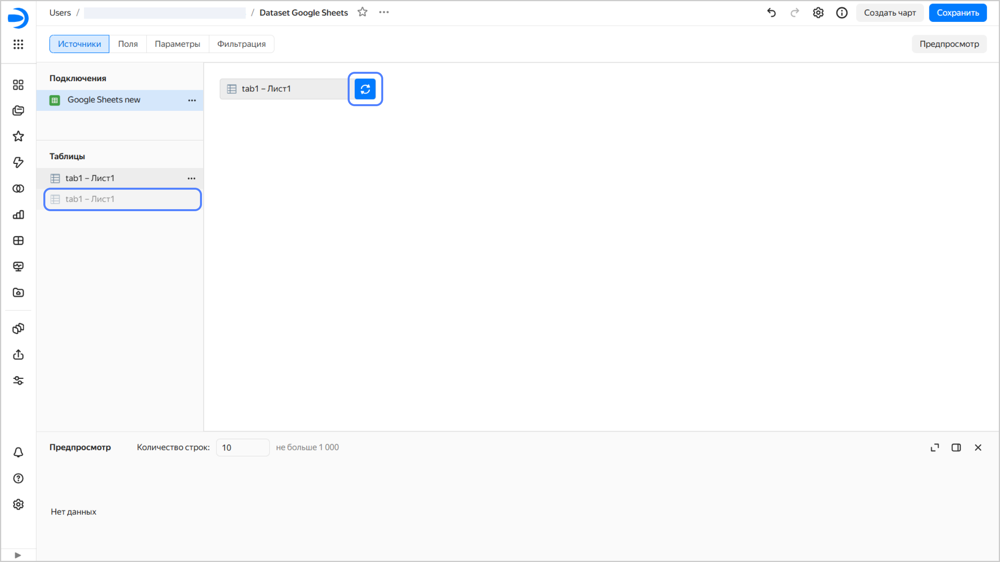

### Как заменить подключение к Google Sheets старого типа на новое? {#google-sheets-v2}

Чтобы заменить подключение к Google Sheets старого типа (созданное до 2022 года включительно) на новое, вручную создайте новое подключение и замените его в текущих датасетах, которые используют старое подключение:

1. Откройте старое подключение и скопируйте ссылку на документ.

   
   
   

   

1. Создайте новое [подключение к Google Sheets](../../datalens/operations/connection/create-google-sheets.md). Укажите в нем ссылку на документ, скопированную из старого подключения.
1. [Замените подключение](../../datalens/dataset/create-dataset.md#replace-connection) на новое в существующих датасетах:
   
   1. В датасете напротив подключения нажмите  → Заменить подключение.
   1. Выберите новое подключение.
   1. Чтобы восстановить отображение данных, обновите таблицу в рабочей области. Для этого перетащите новую таблицу (справа от новой таблицы нет значка ) из блока **Таблицы** в рабочую область, наведите ее на иконку с круговыми стрелками справа от заменяемой таблицы так, чтобы фон иконки стал синим, затем отпустите таблицу.

      
      
      

      

      

      Если сначала удалить таблицу из рабочей области, а потом добавить новую с таким же набором полей, изменятся ID полей в датасете и нарушится отображение данных во всех чартах и селекторах, которые созданы на его основе.

      

   1. Сохраните датасет.

   Вы можете посмотреть, какие датасеты построены на старом подключении. Для этого вверху на странице подключения нажмите  →  **Связанные объекты**.
