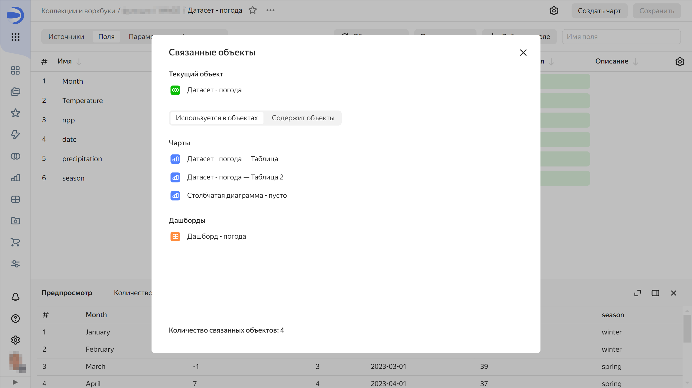

### Как в {{ datalens-short-name }} посмотреть связанные объекты? {#related-objects}

В {{ datalens-short-name }} можно посмотреть, где используется объект, а также какие объекты он использует. Для этого на странице навигации или в окне редактирования объекта нажмите значок  → **Связанные объекты**. Например, так можно узнать, на каких источниках построен дашборд или какие чарты построены на основе датасета.



