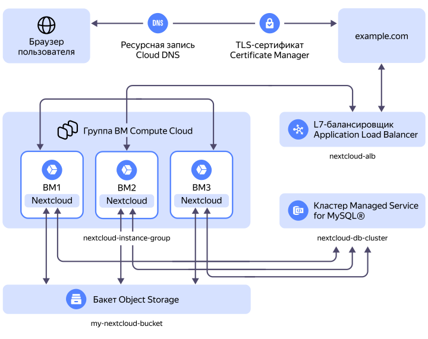

В этом руководстве вы подключите [бакет](../../../storage/concepts/bucket.md) {{ objstorage-name }} к решению Nextcloud, развернутому на [виртуальной машине](../../../compute/concepts/vm.md) {{ compute-name }} с базой данных в [кластере](../../../managed-mysql/concepts/index.md) {{ mmy-full-name }}. Для обеспечения отказоустойчивости и избыточности создаваемой под Nextcloud инфраструктуры вы масштабируете Nextcloud на [группу виртуальных машин](../../../compute/concepts/instance-groups/index.md) с распределением нагрузки при помощи [L7-балансировщика](../../../application-load-balancer/concepts/application-load-balancer.md) {{ alb-full-name }}. В отказоустойчивой конфигурации Nextcloud будет доступен по доменному имени, для которого в {{ certificate-manager-full-name }} будет выпущен [TLS-сертификат](../../../certificate-manager/concepts/managed-certificate.md).



Для реализации отказоустойчивой конфигурации Nextcloud вам понадобится домен, который будет использоваться L7-балансировщиком.



Схема отказоустойчивого решения:

Где:
* `example.com` — ваш домен, для которого в {{ certificate-manager-full-name }} выпущен [сертификат](../../../certificate-manager/concepts/managed-certificate.md) и который подключен к [L7-балансировщику](../../../application-load-balancer/concepts/application-load-balancer.md) нагрузки.
* `nextcloud-alb` — L7-балансировщик, который равномерно распределяет входящий трафик от пользователей между хостами группы виртуальных машин.
* `nextcloud-instance-group` — [группа виртуальных машин](../../../compute/concepts/instance-groups/index.md), в которую входят хосты с развернутым решением Nextcloud.
* `nextcloud-db-cluster` — [кластер](../../../managed-mysql/concepts/index.md) {{ mmy-full-name }}, в котором расположена служебная база данных Nextcloud.
* `my-nextcloud-bucket` — [бакет](../../../storage/concepts/bucket.md) {{ objstorage-full-name }}, подключенный к решению Nextcloud.

Чтобы развернуть Nextcloud в {{ yandex-cloud }} с интеграцией бакета {{ objstorage-name }}: