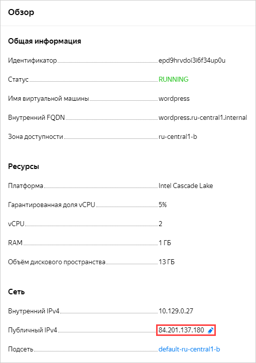
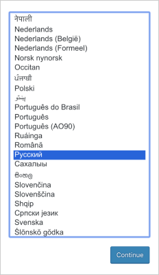
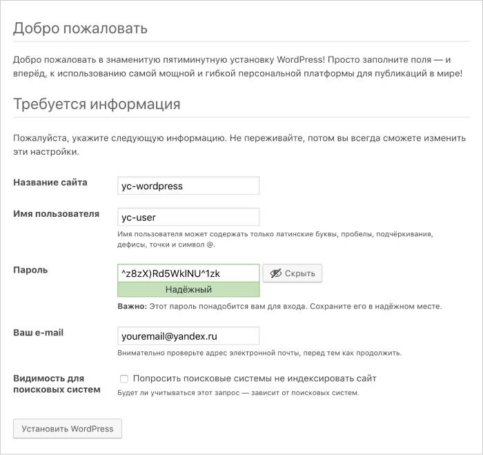
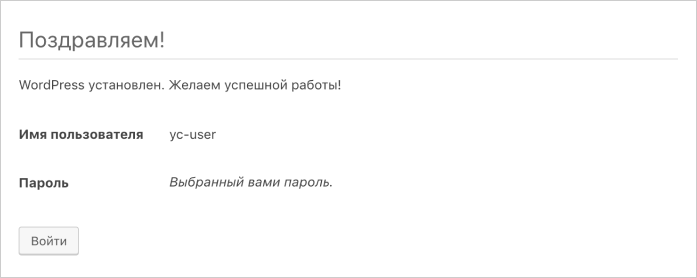

После того как ВМ `wordpress` перейдет в [статус](../../../compute/concepts/vm-statuses.md) `RUNNING`, выполните:
1. В блоке **Сеть** на странице ВМ в [консоли управления]({{ link-console-main }}) найдите публичный IP-адрес ВМ и внесите в [ресурсную запись](../../../dns/concepts/dns-zone.md) [типа А](../../../dns/concepts/resource-record.md#a), созданную ранее.

   

1. Перейдите по доменному имени, которое вы настроили, или по адресу ВМ в браузере.
1. Выберите язык и нажмите кнопку **Продолжить**.

   

1. Заполните информацию для доступа к сайту:
   1. Укажите любое название сайта, например, `yc-wordpress`.
   1. Укажите имя пользователя, которое будет использоваться для входа в административную панель, например, `yc-user`.
   1. Укажите пароль, который будет использоваться для входа в административную панель.
   1. Укажите вашу электронную почту.

   

1. Нажмите кнопку **Установить WordPress**.
1. Если установка прошла успешно, нажмите кнопку **Войти**.

   

1. Войдите на сайт, используя указанные на прошлых шагах имя пользователя и пароль. После этого откроется административная панель, в которой можно приступать к работе с вашим сайтом.
1. Убедитесь, что сайт доступен, открыв публичный IP-адрес ВМ в браузере.