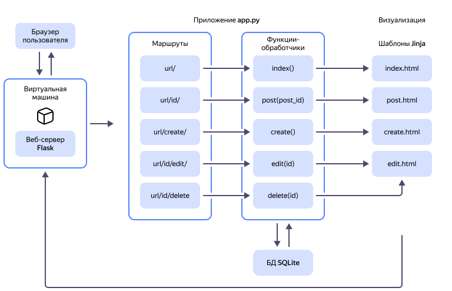

# Создание веб-приложения на Python с использованием фреймворка Flask


С помощью этого руководства вы с нуля разработаете простое веб-приложение — мини-блог, в котором пользователь сможет создавать, просматривать, редактировать и удалять посты. Для этого в {{ yandex-cloud }} вы создадите виртуальную машину {{ compute-full-name }} и запустите на ней веб-сервер.

Веб-приложение написано на языке [Python](https://www.python.org/) и использует СУБД [SQLite](https://sqlite.org/) для работы с данными. Визуальное оформление выполнено с помощью [инструментария Bootstrap](https://getbootstrap.com/). 

В качестве основы приложения выбран фреймворк [Flask](https://flask.palletsprojects.com/en/3.0.x/), как один из наиболее доступных фреймворков для создания веб-приложений на языке программирования Python. 

Фреймворк Flask позволяет создавать веб-приложения c использованием всего одного файла с исходным кодом, не требует соблюдения какой-то определенной структуры директорий или написания сложного шаблонного кода перед началом использования. Также Flask предоставляет набор инструментов [Werkzeug](https://werkzeug.palletsprojects.com/en/latest/) и [механизм шаблонов Jinja](http://jinja.palletsprojects.com/) для динамического создания HTML-страниц.

Исходный код приложения доступен в файле [flask_blog.zip](https://github.com/yandex-cloud-examples/yc-web-app-python-flask/blob/main/flask_blog.zip).

Схема работы создаваемого веб-приложения:



1. HTTP-запросы поступают из браузера пользователя на виртуальную машину под управлением ОС Linux Ubuntu с установленным и запущенным веб-сервером Flask.
1. Веб-сервер передает запрос в веб-приложение, маршрутизатор которого в зависимости от URL запроса вызывает подходящую функцию-обработчик.
1. Функция-обработчик выполняет запрос к базе данных SQLite, чтобы получить или записать необходимые данные.
1. Полученные из БД данные функция передает в подходящий HTML-шаблон Jinja, который возвращает готовый HTML-код страницы.
1. Полученный HTML-код передается на веб-сервер, который в свою очередь передает этот код в браузер пользователя.

Чтобы создать веб-приложение с помощью Flask:

1. [Подготовьте облако к работе](#before-you-begin).
1. [Создайте и настройте виртуальную машину](#create-setup-vm).
1. [Создайте и запустите приложение](#create-app).
1. [Создайте и настройте шаблоны HTML](#html-templates).
1. [Настройте базу данных](#configure-data-base).
1. [Настройте отображение постов блога](#display-posts).
1. [Добавьте действия с постами](#add-post-actions).
1. [Подведите итоги](#results).

Если веб-приложение вам больше не нужно, [удалите все используемые им ресурсы](#clear-out).

## Перед началом работы {#before-you-begin}

В {{ yandex-cloud }} оплачиваются только потребленные ресурсы и время их фактического использования, а для идентификации пользователя, оплачивающего такие ресурсы, нужен платежный аккаунт.

В стоимость поддержки создаваемого приложения входят:

* плата за использование публичного IP-адреса (см. [тарифы {{ vpc-full-name }}](../../vpc/pricing.md));
* плата за вычислительные ресурсы и диски ВМ (см. [тарифы {{ compute-full-name }}](../../compute/pricing.md)).



### Создайте облачную сеть и подсеть {#create-network}

В {{ yandex-cloud }} ресурсы связаны между собой и с интернетом при помощи [облачных сетей](../../vpc/concepts/network.md#network), в которых ресурсам выделяются [публичные](../../vpc/concepts/address.md#public-addresses) IP-адреса, а также диапазоны внутренних IP-адресов или [подсети](../../vpc/concepts/network.md#subnet).

Чтобы создать виртуальную сеть и подсеть для вашего веб-сервера:



- Консоль управления {#console} 

  1. В [консоли управления]({{ link-console-main }}) выберите ваш каталог.
  1. В списке сервисов выберите **{{ ui-key.yacloud.iam.folder.dashboard.label_vpc }}**.
  1. Справа сверху нажмите кнопку **{{ ui-key.yacloud.vpc.networks.button_create }}**.
  1. В поле **{{ ui-key.yacloud.vpc.networks.create.field_name }}** укажите `webserver-network`.
  1. В поле **{{ ui-key.yacloud.vpc.networks.create.field_advanced }}** отключите опцию **{{ ui-key.yacloud.vpc.networks.create.field_is-default }}**.
  1. Нажмите кнопку **{{ ui-key.yacloud.vpc.networks.button_create }}**.
  1. На панели слева выберите  **{{ ui-key.yacloud.vpc.switch_networks }}**.
  1. Справа сверху нажмите **{{ ui-key.yacloud.common.create }}**.
  1. В поле **{{ ui-key.yacloud.vpc.subnetworks.create.field_name }}** укажите `webserver-subnet-{{ region-id }}-b`.
  1. В поле **{{ ui-key.yacloud.vpc.subnetworks.create.field_zone }}** выберите зону доступности `{{ region-id }}-b`.
  1. В поле **{{ ui-key.yacloud.vpc.subnetworks.create.field_network }}** выберите облачную сеть `webserver-network`.
  1. В поле **{{ ui-key.yacloud.vpc.subnetworks.create.field_ip }}** укажите `192.168.1.0/24`.
  1. Нажмите кнопку **{{ ui-key.yacloud.vpc.subnetworks.create.button_create }}**.

- CLI {#cli}

  1. Создайте сеть `webserver-network`:

      ```bash
      yc vpc network create webserver-network
      ```

      Результат:

      ```text
      id: enp1gg8kr3pv********
      folder_id: b1gt6g8ht345********
      created_at: "2023-12-20T20:08:11Z"
      name: webserver-network
      default_security_group_id: enppne4l2eg5********
      ```

      Подробнее о команде `yc vpc network create` читайте в [справочнике CLI](../../cli/cli-ref/vpc/cli-ref/network/create.md).

  1. Создайте подсеть в зоне доступности `{{ region-id }}-b`:

      ```bash
      yc vpc subnet create webserver-subnet-{{ region-id }}-b \
        --zone {{ region-id }}-b \
        --network-name webserver-network \
        --range 192.168.1.0/24
      ```

      Результат:

      ``` 
      id: e2li9tcgi7ii********
      folder_id: b1gt6g8ht345********
      created_at: "2023-12-20T20:11:16Z"
      name: webserver-subnet-{{ region-id }}-b
      network_id: enp1gg8kr3pv********
      zone_id: {{ region-id }}-b
      v4_cidr_blocks:
        - 192.168.1.0/24
      ```

      Подробнее о команде `yc vpc subnet create` читайте в [справочнике CLI](../../cli/cli-ref/vpc/cli-ref/subnet/create.md).

- API {#api}

  1. Чтобы создать сеть, воспользуйтесь методом REST API [create](../../vpc/api-ref/Network/create.md) для ресурса [Network](../../vpc/api-ref/Network/index.md) или вызовом gRPC API [NetworkService/Create](../../vpc/api-ref/grpc/Network/create.md).

  1. Чтобы создать подсеть, воспользуйтесь методом REST API [create](../../vpc/api-ref/Subnet/create.md) для ресурса [Subnet](../../vpc/api-ref/Subnet/index.md) или вызовом gRPC API [SubnetService/Create](../../vpc/api-ref/grpc/Subnet/create.md).



### Создайте группу безопасности {#create-sg}

[Группы безопасности](../../vpc/concepts/security-groups.md) служат основным механизмом разграничения сетевого доступа в {{ yandex-cloud }} и помогают ограничить для облачных ресурсов несанкционированный трафик на уровне облачной сети.

Создайте группу безопасности, разрешающую входящий TCP-трафик для портов `5000` и `22`, а также любой исходящий трафик. Порт `22` необходим для подключения к ВМ по SSH, порт `5000` по умолчанию используется для работы веб-сервера Flask.



- Консоль управления {#console}

  1. В [консоли управления]({{ link-console-main }}) выберите ваш каталог.
  1. В списке сервисов выберите **{{ ui-key.yacloud.iam.folder.dashboard.label_vpc }}**.
  1. На панели слева выберите  **{{ ui-key.yacloud.vpc.label_security-groups }}**. 
  1. Нажмите кнопку **{{ ui-key.yacloud.vpc.network.security-groups.button_create }}**.
  1. В поле **{{ ui-key.yacloud.vpc.network.security-groups.forms.field_sg-name }}** укажите имя `webserver-sg`.
  1. В поле **{{ ui-key.yacloud.vpc.network.security-groups.forms.field_sg-network }}** выберите созданную ранее сеть `webserver-network`.
  1. В блоке **{{ ui-key.yacloud.vpc.network.security-groups.forms.label_section-rules }}** [создайте](../../vpc/operations/security-group-add-rule.md) следующие правила для управления трафиком:

      | Направление<br/>трафика | {{ ui-key.yacloud.vpc.network.security-groups.forms.field_sg-rule-description }} | {{ ui-key.yacloud.vpc.network.security-groups.forms.field_sg-rule-port-range }} | {{ ui-key.yacloud.vpc.network.security-groups.forms.field_sg-rule-protocol }} | {{ ui-key.yacloud.vpc.network.security-groups.forms.field_sg-rule-source }} /<br/>{{ ui-key.yacloud.vpc.network.security-groups.forms.field_sg-rule-destination }} | {{ ui-key.yacloud.vpc.network.security-groups.forms.field_sg-rule-cidr-blocks }} |
      | --- | --- | --- | --- | --- | --- |
      | Входящий | `Flask`           | `5000` | `TCP` | `{{ ui-key.yacloud.vpc.network.security-groups.forms.value_sg-rule-destination-cidr }}` | `0.0.0.0/0` |
      | Входящий | `ssh`            | `22`   | `TCP`  | `{{ ui-key.yacloud.vpc.network.security-groups.forms.value_sg-rule-destination-cidr }}` | `0.0.0.0/0` |
      | Исходящий | `any`           | `Весь` | `{{ ui-key.yacloud.vpc.network.security-groups.forms.value_any }}` | `{{ ui-key.yacloud.vpc.network.security-groups.forms.value_sg-rule-destination-cidr }}` | `0.0.0.0/0` |

  1. Нажмите кнопку **{{ ui-key.yacloud.common.save }}**.

- CLI {#cli}
  
  Выполните команду:

  ```bash
  yc vpc security-group create \
    --name webserver-sg \
    --rule "description=Flask,direction=ingress,port=5000,protocol=tcp,v4-cidrs=[0.0.0.0/0]" \
    --rule "description=ssh,direction=ingress,port=22,protocol=tcp,v4-cidrs=[0.0.0.0/0]" \
    --rule "description=any,direction=egress,port=any,protocol=any,v4-cidrs=[0.0.0.0/0]" \
    --network-name webserver-network
  ```

  Результат:

  ```text
  id: enpv1c0q7j01********
  folder_id: b1gt6g8ht345********
  created_at: "2024-03-23T18:54:05Z"
  name: webserver-sg
  network_id: enp9mji1m7b3********
  status: ACTIVE
  rules:
    - id: enpmbsk2hjfd********
      description: Flask
      direction: INGRESS
      ports:
        from_port: "5000"
        to_port: "5000"
      protocol_name: TCP
      protocol_number: "6"
      cidr_blocks:
        v4_cidr_blocks:
          - 0.0.0.0/0
    - id: enpna5id9265********
      description: ssh
      direction: INGRESS
      ports:
        from_port: "22"
        to_port: "22"
      protocol_name: TCP
      protocol_number: "6"
      cidr_blocks:
        v4_cidr_blocks:
          - 0.0.0.0/0
    - id: enpen3vf7rui********
      description: any
      direction: EGRESS
      protocol_name: ANY
      protocol_number: "-1"
      cidr_blocks:
        v4_cidr_blocks:
          - 0.0.0.0/0
  ```

  Сохраните полученный идентификатор (`id`) группы безопасности: он потребуется при создании виртуальной машины.

  Подробнее о команде `yc vpc security-group create` читайте в [справочнике CLI](../../cli/cli-ref/vpc/cli-ref/security-group/create.md).

- API {#api}

  Чтобы создать группу безопасности, воспользуйтесь методом REST API [create](../../vpc/api-ref/SecurityGroup/create.md) для ресурса [SecurityGroup](../../vpc/api-ref/SecurityGroup/index.md) или вызовом gRPC API [SecurityGroupService/Create](../../vpc/api-ref/grpc/SecurityGroup/create.md).



## Создайте и настройте виртуальную машину {#create-setup-vm}

[Виртуальная машина](../../compute/concepts/vm.md) — это аналог сервера в облачной инфраструктуре. В {{ yandex-cloud }} вы можете создавать
виртуальные машины с самыми разными аппаратными характеристиками по [производительности](../../compute/concepts/performance-levels.md), объему оперативной памяти и [дискового пространства](../../compute/concepts/disk.md#maximum-disk-size), а также под управлением разных [операционных систем](../../compute/concepts/image.md#public).
 
Создаваемое веб-приложение будет развернуто на виртуальной машине под управлением OC Linux [Ubuntu 22.04 LTS](/marketplace/products/yc/ubuntu-22-04-lts).

1. Создайте виртуальную машину:

    Перед тем как приступать к созданию виртуальной машины, [подготовьте](../../compute/operations/vm-connect/ssh.md#creating-ssh-keys) пару ключей (открытый и закрытый) для доступа к ВМ по SSH.

    

    - Консоль управления {#console}

      1. В [консоли управления]({{ link-console-main }}) выберите [каталог](../../resource-manager/concepts/resources-hierarchy.md#folder), в котором будет создана ВМ.
      1. В списке сервисов выберите **{{ ui-key.yacloud.iam.folder.dashboard.label_compute }}**.
      1. На панели слева выберите  **{{ ui-key.yacloud.compute.instances_jsoza }}**.
      1. Нажмите кнопку **{{ ui-key.yacloud.compute.instances.button_create }}**.
      1. Выберите вариант **{{ ui-key.yacloud.compute.instances.create.option_create-form-extended-title }}**.
      1. В блоке **{{ ui-key.yacloud.compute.instances.create.section_image }}** выберите образ [Ubuntu 22.04 LTS](/marketplace/products/yc/ubuntu-22-04-lts).
      1. В блоке **{{ ui-key.yacloud.k8s.node-groups.create.section_allocation-policy }}** выберите [зону доступности](../../overview/concepts/geo-scope.md) `{{ region-id }}-b`.
      1. В блоке **{{ ui-key.yacloud.compute.instances.create.section_network }}**:

          * В поле **{{ ui-key.yacloud.component.compute.network-select.field_subnetwork }}** выберите созданную ранее подсеть `webserver-subnet-{{ region-id }}-b`.
          * В поле **{{ ui-key.yacloud.component.compute.network-select.field_external }}** выберите `{{ ui-key.yacloud.component.compute.network-select.switch_auto }}`.
          * В поле **{{ ui-key.yacloud.component.compute.network-select.field_security-groups }}** выберите созданную ранее группу безопасности `webserver-sg`.

      1. В блоке **{{ ui-key.yacloud.compute.instances.create.section_access }}** выберите **{{ ui-key.yacloud.compute.instance.access-method.label_oslogin-control-ssh-option-title }}** и укажите данные для доступа к ВМ:

          * В поле **{{ ui-key.yacloud.compute.instances.create.field_user }}** укажите имя пользователя `yc-user`.
          * 

      1. В блоке **{{ ui-key.yacloud.compute.instances.create.section_base }}** задайте имя ВМ: `mywebserver`.
      1. Нажмите кнопку **{{ ui-key.yacloud.compute.instances.create.button_create }}**.

    - CLI {#cli}

      Выполните команду, указав сохраненный на предыдущем шаге идентификатор группы безопасности:

      ```bash
      yc compute instance create \
        --name mywebserver \
        --zone {{ region-id }}-b \
        --network-interface subnet-name=webserver-subnet-{{ region-id }}-b,nat-ip-version=ipv4,security-group-ids=<идентификатор_группы_безопасности> \
        --create-boot-disk image-folder-id=standard-images,image-id=fd8ne6e3etbrr2ve9nlc \
        --ssh-key <файл_открытого_SSH-ключа>
      ```

      Где `--ssh-key` — путь к файлу с открытым SSH-ключом. Например, `~/.ssh/id_ed25519.pub`.

      Результат:

      ```yml
      done (32s)
      id: epdv79cu67np********
      folder_id: b1gt6g8ht345********
      created_at: "2024-03-23T19:17:09Z"
      name: mywebserver
      zone_id: {{ region-id }}-b
      platform_id: standard-v2
      resources:
        memory: "2147483648"
        cores: "2"
        core_fraction: "100"
      status: RUNNING
      metadata_options:
        gce_http_endpoint: ENABLED
        aws_v1_http_endpoint: ENABLED
        gce_http_token: ENABLED
        aws_v1_http_token: DISABLED
      boot_disk:
        mode: READ_WRITE
        device_name: epdg0926k12t********
        auto_delete: true
        disk_id: epdg0926k12t********
      network_interfaces:
        - index: "0"
          mac_address: d0:0d:1f:3a:59:e3
          subnet_id: e2l3qffk0h6t********
          primary_v4_address:
            address: 192.168.1.14
            one_to_one_nat:
              address: 62.84.***.***
              ip_version: IPV4
          security_group_ids:
            - enpv1c0q7j01********
      serial_port_settings:
        ssh_authorization: INSTANCE_METADATA
      gpu_settings: {}
      fqdn: epdv79cu67np********.auto.internal
      scheduling_policy: {}
      network_settings:
        type: STANDARD
      placement_policy: {}
      ```

      Подробнее о команде `yc compute instance create` читайте в [справочнике CLI](../../cli/cli-ref/compute/cli-ref/instance/create.md).

    - API {#api}

      Чтобы создать виртуальную машину, воспользуйтесь методом REST API [create](../../compute/api-ref/Instance/create.md) для ресурса [Instance](../../compute/api-ref/Instance/) или вызовом gRPC API [InstanceService/Create](../../compute/api-ref/grpc/Instance/create.md).

    

    В вашем каталоге будет создана виртуальная машина `mywebserver`. Чтобы [подключиться](../../compute/operations/vm-connect/ssh.md#vm-connect) к ней по SSH, используйте логин `yc-user` и [публичный IP-адрес](../../vpc/concepts/address.md#public-addresses) этой ВМ. Если вы планируете пользоваться созданным веб-сервером длительное время, [сделайте](../../vpc/operations/set-static-ip.md) публичный IP-адрес этой ВМ статическим.

1. Создайте и активируйте виртуальное окружение.

    Виртуальное окружение обеспечивает изолированное пространство для проектов Python на сервере. Все необходимые зависимости — исполняемые файлы, библиотеки и прочие файлы — копируются в выбранный каталог, и приложение использует их, а не установленные в системе. Это позволяет обеспечить стабильность среды разработки и чистоту основной системы.

    Для создания виртуального окружения используйте модуль библиотеки Python 3 `venv`:

    1. [Подключитесь](../../compute/operations/vm-connect/ssh.md) к виртуальной машине `mywebserver`.

    1. В директории текущего пользователя создайте поддиректорию проекта `flask_blog`, в которой будет находиться приложение, и перейдите в нее:

        ```bash
        mkdir flask_blog && cd flask_blog
        ```

    1. Установите модуль создания виртуальных сред `venv`:

        ```bash
        sudo apt install python3.10-venv
        ```

    1. Создайте виртуальное окружение `env`:

        ```bash
        python3 -m venv env
        ```

    1. Активируйте созданное виртуальное окружение:

        ```bash
        source env/bin/activate
        ```

        После активации виртуального окружения в командной строке появится префикс с именем окружения:

        ```text
        (env) yc-user@ubuntu:~/flask_blog$
        ```

        

        Чтобы эффективно отслеживать процесс разработки проекта и управлять им, вы можете использовать [систему контроля версий](../../glossary/vcs.md). В этом случае добавьте директорию `env` в файл `.gitignore`, чтобы не отслеживать файлы, не связанные с проектом.

        

        Чтобы деактивировать виртуальное окружение, выполните команду:

        ```bash
        deactivate
        ```

1. Установите Flask:

    ```bash
    pip install flask
    ```

    Результат:

    ```text
    Successfully installed Jinja2-3.1.3 MarkupSafe-2.1.5 Werkzeug-3.0.1 blinker-1.7.0 click-8.1.7 flask-3.0.2 itsdangerous-2.1.2
    ```

## Создайте и запустите приложение {#create-app}

Создайте простое веб-приложение внутри файла Python и запустите его для начала работы сервера.

1. В директории проекта `flask_blog` создайте и откройте файл `app.py`:

    ```bash
    nano app.py
    ```

    Этот файл позволяет понять, как приложение будет обрабатывать HTTP-запросы.

1. Добавьте в файл следующий код:

    ```python
    from flask import Flask

    app = Flask(__name__)


    @app.route('/')
    def hello():
        return 'Hello, World!'
    ```

    В этом коде:

    * Импортируется [объект `Flask`](https://flask.palletsprojects.com/en/latest/api/#flask.Flask) из пакета `flask`.
    * Создается экземпляр приложения Flask с именем `app`. Специальная переменная `__name__` содержит имя текущего модуля Python и указывает экземпляру его расположение. Это необходимо, так как Flask устанавливает ряд путей внутри приложения.
    * С помощью [декоратора](https://en.wikipedia.org/wiki/Python_syntax_and_semantics#Decorators) `@app.route('/')` функция Python превращается в функцию визуализации Flask. Функция визуализации конвертирует возвращаемое значение в HTTP-ответ, который может быть обработан HTTP-клиентом, таким как веб-браузер. Значение `'/'` в маршруте `@app.route()​​` устанавливает, что эта функция будет отвечать на веб-запросы для URL `/`, который является основным URL-адресом веб-приложения.
    * Создается функция `hello()`, которая возвращает строку `Hello, World!` в качестве ответа.

    Сохраните и закройте файл `app.py`.

1. Задайте переменные окружения `Flask`:

    ```bash
    export FLASK_APP=app && export FLASK_DEBUG=true
    ```

    Где:

    * `FLASK_APP=app` указывает на расположение приложения — файла `app.py`.
    * `FLASK_DEBUG=true` указывает, что приложение необходимо запустить в режиме разработки.

1. Запустите приложение:

    ```bash
    flask run \
      --host=0.0.0.0
    ```

    Где параметр `--host=0.0.0.0` запускает сервер приложения на всех IP-адресах виртуальной машины. Не указав этот параметр, вы не сможете обратиться к приложению по публичному IP-адресу ВМ.

    Результат:

    ```text
     * Serving Flask app 'app'
     * Debug mode: on
    WARNING: This is a development server. Do not use it in a production deployment. Use a production WSGI server instead.
     * Running on all addresses (0.0.0.0)
     * Running on http://127.0.0.1:5000
     * Running on http://192.168.1.14:5000
    Press CTRL+C to quit
     * Restarting with stat
     * Debugger is active!
     * Debugger PIN: 884-371-***
    ```

    Для нас важна следующая информация:

    * Название работающего приложения — `app`.
    * `Debug mode: on` означает, что отладчик Flask работает. Эта функция полезна при разработке, так как при возникновении проблем она выдает детализированные сообщения об ошибках, что упрощает работу по их устранению.
    * Приложение работает на всех адресах.

    Вы можете изменить порт веб-сервера на любое другое значение, задав дополнительный параметр `--port=<номер_порта>`. Например, команда `flask run --host=0.0.0.0 --port=5001` запустит веб-сервер Flask на порте `5001`.

1. Откройте браузер и введите в адресной строке `http://<публичный_IP-адрес_ВМ>:5000/`​.

    Браузер отобразит строку `Hello, World!`. Это подтверждает, что ваше приложение успешно работает и к нему можно обращаться из интернета.



Flask использует простой веб-сервер для обслуживания приложения в среде разработки. Он предназначен для тестирования и обнаружения ошибок и не должен использоваться при развертывании в производственной среде. Подробнее см. в [документации Flask](https://flask.palletsprojects.com/en/latest/deploying/).



Оставьте веб-сервер работать в текущем окне и откройте новое окно терминала. В новом окне терминала вы будете выполнять дальнейшую настройку приложения. Это позволит проверять работу внесенных в приложение изменений без необходимости постоянно останавливать и вновь запускать веб-сервер.

При открытии нового окна терминала:

1. [Подключитесь](../../compute/operations/vm-connect/ssh.md) к ВМ.
1. Перейдите в директорию проекта `flask_blog`, активируйте виртуальное окружение и задайте переменные окружения:

    ```bash
    cd flask_blog && source env/bin/activate && export FLASK_APP=app && export FLASK_DEBUG=true
    ```

## Создайте и настройте шаблоны HTML {#html-templates}

В текущем виде приложение отображает в браузере только простое текстовое сообщение. Добавьте в приложение файлы-шаблоны HTML, которые позволят отображать нужные пользователю данные и элементы управления.

Использовать в приложении шаблоны позволяет [вспомогательная функция `render_template()`](https://flask.palletsprojects.com/en/latest/api/#flask.render_template), в которой доступен [механизм шаблонов Jinja](https://jinja.palletsprojects.com/en/latest/templates/). Вы будете использовать шаблоны HTML для создания страниц приложения: главной страницы со списком текущих постов блога и страниц создания, просмотра и редактирования поста.

### Создайте HTML-шаблон главной страницы {#create-html-template}

1. Откройте файл `app.py`:

    ```bash
    nano app.py
    ```

1. Замените содержимое файла следующим кодом:

    ```python
    from flask import Flask, render_template

    app = Flask(__name__)

    @app.route('/')
    def index():
        return render_template('index.html')
    ```

    В этом коде:

    * Дополнительно импортируется вспомогательная функция `render_template()`, которая позволяет визуализировать шаблоны HTML.
    * Функция `hello()` заменяется на функцию `index()`, которая возвращает результат вызова вспомогательной функции `render_template()` с аргументом `index.html​`​. Аргумент функции указывает на файл шаблона, который должен быть расположен в директории шаблонов и который будет использован для визуализации.

    

    Директория шаблонов и файл `index.html` еще не созданы. Вы получите сообщение об ошибке, если запустите приложение на этом этапе.

    

    Сохраните и закройте файл `app.py`.

1. В директории проекта `flask_blog` создайте поддиректорию `templates`:

    ```bash
    mkdir templates
    ```

1. Создайте и откройте файл-шаблон `index.html` в директории `templates`:

    ```bash
    nano templates/index.html
    ```

1. Добавьте в файл `index.html` следующий код:

    ```html
    <!DOCTYPE html>
    <html lang="en">
      <head>
        <meta charset="UTF-8">
        <title>FlaskBlog</title>
      </head>
      <body>
        <h1>Welcome to FlaskBlog</h1>
      </body>
    </html>
    ```

    В этом HTML коде описана простейшая страница с заголовком `FlaskBlog` и содержимым `Welcome to FlaskBlog` в заголовке первого уровня.

    Сохраните и закройте файл `index.html`.

1. Обновите главную страницу приложения `http://<публичный_IP-адрес_ВМ>:5000/`.

    Результат:

    ```text
    Welcome to FlaskBlog.
    ```

1. Кроме директории `templates` в веб-приложениях Flask обычно также существует директория `static`, в которой сохраняются статичные файлы, такие как стили CSS, скрипты JavaScript или изображения, используемые приложением.

    В директории проекта `flask_blog` создайте поддиректорию `static`:

    ```bash
    mkdir static
    ```

1. Во вновь созданной директории `static` создайте поддиректорию `css`:

    ```bash
    mkdir static/css
    ```

    

    Вложенные директории используются для упорядочивания статичных файлов в специальных папках. Например, файлы JavaScript обычно хранятся в директории `js`, изображения — в директории `images` (или `img`) и т.д.

    

1. Создайте и откройте файл `style.css` в директории `static/css`:

    ```bash
    nano static/css/style.css
    ```

1. Добавьте в файл `style.css` следующий код:

    ```css
    h1 {
        border: 2px #eee solid;
        color: #fc3d17;
        text-align: center;
        padding: 10px;
    }
    ```

    Этот CSS-код изменяет оформление текста внутри HTML-тегов `<h1>`:
    * свойство `border` добавляет границу;
    * свойство `color` изменяет цвет текста;
    * свойство `text-align` выравнивает текст;
    * свойство `padding` добавляет отступ до текста от границы элемента.

    Сохраните и закройте файл `style.css`.

1. Откройте шаблон `index.html`:

    ```bash
    nano templates/index.html
    ```

1. Добавьте ссылку на файл `style.css` внутри раздела `<head>`:

    ```html
    ...
      <head>
        <meta charset="UTF-8">
        <link rel="stylesheet" href="{{ url_for('static', filename= 'css/style.css') }}">
        <title>FlaskBlog</title>
      </head>
    ...
    ```

    В ссылке используется [вспомогательная функция `url_for()`](https://flask.palletsprojects.com/en/latest/api/#flask.url_for)​​​ для генерации адреса расположения файла. Первый аргумент указывает на то, что ссылка связана со статическими файлами, второй аргумент — путь к файлу в поддиректории статических файлов.

    Сохраните и закройте файл `index.html`.

1. Обновите главную страницу приложения `http://<публичный_IP-адрес_ВМ>:5000/`.

    Вы увидите, что цвет текста `Welcome to FlaskBlog`​​​ теперь красный и расположен по центру внутри рамки.

Используйте [язык CSS](https://ru.wikipedia.org/wiki/CSS), чтобы сформировать единый и уникальный стиль оформления вашего веб-приложения. Если вы не знакомы с языком CSS, воспользуйтесь [инструментарием Bootstrap](https://getbootstrap.com/), который предлагает простые и удобные в использовании элементы оформления приложения. В этом руководстве вы будете использовать Bootstrap.

### Настройте другие шаблоны HTML {#configure-html-templates}

В других HTML-шаблонах потребуется повторить основную часть кода HTML, который уже присутствует в шаблоне `index.html`. Чтобы избежать ненужного дублирования кода, используйте файл _базового шаблона_, который будет служить родителем для всех остальных HTML-шаблонов проекта. Подробнее см. в [документации Jinja](https://jinja.palletsprojects.com/en/latest/templates/#template-inheritance).

1. Создайте и откройте базовый файл-шаблон `base.html` в директории `templates`:

    ```bash
    nano templates/base.html
    ```

1. Добавьте в файл следующий код:

    ```html
    <!doctype html>
    <html lang="en">
      <head>
        <!-- Required meta tags -->
        <meta charset="utf-8">
        <meta name="viewport" content="width=device-width, initial-scale=1, shrink-to-fit=no">

        <!-- Bootstrap CSS -->
        <link href="https://cdn.jsdelivr.net/npm/bootstrap@5.2.3/dist/css/bootstrap.min.css" rel="stylesheet" integrity="sha384-rbsA2VBKQhggwzxH7pPCaAqO46MgnOM80zW1RWuH61DGLwZJEdK2Kadq2F9CUG65" crossorigin="anonymous">

        <title> </title>
      </head>
      <body>
        <nav class="navbar navbar-expand-lg bg-light">
          <div class="container-fluid">
            <a class="navbar-brand" href="{{ url_for('index')}}">FlaskBlog</a>
            <button class="navbar-toggler" type="button" data-bs-toggle="collapse" data-bs-target="#navbarSupportedContent" aria-controls="navbarSupportedContent" aria-expanded="false" aria-label="Toggle navigation">
              <span class="navbar-toggler-icon"></span>
            </button>
            <div class="collapse navbar-collapse" id="navbarSupportedContent">
              <ul class="navbar-nav me-auto mb-2 mb-lg-0">
                <li class="nav-item">
                  <a class="nav-link active" href="#">About</a>
                </li>
              </ul>
            </div>
          </div>
        </nav>
        <div class="container">
           
        </div>

        <!-- Optional JavaScript -->
        <script src="https://cdn.jsdelivr.net/npm/bootstrap@5.2.3/dist/js/bootstrap.bundle.min.js" integrity="sha384-kenU1KFdBIe4zVF0s0G1M5b4hcpxyD9F7jL+jjXkk+Q2h455rYXK/7HAuoJl+0I4" crossorigin="anonymous"></script>
      </body>
    </html>
    ```

    В этот файл входит HTML-код, а также дополнительный код, необходимый для Bootstrap. Теги `<meta>` содержат информацию для браузера, тег `<link>` — привязывает файлы CSS Bootstrap, а тег `<script>` — ссылается на сценарий JavaScript, который позволяет реализовать ряд дополнительных функций Bootstrap. Подробнее см. в [документации Bootstrap](https://getbootstrap.com/docs/).

    Следующие части кода относятся к механизму шаблонов Jinja:

    * ` ` — [блок](https://jinja.palletsprojects.com/en/latest/templates/#blocks), замещающий заголовок. Вы будете использовать его в других шаблонах для написания уникальных заголовков для разных страниц приложения. Это позволит избежать перезаписи раздела `<head>`.
    * `{{ url_for('index')}}` — вызов функции, которая возвращает URL для функции визуализации `index()`. Этот вызов отличается от предыдущего вызова `url_for()`, который использовался для привязки файла CSS. Сейчас в функцию передается только один аргумент — имя функции визуализации, которая вместо файла привязывается к маршруту, связанному с этой функцией визуализации.
    * ` ` — блок, в который будет подставлен определенный контент в зависимости от конечного шаблона.

    Сохраните и закройте файл `base.html`.

1. Настройте в HTML-шаблонах наследование из базового шаблона. Откройте шаблон `index.html`:

    ```bash
    nano templates/index.html
    ```

1. Замените содержимое файла следующим кодом:

    ```html
    

     Welcome to FlaskBlog 

    
      <h1> Welcome to FlaskBlog </h1>
    
    ```

    В этом коде:

    * `` — указывает, что текущий шаблон наследует из шаблона `base.html`.
    * ` ... ` — содержит заголовок, который будет подставлен вместо переменной в соответствующий блок шаблона-родителя `base.html`.
    * ` ... ` — содержит контент, который будет подставлен вместо переменной в соответствующий блок шаблона-родителя `base.html`.

    Поскольку один и тот же текст `Welcome to FlaskBlog` используется и в качестве названия страницы, и в качестве заголовка, который появляется под панелью навигации, то этот код можно сократить, избежав повторения:

    ```html
    

    
      <h1> Welcome to FlaskBlog </h1>
    
    ```

    Сохраните и закройте файл `index.html`.

1. Обновите главную страницу приложения `http://<публичный_IP-адрес_ВМ>:5000/`.

    Вы увидите страницу с панелью навигации и оформленным заголовком.

## Настройте базу данных {#configure-data-base}

Создайте базу данных, в которой будут храниться посты блога, и добавьте в нее несколько примеров постов.

Для работы с данными веб-приложения вы будете использовать [СУБД SQLite](https://sqlite.org/), поскольку необходимый для взаимодействия с БД модуль [sqlite3](https://docs.python.org/3/library/sqlite3.html) уже входит в состав Python.

Подготовьте файл `schema.sql`, содержащий набор SQL-команд для создания базы данных, состоящей из таблицы `posts` с несколькими столбцами.

1. Создайте и откройте файл `schema.sql` в директории проекта `flask_blog`:

    ```bash
    nano schema.sql
    ```

1. Добавьте в файл следующий код:

    ```sql
    DROP TABLE IF EXISTS posts;

    CREATE TABLE posts (
        id INTEGER PRIMARY KEY AUTOINCREMENT,
        created TIMESTAMP NOT NULL DEFAULT CURRENT_TIMESTAMP,
        title TEXT NOT NULL,
        content TEXT NOT NULL
    );
    ```

    В этом коде:

    * Команда `DROP TABLE IF EXISTS posts;` удаляет таблицу `posts`, если она уже существует. Этот шаг рекомендуется выполнять перед созданием любой новой таблицы, так как он позволяет исключить возможные ошибки.
    * Команда `CREATE TABLE posts` создает таблицу `posts` со следующими столбцами:
        * `id` — целое число, _первичный ключ_ (`PRIMARY KEY`) таблицы. `AUTOINCREMENT` означает, что значением будет уникальное число, сгенерированное автоматически при вставке новой записи (поста блога) в таблицу.
        * `created` — время создания новой записи. `NOT NULL` означает, что значение в столбце не может быть пустым, а `DEFAULT CURRENT_TIMESTAMP`​​​ — что значением по умолчанию будет момент добавления новой записи в таблицу. Это позволит не указывать вручную время создания поста, оно будет подставляться автоматически.
        * `title` — заголовок поста.
        * `content` — основной текст поста.

    Сохраните и закройте файл `schema.sql`.

    

    При использовании этих SQL-команд любое предыдущее содержимое таблицы `posts` в файле `database.db` будет удалено. Не сохраняйте ничего важного в базу данных через веб-приложение до окончания изучения этого руководства.

    

1. Создайте и откройте файл `init_db.py` в директории проекта `flask_blog`:

    ```bash
    nano init_db.py
    ```

    Этот файл позволит сформировать файл базы данных SQLite для вашего веб-приложения.

1. Добавьте в файл следующий код:

    ```python
    import sqlite3

    connection = sqlite3.connect('database.db')


    with open('schema.sql') as f:
        connection.executescript(f.read())

    cur = connection.cursor()

    cur.execute("INSERT INTO posts (title, content) VALUES (?, ?)",
                ('First Post', 'Content for the first post')
                )

    cur.execute("INSERT INTO posts (title, content) VALUES (?, ?)",
                ('Second Post', 'Content for the second post')
                )

    connection.commit()
    connection.close()
    ```

    В этом коде:

    * Импортируется модуль `sqlite3`.
    * Открывается соединение с файлом базы данных `database.db`, который будет создан сразу после запуска файла Python.
    * С помощью функции `open()` открывается созданная ранее SQL-схема `schema.sql`.
    * С помощью метода `executescript()` оформляется содержание схемы: выполняется одновременно несколько операторов SQL и формируется таблица `posts`.
    * С помощью метода `cursor()` открывается курсор, необходимый для отправки запросов к базе данных.
    * С помощью метода `execute()` выполняются два оператора SQL `INSERT`, которые добавляют два поста-примера в таблицу `posts`.
    * Изменения фиксируются, и соединение закрывается.

    Сохраните и закройте файл `init_db.py`.

1. Запустите выполнение файла с помощью `python`:

    ```bash
    python init_db.py
    ```

1. Убедитесь, что в директории проекта `flask_blog` появился файл `database.db`:

    ```bash
    ls -l
    ```

    Результат:

    ```text
    total 40
    -rw-rw-r-- 1 yc-user yc-user   105 Mar 23 19:45 app.py
    -rw-r--r-- 1 yc-user yc-user 12288 Mar 24 12:27 database.db
    drwxrwxr-x 5 yc-user yc-user  4096 Mar 23 19:30 env
    -rw-rw-r-- 1 yc-user yc-user   472 Mar 24 12:27 init_db.py
    drwxrwxr-x 2 yc-user yc-user  4096 Mar 23 19:45 __pycache__
    -rw-rw-r-- 1 yc-user yc-user   204 Mar 24 12:26 schema.sql
    drwxrwxr-x 2 yc-user yc-user  4096 Mar 24 12:29 static
    drwxrwxr-x 2 yc-user yc-user  4096 Mar 24 12:30 templates
    ```

## Настройте отображение постов блога {#display-posts}

На главной странице приложения настройте отображение полного списка постов блога и создайте страницу просмотра содержимого отдельных постов по их идентификатору (ID).

### Отобразите список всех постов блога {#display-all-posts}

Измените функцию визуализации `index()` и шаблон `index.html`, чтобы отобразить список всех постов, сохраненных в базе данных.

1. Откройте файл `app.py`:

    ```bash
    nano app.py
    ```

1. Замените содержимое файла следующим кодом:

    ```python
    import sqlite3
    from flask import Flask, render_template

    def get_db_connection():
        conn = sqlite3.connect('database.db')
        conn.row_factory = sqlite3.Row
        return conn

    app = Flask(__name__)

    @app.route('/')
    def index():
        conn = get_db_connection()
        posts = conn.execute('SELECT * FROM posts').fetchall()
        conn.close()
        return render_template('index.html', posts=posts)
    ```

    В этом коде дополнительно:

    * Импортируется модуль `sqlite3`.
    * Создается функция `get_db_connection()`, в которой:
        * создается объект подключения `conn` к базе данных `database.db`;
        * данные БД присваиваются атрибуту `row_factory` объекта `conn`;
        * возвращается объект подключения `conn`, который будет использоваться для доступа к БД.
    * В измененной функции `index()`:
        * объекту `conn` присваивается объект подключения к БД, возвращенный функцией `get_db_connection()`;
        * с помощью метода `fetchall()` объекту `posts` присваивается результат выполнения SQL-запроса для выбора всех записей из таблицы `posts`;
        * с помощью метода `close()` закрывается подключение к базе данных;
        * возвращается HTML-код главной страницы приложения, сформированный из шаблона `index.html`, в который в качестве аргумента передается объект `posts`, содержащий все записи таблицы с постами.

    Сохраните и закройте файл `app.py`.

1. Откройте шаблон главной страницы приложения `index.html`:

    ```bash
    nano templates/index.html
    ```

1. Замените содержимое файла следующим кодом:

    ```html
    

    
      <h1> Welcome to FlaskBlog </h1>
      
        <a href="#">
          <h2>{{ post['title'] }}</h2>
        </a>
        <span class="badge text-bg-primary">{{ post['created'] }}</span>
        <hr>
      
    
    ```

    В этом коде добавляются:

    * ``` ... ``` — [цикл Jinja](https://jinja.palletsprojects.com/en/latest/templates/#for), который отображает по порядку каждый элемент, содержащийся в объекте `posts`, переданном функцией `index()` в файле `app.py`. Внутри этого цикла для каждого поста в HTML-заголовке `<h2>​​` отображается заголовок поста ​со ссылкой. В дальнейшем эти ссылки будут использоваться для перехода на страницы просмотра отдельных постов.
    * `{{ post['title'] }}` — значение заголовка поста, который содержится в переменной `post`, то есть в элементе объекта `posts`, обрабатываемом в текущей итерации цикла `for`.
    * Аналогично отображается дата создания поста `post['created']`, к дате применяется CSS-класс `badge`.

    Сохраните и закройте файл `index.html`.

1. Обновите главную страницу приложения  `http://<публичный_IP-адрес_ВМ>:5000/`.

    Вы увидите список заголовков двух постов, которые вы добавили в базу данных при ее создании.

### Отобразите отдельные посты блога {#display-individual-posts}

Создайте новый маршрут Flask с функцией визуализации, которая будет обрабатывать новый HTML-шаблон для отображения отдельного поста блога по его идентификатору. С помощью нового маршрута приложение по URL `http://<публичный_IP-адрес_ВМ>:5000/ID` будет отображать пост с соответствующим номером `ID`, если такой идентификатор существует в базе данных.

1. Откройте файл `app.py`:

    ```bash
    nano app.py
    ```

1. Замените содержимое файла следующим кодом:

    ```python
    import sqlite3
    from flask import Flask, render_template
    from werkzeug.exceptions import abort

    def get_db_connection():
        conn = sqlite3.connect('database.db')
        conn.row_factory = sqlite3.Row
        return conn

    def get_post(post_id):
        conn = get_db_connection()
        post = conn.execute('SELECT * FROM posts WHERE id = ?',
                            (post_id,)).fetchone()
        conn.close()
        if post is None:
            abort(404)
        return post

    app = Flask(__name__)

    @app.route('/')
    def index():
        conn = get_db_connection()
        posts = conn.execute('SELECT * FROM posts').fetchall()
        conn.close()
        return render_template('index.html', posts=posts)

    @app.route('/<int:post_id>')
    def post(post_id):
        post = get_post(post_id)
        return render_template('post.html', post=post)
    ```

    В этом коде дополнительно:

    * Импортируется функция [abort()](https://werkzeug.palletsprojects.com/en/latest/exceptions/#werkzeug.exceptions.abort) из библиотеки [Werkzeug](https://werkzeug.palletsprojects.com/en/latest/). Она позволит формировать ответ Flask с сообщением `404 Not Found​​`​, если пост блога с указанным в URL идентификатором не существует.
    * Создается функция `get_post()`, принимающая аргумент `post_id` с идентификатором поста блога, который необходимо получить. В этой функции:
        * объекту `conn` присваивается объект подключения к БД, возвращенный функцией `get_db_connection()`;
        * с помощью метода `fetchone()` объекту `post` присваивается результат выполнения SQL-запроса, получающего из БД строку с постом блога с идентификатором, соответствующим значению `post_id`;
        * с помощью метода `close()` закрывается подключение к базе данных;
        * если пост с переданным в `post_id` идентификатором не найден, используется функция `abort()` для ответа с кодом ошибки 404, после чего выполнение функции завершается;
        * если пост с переданным в `post_id` идентификатором найден, функция возвращает объект `post`, содержащий строку таблицы БД для этого поста.
    * Создается функция визуализации `post(post_id)`. В этой функции:
        * декоратором добавляется [правило переменной](https://flask.palletsprojects.com/en/latest/quickstart/#variable-rules) `<int:post_id>`, которое указывает, что URL после `/` представляет собой положительное целое число (отмеченное конвертером `int`), использующееся функцией визуализации;
        * с помощью функции `get_post(post_id)` объекту `post` присваивается содержимое строки таблицы БД, соответствующей посту блога с указанным идентификатором;
        * возвращается HTML-код страницы просмотра поста, сформированный из шаблона `post.html`, в который в качестве аргумента передается объект `post` с содержимым поста.

    Сохраните и закройте файл `app.py`.

1. Создайте и откройте файл-шаблон `post.html` в директории `templates`:

    ```bash
    nano templates/post.html
    ```

1. Добавьте в файл следующий код:

    ```html
    

    
        <h2> {{ post['title'] }} </h2>
        <p>{{ post['content'] }}</p>
        <span class="badge text-bg-primary">{{ post['created'] }}</span>
    
    ```

    Этот код похож на код в шаблоне `index.html`. Различие в том, что здесь не используется цикл `for`, так как шаблон должен отображать единичный пост с его содержимым `post['content']`.

    Сохраните и закройте файл `post.html`.

1. Откройте URL `http://<публичный_IP-адрес_ВМ>:5000/1` и `http://<публичный_IP-адрес_ВМ>:5000/2`, чтобы просмотреть два первых поста, созданных одновременно с базой данных.

    Откройте URL `http://<публичный_IP-адрес_ВМ>:5000/3`, и вы увидите страницу с ошибкой о том, что запрашиваемый пост блога не найден.

1. Добавьте на главную страницу приложения ссылки, ведущие с заголовков постов на страницы просмотра их содержимого. 

    Откройте шаблон `index.html`:

    ```bash
    nano templates/index.html
    ```

1. Замените значение атрибута `href` с `#` на `{{ url_for('post', post_id=post['id']) }}`, чтобы цикл `for` выглядел следующим образом:

    ```html
    ...
      
        <a href="{{ url_for('post', post_id=post['id']) }}">
          <h2>{{ post['title'] }}</h2>
        </a>
        <span class="badge text-bg-primary">{{ post['created'] }}</span>
        <hr>
      
    ...
    ```

    Функция `url_for()` в качестве аргументов принимает:

    * `'post'` — функцию визуализации `post()`.
    * `post_id` — переменную со значением идентификатора поста `post['id']`, необходимого для функции визуализации. 

    Функция `url_for()` для каждого заголовка поста возвращает корректный URL, основанный на его идентификаторе.

    Сохраните и закройте файл `index.html`.

1. Перейдите к главной странице приложения `http://<публичный_IP-адрес_ВМ>:5000/` и убедитесь, что заголовки постов работают как ссылки для перехода к их содержимому.

## Добавьте действия с постами {#add-post-actions}

Добавьте в ваше веб-приложение возможность создавать в блоге новые посты, а также редактировать существующие и удалять ненужные.

### Создание нового поста {#create-post}

Создайте страницу, на которой пользователь сможет написать новый пост, состоящий из заголовка и содержания.

1. Откройте файл `app.py`:

    ```bash
    nano app.py
    ```

1. Замените содержимое файла следующим кодом:

    ```python
    import sqlite3
    from flask import Flask, render_template, request, url_for, flash, redirect
    from werkzeug.exceptions import abort

    def get_db_connection():
        conn = sqlite3.connect('database.db')
        conn.row_factory = sqlite3.Row
        return conn

    def get_post(post_id):
        conn = get_db_connection()
        post = conn.execute('SELECT * FROM posts WHERE id = ?',
                            (post_id,)).fetchone()
        conn.close()
        if post is None:
            abort(404)
        return post

    app = Flask(__name__)
    app.config['SECRET_KEY'] = 'your secret key'

    @app.route('/')
    def index():
        conn = get_db_connection()
        posts = conn.execute('SELECT * FROM posts').fetchall()
        conn.close()
        return render_template('index.html', posts=posts)

    @app.route('/<int:post_id>')
    def post(post_id):
        post = get_post(post_id)
        return render_template('post.html', post=post)

    @app.route('/create', methods=('GET', 'POST'))
    def create():
        return render_template('create.html')
    ```

    В этом коде дополнительно:

    * Импортируются:
        * [глобальный объект `request`](https://flask.palletsprojects.com/en/latest/api/#flask.request), необходимый для доступа к данным, передающимся через HTML-форму;
        * [функция `url_for()`](https://flask.palletsprojects.com/en/latest/api/#flask.url_for), необходимая для формирования URL-адресов;
        * [функция `flash()`](https://flask.palletsprojects.com/en/latest/api/#flask.flash), необходимая для отображения сообщения при обработке запроса;
        * [функция `redirect()`](https://flask.palletsprojects.com/en/latest/api/#flask.redirect), необходимая для перенаправления клиента на другую страницу.
    * Через объект `app.config` добавляется конфигурация секретного ключа `SECRET_KEY`, необходимая для работы функции `flash()`, чтобы хранить всплывающие сообщения в сеансе браузера клиента. Секретный ключ представляет собой длинную строку случайных символов. Он используется для создания защищенных сеансов и позволяет Flask запоминать информацию между запросами, например переходить от страницы создания нового поста к главной странице приложения. Пользователь может получить доступ к информации, хранящейся в сеансе, но не может изменить ее без секретного ключа. Поэтому никогда не передавайте никому доступ к вашему секретному ключу. Подробнее см. в [документации Flask](https://flask.palletsprojects.com/en/latest/api/#sessions).
    * Функция визуализации `create()` возвращает сформированный из шаблона `create.html` HTML-код страницы создания поста блога. Декоратор создает маршрут `/create`, который принимает GET и POST-запросы. По умолчанию принимаются только GET-запросы. Для того чтобы маршрут также принимал POST-запросы, которые используются браузером при передаче данных форм, в аргументе `methods` передается кортеж с допустимыми типами запросов.

    Сохраните и закройте файл `app.py`.

1. Создайте и откройте файл-шаблон `create.html` в директории `templates`:

    ```bash
    nano templates/create.html
    ```

1. Добавьте в файл следующий код:

    ```html
    

    
    <h1> Create a New Post </h1>

    <form method="post">
      <div class="mb-3">
        <label for="title" class="col-sm-2 col-form-label">Title</label>
        <input type="text" name="title"
               placeholder="Post title" class="form-control"
               value="{{ request.form['title'] }}">
      </div>

      <div class="mb-3">
        <label for="content" class="col-sm-2 col-form-label">Content</label>
        <textarea name="content" placeholder="Post content"
                  class="form-control" rows="3">{{ request.form['content'] }}</textarea>
      </div>
      <div class="mb-3">
        <button type="submit" class="btn btn-primary">Submit</button>
      </div>
    </form>
    
    ```

    В основном это обычный HTML-код, который будет отображать поля для ввода заголовка и основного текста будущего поста, а также кнопку для отправки формы.

    Значение заголовка поста сохраняется в объекте `{{ request.form['title'] }}`, а значение содержания — в объекте `{{ request.form['content'] }}`. Это сделано для того, чтобы вводимые вами данные не потерялись, если что-то пойдет не по плану. Например, если вы напишете основной текст поста, но забудете указать заголовок, отобразится сообщение о том, что заголовок является обязательным для заполнения полем. При этом вы не потеряете уже введенный основной текст, так как он будет сохранен в глобальном объекте `request`, к которому у вас есть доступ в шаблонах.

    Сохраните и закройте файл `create.html`.

1. Откройте URL `http://<публичный_IP-адрес_ВМ>:5000/create` и убедитесь, что отображается страница **Create a New Post** с полями для заголовка и содержания поста, а также кнопкой для отправки формы.

    Форма с этой страницы отправляет POST-запрос в функцию визуализации `create()`. Но в функции сейчас отсутствует код обработки POST-запроса, поэтому после заполнения и отправки формы введенные данные не будут сохранены в БД. Исправьте это, изменив функцию визуализации `create()`.

1. Откройте файл `app.py`:

    ```bash
    nano app.py
    ```

1. Замените содержимое функции визуализации `create()` на следующий код:

    ```python
    ...
    @app.route('/create', methods=('GET', 'POST'))
    def create():
        if request.method == 'POST':
            title = request.form['title']
            content = request.form['content']

            if not title:
                flash('Title is required!')
            else:
                conn = get_db_connection()
                conn.execute('INSERT INTO posts (title, content) VALUES (?, ?)',
                             (title, content))
                conn.commit()
                conn.close()
                return redirect(url_for('index'))

        return render_template('create.html')
    ```

    В коде этой функции:

    * Условие `if request.method == 'POST'` обеспечивает, чтобы код выполнялся только в отношении POST-запросов.
    * Из глобального объекта `request.form`, содержащего данные формы, извлекаются отправленные в полях формы заголовок и содержание нового поста.
    * Если в форме не задан заголовок поста, будет выполнено условие `if not title`, и пользователь увидит сообщение с информацией о необходимости заполнения поля заголовка.
    * Если заголовок указан:
        * с помощью функции `get_db_connection()` открывается подключение к БД, и в таблицу `posts` добавляется запись о новом посте, содержащая полученные через форму заголовок и текст поста;
        * изменения фиксируются, соединение закрывается;
        * с помощью функции `redirect()` пользователь перенаправляется на главную страницу приложения.

    Сохраните и закройте файл `app.py`.

1. Откройте URL `http://<публичный_IP-адрес_ВМ>:5000/create`, введите заголовок и содержание поста и отправьте форму. После отправки формы вы будете перенаправлены на главную страницу приложения, где вы увидите список всех постов, включая новый.

1. В шаблоне `base.html` добавьте отображение всплывающего сообщения и добавьте на панель навигации ссылку на форму создания нового поста. Откройте шаблон `base.html`:

    ```bash
    nano templates/base.html
    ```

1. Перед ссылкой `About`​​ внутри тега `<nav>` Добавьте тег `<li>`:

    ```html
    ...
        <nav class="navbar navbar-expand-lg bg-light">
          <div class="container-fluid">
            <a class="navbar-brand" href="{{ url_for('index')}}">FlaskBlog</a>
            <button class="navbar-toggler" type="button" data-bs-toggle="collapse" data-bs-target="#navbarSupportedContent" aria-controls="navbarSupportedContent" aria-expanded="false" aria-label="Toggle navigation">
              <span class="navbar-toggler-icon"></span>
            </button>
            <div class="collapse navbar-collapse" id="navbarSupportedContent">
              <ul class="navbar-nav me-auto mb-2 mb-lg-0">
                <li class="nav-item">
                  <a class="nav-link active" href="{{url_for('create')}}">New Post</a>
                </li>
                <li class="nav-item">
                  <a class="nav-link active" href="#">About</a>
                </li>
              </ul>
            </div>
          </div>
        </nav>
    ...
    ```

1. В блоке `<div class="container">` непосредственно перед блоком `content` добавьте цикл `for`, необходимый для отображения всплывающих сообщений под панелью навигации:

    ```html
    ...
        <div class="container">
          
            <div class="alert alert-danger">not_var{{ message }}</div>
          
           
        </div>
    ...
    ```

    Всплывающие сообщения доступны в специальной функции Flask `get_flashed_messages()`.

    Сохраните и закройте файл `base.html`.

    На панели навигации появился управляющий элемент **New Post**, связанный с маршрутом `/create`.

1. Перейдите на главную страницу приложения  `http://<публичный_IP-адрес_ВМ>:5000` и убедитесь, что по ссылке **New Post** на панели навигации можно создать новый пост.

### Редактирование существующего поста {#edit-post}

Создайте страницу, на которой можно отредактировать существующий пост.

1. Откройте файл `app.py`:

    ```bash
    nano app.py
    ```

1. В конце файла добавьте функцию визуализации `edit()`:

    ```python
    ...
    @app.route('/<int:id>/edit', methods=('GET', 'POST'))
    def edit(id):
        post = get_post(id)

        if request.method == 'POST':
            title = request.form['title']
            content = request.form['content']

            if not title:
                flash('Title is required!')
            else:
                conn = get_db_connection()
                conn.execute('UPDATE posts SET title = ?, content = ?'
                            ' WHERE id = ?',
                            (title, content, id))
                conn.commit()
                conn.close()
                return redirect(url_for('index'))

        return render_template('edit.html', post=post)
    ```

    Процесс редактирования существующего поста похож на процесс создания нового, поэтому эта функция визуализации почти идентична функции визуализации `create()`. Пост, который необходимо отредактировать, задается в URL, а идентификатор поста передается в функцию `edit()` в аргументе `id`. Это же значение передается и в функцию `get_post()`, чтобы получить текущее содержимое поста из базы данных. Измененные данные поступят в приложение в POST-запросе, который обрабатывается внутри условия `if request.method == 'POST'`.

    Как и при создании нового поста, функция извлекает в отдельные переменные данные из объекта `request.form`, после чего выполняет проверку на заполнение пользователем заголовка поста. Если заголовок не заполнен, функция показывает всплывающее сообщение об обязательности заполнения этого поля. В остальных случаях функция открывает подключение к базе данных и обновляет поля в строке с нужным постом в таблице `posts`. Идентификатор поста в базе данных соответствует идентификатору ID, указанному в URL.

    В случае GET-запроса функция возвращает HTML-код, сформированный из шаблона `edit.html` с подставленными из объекта `post` значениями заголовка и текста поста.

    Сохраните и закройте файл `app.py`.

1. Создайте и откройте файл-шаблон `edit.html` в директории `templates`:

    ```bash
    nano templates/edit.html
    ```

1. Добавьте в файл следующий код:

    ```html
    

    
    <h1> Edit "{{ post['title'] }}" </h1>

    <form method="post">
      <div class="mb-3">
        <label for="title" class="col-sm-2 col-form-label">Title</label>
        <input type="text" name="title" placeholder="Post title"
               class="form-control"
               value="{{ request.form['title'] or post['title'] }}">
      </div>

      <div class="mb-3">
        <label for="content" class="col-sm-2 col-form-label">Content</label>
        <textarea name="content" placeholder="Post content"
                  class="form-control" rows="3">{{ request.form['content'] or post['content'] }}</textarea>
      </div>
      <div class="mb-3">
        <button type="submit" class="btn btn-primary">Submit</button>
      </div>
    </form>
    <hr>
    
    ```

    Код аналогичен коду шаблона `create.html` за исключением выражений `{{ request.form['title'] or post['title'] }}` и `{{ request.form['content'] or post['content'] }}`. Эти выражения отображают данные, сохраненные в запросе, а если запроса не существует, — данные из переданной в шаблон переменной `post` с текущими значениями из базы данных.

    Сохраните и закройте файл `edit.html`.

1. Откройте URL `http://<публичный_IP-адрес_ВМ>:5000/1/edit` для редактирования первого поста. Вы увидите страницу **Edit "First Post"** с данными поста. Отредактируйте пост, отправьте форму и убедитесь, что пост был обновлен.

1. На главной странице приложения добавьте для каждого поста из списка ссылку на страницу редактирования. Откройте шаблон `index.html`:

    ```bash
    nano templates/index.html
    ```

1. После даты создания поста добавьте ссылку для его редактирования:

    ```html
    ...
      
        <a href="{{ url_for('post', post_id=post['id']) }}">
          <h2>{{ post['title'] }}</h2>
        </a>
        <span class="badge text-bg-primary">{{ post['created'] }}</span>
        <a href="{{ url_for('edit', id=post['id']) }}">
          <span class="badge text-bg-warning">Edit</span>
        </a>
        <hr>
      
    ...
    ```

    К заголовкам постов на главной странице добавляется ссылка **Edit**, которая указывает на функцию визуализации `edit()` и передает в нее значение идентификатора поста из `post['id']`.

    Сохраните и закройте файл `index.html`.

1. Перейдите на главную страницу приложения `http://<публичный_IP-адрес_ВМ>:5000` и убедитесь, что на ней появились ссылки **Edit**, с помощью которых можно изменять содержимое постов.

### Удаление поста {#delete-post}

1. Откройте файл `app.py`:

    ```bash
    nano app.py
    ```

1. В конце файла добавьте функцию визуализации `delete()`:

    ```python
    ...
    @app.route('/<int:id>/delete', methods=('POST',))
    def delete(id):
        post = get_post(id)
        conn = get_db_connection()
        conn.execute('DELETE FROM posts WHERE id = ?', (id,))
        conn.commit()
        conn.close()
        flash('"{}" was successfully deleted!'.format(post['title']))
        return redirect(url_for('index'))
    ```

    Эта функция принимает только POST-запросы. Это значит, что просто переход в браузере по адресу `http://<публичный_IP-адрес_ВМ>:5000/ID/delete` вернет ошибку, поскольку веб-браузеры по умолчанию используют GET-запросы. POST-запрос по этому маршруту можно отправить только через форму, передающую идентификатор поста, который требуется удалить.

    Получив POST-запрос, функция открывает подключение к базе данных и выполняет SQL-команду `DELETE FROM`, после чего изменения фиксируются, а подключение закрывается. Приложение перенаправляет пользователя на главную страницу и показывает сообщение о том, что пост был успешно удален.

    Кнопка **Delete** будет добавлена на страницу редактирования поста, поэтому для этой функции не нужен отдельный шаблон.

    Сохраните и закройте файл `app.py`.

1. Откройте шаблон `edit.html`:

    ```bash
    nano templates/edit.html
    ```

1. Непосредственно после тега `<hr>` и  перед строкой `` добавьте тег `<form>`:

    ```html
    ...
    <hr>
    <form action="{{ url_for('delete', id=post['id']) }}" method="POST">
      <input type="submit" value="Delete Post"
             class="btn btn-danger btn-sm"
             onclick="return confirm('Are you sure you want to delete this post?')">
    </form>
    
    ```

    В этом коде используется [метод `confirm()`](https://developer.mozilla.org/en-US/docs/Web/API/Window/confirm), запрашивающий подтверждение согласия пользователя перед отправкой запроса.

    Сохраните и закройте файл `edit.html`.

1. Перейдите на главную страницу приложения `http://<публичный_IP-адрес_ВМ>:5000` и убедитесь, что на странице редактирования поста появилась кнопка **Delete Post**, удаляющая пост.

Разработка вашего приложения завершена. Если вы все сделали правильно, итоговый исходный код вашего проекта соответствует [коду на этой странице](https://github.com/).

## Подведите итоги {#results}

В ходе выполнения данного руководства вы использовали фреймворк [Flask](http://flask.pocoo.org/), СУБД [SQLite](https://sqlite.org/), набор инструментов [Werkzeug](https://werkzeug.palletsprojects.com/en/latest/), механизм [шаблонов Jinja](http://jinja.palletsprojects.com/) и инструментарий [Bootstrap](https://getbootstrap.com/), чтобы создать небольшое веб-приложение. В результате вы получили полностью функциональный блог, позволяющий создавать, читать, редактировать и удалять посты при помощи параметров URL и HTML-форм.

Вы можете самостоятельно продолжить разработку этого проекта с помощью большого количества [расширений Flask](http://flask.palletsprojects.com/en/latest/extensions/), созданных сообществом, например:

* [Flask-Login](https://flask-login.readthedocs.io/en/latest/) — позволяет управлять сеансами пользователей: решает задачи входа в систему и выхода из системы, а также управления сеансами пользователей.
* [Flask-SQLAlchemy](https://flask-sqlalchemy.palletsprojects.com/en/latest/) — упрощает использование Flask за счет поддержки [SQLAlchemy](https://www.sqlalchemy.org/). Это инструментарий Python SQL и Object Relational Mapper, разработанный для взаимодействия с базами данных.
* [Flask-Mail](https://pythonhosted.org/Flask-Mail/) — помогает отправлять сообщения электронной почты из приложений Flask.

## Удалите созданные ресурсы {#clear-out}

Чтобы перестать платить за развернутый веб-сервер, [удалите виртуальную машину](../../compute/operations/vm-control/vm-delete.md).

Если вы зарезервировали для вашего веб-сервера статический публичный IP-адрес, [удалите его](../../vpc/operations/address-delete.md).