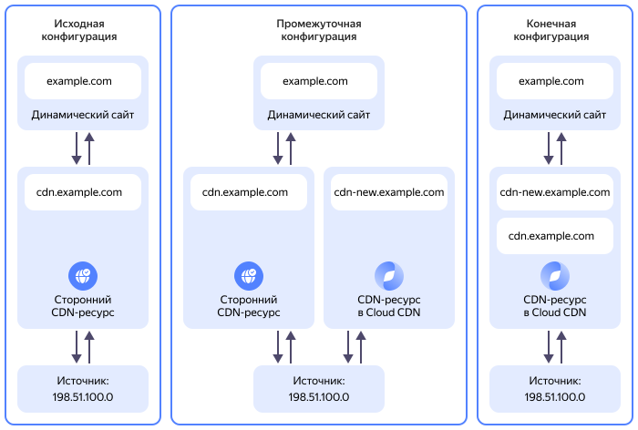

# Миграция в {{ cdn-full-name }} из стороннего CDN-провайдера

Если ваш динамический сайт использует сторонний CDN-ресурс для предоставления пользователям доступа к статическому контенту, вы можете бесшовно перейти на использование {{ cdn-full-name }}. В данном руководстве описаны шаги, которые позволят выполнить такой переход, сохранив доступность вашего контента на протяжении всего процесса перехода.

## Схема решения {#solution-overview}



Для бесшовного перехода вы создадите в {{ cdn-full-name }} новый [CDN-ресурс](../../cdn/concepts/resource.md), использующий тот же [источник](../../cdn/concepts/origins.md), который использует сторонний CDN-ресурс. Для нового CDN-ресурса вы создадите новый поддомен, а для домена второго уровня и всех его поддоменов третьего уровня выпустите новый [TLS-сертификат](../../certificate-manager/concepts/managed-certificate.md) в {{ certificate-manager-full-name }}.

Убедившись в работоспособности нового CDN-ресурса, на вашем динамическом сайте вы перенастроите ссылки на статический контент, перенаправив их на новый CDN-ресурс. Затем вы удалите сторонний CDN-ресурс, добавив использовавшееся им доменное имя как дополнительное в CDN-ресурс {{ cdn-full-name }}.

В процессе перехода со стороннего CDN-ресурса на CDN-ресурс в {{ cdn-name }} будет обеспечена непрерывная доступность статического контента для вашего динамического сайта.

Чтобы перенести CDN-ресурс в {{ cdn-full-name }}:

1. [Подготовьте облако к работе](#before-you-begin).
1. [Подключитесь к провайдеру {{ cdn-name }}](#enable-provider).
1. [Создайте CNAME-запись поддомена для нового CDN-ресурса](#setup-subdomain).
1. [Добавьте TLS-сертификат в {{ certificate-manager-full-name }}](#issue-certificate).
1. [Создайте CDN-ресурс в {{ cdn-name }}](#setup-resource).
1. [Перенастройте ваш сайт на использование нового CDN-ресурса](#update-website).
1. [Добавьте дополнительный домен к CDN-ресурсу в {{ cdn-name }}](#add-secondary-domain).

## Перед началом работы {#before-you-begin}



### Доступ к настройкам DNS {#dns-access}

Убедитесь, что у вас есть доступ к настройкам [DNS](../../glossary/dns.md) на сайте компании, которая предоставляет вам услуги DNS-хостинга. Обычно это компания-регистратор вашего домена.

Предполагается, что в вашем личном кабинете DNS-провайдера создана публичная доменная зона, соответствующая вашему доменному имени (например, `example.com.`), и в этой публичной зоне существует [CNAME-запись](../../dns/concepts/resource-record.md#cname) для вашего текущего CDN-поддомена (например, `cdn.example.com`), указывающая на стороннего CDN-провайдера.

### Необходимые платные ресурсы {#paid-resources}

В стоимость поддержки создаваемой CDN-инфраструктуры входит плата за исходящий трафик с CDN-серверов (см. [тарифы {{ cdn-name }}](../../cdn/pricing.md)).

## Подключитесь к провайдеру {{ cdn-name }} {#enable-provider}

Создать в [каталоге](../../resource-manager/concepts/resources-hierarchy.md#folder) CDN-ресурс можно только в том случае, если этот каталог подключен к CDN-провайдеру {{ cdn-name }}. При подключении к CDN-провайдеру вашему каталогу будет присвоено уникальное значение `cname`, которое необходимо для создания [CNAME-записей](../../dns/concepts/resource-record.md#cname) для поддоменов, используемых создаваемыми в этом каталоге CDN-ресурсами.

Чтобы подключить каталог к CDN-провайдеру и получить значение `cname`:



- Консоль управления {#console}

  1. В [консоли управления]({{ link-console-main }}) выберите каталог, который нужно подключить к CDN-провайдеру.
  1. В списке сервисов выберите **{{ ui-key.yacloud.iam.folder.dashboard.label_cdn }}**.
  1. Если CDN-провайдер еще не активирован, нажмите кнопку **{{ ui-key.yacloud.cdn.label_activate-provider-empty-container_action-text }}**. Подключение произойдет автоматически.

      Если кнопки **{{ ui-key.yacloud.cdn.label_activate-provider-empty-container_action-text }}** нет и вам доступно создание ресурсов и групп источников — провайдер уже активирован.
  1. Нажмите кнопку **{{ ui-key.yacloud.cdn.button_resource-create }}** и в блоке **{{ ui-key.yacloud.cdn.label_section-domain }}** скопируйте значение `cname`, необходимое для создания [ресурсной записи](../../dns/concepts/resource-record.md#cname) нового поддомена для CDN-ресурса.
  1. Нажмите кнопку **{{ ui-key.yacloud.common.cancel }}**. CDN-ресурс вы создадите позднее.

- CLI {#cli}

  

  
  
  1. Подключитесь к провайдеру:

      ```bash
      yc cdn provider activate --type gcore
      ```

  1. Получите значение CNAME-записи для CDN-ресурса:

      ```bash
      yc cdn resource get-provider-cname
      ```

      Результат:

      ```yaml
      cname: cl-ms6*****90.edgecdn.ru
      folder_id: b1gt6g8ht345********
      ```



Сохраните полученное значение CNAME-записи, оно понадобится на следующем шаге.

## Создайте CNAME-запись поддомена для нового CDN-ресурса {#setup-subdomain}

Для бесшовного переключения вашего сайта на новый CDN-ресурс вам понадобится новый CDN-поддомен. В публичной доменной зоне, к которой относится доменное имя вашего сайта, создайте CNAME-запись для нового CDN-поддомена, который будет использоваться новым CDN-ресурсом:

* Имя записи: имя нового CDN-поддомена. Например: `cdn-new.example.com.`.
* Тип записи: `CNAME`.
* Значение записи: полученное [ранее](#enable-provider) значение `cname` для вашего каталога.

Если домен вашего сайта делегирован {{ dns-full-name }}, для создания CNAME-записи воспользуйтесь [инструкцией](../../dns/operations/resource-record-create.md). В остальных случаях воспользуйтесь документацией вашего DNS-провайдера или обратитесь в его службу технической поддержки.

## Добавьте TLS-сертификат в {{ certificate-manager-full-name }} {#issue-certificate}

Чтобы обеспечить шифрование данных при обращении к новому CDN-ресурсу, добавьте в сервис {{ certificate-manager-full-name }} новый [TLS-сертификат](../../certificate-manager/concepts/managed-certificate.md) от Let's Encrypt® для домена вашего сайта и всех его поддоменов (wildcard-сертификат):

1. Создайте новый TLS-сертификат:

    

    - Консоль управления {#console}

      1. В [консоли управления]({{ link-console-main }}) выберите [каталог](../../resource-manager/concepts/resources-hierarchy.md#folder), в который будет добавлен сертификат.
      1. В списке сервисов выберите **{{ ui-key.yacloud.iam.folder.dashboard.label_certificate-manager }}**.
      1. Нажмите кнопку **{{ ui-key.yacloud.certificate-manager.button_empty-action }}** и выберите **{{ ui-key.yacloud.certificate-manager.action_request }}**.
      1. В открывшемся окне в поле **{{ ui-key.yacloud.certificate-manager.metadata.field_name }}** введите имя сертификата. Например: `my-cdn-certificate`.
      1. В поле **{{ ui-key.yacloud.certificate-manager.request.field_domains }}** задайте маску для вашего домена и его поддоменов. Например: `*.example.com`, где `example.com` — доменное имя вашего сайта.
      1. В поле **{{ ui-key.yacloud.certificate-manager.request.field_challenge-type }}** выберите `{{ ui-key.yacloud.certificate-manager.request.challenge-type_label_dns }}`.
      1. Нажмите кнопку **{{ ui-key.yacloud.certificate-manager.request.button_request }}**.

    - CLI {#cli}

      1. Запросите новый wildcard-сертификат. Для этого выполните команду:

          ```bash
          yc certificate-manager certificate request \
            --name my-cdn-certificate \
            --domains "*.<доменное_имя_вашего_сайта>"
          ```

          Где:
          * `--name` — имя сертификата. Например: `my-cdn-certificate`.
          * `--domains` — маска для вашего домена и его поддоменов. Например: `*.example.com`, где `example.com` — доменное имя вашего сайта.

          Результат:

          ```text
          id: fpqba7lpgmp7********
          folder_id: b1gt6g8ht345********
          created_at: "2025-02-09T20:41:05.916923798Z"
          name: my-cdn-certificate
          type: MANAGED
          domains:
            - '*.example.com'
          status: VALIDATING
          updated_at: "2025-02-09T20:41:05.916923798Z"
          ```

          Сохраните идентификатор запрошенного сертификата (значение поля `id`) — он понадобится на последующих шагах.

          Подробнее о команде `yc certificate-manager certificate request` читайте в [справочнике CLI](../../cli/cli-ref/certificate-manager/cli-ref/certificate/request.md).

    
1. Пройдите процедуру подтверждения прав на домен:

    

    - Консоль управления {#console}

      1. В [консоли управления]({{ link-console-main }}) выберите [каталог](../../resource-manager/concepts/resources-hierarchy.md#folder), в который был добавлен [сертификат](../../certificate-manager/concepts/managed-certificate.md).
      1. В списке сервисов выберите **{{ ui-key.yacloud.iam.folder.dashboard.label_certificate-manager }}**.
      1. В списке сертификатов выберите сертификат, для которого необходимо пройти процедуру проверки.
      1. В открывшемся окне в блоке **{{ ui-key.yacloud.certificate-manager.overview.section_challenges }}** будет указана информация для прохождения процедуры проверки прав.

          На вкладке **CNAME-запись** скопируйте и сохраните значения полей **{{ ui-key.yacloud.certificate-manager.overview.challenge_label_dns-name }}** и **{{ ui-key.yacloud.certificate-manager.overview.challenge_label_value }}**. Они понадобятся для создания CNAME-записи.

    - CLI {#cli}

      1. Получите значения CNAME-записи, необходимые для прохождения процедуры проверки прав на домен. Для этого выполните команду, указав сохраненный ранее идентификатор сертификата:

          ```bash
          yc certificate-manager certificate get <идентификатор_сертификата> \
            --full \
            --format=json | \
            jq -r ".challenges[].dns_challenge"
          ```

          Результат:

          ```json
          {
            "name": "_acme-challenge.example.com.",
            "type": "CNAME",
            "value": "fpqba7lpgmp7********.cm.yandexcloud.net."
          }
          {
            "name": "_acme-challenge.example.com.",
            "type": "TXT",
            "value": "oRnpmIJau5SWFDYqKwwUJMn-61HHdulvqk7********"
          }
          ```

          Сохраните значения полей `name` и `value` для типа записи `CNAME`. Они понадобятся для создания CNAME-записи.

          Подробнее о команде `yc certificate-manager certificate get` читайте в [справочнике CLI](../../cli/cli-ref/certificate-manager/cli-ref/certificate/get.md).

    
1. Используя сохраненные на предыдущем шаге значения, создайте в публичной доменной зоне доменного имени вашего сайта CNAME-запись для подтверждения ваших прав на домен:

    Если домен вашего сайта делегирован {{ dns-full-name }}, для создания CNAME-записи воспользуйтесь [инструкцией](../../dns/operations/resource-record-create.md). В остальных случаях воспользуйтесь документацией вашего DNS-провайдера или обратитесь в его службу технической поддержки.

    

    

    

Дождитесь успешного прохождения проверки прав на домен, в результате которого созданный wildcard-сертификат будет выпущен и перейдет в статус `Issued`.

Проверить статус сертификата можно на странице сертификата в [консоли управления]({{ link-console-main }}) либо с помощью команды CLI `yc certificate-manager certificate get <идентификатор_сертификата>`.

## Создайте CDN-ресурс в {{ cdn-name }} {#setup-resource}

В данном разделе приведена инструкция по созданию CDN-ресурса с типом источника `{{ ui-key.yacloud.cdn.value_source-type-url }}`. Если в качестве источника вы используете [бакет](../../storage/concepts/bucket.md) {{ objstorage-full-name }} или [балансировщик](../../application-load-balancer/concepts/application-load-balancer.md) {{ alb-full-name }}, при создании CDN-ресурса воспользуйтесь инструкцией [{#T}](../../cdn/operations/resources/create-resource.md).

Создайте новый CDN-ресурс в {{ cdn-full-name }}:



- Консоль управления {#console}

  1. В [консоли управления]({{ link-console-main }}) выберите каталог, в котором вы будете создавать CDN-ресурс.
  1. В списке сервисов выберите **{{ ui-key.yacloud.iam.folder.dashboard.label_cdn }}**.
  1. Нажмите **{{ ui-key.yacloud.cdn.button_resource-create }}**.
  1. В блоке **{{ ui-key.yacloud.cdn.label_section-content }}** укажите:

      * **{{ ui-key.yacloud.cdn.label_content-query-type }}** — `{{ ui-key.yacloud.cdn.value_query-type-one-origin }}`.
      * **{{ ui-key.yacloud.cdn.label_source-type }}** — `{{ ui-key.yacloud.cdn.value_source-type-url }}`.
      * В поле **{{ ui-key.yacloud.cdn.field_origin }}** укажите доменное имя или публичный IP-адрес вашего источника статического контента.
  1. В блоке **{{ ui-key.yacloud.cdn.label_section-domain }}** в поле **{{ ui-key.yacloud.cdn.label_personal-domain }}** укажите новое доменное имя, которое вы присвоили вашему новому CDN-ресурсу. Например: `cdn-new.example.com`.

  1. В блоке **{{ ui-key.yacloud.cdn.label_section-additional }}**:

      1. В поле **{{ ui-key.yacloud.cdn.label_protocol }}** выберите протокол, по которому CDN-ресурс будет взаимодействовать с источником. Если вы выбираете варианты `{{ ui-key.yacloud.common.label_https }}` или `{{ ui-key.yacloud.cdn.value_protocol-match }}`, убедитесь, что ваш источник поддерживает HTTPS.
      1. В поле **{{ ui-key.yacloud.cdn.label_redirect }}** выберите `{{ ui-key.yacloud.cdn.value_do-not-use }}`.
      1. В поле **{{ ui-key.yacloud.cdn.label_certificate-type }}** выберите `{{ ui-key.yacloud.cdn.value_certificate-custom }}` и в появившемся списке выберите созданный ранее сертификат, например: `my-cdn-certificate`.
      1. В поле **{{ ui-key.yacloud.cdn.label_host-header }}** выберите `{{ ui-key.yacloud.cdn.value_host-header-default }}`.

  1. Нажмите **{{ ui-key.yacloud.common.create }}**.

- {{ yandex-cloud }} CLI {#cli}

  1. Выполните команду:
  
      ```bash
      yc cdn resource create <имя_поддомена> \
        --origin-custom-source '<IP-адрес_или_доменное_имя_источника>' \
        --origin-protocol '<протокол_для_источника>' \
        --cert-manager-ssl-cert-id <идентификатор_сертификата>
      ```

      Где:
      * `<имя_поддомена>` — доменное имя, для которого ранее была создана CNAME-запись и которое будет использоваться новым CDN-ресурсом. Например: `cdn-new.example.com`.
      * `--origin-custom-source` — доменное имя или публичный IP-адрес вашего источника статического контента.
      * `--origin-protocol` — протокол, который будет использоваться для взаимодействия CDN-ресурса с источником. Возможные значения:

          * `http` — использовать протокол HTTP.
          * `https` — использовать протокол HTTPS.
          * `match` — использовать такое же значение, как и у заголовка `Host` в запросе клиента к CDN.

          Выбирая вариант `https` или `match`, убедитесь, что ваш источник поддерживает HTTPS.
      * `--cert-manager-ssl-cert-id` — идентификатор TLS-сертификата, сохраненный ранее при его создании.

      

      ```text
      id: bc8cfqtx2mkx********
      folder_id: b1gt6g8ht345********
      cname: cdn-new.example.com
      created_at: "2025-02-10T07:42:24.920162Z"
      updated_at: "2025-02-10T07:42:24.920187Z"
      active: true
      options:
        edge_cache_settings:
          enabled: true
          default_value: "345600"
        query_params_options:
          ignore_query_string:
            enabled: true
            value: true
        stale:
          enabled: true
          value:
            - error
            - updating
      origin_group_id: "352269"
      origin_group_name: Origins for cdn-new.example.com (302798)
      origin_protocol: HTTP
      ssl_certificate:
        type: CM
        status: READY
        data:
          cm:
            id: fpqnetjumkhn********
      ```

      

      Сохраните идентификатор созданного CDN-ресурса (значение поля `id`) — он понадобится позднее.

      Подробнее о команде `yc cdn resource create` читайте в [справочнике CLI](../../cli/cli-ref/cdn/cli-ref/resource/create.md).





После создания CDN-ресурса может пройти до 15 минут, прежде чем ресурс фактически заработает.

Прежде чем приступать к следующим шагам, убедитесь, что вновь созданный CDN-ресурс полностью работоспособен.



## Перенастройте ваш сайт на использование нового CDN-ресурса {#update-website}

После того как вы создали в {{ cdn-name }} новый CDN-ресурс и убедились в его работоспособности, вы можете переходить к перенастройке вашего сайта и удалению старого CDN-ресурса.

### Перенаправьте ссылки с динамического сайта {#redirect-links}

Перенаправьте на новый CDN-поддомен ссылки на статический контент, которые генерирует ваш динамический сайт. Например, заменив в генерируемых ссылках имя домена с `cdn.example.com` на `cdn-new.example.com`. Это действие должен выполнить администратор вашего динамического сайта.

Произведя все необходимые изменения, убедитесь, что ссылки на статический контент, генерируемые вашим сайтом, работают, а контент — доступен. Также убедитесь, что на старом CDN-ресурсе прекратился исходящий трафик: для этого воспользуйтесь инструментами статистики и мониторинга стороннего CDN-провайдера.

На этом этапе ваш динамический сайт полностью перешел на использование {{ cdn-full-name }}.

### Измените CNAME-запись исходного CDN-поддомена {#update-cname}

Чтобы исходный CDN-поддомен вашего сайта продолжил работать на новом CDN-ресурсе {{ cdn-name }}, замените значение ресурсной CNAME-записи исходного поддомена на значение, полученное ранее при подключении к провайдеру {{ cdn-name }}:

* Имя записи: имя исходного CDN-поддомена. Например: `cdn.example.com.`.
* Тип записи: `CNAME`.
* Значение записи: [полученное ранее](#enable-provider) значение `cname` для вашего каталога.

Если домен вашего сайта делегирован {{ dns-full-name }}, для изменения CNAME-записи воспользуйтесь [инструкцией](../../dns/operations/resource-record-update.md). В остальных случаях воспользуйтесь документацией вашего DNS-провайдера или обратитесь в его службу технической поддержки.

### Удалите сторонний CDN-ресурс {#delete-resource}

Убедившись, что исходный CDN-ресурс у стороннего CDN-провайдера перестал генерировать исходящий трафик, удалите этот CDN-ресурс. Для этого воспользуйтесь документацией стороннего CDN-провайдера или обратитесь в его службу технической поддержки.

## Добавьте дополнительный домен к CDN-ресурсу в {{ cdn-name }} {#add-secondary-domain}

После удаления стороннего CDN-ресурса, использовавшего исходный CDN-поддомен, вы можете добавить этот освободившийся поддомен к вашему новому CDN-ресурсу в {{ cdn-name }} в качестве дополнительного домена. Для этого:



- Консоль управления {#console}

  1. В [консоли управления]({{ link-console-main }}) выберите каталог, в котором расположен ваш CDN-ресурс.
  1. В списке сервисов выберите **{{ ui-key.yacloud.iam.folder.dashboard.label_cdn }}**.
  1. В строке с созданным ранее CDN-ресурсом нажмите значок  и выберите  **{{ ui-key.yacloud.common.edit }}**.
  1. В блоке **{{ ui-key.yacloud.cdn.label_section-domain }}** нажмите кнопку  **{{ ui-key.yacloud.cdn.button_add-domain }}** и в появившемся поле введите доменное имя, оставшееся от прежнего CDN-ресурса. Например: `cdn.example.com`.
  1. Нажмите кнопку **{{ ui-key.yacloud.common.save }}**.

- {{ yandex-cloud }} CLI {#cli}

  1. Выполните команду:
  
      ```bash
      yc cdn resource update <идентификатор_CDN-ресурса> \
        --secondary-hostnames '<прежний_CDN-поддомен>'
      ```

      Где:
      * `<идентификатор_CDN-ресурса>` — сохраненный [ранее](#setup-resource) идентификатор CDN-ресурса {{ cdn-name }}.
      * `--secondary-hostnames` — освободившееся после удаления стороннего CDN-ресурса доменное имя. Например: `cdn.example.com`.

      

      Команда удалит все дополнительные домены, которые до этого были привязаны к CDN-ресурсу.
      
      Чтобы привязать дополнительный домен к CDN-ресурсу, уже имеющему привязанные дополнительные домены, укажите в параметре `--secondary-hostnames` через запятую все дополнительные домены, которые должны быть привязаны к ресурсу. 

      

      

      ```text
      id: bc845trezddi********
      folder_id: b1gt6g8ht345********
      cname: cdn-new.example.com
      created_at: "2025-01-25T21:47:21.181871Z"
      updated_at: "2025-02-10T17:10:37.511453Z"
      active: true
      options:
        edge_cache_settings:
          enabled: true
          default_value: "345600"
        query_params_options:
          ignore_query_string:
            enabled: true
            value: true
        stale:
          enabled: true
          value:
            - error
            - updating
        ignore_cookie:
          enabled: true
      secondary_hostnames:
        - cdn.example.com
      origin_group_id: "350569"
      origin_group_name: Origins for cdn-new.example.com (301532)
      origin_protocol: HTTP
      ssl_certificate:
        type: CM
        status: READY
      ```

      

      Подробнее о команде `yc cdn resource update` читайте в [справочнике CLI](../../cli/cli-ref/cdn/cli-ref/resource/update.md).



Обновление настроек CDN-ресурса может занять до 15 минут, после чего ваш новый CDN-ресурс станет доступен по обоим доменным именам: `cdn-new.example.com` и `cdn.example.com`.

#### См. также {#see-also}

* [Создание CDN-ресурса](../../cdn/operations/resources/create-resource.md)
* [Добавление сертификата от Let's Encrypt®](../../certificate-manager/operations/managed/cert-create.md)
* [Начало работы с {{ dns-name }}](../../dns/quickstart.md)