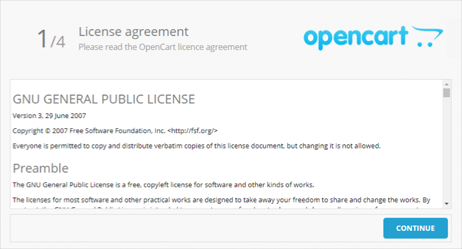
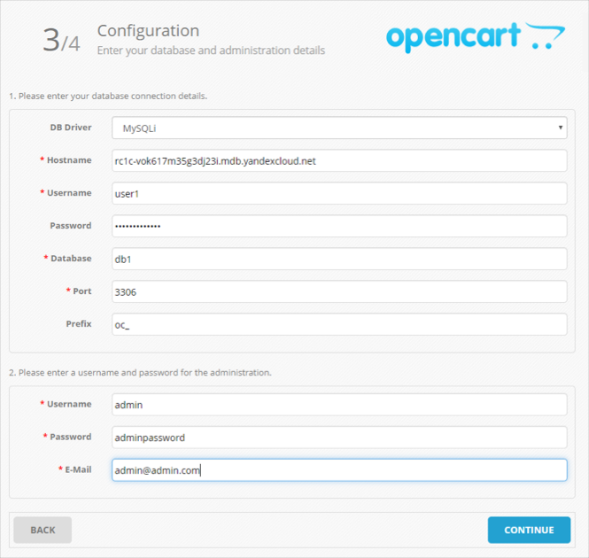
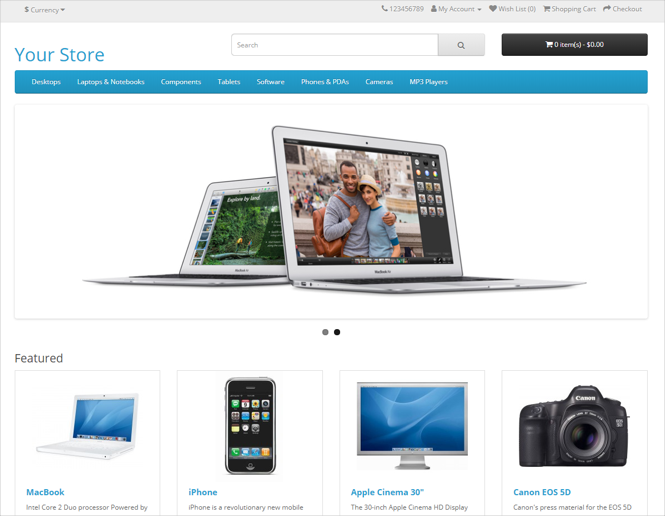

# Интернет-магазин на платформе OpenCart

[OpenCart](https://ru.wikipedia.org/wiki/OpenCart) — это платформа, предназначенная для создания собственного интернет-магазина. Платформа бесплатна и имеет открытый исходный код. С помощью OpenCart можно создать интернет-магазин любой сложности с помощью большого количества поддерживаемых сообществом дополнений.

В этой инструкции будет создан и настроен интернет-магазин на базе OpenCart. Для этого будет развернута [виртуальная машина](../../compute/concepts/vm.md) с предустановленной платформой OpenCart и требуемыми для ее работы программами, в частности, сервером {{ MY }}.

В сценарии описана как настройка локального сервера {{ MY }}, так и развертывание [кластера базы данных {{ mmy-full-name }}](../../managed-mysql/concepts/index.md) на тот случай, если вам не хватает производительности или функциональности локальной СУБД. Если необходимости в кластере нет, пропустите этот шаг.

Чтобы настроить свой интернет-магазин на OpenCart:
1. [Подготовьте облако к работе](#before-you-begin).
1. [Создайте ВМ с платформой OpenCart](#create-vm).
1. [(опционально) Создайте кластер БД {{ MY }}](#create-mysql).
1. [Настройте OpenCart](#configure-opencart).

Если сайт вам больше не нужен, [удалите все используемые им ресурсы](#clear-out).


Также инфраструктуру для интернет-магазина на OpenCart можно развернуть через {{ TF }} с помощью [готовой конфигурации](#terraform).


## Подготовьте облако к работе {#before-you-begin}




### Необходимые платные ресурсы

В стоимость поддержки инфраструктуры для OpenCart входит:
* Плата за постоянно запущенную ВМ (см. [тарифы {{ compute-full-name }}](../../compute/pricing.md)).
* Плата за использование динамического или статического [внешнего IP-адреса](../../vpc/concepts/address.md#public-addresses) (см. [тарифы {{ vpc-full-name }}](../../vpc/pricing.md)).
* Если планируется настройка управляемой БД, в стоимость также войдет плата за кластер БД (см. [тарифы {{ mmy-name }}](../../managed-mysql/pricing.md)).


## Создайте ВМ с платформой OpenCart {#create-vm}

Чтобы создать ВМ:



- Консоль управления

  1. На странице [каталога](../../resource-manager/concepts/resources-hierarchy.md#folder) в [консоли управления]({{ link-console-main }}) нажмите кнопку **Создать ресурс** и выберите пункт **Виртуальная машина**.
  1. В поле **Имя** введите имя ВМ, например `opencart`. Требования к имени:

     

  1. Выберите [зону доступности](../../overview/concepts/geo-scope.md), в которой должна находиться ВМ.
  1. В блоке **Выбор образа/загрузочного диска** перейдите на вкладку **{{ marketplace-name }}** и выберите публичный [образ](../../compute/concepts/image.md) [OpenCart](/marketplace/products/yc/opencart-3).

     На загрузочном диске будет предустановлена платформа OpenCart и необходимые для ее работы компоненты, включая PHP и {{ MY }}.
  1. В блоке **Диски** выберите жесткий [диск](../../compute/concepts/disk.md) SSD размером 13 ГБ.
  1. В блоке **Вычислительные ресурсы** укажите следующую конфигурацию:
     * **Платформа** — Intel Ice Lake.
     * **Гарантированная доля vCPU** — 20%.
     * **vCPU** — 2.
     * **RAM** — 4 ГБ.
  1. В блоке **Сетевые настройки**:
     * Выберите [сеть](../../vpc/concepts/network.md#network) и [подсеть](../../vpc/concepts/network.md#subnet), к которым нужно подключить ВМ. Если у вас еще нет сети или подсети, вы можете создать их прямо на странице создания ВМ: нажмите кнопку **Создать новую сеть** или **Создать новую подсеть**.
     * В поле **Публичный адрес** оставьте значение **Автоматически**, чтобы назначить ВМ случайный внешний IP-адрес из пула {{ yandex-cloud }}, или выберите статический адрес из списка, если вы зарезервировали его заранее.
  1. В блоке **Доступ** укажите данные для доступа к ВМ:
     * В поле **Логин** введите предпочтительное имя пользователя, который будет создан на ВМ, например, `ubuntu`.
     * В поле **SSH-ключ** скопируйте ваш открытый [SSH-ключ](../../glossary/ssh-keygen.md). Пару ключей для подключения по SSH необходимо создать самостоятельно, см. [раздел о подключении к ВМ по SSH](../../compute/operations/vm-connect/ssh.md).
  1. Нажмите кнопку **Создать ВМ**.

  
- {{ TF }}

  См. раздел [Как создать инфраструктуру с помощью {{ TF }}](#terraform).




## Создайте кластер БД {{ MY }} {#create-mysql}

Если вы рассчитываете на существенную нагрузку на БД, или хотели бы использовать сервис управляемых СУБД, разверните кластер БД с помощью сервиса {{ mmy-name }}. Сервис берет на себя поддержку и обслуживание СУБД, в том числе мониторинг ее состояния и текущей активности, автоматическое создание резервных копий и легко настраиваемую отказоустойчивость.

Чтобы создать кластер БД:



- Консоль управления

  1. На странице каталога в [консоли управления]({{ link-console-main }}) нажмите кнопку **Создать ресурс** и выберите пункт **Кластер {{ MY }}**.
  1. Укажите имя кластера, например, `opencart`.
  1. В блоке **Класс хоста** выберите **s2.micro**. Данных характеристик хватит для работы системы без особых нагрузок.
  1. В блоке **База данных** укажите:
     * **Имя БД** — оставьте значение по умолчанию, `db1`.
     * **Имя пользователя** для подключения к БД — оставьте значение по умолчанию, `user1`.
     * **Пароль**, который OpenCart будет использовать для доступа к БД {{ MY }}.
  1. В блоке **Хосты**, при необходимости поменяйте **Зону доступности**, в которой должна находиться БД. Для этого нажмите значок  справа от текущей выбранной зоны доступности и выберите из выпадающего списка нужную.

     

     Рекомендуется выбрать ту же зону доступности, которую вы выбрали при создании ВМ. Это позволит уменьшить задержку (latency) между ВМ и БД.

     

  1. (опционально) Если вы хотите обеспечить отказоустойчивость БД, добавьте дополнительные хосты в кластер: для этого нажмите **Добавить хост** и укажите, в какой зоне доступности он должен быть размещен.
  1. Остальные поля оставьте без изменений.
  1. Нажмите кнопку **Создать кластер**.

  
- {{ TF }}

  См. раздел [Как создать инфраструктуру с помощью {{ TF }}](#terraform).




Создание кластера БД может занять несколько минут.

## Настройте OpenCart {#configure-opencart}

1. Откройте веб-интерфейс интернет-магазина OpenCart. Для этого откройте в браузере адрес `http://<публичный_IP-адрес_ВМ>/`. Откроется страница настройки OpenCart.
1. Ознакомьтесь с лицензией и нажмите **Continue**.

   

1. Убедитесь, что все строки с требованиями к системе отмечены с зелеными галочками, и нажмите кнопку **Continue**.

   

1. Настройте доступ к БД:

   

   - Локальный сервер {{ MY }}

     Атрибуты подключения к БД генерируются в специальном файле при создании ВМ:
     1. Зайдите по SSH на созданную ВМ.
     1. Перейдите в режим администратора `sudo -i`.
     1. Откройте файл `default_passwords.txt` в домашней директории администратора:

        ```bash
        root@opencart:~# cat default_passwords.txt
        MYSQL_USER=opencart
        MYSQL_PASS=qDbvN1R6tA6ET
        MYSQL_ROOT_PASS=5DiVb80l1kXVz
        MYSQL_DB=opencart
        ```

     1. На странице настройки OpenCart в секции БД, введите соответствующие данные:
        * **Username** — значение переменной `MYSQL_USER`.
        * **Database** — значение переменной `MYSQL_DB`.
        * **Password** — значение переменной `MYSQL_PASS`.

        Остальные поля оставьте без изменения.

   - Кластер {{ mmy-name }}

     Если вы используете кластер {{ mmy-name }}, введите нужные атрибуты кластера:
     * **Hostname** — укажите [полное доменное имя (FQDN)](../../compute/concepts/network.md#hostname) созданной БД. Чтобы его узнать:
       1. Перейдите в новой вкладке браузера на страницу каталога в [консоли управления]({{ link-console-main }}).
       1. Выберите раздел **{{ mmy-name }}**.
       1. В таблице выберите созданный вами кластер.
       1. В меню слева выберите вкладку **Хосты**.
       1. Подведите курсор к полю **Имя хоста** (например, `rc1c-vok617m35g3dj23i`) и скопируйте полное доменное имя БД, нажав на значок .
     * **Username** — имя пользователя (в примере `user1`).
     * **Database** — имя БД (в примере `db1`).
     * **Password** — указанный вами пароль пользователя.

     Остальные поля оставьте без изменения.

   

1. Задайте имя администратора, его пароль и актуальный электронный адрес. После этого нажмите кнопку **Continue**.

   

1. Откроется страница с уведомлением о том, что система настроена. Чтобы настроить интернет-магазин, нажмите кнопку **Login to your administration** и введите логин и пароль администратора.

   

1. После завершения установки зайдите на ВМ по SSH и удалите ненужные установочные файлы:

   ```bash
   user@opencart:~$ sudo -i
   root@opencart:~# rm -rf /var/www/opencart/install/
   ```

1. Чтобы проверить главную страницу сайта, перейдите по адресу `http://<публичный_IP-адрес_ВМ>/`. Вы увидите главную страницу сайта глазами пользователя, посетившего ваш интернет-магазин.

   

## Как удалить созданные ресурсы {#clear-out}

Чтобы перестать платить за развернутый сервер, достаточно удалить созданную ВМ и кластер БД, если вы его создавали:
* [Удалите ВМ](../../compute/operations/vm-control/vm-delete.md) (в примере ВМ создается с именем `opencart`).
* [Удалите кластер {{ mmy-name }}](../../managed-mysql/operations/cluster-delete.md) (в примере кластер БД создается с именем `opencart`).

Если вы зарезервировали статический публичный IP-адрес специально для этой ВМ:
1. Выберите сервис **{{ vpc-short-name }}** в вашем каталоге.
1. Перейдите на вкладку **IP-адреса**.
1. Найдите нужный IP-адрес, нажмите значок  и выберите пункт **Удалить**.


## Как создать инфраструктуру с помощью {{ TF }} {#terraform}



Чтобы разместить интернет-магазин на OpenCart с помощью {{ TF }}:

1. [Установите {{ TF }}](../../tutorials/infrastructure-management/terraform-quickstart.md#install-terraform), [получите данные для аутентификации](../../tutorials/infrastructure-management/terraform-quickstart.md#get-credentials) и укажите источник для установки провайдера {{ yandex-cloud }} (раздел [{#T}](../../tutorials/infrastructure-management/terraform-quickstart.md#configure-provider), шаг 1).

1. Подготовьте файлы с описанием инфраструктуры:

    

    - Готовая конфигурация

      1. Клонируйте репозиторий с конфигурационными файлами:

          ```bash
          git clone https://github.com/yandex-cloud-examples/yc-opencart-store.git
          ```

      1. Перейдите в директорию с репозиторием. В ней должны появиться файлы:
          * `opencart.tf` — конфигурация создаваемой инфраструктуры;
          * `opencart.auto.tfvars` — файл с пользовательскими данными.

    - Создание вручную

       1. Создайте папку для конфигурационных файлов.

       1. Создайте в папке:

           1. Конфигурационный файл `opencart.tf`:

               

               

               

           1. Файл с пользовательскими данными `opencart.auto.tfvars`:

               

               

               

    

    Более подробную информацию о параметрах используемых ресурсов в {{ TF }} см. в документации провайдера:

    * [yandex_vpc_network]({{ tf-provider-link }}/vpc_network)
    * [yandex_vpc_subnet]({{ tf-provider-link }}/vpc_subnet)
    * [yandex_vpc_security_group]({{ tf-provider-link }}/vpc_security_group)
    * [yandex_compute_image]({{ tf-provider-link }}/compute_image)
    * [yandex_compute_instance]({{ tf-provider-link }}/compute_instance)
    * [yandex_mdb_mysql_cluster]({{ tf-provider-link }}/mdb_mysql_cluster)
    * [yandex_mdb_mysql_database]({{ tf-provider-link }}/mdb_mysql_database)
    * [yandex_mdb_mysql_user]({{ tf-provider-link }}/mdb_mysql_user)

1. В файле `opencart.auto.tfvars` задайте пользовательские параметры:

    * `folder_id` — [идентификатор каталога](../../resource-manager/operations/folder/get-id.md).
    * `vm_user` — имя пользователя ВМ.
    * `ssh_key_path` — путь к файлу с открытым SSH-ключом для аутентификации пользователя на ВМ. Подробнее см. [{#T}](../../compute/operations/vm-connect/ssh.md#creating-ssh-keys).
    * `db_user` — имя пользователя БД, например `user1`.
    * `db_password` — пароль для доступа к БД. Длина пароля должна составлять от 8 до 128 символов.

1. Создайте ресурсы:

    

1. [Настройте OpenCart](#configure-opencart).

