# Анализ customer journey мобильного приложения на данных AppMetrica

В этом сценарии вы проведете анализ поведения пользователей в мобильном приложении на данных AppMetrica:

* Обработаете данные с помощью скриптов на языке Python, описанных в {{ jlab }} ноутбуках в {{ ml-platform-full-name }}.
* Построите чарты и дашборды в {{ datalens-full-name }}.
* Сравните товары по охвату и частоте.

Customer journey — это последовательность действий пользователя. Анализ поведения пользователей поможет узнать, как люди используют продукт: какие страницы посещают и функции используют, где сталкиваются с трудностями. С помощью этой информации информации легче найти правильные решения для развития продукта.

В качестве источника будут использоваться сэмплированные и анонимизированные данные мобильного приложения [Авто.ру](https://auto.ru), выгруженные из AppMetrica.



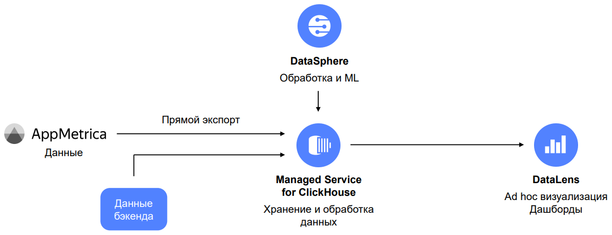





В сценарии используется файл с предварительно выгруженными данными из AppMetrica, поэтому вы можете пройти сценарий без доступа к мобильному приложению и AppMetrica.

Для решения ваших рабочих задач рекомендуем напрямую [экспортировать данные](https://appmetrica.yandex.ru/docs/common/cloud/about.html) из AppMetrica в {{ CH }}.



[Подготовьте облако к работе](#before-you-begin), затем исследуйте и визуализируйте данные по шагам:

1. [Подключите {{ CH }} и {{ ml-platform-short-name }}](#ch-datasphere-connection)
    1. [Подключите {{ CH }}](#ch-connection)
    1. [Подключите {{ ml-platform-short-name }}](#datasphere-connection)
    1. [Клонируйте репозиторий в {{ ml-platform-short-name }}](#clone-repo-to-datasphere)
1. [Получите и загрузите данные в {{ CH }}](#get-download-data-in-ch)
    1. [{{ ml-platform-short-name }}. Выгрузите данные тестового приложения через Яндекс Диск](#uploading-data-counter-from-disk)
    1. [Выгрузите данные из AppMetrica](#uploading-data-from-appmetrica)
    1. [{{ CH }}. Получите адрес кластера](#getting-ch-cluster-host)
    1. [{{ ml-platform-short-name }}. Загрузите данные в {{ CH }}](#uploading-data-counter-to-ch)
1. [{{ ml-platform-short-name }}. Сравните товары по охвату и частоте](#compare-by-coverage-frequency)
1. [Подключите {{ datalens-short-name }} и создайте чарты](#datalens-connection-chart-creation)
    1. [Подключитесь к {{ datalens-short-name }}](#datalens-connection)
    1. [Создайте подключение к {{ CH }} в {{ datalens-short-name }}](#creation-datalens-connection-to-ch)
    1. [Создайте датасет на базе подключения](#creating-dataset-based-on-connection)
    1. [Создайте чарт — точечная диаграмма](#creating-scatter-chart)
    1. [Создайте чарт — таблица](#creating-table-chart)
1. [Создайте и настройте дашборд в {{ datalens-short-name }}](#creating-configuring-dashboard)
1. [Customer journey. Создайте QL-чарт и диаграмму Sankey](#customer-journey)
    1. [Создайте QL-чарт в {{ datalens-short-name }}](#creating-sql-chart)
    1. [Создайте диаграмму Sankey в {{ ml-platform-short-name }}](#creating-sankey-chart)

## Подготовьте облако к работе {#before-you-begin}



## 1. Подключите {{ CH }} и {{ ml-platform-short-name }} {#ch-datasphere-connection}

### 1.1. Подключите {{ CH }} {#ch-connection}

1. В [консоли управления]({{ link-console-main }}) выберите в списке слева **{{ mch-name }}**.
1. Нажмите **Создать кластер**.
1. Укажите настройки кластера {{ CH }}.

   1. **Базовые параметры** — укажите имя кластера `appmetrica_analysis`. 
   1. **Класс хоста** — выберите тип виртуальной машины **burstable** и тип хоста **b2.medium**.
   
       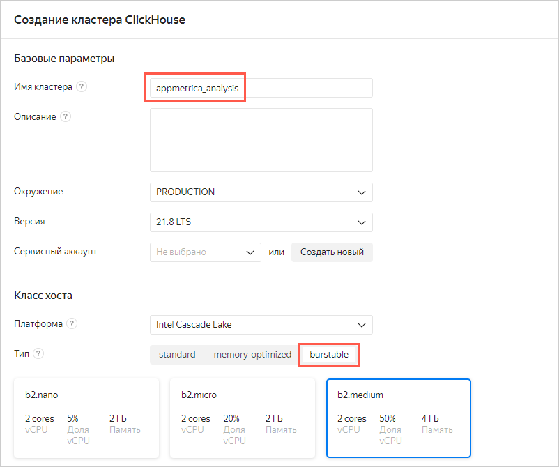
   
   1. **Размер хранилища** — оставьте значение 10 ГБ.
   1. **База данных** — укажите имя базы данных `autoru_appmetrica`, имя пользователя и пароль. Запомните эти данные.
     
       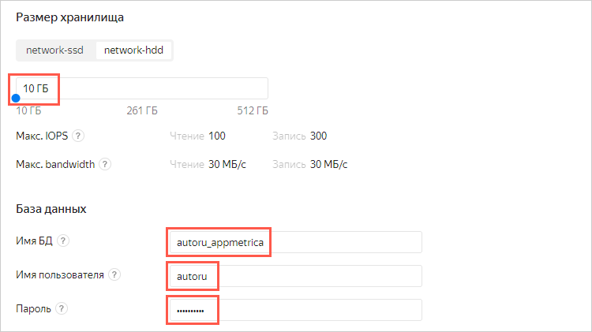
      
   1. **Хосты** — нажмите значок . Включите опцию **Публичный доступ** и нажмите кнопку **Сохранить**.
   1. **Дополнительные настройки** — включите 4 опции:

        * Доступ из {{ datalens-short-name }}
        * Доступ из консоли управления
        * Доступ из Метрики и AppMetrica
        * Доступ из Serverless

   1. После всех настроек нажмите кнопку **Создать кластер**.

### 1.2. Подключите {{ ml-platform-short-name }} {#datasphere-connection}

1. Перейдите в [консоль управления]({{ link-console-main }}).
1. Выберите в списке слева **{{ ml-platform-name }}**.
1. Нажмите **Создать проект**.
1. Укажите название проекта `appmetrica-analysis` и нажмите **Создать**. 
1. Откройте проект. Для этого в строке с именем проекта нажмите значок  → **Открыть**.

### 1.3. Клонируйте репозиторий в {{ ml-platform-short-name }} {#clone-repo-to-datasphere}

1. В левом верхнем углу нажмите значок **Git Clone** — .

   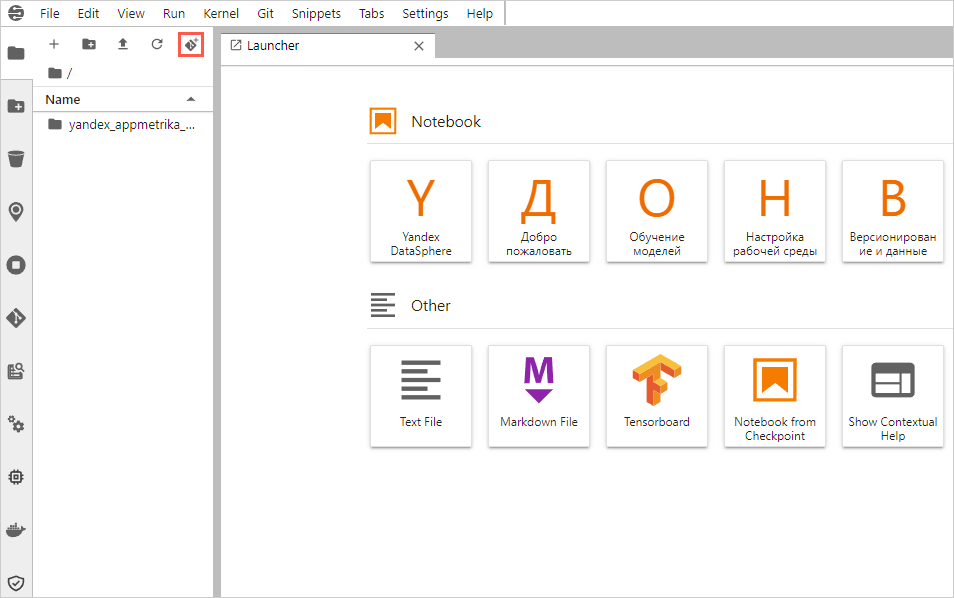

1. В открывшемся окне укажите **URI** репозитория `https://github.com/firstsvet/yandex_appmetrika_cloud_case` и нажмите кнопку **CLONE**.

## 2. Получите и загрузите данные в {{ CH }} {#get-download-data-in-ch}

Если у вас нет приложения AppMetrica или в нем недостаточно данных, или вы гарантированно хотите пройти все шаги инструкции и получить результат, перейдите к разделу [2.1](#uploading-data-counter-from-disk) (пропустите [2.2](#uploading-data-from-appmetrica)).

Если у вас есть приложение AppMetrica и доступ к нему, перейдите к разделу [2.2](#uploading-data-from-appmetrica) — этот шаг рекомендуется опытному пользователю, так как может потребоваться самостоятельная доработка скриптов (пропустите [2.1](#uploading-data-counter-from-disk)).

### 2.1. {{ ml-platform-short-name }}. Выгрузите данные тестового приложения через Яндекс Диск {#uploading-data-counter-from-disk}



Пропустите этот раздел, если вы работаете с данными своего приложения.



1. В меню слева откройте папку **yandex_appmetrika_cloud_case** → ноутбук **1.upload_data_from_yadisk.ipynb**.
1. Выполните все шаги (ячейки с кодом) в ноутбуке **1.upload_data_from_yadisk.ipynb**.

    Чтобы выполнить шаг, нажмите на номер слева от ячейки, затем — кнопку выполнения вверху. Вместо номера появится символ `[*]`. После того, как номер появится снова, запустите следующий шаг.

    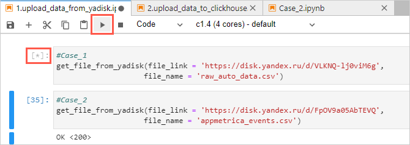

### 2.2. Выгрузите данные из AppMetrica {#uploading-data-from-appmetrica}

Для настройки подключения и выгрузки данных из своего приложения воспользуйтесь инструкцией [Экспорт данных в {{ yandex-cloud }}](https://appmetrica.yandex.ru/docs/common/cloud/about.html).

### 2.3. {{ CH }}. Получите адрес кластера {#getting-ch-cluster-host}

1. Перейдите в кластер {{ CH }} `appmetrica_analysis`, который вы создали в разделе [1.1](#ch-connection). Дождитесь, когда у кластера появится статус **Alive**. После этого откройте кластер — нажмите на него.

     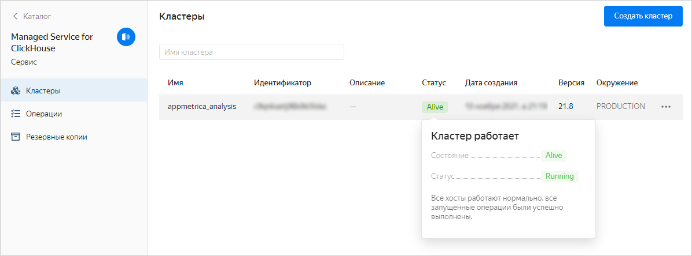

1. Выберите в списке слева **Хосты**.
1. На вкладке **Обзор** перейдите к столбцу **Имя хоста**. Чтобы скопировать имя хоста, наведите указатель мыши справа от названия хоста и нажмите значок копирования. 

### 2.4. {{ ml-platform-short-name }}. Загрузите данные в {{ CH }} {#uploading-data-counter-to-ch}

1. Откройте папку **yandex_appmetrika_cloud_case** → ноутбук **2.upload_data_to_{{ CH }}.ipynb**.
1. Вставьте данные в переменные:

    * Имя хоста из раздела [2.3](#uploading-data-counter-to-ch) — в переменную **CH_HOST_NAME**.
    * Имя пользователя из раздела [1.1](#ch-connection) — в переменную **CH_USER**.
    * Имя базы данных из раздела [1.1](#ch-connection) — в переменную **CH_DB_NAME**.
    
      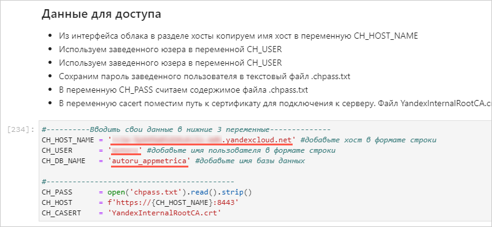
    
1. В папке **yandex_appmetrika_cloud_case** создайте новый текстовый файл с названием `chpass.txt`.
    
    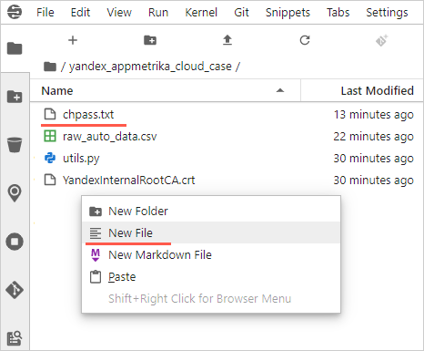

1. Запишите в файл **chpass.txt** пароль заведенного пользователя. Сохраните и закройте файл.
1. Выполните все шаги (ячейки с кодом) в ноутбуке.

## 3. {{ ml-platform-short-name }}. Сравните товары по охвату и частоте {#compare-by-coverage-frequency}

1. Откройте папку **yandex_appmetrika_cloud_case** → ноутбук **Case_1.ipynb**.
1. Вставьте данные в переменные:

    * Имя хоста из раздела [2.3](#uploading-data-counter-to-ch) — в переменную **CH_HOST_NAME**.
    * Имя пользователя из раздела [1.1](#ch-connection) — в переменную **CH_USER**.
    * Имя базы данных из раздела [1.1](#ch-connection) — в переменную **CH_DB_NAME**.

1. Выполните все шаги (ячейки с кодом) в ноутбуке.

1. Посмотрите промежуточные результаты.

     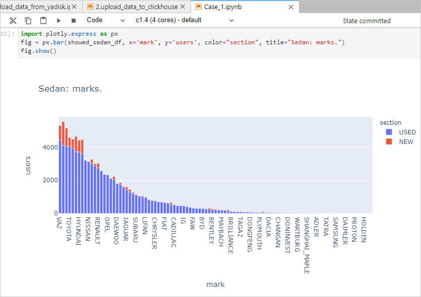

## 4. Подключите {{ datalens-short-name }} и создайте чарты {#datalens-connection-chart-creation}

### 4.1. Подключитесь к {{ datalens-short-name }} {#datalens-connection}

1. Перейдите к [{{ datalens-short-name }}]({{ link-datalens-main }}): на странице созданного кластера {{ CH }} слева в меню выберите **{{ datalens-short-name }}**.
1. В открывшемся окне нажмите кнопку **Активировать**.
1. Выберите каталог **default** и нажмите **Активировать DataLens**.

### 4.2. Создайте подключение к {{ CH }} в {{ datalens-short-name }} {#creation-datalens-connection-to-ch}

1. Нажмите кнопку **Создать подключение**.
1. Выберите подключение **{{ CH }}**.
1. Заполните настройки подключения.

   1. Введите название `AppMetrica_workshop`.
   1. Выберите хост {{ CH }} из выпадающего списка **Имя хоста**. 
   1. Выберите имя пользователя и введите пароль из раздела [1.1](#ch-connection).
   1. Нажмите **Проверить подключение**.
   1. Включите опцию **Разрешить подзапросы в датасетах и запросы из чартов**.
  
      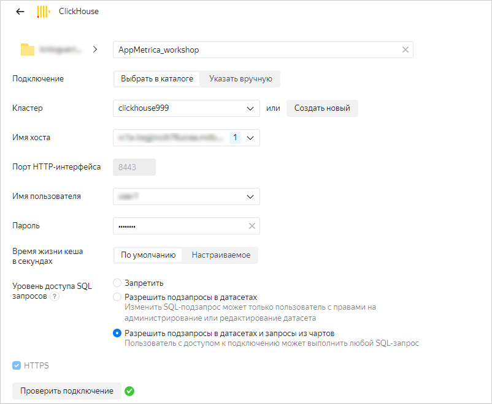

   1. После успешной проверки подключения в правом верхнем углу нажмите кнопку **Создать**.

### 4.3. Создайте датасет на базе подключения {#creating-dataset-based-on-connection}

1. В правом верхнем углу нажмите **Создать датасет**.
1. Выберите таблицу `autoru_appmetrica.auto_data` в качестве источника. Для этого перетащите таблицу из списка слева в область редактирования.
1. Откройте вкладку **Поля**.
1. Создайте вычисляемое поле **users**:

    1. В правом верхнем углу нажмите кнопку **Добавить поле**.
    1. Слева вверху введите название поля `users`.
    1. В область справа вставьте формулу `countd([appmetrica_device_id])`.
    1. Нажмите кнопку **Создать**.

     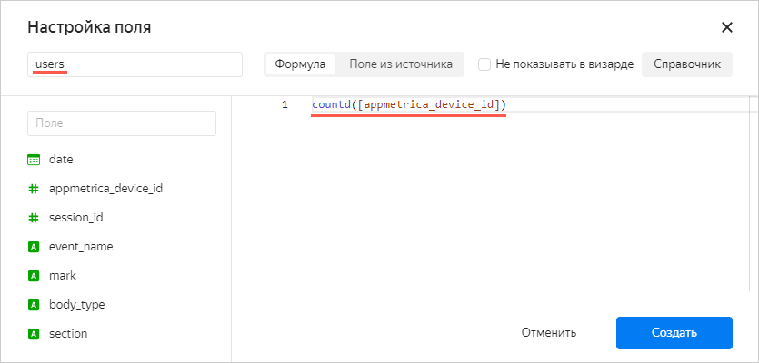

1. Повторите предыдущий шаг для других полей:

    * **reach** с формулой `COUNTD([appmetrica_device_id])/COUNTD([appmetrica_device_id] FIXED)`.
    * **events** с формулой `COUNT([session_id])`.
    * **events per user** с формулой `[events]/[users]`.

1. В правом верхнем углу нажмите кнопку **Сохранить**.
1. Назовите датасет `autoru_backend_data` и нажмите кнопку **Создать**.

### 4.4. Создайте чарт — точечная диаграмма {#creating-scatter-chart}

1. В правом верхнем углу нажмите кнопку **Создать чарт**.
1. Выберите тип **Точечная диаграмма**.
1. Перетащите поля в область чарта:

    * Показатель **reach** в секцию **X**.
    * Показатель **events per user** в секцию **Y**.
    * Измерение **mark** в секцию **Точки**. 
    * Измерение **event_name** в секцию **Цвета**.

   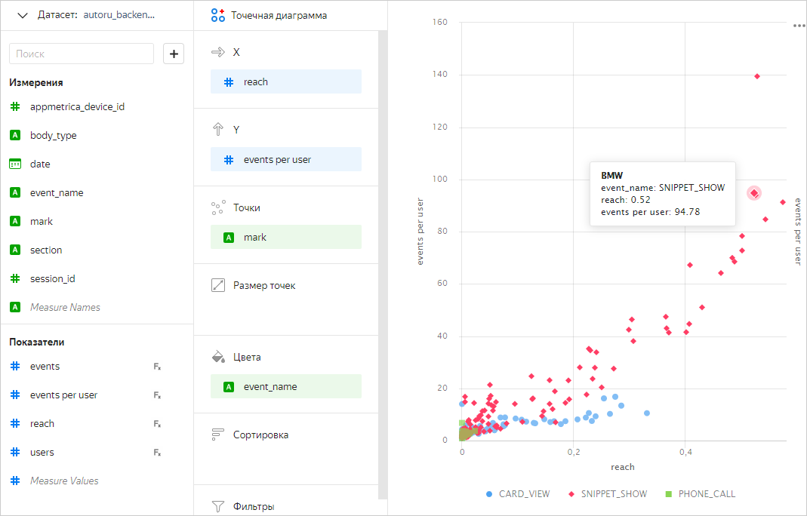

1. В правом верхнем углу нажмите кнопку **Сохранить**.
1. В открывшемся окне введите имя чарта `Охват и события` и нажмите кнопку **Сохранить**.

### 4.5. Создайте чарт — таблица {#creating-table-chart}

1. Выберите тип **Таблица**.
1. Перетащите поля в область чарта:

    * Измерение **mark** в секцию **Столбцы**.
    * Показатель **users** в секцию **Столбцы**.
    * Показатель **users** в секцию **Сортировка**. 

   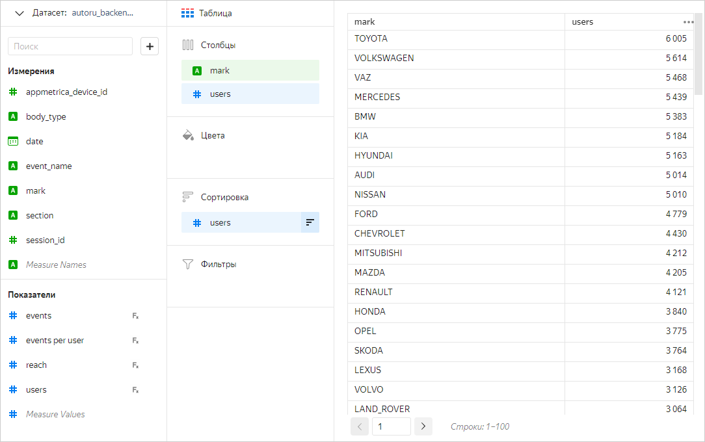

1. В правом верхнем углу нажмите кнопку справа от **Сохранить** и затем **Сохранить как**.
1. В открывшемся окне введите имя чарта `Таблица по маркам` и нажмите кнопку **Сохранить**.

## 5. Создайте и настройте дашборд в {{ datalens-short-name }} {#creating-configuring-dashboard}

1. Откройте [главную страницу]({{ link-datalens-main }}) {{ datalens-short-name }} и нажмите **Создать дашборд**.
1. Укажите название дашборда `auto.ru app` и нажмите кнопку **Создать**.
1. Добавьте чарт на дашборд.

    1. В правом верхнем углу нажмите **Добавить** → **Чарт**.
    1. Из выпадающего списка **Чарт** выберите **Таблица по маркам**. Поле **Название** заполнится автоматически.
    1. Нажмите кнопку **Добавить**.

   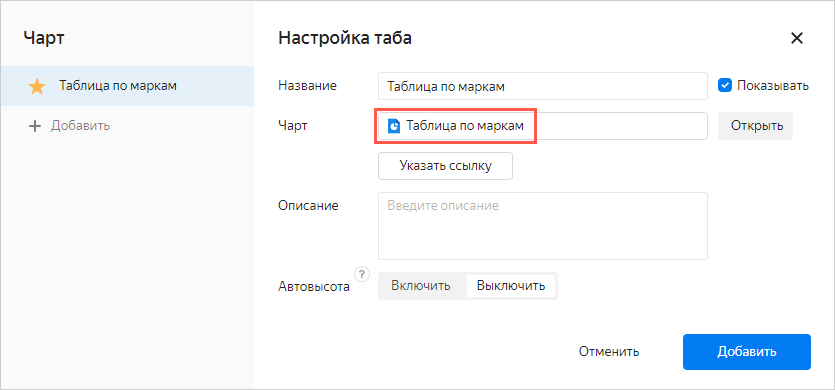

1. Повторите предыдущий шаг для чарта **Охват и события**.
1. Добавьте и настройте селектор.

    1. В правом верхнем углу нажмите **Добавить** → **Селектор**.
    1. В списке **Датасет** выберите **autoru_backend_data**.
    1. В списке **Поле** выберите **event name**.
    1. В списке **Значение по умолчанию** выберите любой вариант.
    1. Нажмите кнопку **Добавить**.

1. Расположите чарты и селектор на дашборде. Чтобы изменить размер элемента, потяните за правый нижний угол.
1. В правом верхнем углу нажмите кнопку **Сохранить**.

   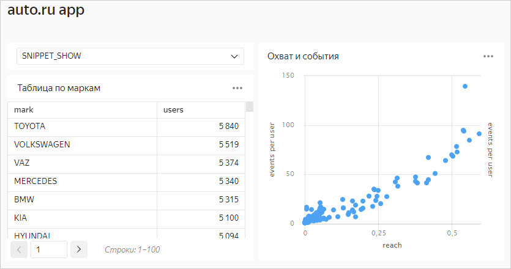

Попробуйте в селекторе изменить **event name** на другое значение — посмотрите, как изменится дашборд.

## 6. Customer journey. Создайте QL-чарт и диаграмму Sankey {#customer-journey}

### 6.1. Создайте QL-чарт в {{ datalens-short-name }} {#creating-sql-chart}

С помощью QL-чартов вы можете изучать последовательности событий и экспериментировать в {{ datalens-short-name }}.

1. Откройте [главную страницу]({{ link-datalens-main }}) {{ datalens-short-name }} и в меню слева выберите **Подключения**.
1. Выберите подключение `AppMetrica_workshop`, которое вы создали на шаге [4.2](#creation-datalens-connection-to-ch).
1. Справа вверху нажмите **Создать QL-чарт**.
1. Введите запрос:

     ```sql
     SELECT uniqExact(t.appmetrica_device_id) as counts, events_seq, 

     if(events_seq like '%Звонок%', 'Звонок', 
     if(events_seq like '%Сообщение%', 'Сообщение', 'Не было контакта')) as contact

     FROM (

     SELECT
         appmetrica_device_id,
         num_steps,
         arrayStringConcat(filt_events, ' -> ') as events_seq
     FROM
         (SELECT
             appmetrica_device_id,
             groupArray(event_name) as events,
             count(event_name) as cnt_events,
             groupArray(datetime) as times,
             arrayEnumerate(events) as indexes,
             arrayDifference(arrayMap(x -> toUInt64(x), times)) as times_diffs,
             arrayFilter(e, i -> (i = 1) or (events[i - 1] != events[i]) or (times_diffs[i] >= 1800),
                         events, indexes) as filt_events,
             length(filt_events) as num_steps
         FROM 
             (SELECT
                 appmetrica_device_id,
                 datetime,
                 event_name
             FROM autoru_appmetrica.raw_appmetrica_auto_data
             ORDER BY appmetrica_device_id,
                 datetime)
         GROUP BY appmetrica_device_id
         HAVING cnt_events <= 30)) as t
     
     where  t.num_steps<10
     
     GROUP BY t.events_seq
     HAVING counts>10
     ORDER BY counts desc
     ```

1. Нажмите **Запустить**.
1. Выберите тип **Линейчатая диаграмма**.

   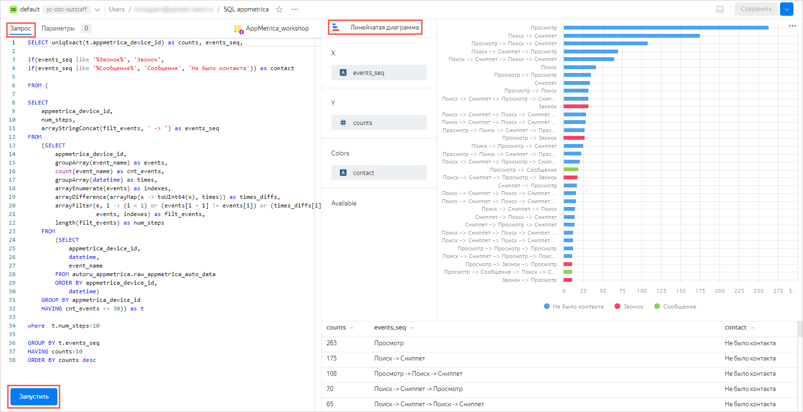

1. В правом верхнем углу нажмите **Сохранить**, введите название чарта `Цепочки событий`.
1. Добавьте QL-чарт на дашборд.

    1. В меню слева нажмите **Дашборды**.
    1. В списке выберите дашборд **auto.ru app**.
    1. Справа вверху нажмите **Редактировать**.
    1. Нажмите **Добавить** → **Чарт**.
    1. В списке **Чарт** выберите **Цепочки событий** и нажмите **Добавить**.
    1. Настройте внешний вид дашборда и нажмите **Сохранить**.

      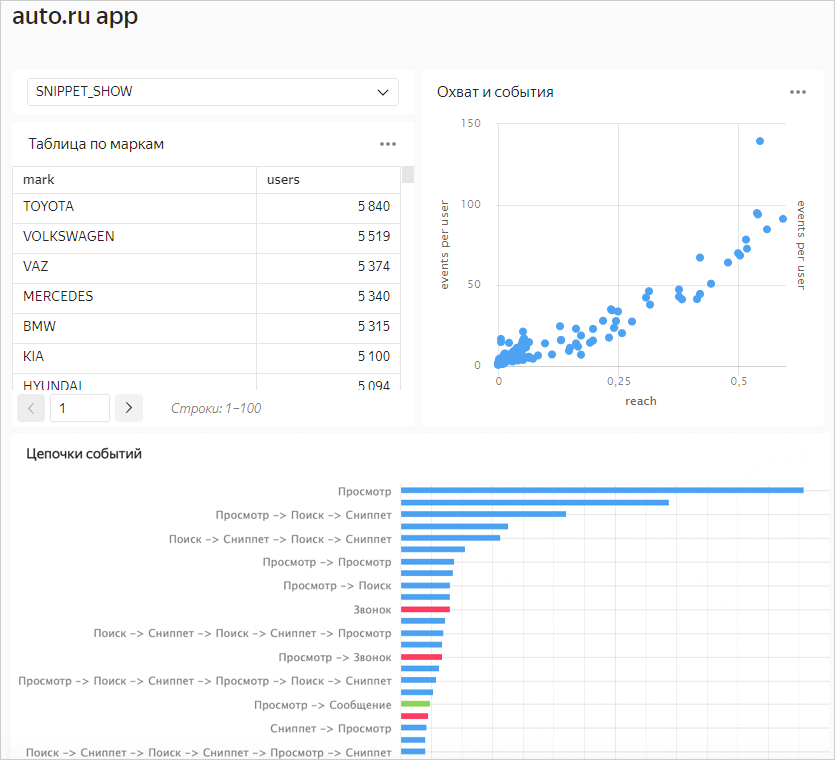

### 6.2. Создайте диаграмму Sankey в {{ ml-platform-short-name }} {#creating-sankey-chart}

1. Перейдите в [консоль управления]({{ link-console-main }}).
1. Выберите в списке слева **{{ ml-platform-name }}**.
1. Откройте папку **yandex_appmetrika_cloud_case** → ноутбук **Case_2.ipynb**.
1. Выполните все шаги (ячейки с кодом) в ноутбуке **Case_2.ipynb**.
1. Вы получите интерактивную диаграмму Sankey, которая показывает сценарии поведения пользователей. Вы можете двигать блоки диаграммы и сохранить результат в виде изображения.

   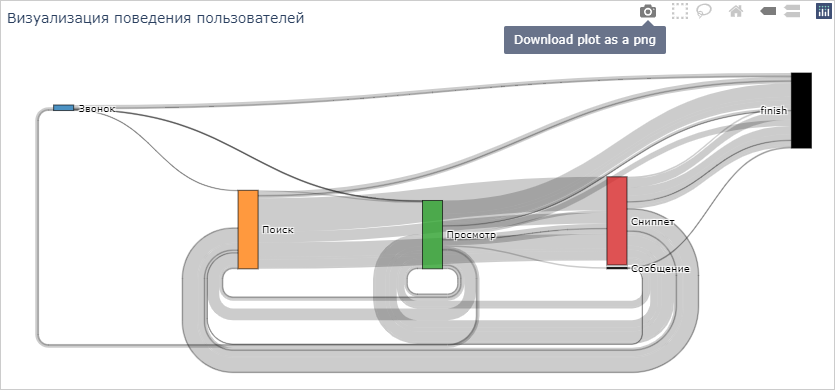
