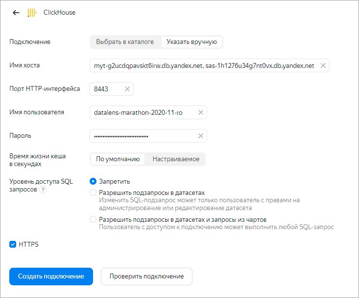
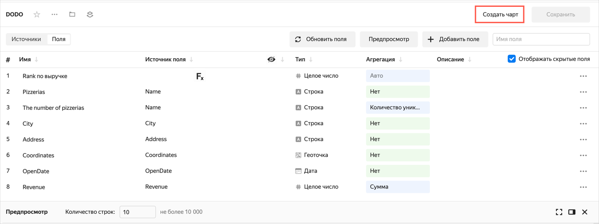
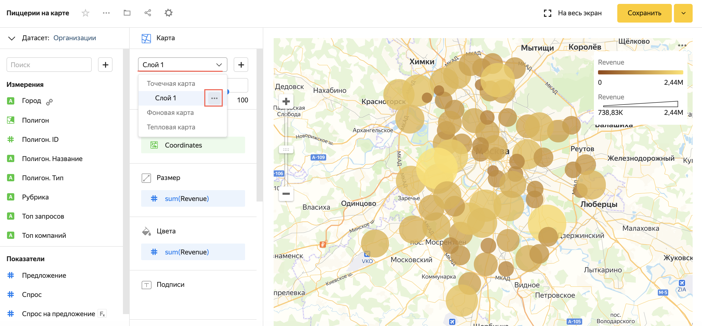
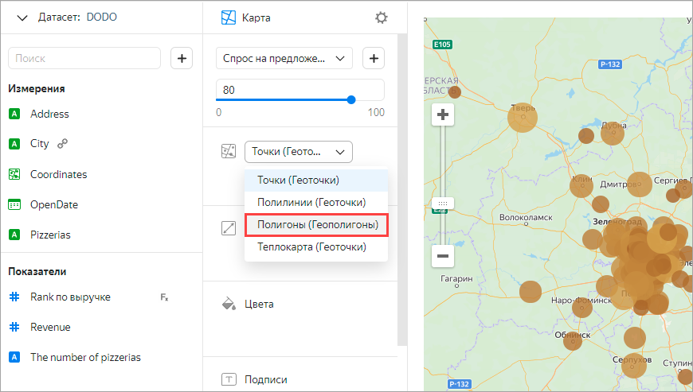
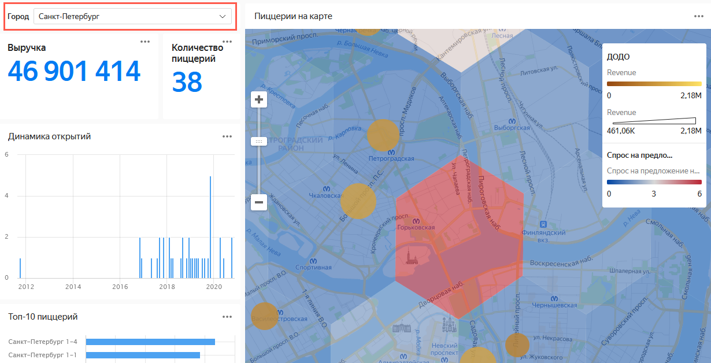

# Анализ продаж и локаций пиццерий на данных из БД Clickhouse и Marketplace

В качестве источника будут использованы подключение базы данных ClickHouse и продукт **Организации: спрос и предложение** из Marketplace.

В этом сценарии вы подготовите дашборд по выбору помещений для открытия новых пиццерий Додо. 

С помощью {{ datalens-short-name }} вы проанализируете локации на основе реальных данных:
- Выручка по текущим пиццериям Додо.
- Поисковые запросы к пиццериям по локациям (данные Яндекса).
- Численность всех пиццерий по локациям (данные Яндекса).

Сценарий также доступен в [записи](https://www.youtube.com/watch?v=cw6PotbQYng) на YouTube-канале {{ yandex-cloud }}.

Для визуализации и исследования данных [подготовьте облако к работе](#before-you-begin), затем выполните следующие шаги:

1. [Импортируйте геослои из Marketplace](#step1).
1. [Создайте подключение](#step2).
1. [Настройте поля датасета](#step3).
1. [Создайте чарт — столбчатая диаграмма](#step4).
1. [Создайте чарт — линейчатая диаграмма](#step5).
1. [Создайте чарт — индикатор](#step6).
1. [Создайте чарт — карта](#step7).
1. [Создайте дашборд](#step8).
1. [Добавьте геослои на дашборд](#step9).

## Подготовьте облако к работе {#before-you-begin}



## Шаг 1. Импортируйте геослои из Marketplace {#step1}

1. Перейдите в [Marketplace]({{ link-datalens-main }}/marketplace) {{ datalens-short-name }}.
1. Выберите категорию **Геослои**, затем товар **Организации: спрос и предложение**.
1. Нажмите **Развернуть** в открывшейся карточке товара. 
1. Сохраните покупку в папке **Purchases**.
1. Нажмите кнопку **Открыть**. 
1. В открывшемся окне будет представлен набор объектов {{ datalens-short-name }}: [подключение](../datalens/concepts/connection.md), [датасет](../datalens/concepts/dataset/index.md), [чарт](../datalens/concepts/chart/index.md) и [дашборд](../datalens/concepts/dashboard.md). Нажмите желтую иконку дашборда в конце списка.
   
   

1. Изучите дашборд и его описание в нижней части экрана:
    * Спрос — число поисковых запросов пользователей геосервисов Яндекса к выбранной категории организаций или услуг. Категория (рубрика) определяется из запроса. Учитываются локальные запросы с мобильных устройств с радиусом поиска менее 3 км.
    * Предложение — число существующих организаций выбранной категории. Используются данные организаций из [Яндекс Справочника](https://business.yandex.ru/sprav/).

1. Выберите рубрику **Пиццерия** и ознакомьтесь на карте с показателями **Спрос**, **Предложение** и **Спрос на предложение на город**.

   

## Шаг 2. Создайте подключение {#step2}

1. Перейдите в [{{ datalens-short-name }}]({{ link-datalens-main }}).
1. Нажмите кнопку **Создать подключение**.
1. Выберите подключение **ClickHouse**.
    1. В открывшемся окне укажите параметры подключения:
       * Название подключения — `DODO Con`.
       * Подключение — тип **Указать вручную**.
       * Имя хоста —  `myt-g2ucdqpavskt6irw.{{ dns-zone }}, sas-1h1276u34g7nt0vx.{{ dns-zone }}` (указать через запятую).
       * Порт HTTP-интерфейса — `8443` (по умолчанию).
       * Имя пользователя — `datalens-marathon-2020-11-ro`.
       * Пароль — `/4b+xBF6aSCgN9wKTevYGuDjxC9IO4Fa`.
    1. Проверьте подключение и нажмите кнопку **Создать**.

    

Дождитесь сохранения подключения.

## Шаг 3. Настройте поля датасета {#step3}

1. В открывшемся окне нажмите кнопку **Создать датасет**.  
1. В созданном датасете перенесите таблицу на рабочую область.
    
   
   
1. Откройте вкладку **Поля**.
    1. Переименуйте поле **Name** в **Pizzerias** в столбце **Имя**.
    1. Для поля **Coordinates** выберите тип `геоточка`.
    1. Для поля **Revenue** выберите в столбце **Агрегация** тип агрегации **Сумма**.
    1. Продублируйте поле **Pizzerias**. Нажмите кнопку  и выберите вариант **Продублировать**.
      
         
    
    1. Переименуйте созданное поле **Pizzerias**→**The number of pizzerias**.
    1. Для поля **The number of pizzerias** выберите в столбце **Агрегация** тип агрегации **Количество уникальных**.
    1. Нажмите кнопку **Добавить поле**.
      
         

    1. Создайте расчетное поле с рангом по выручке:
        * Формула — `RANK([Выручка])`.
        * Название поля — Rank по выручке.
        
       Это поле будет использоваться при построении чартов для фильтрации ТОП-N.
        
    1. Нажмите кнопку **Создать**.
    
         
        
В открывшемся окне укажите название датасета **DODO** и нажмите **Создать**.

## Шаг 4. Создайте чарт — столбчатая диаграмма {#step4}

1. Нажмите кнопку **Создать чарт** на рабочей панели датасета **DODO**.

           
 
1. В открывшемся окне выберите измерение **OpenDate** в секции **X** и показатель **The number of pizzerias** в секции **Y**.
    
     
                             
   График покажет статистику — сколько открылось новых пиццерий по дням.
1. Настройте группировку **Даты открытия** по месяцам.
   1. Нажмите кнопку календаря в поле **OpenDate**.
      1. Выберите **Округление** → **Месяц** из списка **Группировка**.
      1. Нажмите **Применить**.
      
    
      
1. Нажмите кнопку **Сохранить** в правом верхнем углу. Назовите чарт **Динамика открытий** и нажмите **Сохранить**.

## Шаг 5. Создайте чарт — линейчатая диаграмма {#step5}

1. Выберите другой тип чарта — **Линейчатая диаграмма**.
   
      

1. Добавьте измерение **Pizzerias** в секцию **Y**. Удалите из секции **Y** измерение **OpenDate**.
1. Добавьте показатель **Revenue** в секцию **X**. Удалите из секции **X** показатель **The number of pizzerias**.
1. Добавьте показатель **Revenue** в секцию **Сортировка**. 
    
    
    
1. Добавьте показатель **Rank по выручке** в секцию **Фильтры**:
   1. Выберите **Меньше или равно** из списка **Операция**.
   1. Укажите число **10** в поле **Значение**.
   1. Нажмите кнопку **Применить фильтр**.     
1. На графике отобразится рейтинг **Топ-10 пиццерий по России**.
1. В правом верхнем углу нажмите значок  → **Сохранить как**. Назовите чарт **Топ-10 пиццерий** и нажмите **Сохранить**.

     

## Шаг 6. Создайте чарт — индикатор {#step6}

1. Выберите тип чарта **Индикатор**.

     
           
1. Удалите показатель **RANK по выручке** из поля **Фильтры**.
1. Добавьте показатель **Revenue** в секцию **Показатель**. 

        

1. В правом верхнем углу нажмите значок  → **Сохранить как**. Назовите чарт **Выручка** и нажмите **Сохранить**.
1. Удалите показатель **sum(Revenue)** из секции **Показатель**. 
1. Добавьте показатель **The number of pizzerias** в секцию **Показатель**.

        
 
1. В правом верхнем углу нажмите значок   → **Сохранить как**. Назовите чарт **Количество пиццерий** и нажмите **Сохранить**.
 
## Шаг 7. Создайте чарт — карта {#step7}

1. Выберите тип чарта **Карта**.

         
    
1. Добавьте измерение **Coordinates** в секцию **Геоточки**.
1. Добавьте показатель **Revenue** в секцию **Размер** и **Цвета**.

      

1. Добавьте в секцию **Тултипы**:
    * Pizzerias;
    * Address;
    * OpenDate;
    * Revenue.
1. Перейдите к настройкам секции **Цвета**.
    
     
    
    1. Выберите тип градиента **Двухцветный** и цвет **Желтый (оттенки)**. 
    1. Нажмите кнопку **Применить**.  
1. Сохраните чарт с названием **Пиццерии на карте**.

    

## Шаг 8. Создайте дашборд {#step8}

1. Перейдите в [{{ datalens-short-name }}]({{ link-datalens-main }}).
1. Нажмите кнопку **Создать Дашборд**.
1. Назовите дашборд **DODO Dashboard** и нажмите кнопку **Создать**.
1. В открывшемся окне в правом верхнем углу нажмите кнопку **Добавить** и выберите **Чарт**.
1. Выберите чарт с названием **Количество пиццерий**.
1. Нажмите кнопку **Добавить**.

    
    
1. Повторите шаги 4-6 для остальных чартов.
1. Для чартов-индикаторов (**Количество пиццерий** и **Выручка**) уберите отображение названия. Для этого отключите опцию **Показывать** в окне **Настройка таба**.

    

1. Чтобы чарты не формировались в одну колонку, перетащите каждый чарт в любую свободную область на дашборде.
1. В верхнем правом углу нажмите **Добавить** → **Селектор**.
    1. В открывшемся окне выберите датасет **DODO**.
    1. В настройках селектора:
       1. Активируйте опцию **Показывать** для отображения названия.
       1. Выберите поле **City**.
       1. Нажмите кнопку **Добавить**.
       
     
       
1. Перенесите селектор наверх, при необходимости скорректируйте размеры чартов.
1. Нажмите **Сохранить**.
1. Выберите в селекторе город Москва. Если при изменении города в фильтре фокус карты остался на прежней локации, обновите страницу веб-браузера. {{ datalens-name }} фиксирует масштаб и местоположение карты, если вы изменяли их в рамках текущей сессии.

     

## Шаг 9. Добавьте геослои на дашборд {#step9}

1. Убедитесь, что на дашборде в фильтре города у вас выбрана только Москва.
1. Нажмите кнопку меню в правом верхнем углу карты. 
1. Выберите **Редактировать**.

    
  
1. Нажмите на название датасета **DODO** и выберите **Добавить датасет**.
1. В списке выпадающий список с **Личной папкой** и выберите **Датасеты**.
1. Выберите **Организации** (датасет, импортированный из Marketplace на [шаге 1](#step-1)).
    
    
    
1. После выбора датасета появится окно настройки связей. По умолчанию связь устанавливается по полям с одинаковыми названиями. 
    
   1. Нажмите кнопку **Добавить связь**. 
   1. Установите связь между полями датасетов **City** (DODO) и **Город** (Организации) и нажмите **Сохранить**.
  
      

1. Закройте окно **Связи**, нажав кнопку **Сохранить**.     
1. В секции слой переименуйте **Слой 1**. 
   1. Для этого нажмите на слой и выберите . 
   
   
   
   1. В открывшемся окне **Настройки слоя** укажите название **ДОДО** и нажмите кнопку **Применить**.
1. Нажмите кнопку , чтобы добавить еще один слой. Переименуйте его в **Спрос на предложение**.
1. Измените тип геослоя **Геоточки** на **Геополигоны**.
 
   
    
1. Убедитесь, что текущий датасет – **Организации**, а не **DODO**. Если текущий датасет **DODO**, то нажмите в левом верхнем углу на название датасета и выберите **Организации**. 
    
    

1. Добавьте **Полигон** в секцию **Геополигоны**.
1. Добавьте измерение **Полигон.Тип** в секцию **Общие фильтры** и укажите значение **hash7**. Нажмите кнопку **Применить фильтр**.
1. Добавьте измерение **Рубрика** в секцию **Фильтры слоя** и выберите значение **Пиццерия**. Нажмите кнопку **Применить фильтр**.
1. Добавьте показатель **Спрос на предложение на город** в секцию **Цвета**.
1. В настройках цвета выберите трехцветный градиент **Синий-Серый-Красный** и нажмите **Применить**.
    
    

1. Измените уровень прозрачности до 60.
   1. Добавьте в секцию **Тултипы**:
        * Спрос;
        * Предложение;
        * Спрос на предложение на город;
        * Топ запросов;
        * Топ компаний.
1. Нажмите **Сохранить** в верхнем правом углу.
 
   
       
1. Вернитесь наш дашборд (должен быть открыт на предыдущей вкладке браузера) и обновите страницу браузера.
1. Выберите в секторе Санкт-Петербург. После этого дашборд, включая карту и внешний геослой, будет отфильтрован полностью по этому селектору.

    
    
Если при изменении города в фильтре фокус карты остался на прежней локации, обновите страницу веб-браузера. {{ datalens-name }} фиксирует масштаб и местоположение карты, если вы изменяли их в рамках текущей сессии.

## Дополнительно {#additional}

В качестве идей для дальнейшей самостоятельной работы предлагаем:
1.	Добавить геослой с организациями категории **Где поесть**  (в целом рестораны и фастфуд, не только пиццерии).
1.	Добавить из Marketplace продукт [Аудитория: интересы и соцдем]({{ link-datalens-main }}/marketplace/f2eemc2dui59rn72h0ck), чтобы аналогично отобразить на карте данные по аудитории города.
1.	На примере Воронежа можно изучить бесплатные [геослои от компании Геоинтеллект]({{ link-datalens-main }}/marketplace/f2eu3edujf1jdmaihu7u). Демонабор содержит посчитанные индексы бизнес-потенциала локации для фастфуда.

  
   

       

  

   

 

