# Создание чартов в Editor {{ datalens-full-name }}


[Editor](../../datalens/charts/editor/index.md) — редактор для создания визуализации данных и селекторов с помощью кода на JavaScript. Editor позволяет загружать данные из одного или нескольких источников, управлять параметрами чартов и настраивать визуализации. В качестве источников данных вы можете использовать датасеты и подключения.

С помощью редактора можно создать отдельные объекты {{ datalens-short-name }}:

* Чарты Editor более гибки, чем Wizard, так как позволяют подключаться к нескольким источникам данных и отрисовывать любую требуемую визуализацию через HTML и SVG.
* Селекторы Editor позволят вам реализовать кодозависимые поля выбора с уникальной логикой.

Вы научитесь создавать чарты в Editor:

* создадите чарт в Editor, используя подключение и датасет;
* разместите чарт и селекторы на дашборде;
* получите и обработаете параметры с дашборда в Editor.

В качестве источника данных будет использовано прямое подключение к демонстрационной базе данных {{ CH }} с информацией о продажах товаров в сети московских магазинов.





Для визуализации и исследования данных [подготовьте {{ datalens-short-name }} к работе](#before-you-begin), затем выполните следующие шаги:


1. [Создайте воркбук](#create-workbook).
1. [Создайте подключение](#create-connection).
1. [Создайте датасет](#create-dataset).
1. [Создайте простой чарт в Editor](#create-chart).
1. [Создайте дашборд и разместите на нем чарт](#create-dashboard).
1. [Получите значения фильтров и параметров с дашборда](#get-filter-parameters-values).
1. [Создайте чарт с обработкой фильтров и параметров с дашборда](#processing-filter-parameters-values).
1. [Добавьте интерактивные элементы в чарт](#interactive-elements).


## Перед началом работы {#before-you-begin}



## Создайте воркбук {#create-workbook}

1. Перейдите на [главную страницу]({{ link-datalens-main }}) {{ datalens-short-name }}.
1. На панели слева выберите  **Коллекции и воркбуки**.
1. В правом верхнем углу нажмите **Создать** → **Создать воркбук**.
1. Введите название [воркбука](../../datalens/workbooks-collections/index.md) — `Чарты в Editor`.
1. Нажмите кнопку **Создать**.


## Создайте подключение {#create-connection}



## Создайте датасет {#create-dataset}

Создайте [датасет](../../datalens/dataset/index.md) на базе подключения `Sample ClickHouse`:

1. На странице подключения в правом верхнем углу нажмите кнопку **Создать датасет**.
1. Перенесите на рабочую область таблицу `MS_SalesFacts`.

   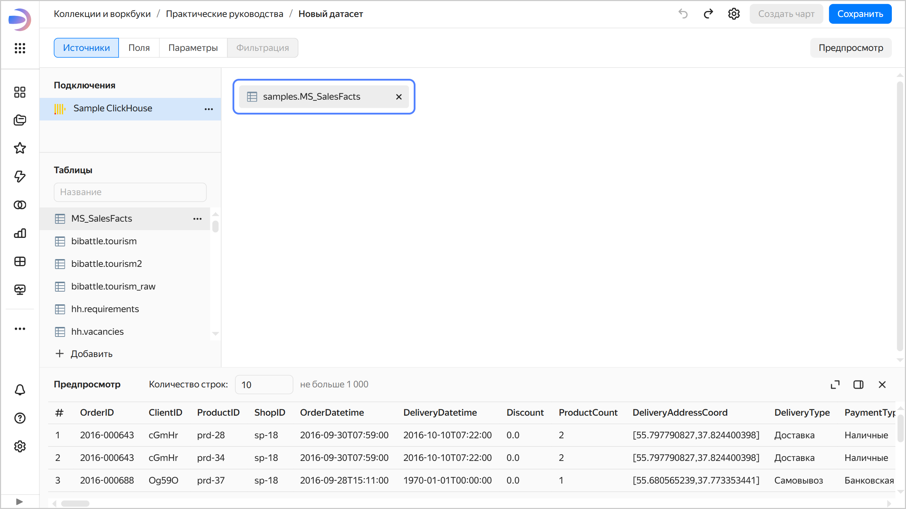

1. Перенесите на рабочую область таблицу `MS_Products`. Таблицы автоматически свяжутся.

   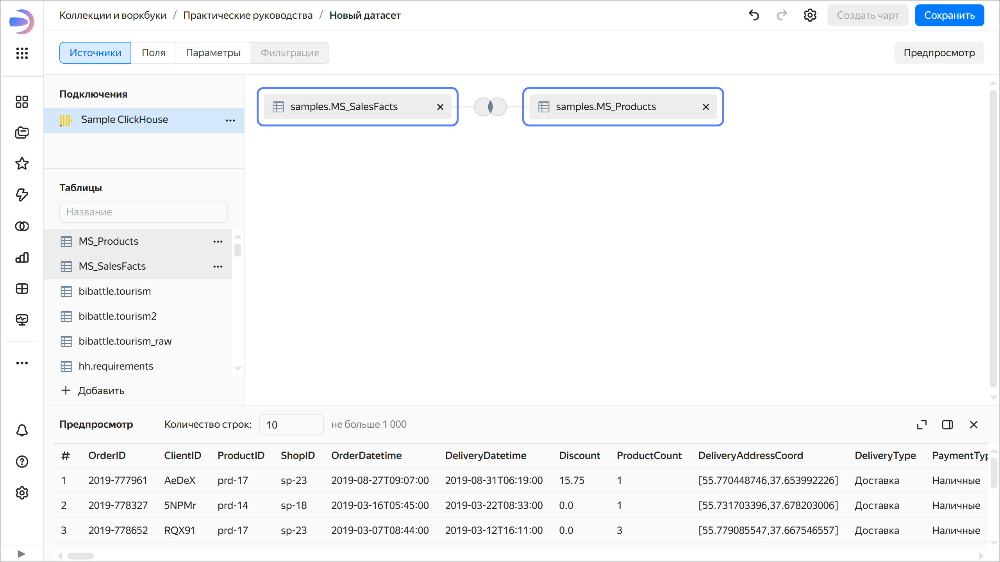

1. Перейдите на вкладку **Поля**.
1. Удалите дубликат поля `ProductID (1)`, получившийся в результате соединения таблиц. Для этого в правой части строки с полем нажмите  → **Удалить**.
1. Создайте поле с датой заказа `OrderDate`:

   1. Продублируйте поле `OrderDatetime` — в правой части строки с полем нажмите  → **Дублировать**.
   1. Переименуйте дубликат поля `OrderDatetime (1)` в `OrderDate` — нажмите на имя поля, удалите текущее имя и введите новое.
   1. В столбце **Тип** измените тип данных с **Дата и время** на **Дата**.

   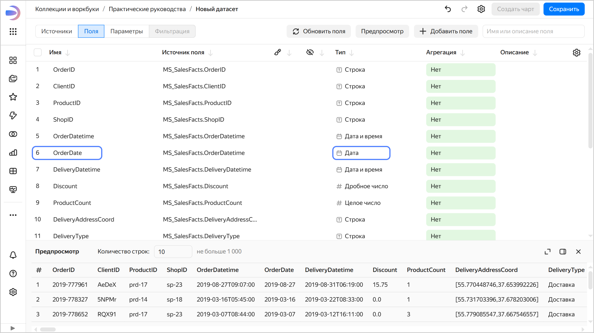

1. Создайте показатель с суммой заказа: в столбце **Агрегация** для поля `Sales` выберите **Сумма**. Поле с агрегацией поменяет цвет на синий: оно стало показателем.

   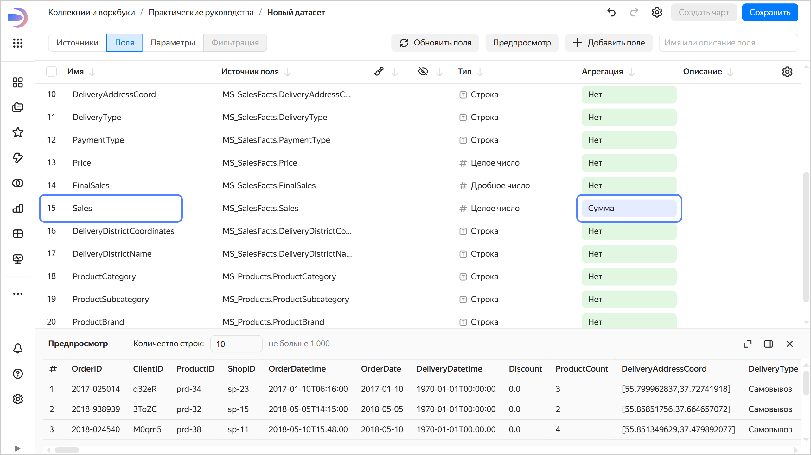

1. Создайте показатель с количеством заказов:

   1. Продублируйте поле `OrderID`.
   1. Переименуйте дубликат поля `OrderID (1)` в `OrderCount`.
   1. Измените тип агрегации на **Количество уникальных**.

1. Сохраните датасет:

   1. В правом верхнем углу нажмите кнопку **Сохранить**.
   1. Введите название датасета — `Sales dataset` и нажмите кнопку **Создать**.

1. Скопируйте идентификатор датасета: вверху нажмите  → **Копировать ID**. Идентификатор будет скопирован в буфер обмена.

## Создайте простой чарт в Editor {#create-chart}


1. На панели слева выберите  **Коллекции и воркбуки** и перейдите в воркбук `Чарты в Editor`.
1. В правом верхнем углу нажмите **Создать** →  **Чарт в Editor**.


1. В блоке **Чарты** выберите тип визуализации **Таблица**.
1. Свяжите чарт с датасетом: для этого перейдите на вкладку **Meta** и добавьте ID, скопированный из датасета `Sales dataset`, в `links`:

   ```javascript
   {
       "links": {
           "salesDataset": "<id_датасета>"
   	   }
   }
   ```

   Где:

   * `<id_датасета>` — идентификатор датасета, скопированный после создания датасета;
   * `salesDataset` — произвольное имя-алиас, которое вы присваиваете датасету. По алиасу вы запрашиваете данные для чарта.

1. На вкладке **Params** задайте параметры, которые используются в чарте:

   ```javascript
   {
       module.exports = {
           metrics_list: ['Sales', 'OrderCount'],
           date_interval: ['__interval_2019-05-25T00:00:00.000Z_2019-06-15T00:00:00.000'],
           date_dimension: ['OrderDate'],
           limit: ['5']
   	   }
   }
   ```

   Где:

   * `metrics_list` — список показателей датасета для отображения в чарте;
   * `date_interval` — интервал дат для фильтрации данных;
   * `date_dimension` — поле датасета с типом `Дата` для фильтрации данных;
   * `limit` — лимит запрашиваемых строк.

1. Чтобы получить данные из источника, на вкладке **Source** введите код:
   
   
   
   * В данном примере используется служебный модуль `const {buildSource} = require('libs/dataset/v2');` для более удобной работы с датасетами.
   * Чтобы вывести данные в консоль в виде JSON-объектов для отладки, используйте метод `console.log(<имя_переменной>)`.

   

   ```javascript
   const {buildSource} = require('libs/dataset/v2');

   const params = Editor.getParams();
   const date_interval = params.date_interval[0];
   const limit = parseInt(params.limit[0]);
   const metrics_list = params.metrics_list;
   // Можно вывести данные в консоль в виде объектов json
   //console.log(params)

   // создаем пустой массив для заполнения условий
   let where = [];
   // колонки для выбора
   let cols = [];
   // параметры в датасет
   let filled_params = []


   // Базовое заполнение фильтра по дате как есть
   // поле для фильтрации
   const date_dim = params.date_dimension[0];
   // парсим даты из интервала
   const {from:from_date,to:to_date} = Editor.resolveInterval(date_interval);
   // собираем объект для фильтра
   const dateFilter = {column: date_dim,
                           operation: 'BETWEEN',
                     values: [from_date, to_date]}
   // добавляем в массив where
   where.push(dateFilter)

   // добавляем колонку ProductCategory
   cols.push('ProductCategory');
   // добавляем колонку ProductSubcategory
   cols.push('ProductSubcategory');

   // добавляем колонки для выбора метрик
   cols.push(...metrics_list);

   module.exports = {
         salesSourceData: buildSource({
               id: Editor.getId('salesDataset'),
               columns: cols,
               where: where,
               parameters:filled_params,
               limit:limit,
               order_by:[{'direction':'DESC','column':metrics_list[0]}]
         })
      }
   ```

   Где:

   * `params` — объект, в который передаются параметры с помощью метода [Editor.getParams()](../../datalens/charts/editor/methods.md#get-params).
   * `date_interval` — интервал дат, получаемый из объекта `params`.
   * `limit` — лимит строк, получаемый из объекта `params`.
   * `metrics_list` — массив полей, получаемый из объекта `params`.
   * `date_dim` — название поля, по которому будут фильтроваться данные, полученное из объекта `params`.
   * `from_date` и `to_date` — даты начала и окончания периода, получаемые из `date_interval` с помощью метода [Editor.resolveInterval(arg)](../../datalens/charts/editor/methods.md#resolve-interval).
   * `dateFilter` — JSON-объект для фильтрации данных по дате:
     
     ```javascript
     {
         column: date_dim,
         operation: 'BETWEEN',
         values: [from_date, to_date],
     }
     ```

     Где:
     
     * `column` — поле, по которому выполняется фильтрация;
     * `operation` — операция фильтрации;
     * `values` — значения фильтра.

   * `where` — массив условий, заполняемый с помощью метода `where.push(<условия_отбора>)`.
   * `cols` — массив столбцов для отбора, заполняемый с помощью метода `cols.push("<название_колонки>")` или `cols.push(...<массив_названий_колонок>)`.
   * `filled_params` — массив параметров, передаваемых в датасет.

   В `module.exports` — загружаются данные из датасета с помощью служебного модуля `buildSource`:
     
   * `id` — идентификатор датасета, который можно получить с помощью метода `Editor.getId.('алиас_датасета_с_вкладки_meta')`.
   * `columns` — список столбцов датасета для отбора.
   * `where` — условия отбора данных.
   * `parameters` — параметры, передаваемые в датасет.
   * `limit` — лимит строк для отбора.
   * `order_by` — сортировка данных в виде массива: `[{"direction": "<порядок_сортировки>","column": "<название_колонки>"}]`.

1. Настройте отображение данных на вкладке **Config**:

   ```javascript
   module.exports = {
      title: {
         text: 'Таблица с выбором метрик',
         style: {
               'text-align': 'center',
               'font-size': '16px',
               'font-style': 'italic',
               'color': 'var(--g-color-text-hint)',
               'margin-bottom': '16px',
         }
      },
      size: 'l',
   };
   ```

   Где все поля являются необязательными:

   * `title` — объект вида:

     ```json
     {
         text: "<string>",
         style: <object>,
             // CSS-стили заголовка
             style: {
                 'text-align': 'center',
                 'font-size': '20px'
             }
     ```
  
     Где:

     * `text` — заголовок таблицы.
     * `style` — описание CSS-стилей для заголовка таблицы. Тип значения — объект из CSS-свойств.
   
   * `size` — размер таблицы (включает в себя размер шрифта, межстрочный интервал и отступы внутри ячеек). Тип значения — строка из возможных значений: `l`, `m`, `s`.

1. На вкладке **Prepare** сформируйте таблицу:

   ```javascript
   // Импорт необходимых библиотек и получение параметров
   const Dataset = require('libs/dataset/v2'); // Библиотека для обработки данных
   const params = Editor.getParams(); // Получение параметров из редактора

   const loadedData = Editor.getLoadedData(); // Получаем загруженные данные
   const preparedData = Dataset.processData(loadedData, 'salesSourceData', Editor); // Обрабатываем данные
   // Можно вывести данные в консоль в виде объектов json
   //console.log(preparedData)

   // Получаем параметры для сводной таблицы
   const metrics_list = params.metrics_list; // Список метрик
   // Измерения для строк (до 4 измерений, пустые отфильтрованы)
   const dimensions = Object.keys(preparedData[0]).filter(key => !metrics_list.includes(key));

   // Формируем заголовки
   const head = [
      // Сначала добавляем измерения
      ...dimensions.map(dim => ({
         id: dim,
         name: dim,
         type: 'text'
      })),
      // Затем метрики с индикаторами
      ...metrics_list.map(metric => ({
         id: metric,
         name: metric,

      }))
   ];

   // Формируем строки
   const rows = preparedData.map(row => ({
      cells: [
         // Ячейки для измерений
         ...dimensions.map(dim => ({
               value: row[dim],
         })),
         // Ячейки для метрик с индикаторами
         ...metrics_list.map(metric => ({
               value: row[metric]
         }))
      ]
   }));

   module.exports = {head, rows};
   ```

1. Вверху чарта нажмите **Выполнить**. В области предпросмотра отобразится таблица с данными из датасета.

   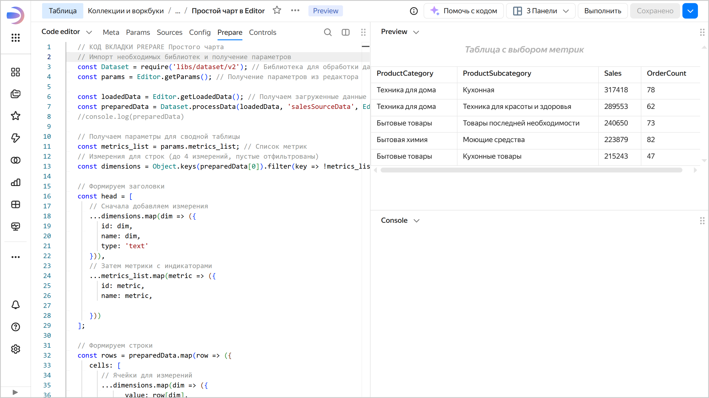

1. Сохраните чарт:

   1. В правом верхнем углу нажмите кнопку **Сохранить**.
   1. Введите название чарта `Простой чарт в Editor` и нажмите кнопку **Сохранить**.

## Получите значения фильтров и параметров с дашборда {#get-filter-parameters-values}

Разместите чарт и селекторы на дашборде, чтобы продемонстрировать, как параметры передаются в Editor.

### Создайте дашборд и разместите на нем чарт {#create-dashboard}

Создайте [дашборд](../../datalens/concepts/dashboard.md) и добавьте на него чарт:

1. На панели слева выберите  **Коллекции и воркбуки** и перейдите в воркбук `Чарты в Editor`.
1. В правом верхнем углу нажмите **Создать** →  **Дашборд**.
1. На панели в нижней части страницы зажмите  **Чарт** и перетащите его в нужную область.
1. В открывшемся окне нажмите кнопку **Выбрать**.
1. Выберите чарт `Простой чарт в Editor`.
1. Нажмите кнопку **Добавить**.

### Добавьте селекторы на дашборд {#add-selectors-on-dashboard}

1. Добавьте селектор для выбора периода. Для этого на панели в нижней части страницы зажмите  **Селектор** и перетащите его в нужную область. Задайте настройки селектора:

   1. Источник — выберите `Ручной ввод`.
   1. В **Имя поля или параметра** введите `date_interval`.
   1. Выберите тип селектора `Календарь`.
   1. Включите опцию **Диапазон**.
   1. В **Значение по умолчанию** задайте диапазон `15.05.2019 - 10.06.2019`.
   1. Включите опцию **Обязательное поле**.
   1. В поле **Заголовок** введите `Выберите период`.
   1. Нажмите кнопку **Сохранить**.

1. Добавьте селектор для выбора метрик:

   1. Источник — выберите `Ручной ввод`.
   1. В **Имя поля или параметра** введите `metrics_list`.
   1. Выберите тип селектора `Список`.
   1. Включите опцию **Множественный выбор**.
   1. Возможные значения — добавьте `Sales` и `OrderCount`.
   1. Значение по умолчанию — выберите `Sales`.
   1. Включите опцию **Обязательное поле**.
   1. В поле **Заголовок** введите `Выберите метрики`.
   1. Нажмите кнопку **Сохранить**.

1. Добавьте селектор для задания количества выводимых строк:

   1. Источник — выберите `Ручной ввод`.
   1. В **Имя поля или параметра** введите `limit`.
   1. Выберите тип селектора `Поле ввода`.
   1. Значение по умолчанию — `5`.
   1. В поле **Заголовок** введите `Количество строк`.
   1. Нажмите кнопку **Сохранить**.

1. Сохраните дашборд:

   1. В правом верхнем углу дашборда нажмите кнопку **Сохранить**.
   1. Введите название дашборда `Примеры чартов в Editor` и нажмите кнопку **Создать**.

### Получите значения фильтров и параметров {#get-filter-parameters}

1. Задайте значения селекторов:

   * В селекторе с выбором категории товара выберите `Sales` и `OrderCount`.
   * В селекторе с выбором периода выберите диапазон, например, `10.05.2019 - 10.07.2019`.
   * В селектор с количеством строк введите `3`.

   Данные отфильтруются соответственно.

   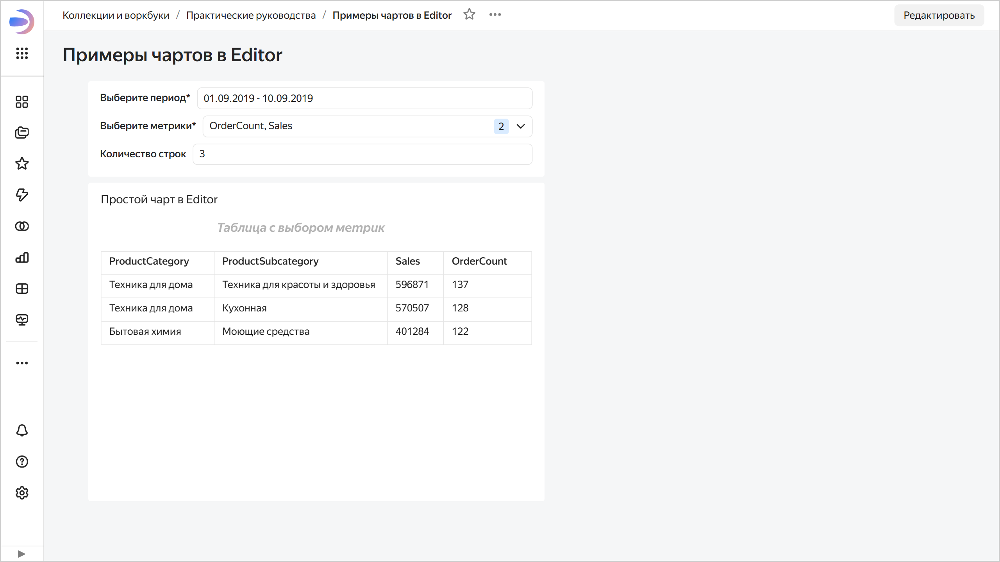

1. Откройте чарт `Простой чарт в Editor` на редактирование — наведите курсор на чарт и в правом верхнем углу нажмите  →  **Редактировать**.

   Вверху отображаются параметры и их значения с дашборда.

   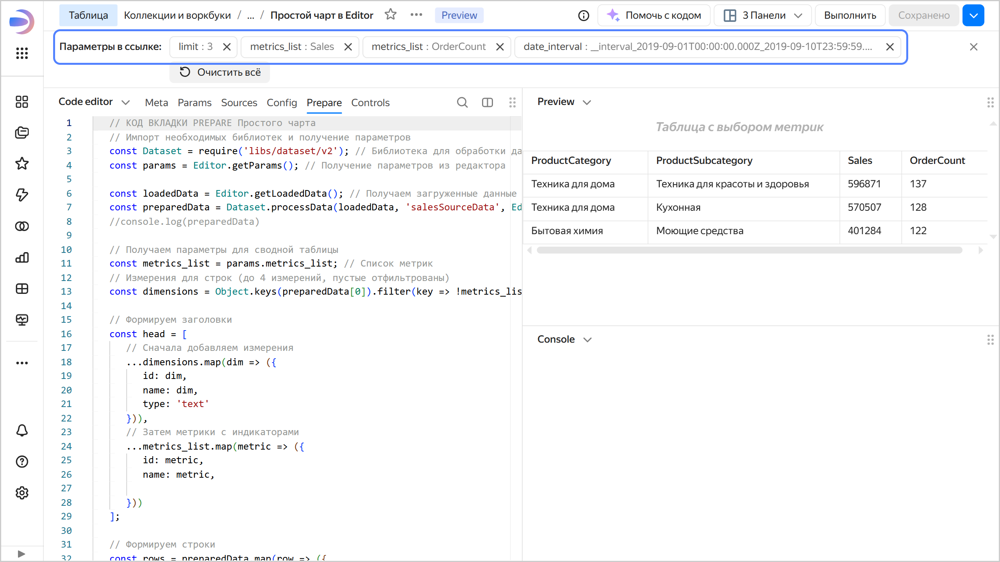

## Создайте чарт с обработкой фильтров и параметров с дашборда {#processing-filter-parameters-values}

Создайте чарт в Editor с более гибкой обработкой фильтров и параметров с дашборда и разместите его на дашборде.

### Создайте чарт в Editor {#chart-editor-create}


1. На панели слева выберите  **Коллекции и воркбуки** и перейдите в воркбук `Чарты в Editor`.
1. В правом верхнем углу нажмите **Создать** →  **Чарт в Editor**.


1. В блоке **Чарты** выберите тип визуализации **Таблица**.
1. Свяжите чарт с датасетом: для этого перейдите на вкладку **Meta** и добавьте ID, скопированный из датасета `Sales dataset`, в `links`.

   

   ```javascript
   {
       "links": {
           "salesDataset": "<id_датасета>"
   	   }
   }
   ```

   Где:

   * `<id_датасета>` — идентификатор датасета, скопированный после создания датасета;
   * `salesDataset` — произвольное имя-алиас, которое вы присваиваете датасету. По алиасу вы запрашиваете данные для чарта.

   

1. На вкладке **Params** задайте параметры, которые используются в чарте.

   

   ```javascript
   {
       module.exports = {
           metrics_list: ['Sales', 'OrderCount'],
           date_interval: ['__interval_2019-09-12T00:00:00.000Z_2019-09-18T00:00:00.000'],
           filter_date_dimension: ['OrderDate'],
           date_scale: ['week'],
           params_to_send: [],
           filter_fields_ids: ['<идентификатор_поля_датасета_1>|<идентификатор_поля_датасета_2>'],
           mass_filter_fields_ids: [],
           row_limit: ['5']
   	   }
   }
   ```

   Где:

   * `metrics_list` — список полей датасета для отображения в чарте;
   * `date_interval` — интервал дат для фильтрации данных;
   * `filter_date_dimension` — поле датасета с типом `Дата` для фильтрации данных;
   * `date_scale` — масштаб для дат;
   * `params_to_send` — список параметров с дашборда, которые будут переданы в датасет при запросе данных;
   * `filter_fields_ids` — идентификаторы полей датасета ^1^, которые будут участвовать в фильтрации данных, разделенных знаком `|`;
   * `mass_filter_fields_ids` — список идентификаторов полей датасета ^1^, разделенных знаком `|`, для которых задано множественное значение;
   * `row_limit` — лимит запрашиваемых строк.

   ^1^ Чтобы скопировать идентификатор поля, откройте датасет, перейдите на вкалдку **Поля** и в строке с нужным полем нажмите  → **Скопировать ID**. Идентификатор будет скопирован в буфер обмена.

   

1. На вкладке **Source** сформируйте запрос для получения данных с помощью модуля `buildSource`.

   1. В объект `params` получите значения параметров с помощью метода [Editor.getParams()](../../datalens/charts/editor/methods.md#get-params) и для удобства задайте отдельную переменную для каждого параметра.

      ```javascript
      const params = Editor.getParams();
      // для удобства все параметры переносим в переменные без парамс
      const date_interval = params.date_interval[0];
      const filter_date_dimension = params.filter_date_dimension[0];
      const date_scale = params.date_scale[0];
      const limit = parseInt(params.row_limit[0]);
      const metrics_list = params.metrics_list;
      const filter_fields = params.filter_fields_ids['0'].split('|');
      const params_to_send = params.params_to_send.length > 0? params.params_to_send['0'].split('|'):[];
      const filter_mass = params.mass_filter_fields_ids.length > 0? params.mass_filter_fields_ids['0'].split('|'):[];
      ```

      При этом:
      
      * Все параметры представлены в виде массивов.
      * В данном примере только параметр `metrics_list` задан списком значений. Он переносится в переменную без дополнительной обработки. Остальные параметры заданы единственным значением, поэтому берется только первый элемент массива.
      * Парсим `filter_fields_ids['0']` и `mass_filter_fields_ids['0']`, чтобы получить массив значений из строки с разделителем `|`.
      * Проверяем параметры `params_to_send` и `mass_filter_fields_ids` — если они пустые, не парсим значения, а сразу возвращаем пустые массивы. Можно добавить такую же проверку для параметра `filter_fields_ids`.      

      
      
      Вы можете организовать структуру и обработку параметров иначе.

      
      
   1. Заведите переменные для формирования запроса:

      ```javascript
      // массив для заполнения условий
      let where = [];
      // колонки для выбора
      let cols = [];
      // параметры в датасет
      let filled_params = []
      ```

   1. Обработайте фильтры и параметры с дашборда:

      * Фильтр по интервалу дат от селектора с ручным вводом обработайте отдельно с помощью функции `getDateFilters()` и добавьте его в массив `where`:

        ```javascript
        let q = getDateFilters(date_interval, filter_date_dimension, date_scale);
        where.push(q)
        ```

        Функцию `getDateFilters()` можно переиспользовать для обработки интервалов дат. Она возвращает объект фильтра вида:
        
        ```javascript
        {
            column: <колонка_для_фильтрации>,
            operation: 'BETWEEN',
            values: [<дата_начала_периода>, <дата_окончания_периода>]
        }
        ```
      
        

        ```javascript
        function getDateFilters(date_interval, date_dimension, scale_name) {
            let scale_dict = {'day':'D','week':'W','month':'M'};
            
            const {from:from_date,to:to_date} = Editor.resolveInterval(date_interval);
            let right_date = to_date;
            let left_date = from_date;
            //console.log(right_date,left_date);
            const dateTo = dateTimeParse(right_date).add(1,scale_name).startOf(scale_dict[scale_name]).add(-1,'day').format(FORMAT);
            const dateFrom = dateTimeParse(left_date).startOf(scale_dict[scale_name]).format(FORMAT);

            const dateFilter = {column: date_dim,
                                 operation: 'BETWEEN',
                                 values: [dateFrom, dateTo]}
            return dateFilter;
        }
        ```

        

      * Все параметры и фильтры приходят в чарт в виде параметров. Обработайте их в одном цикле.
      
        

        ```javascript
        for (const [key, value] of Object.entries(params)) {
            // добавляем все параметры из переданных и не пустых

            // если в спике параметров params_to_send, добавляем в массив filled_params
            if (params_to_send.includes(key)) {
               filled_params.push({id:key,value:value.toString()});
            };

            // если в спике фильтров filter_fields, обрабатываем и добавляем в массив where
            if (filter_fields.includes(key) && value != '') {
                     let val, suff;

               if (value[0] && value[0].substr(0, 2) === '__') {
                     const {operation:suffx, value:vala} = Editor.resolveOperation(value);
                     val = value.length == 1 ? vala:valArrayFromPrefix(value);
                     suff = suffx;            

               } else {
                     val = value;
                     suff = 'IN';
               }


               if  (Editor.resolveRelative(val) != null) {
                     val = Editor.resolveRelative(val);
                  }
               if  (Editor.resolveInterval(value) != null) {
                     val = [Editor.resolveInterval(value)['from'],Editor.resolveInterval(value)['to']];
                     suff = 'BETWEEN'
                  }

               if  (filter_mass.includes(key)) {
                     suff = 'IN';
                     val = value[0].split(' ');
               }
            
            where.push({type:'id', column: key, operation: suff, values: arrayChecker(val)})
         }
         
               if ((key.startsWith('dimension_') || key.startsWith('dim_col'))  && value[0] != '') {
                     cols.push(value[0]);
            }

        }
        ```

        

        При этом:

        * Параметр, указанный в списке `filter_fields` на вкладке `Params`, добавьте в массив `where`:
        
          ```javascript
          where.push({type:'id', column: key, operation: suff, values: arrayChecker(val)})
          ```

          Где:

          * `type: 'id'` — поле определяется по идентификатору;
          * `column` — поле датасета для выбора данных;
          * `operation` — операция сравнения;
          * `values` — массив значений;
          * `arrayChecker(val)` — вспомогательная функция, возвращающая массив значений для переданного как массива, так и отдельного значения.

          Перед добавлением обработайте значение параметра:

          * Значения, начинающиеся на `__` парсятся с помощью метода [Editor.resolveOperation(args)](../../datalens/charts/editor/methods.md#resolve-oper) для составления выражения. Если значений несколько, они добавляются в виде массива:

            ```javascript
            if (value[0] && value[0].substr(0, 2) === '__') {
                  const {operation:suffx, value:vala} = Editor.resolveOperation(value);
                  val = value.length == 1 ? vala:valArrayFromPrefix(value);
                  suff = suffx;

            }
            ```

          * Остальные значения (не начинающиеся на `__`) добавляются с условием `IN`:

            ```javascript
            else {
                  val = value;
                  suff = 'IN';
            }
            ```

          * Интервальные значения дат обрабатываются с помощью метода [Editor.resolveInterval(arg)](../../datalens/charts/editor/methods.md#resolve-interval):

            ```javascript
            if (Editor.resolveInterval(value) != null) {
                  val = [Editor.resolveInterval(value)['from'],Editor.resolveInterval(value)['to']];
                  suff = 'BETWEEN'
               }
            ```

          * Относительные даты обрабатываются с помощью метода [Editor.resolveRelative(arg)](../../datalens/charts/editor/methods.md#resolve-relative):

            ```javascript
            if (Editor.resolveRelative(val) != null) {
                  val = Editor.resolveRelative(val);
               }
            ```

          * Если для обрабатываемого параметра задано множественное значение в списке `filter_mass` (параметр `mass_filter_fields_ids` на вкладке `Params`), добавляем их в виде массива:

            ```javascript
            if (filter_mass.includes(key)) {
                suff = 'IN';
                val = value[0].split(' ');
            }
            ```

            Множественное значение должно быть задано строкой значений, разделенных пробелом ` `.

        * Параметр, указанный в списке `params_to_send` на вкладке `Params`, добавьте в массив `field_params`:

          ```javascript
          if (params_to_send.includes(key)) {
                filled_params.push({id:key,value:value.toString()});
              };
          ```

          Чтобы использовать передачу параметров в датасет, включите [параметризацию источников](../../datalens/dataset/parametrization.md).

          Пример использования параметров в источнике см. в практическом руководстве [{#T}](../../datalens/tutorials/data-from-ch-dataset-parametrization.md).

   1. Сформируйте запрос к датасету с помощью модуля `buildSource`, используя сформированные переменные `where`, `cols`, `field_params` и `row_limit`:

      ```javascript
      module.exports = {
         dataset: buildSource({
            id: Editor.getId('dataset'),
            columns: cols,
            where: where,
            parameters:filled_params,
            order:params.date_dimension[0],
            limit:row_limit,
            order_by:[{'direction':'DESC','column':metrics_list[0]}]
         })
      }
      ```

   

   ```javascript
   // КОД ВКЛАДКИ SOURCES Обработки параметров и фильтров
   const {buildSource} = require('libs/dataset/v2');
   const {dateTimeParse,dateTime,addDays, addUnits,startOf} = require('@gravity-ui/date-utils');
   const FORMAT = 'YYYY-MM-DD'
   
   
   function arrayChecker(some) {
       if (Array.isArray(some)) {
           return some
       }
       else {
           return [some]
           }
   }
   
   function valArrayFromPrefix(arr) {
               let vals = [];
               arr.forEach((element) => {
                   const {operation:suffx, value:vala} = Editor.resolveOperation(element);
                    vals.push(vala);
               });
               return vals;
   }
   
   function getDateFilters(date_interval, date_dimension, scale_name) {
       let scale_dict = {'day':'D','week':'W','month':'M'};
       
       const {from:from_date,to:to_date} = Editor.resolveInterval(date_interval);
       let right_date = to_date;
       let left_date = from_date;
       //console.log(right_date,left_date);
       const dateTo = dateTimeParse(right_date).add(1,scale_name).startOf(scale_dict[scale_name]).add(-1,'day').format(FORMAT);
       const dateFrom = dateTimeParse(left_date).startOf(scale_dict[scale_name]).format(FORMAT);
   
       const dateFilter = {column: date_dimension,
                               operation: 'BETWEEN',
                           values: [dateFrom, dateTo]}
       return dateFilter;
   }
   
       const params = Editor.getParams();
       // для удобства все параметры переносим в переменные без парамс
       const date_interval = params.date_interval[0];
       const filter_date_dimension = params.filter_date_dimension[0];
       const date_scale = params.date_scale[0];
       const limit = parseInt(params.row_limit[0]);
       const metrics_list = params.metrics_list;
       const filter_fields = params.filter_fields_ids['0'].split('|');
       const params_to_send = params.params_to_send.length > 0? params.params_to_send['0'].split('|'):[];
       const filter_mass = params.mass_filter_fields_ids.length > 0? params.mass_filter_fields_ids['0'].split('|'):[];
       // Можно вывести данные в консоль в виде объектов json
       //console.log(params)
   
   // массив для заполнения условий
   let where = [];
   // колонки для выбора
   let cols = [];
   // параметры в датасет
   let filled_params = []
   
   // 1) Фильтр на даты - отдельная обработка
   let q = getDateFilters(date_interval, filter_date_dimension, date_scale);
   where.push(q)
   
   // 2) Фильтры и параметры дэша - все по циклу
   for (const [key, value] of Object.entries(params)) {
       // добавляем все параметры из переданных и не пустых
   
       // если в спике параметров params_to_send, добавляем в массив filled_params
       if (params_to_send.includes(key)) {
          filled_params.push({id:key,value:value.toString()});
       };
   
       // если в спике фильтров filter_fields, обрабатываем и добавляем в массив where
       if (filter_fields.includes(key) && value != '') {
               let val, suff;
   
           if (value[0] && value[0].substr(0, 2) === '__') {
               const {operation:suffx, value:vala} = Editor.resolveOperation(value);
               val = value.length == 1 ? vala:valArrayFromPrefix(value);
               suff = suffx;            
   
           } else {
               val = value;
               suff = 'IN';
           }
   
   
           if  (Editor.resolveRelative(val) != null) {
                 val = Editor.resolveRelative(val);
            }
           if  (Editor.resolveInterval(value) != null) {
                 val = [Editor.resolveInterval(value)['from'],Editor.resolveInterval(value)['to']];
                 suff = 'BETWEEN'
            }
   
           if  (filter_mass.includes(key)) {
               suff = 'IN';
               val = value[0].split(' ');
           }
        
       where.push({type:'id', column: key, operation: suff, values: arrayChecker(val)})
     }
     
         if ((key.startsWith('dimension_') || key.startsWith('dim_col'))  && value[0] != '') {
               cols.push(value[0]);
       }
   
   }
   
   // добавляем колонки для выбора данных
   cols.push(...metrics_list);
   
   // выполняем запрос данных из датасета
   module.exports = {
           salesSourceData: buildSource({
               id: Editor.getId('salesDataset'),
               columns: cols,
               where: where,
               parameters:filled_params,
               order:params.filter_date_dimension[0],
               limit:limit,
               order_by:[{'direction':'DESC','column':metrics_list[0]}]
           })
       }
       
   ```

   

1. Настройте отображение данных на вкладке **Config**.

   

   ```javascript
   module.exports = {
      title: {
         text: 'Таблица продаж по категориям',
         style: {
               'text-align': 'center',
               'font-size': '16px',
               'font-style': 'italic',
               'color': 'var(--g-color-text-hint)',
               'margin-bottom': '16px',
         }
      },
      size: 'l',
   };
   ```

   

1. На вкладке **Prepare** сформируйте таблицу:

   
   
   ```javascript
   // Импорт необходимых библиотек и получение параметров
   const Dataset = require('libs/dataset/v2'); // Библиотека для обработки данных
   const params = Editor.getParams(); // Получение параметров из редактора

   const loadedData = Editor.getLoadedData(); // Получаем загруженные данные
   const preparedData = Dataset.processData(loadedData, 'salesSourceData', Editor); // Обрабатываем данные

   // Получаем параметры для сводной таблицы
   const metrics_list = params.metrics_list; // Список метрик
   // Измерения для строк (до 4 измерений, пустые отфильтрованы)
   const dimensions = Object.keys(preparedData[0]).filter(key => !metrics_list.includes(key));

   // Формируем заголовки
   const head = [
      // Сначала добавляем измерения
      ...dimensions.map(dim => ({
         id: dim,
         name: dim,
         type: 'text'
      })),
      // Затем метрики с индикаторами
      ...metrics_list.map(metric => ({
         id: metric,
         name: metric,

      }))
   ];

   // Формируем строки
   const rows = preparedData.map(row => ({
      cells: [
         // Ячейки для измерений
         ...dimensions.map(dim => ({
               value: row[dim],
         })),
         // Ячейки для метрик с индикаторами
         ...metrics_list.map(metric => ({
               value: row[metric]
         }))
      ]
   }));

   module.exports = {head, rows};
   ```

    

1. Сохраните чарт:

   1. В правом верхнем углу нажмите кнопку **Сохранить**.
   1. Введите название чарта `Чарт с обработкой параметров в Editor` и нажмите кнопку **Сохранить**.

### Создайте новый дашборд и разместите на нем чарт и селекторы {#create-dashboard2}

1. На панели слева выберите  **Коллекции и воркбуки** и перейдите в воркбук `Чарты в Editor`.
1. В правом верхнем углу нажмите **Создать** →  **Дашборд**.
1. Добавьте селектор чарт на дашборд:

   1. На панели в нижней части страницы зажмите  **Чарт** и перетащите его в нужную область.
   1. В открывшемся окне нажмите кнопку **Выбрать**.
   1. Выберите чарт `Чарт с обработкой параметров в Editor`.
   1. Нажмите кнопку **Добавить**.

1. Добавьте селектор для выбора периода — на панели в нижней части страницы зажмите  **Селектор** и перетащите его в нужную область. Задайте настройки:

   1. Источник — выберите `Ручной ввод`.
   1. В **Имя поля или параметра** введите `date_interval`.
   1. Выберите тип селектора `Календарь`.
   1. Включите опцию **Диапазон**.
   1. В **Значение по умолчанию** задайте диапазон `15.05.2019 - 10.06.2019`.
   1. Включите опцию **Обязательное поле**.
   1. В поле **Заголовок** введите `Выберите период`.
   1. Нажмите кнопку **Сохранить**.

1. Добавьте селектор для выбора категории товара:

   1. Источник — выберите `На основе датасета`.
   1. В **Датасет** выберите `Sales dataset`.
   1. В **Поле** выберите `ProductCategory`.
   1. Выберите тип селектора `Список`.
   1. В поле **Операция** выберите `Равно`.
   1. В поле **Заголовок** введите `Категория товара`.
   1. Нажмите кнопку **Сохранить**.

1. Добавьте селектор для выбора подкатегории товара:

   1. Источник — выберите `На основе датасета`.
   1. В **Датасет** выберите `Sales dataset`.
   1. В **Поле** выберите `ProductSubcategory`.
   1. Выберите тип селектора `Список`.
   1. Включите опцию **Множественный выбор**.
   1. В поле **Операция** выберите `Не принадлежит множеству`.
   1. В поле **Заголовок** введите `Исключить подкатегории`.
   1. Нажмите кнопку **Сохранить**.

1. Добавьте селектор для задания масштаба периода:

   1. Источник — выберите `Ручной ввод`.
   1. В **Имя поля или параметра** введите `date_scale`.
   1. Выберите тип селектора `Список`.
   1. Возможные значения — добавьте `day`, `week` и `month`.
   1. Значение по умолчанию — выберите `week`.
   1. В поле **Заголовок** введите `Масштаб периода`.
   1. Нажмите кнопку **Сохранить**.

1. Сохраните дашборд:

   1. В правом верхнем углу дашборда нажмите кнопку **Сохранить**.
   1. Введите название дашборда `Обработка фильтров и параметров в Editor` и нажмите кнопку **Создать**.

1. Задайте значения селекторов:

   * В селекторе с выбором периода выберите диапазон, например, `10.05.2019 - 10.07.2019`.
   * В селекторе с выбором категории товара выберите `Бытовые товары`.
   * В селекторе **Исключить подкатегории** выберите `Кухонные товары` и `Косметика и здоровье`.
   * В селекторе **Масштаб периода** выберите `day`.

   Данные отфильтруются соответственно.

   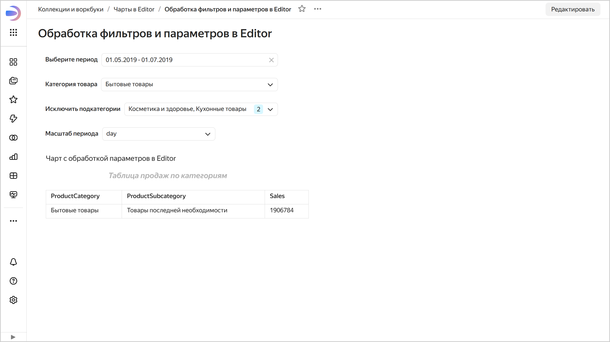

1. Откройте инспектор чарта — наведите курсор на чарт и в правом верхнем углу нажмите  →  **Инспектор**. Убедитесь, что запрос построен с использованием параметров, переданных в чарт Editor.

   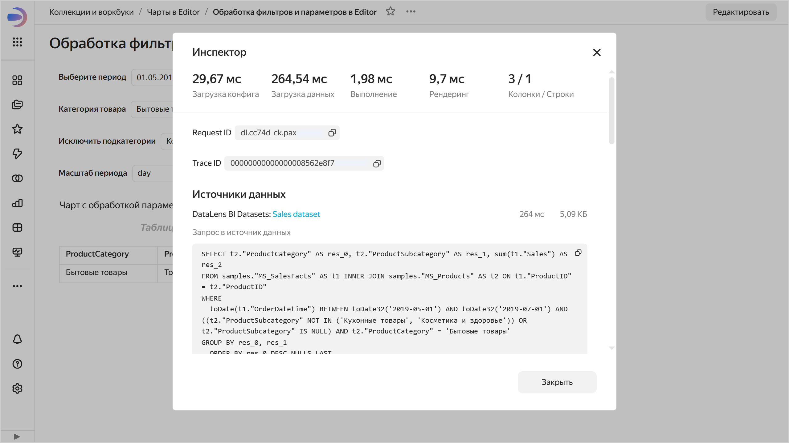

1. Откройте чарт `Простой чарт в Editor` на редактирование — наведите курсор на чарт и в правом верхнем углу нажмите  →  **Редактировать**.

   Вверху отображаются параметры и их значения с дашборда.

   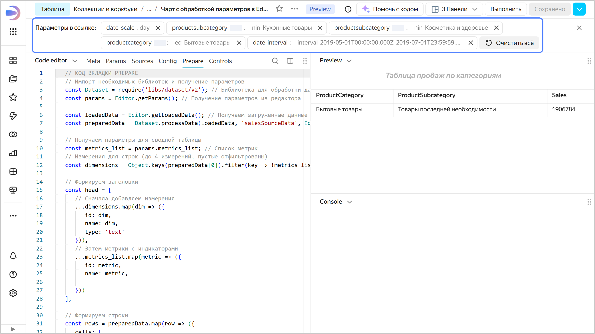

## Добавьте интерактивные элементы в чарт {#interactive-elements}

Чтобы добавить инерактивные элементы, используйте [Advanced-чарт](../../datalens/charts/editor/widgets/advanced.md), который позволяет создавать HTML с безопасной разметкой через функцию [Editor.generateHtml(args)](../../datalens/charts/editor/methods.md#gen-html) и гибкие SVG-визуализации с помощью библиотек `d3`, `d3-chord` и `d3-sankey`.

Создайте [Advanced-чарт](../../datalens/charts/editor/widgets/advanced.md) и добавьте на него кнопки для выбора метрик и тултипы.


1. На панели слева выберите  **Коллекции и воркбуки** и перейдите в воркбук `Чарты в Editor`.
1. В правом верхнем углу нажмите **Создать** →  **Чарт в Editor**.


1. В блоке **Чарты** выберите тип визуализации **Advanced-чарт**.
1. На вкладке **Prepare** задайте начальные параметры и добавьте код, выполняющий отрисовку элементов и обработку событий чарта.

   1. Для упрощения примера, задайте в константах описания метрик, выбранную метрику по умолчанию и передайте их в объект конфигурации:

      ```javascript
      const primaryData = [{x: 'Категория A', y: 30, id: 'A'},{x: 'Категория B', y: 80, id: 'B'},{x: 'Категория C', y: 45, id: 'C'},{x: 'Категория D', y: 60, id: 'D'},{x: 'Категория E', y: 20, id: 'E'}];
      const secondaryData = [{x: 'Категория A', y: 50, id: 'A'},{x: 'Категория B', y: 40, id: 'B'},{x: 'Категория C', y: 75, id: 'C'},{x: 'Категория D', y: 30, id: 'D'}];
      // Выбранная метрика
      const selectedMetric =  'primary';

      // Конфигурация
      const config = {
          data: {primaryData:primaryData,secondaryData:secondaryData},
          selectedMetric: selectedMetric
      };
      ```

   1. В модуле `module.exports` с помощью функции [Editor.wrapFn(args)](../../datalens/charts/editor/methods.md#wrap) опишите:

      * В блоке `render` отрисовку чарта.
      * В блоке `events` — обработку события `click` и обновление состояния чарта.
      * В блоке `tooltip` отрисовку тултипа.
      
      Функция `Editor.wrapFn(args)` для формировании обработчика чарта, исполняется в браузере в песочнице с ограниченным доступом к API браузера.


   

   ```javascript
   // КОД ВКЛАДКИ PREPARE Работа с кликами и тултипами
   // Данные для двух метрик
   const primaryData = [{x: 'Категория A', y: 30, id: 'A'},{x: 'Категория B', y: 80, id: 'B'},{x: 'Категория C', y: 45, id: 'C'},{x: 'Категория D', y: 60, id: 'D'},{x: 'Категория E', y: 20, id: 'E'}];
   const secondaryData = [{x: 'Категория A', y: 50, id: 'A'},{x: 'Категория B', y: 40, id: 'B'},{x: 'Категория C', y: 75, id: 'C'},{x: 'Категория D', y: 30, id: 'D'}];
   // Выбранная метрика
   const selectedMetric =  'primary';

   // Конфигурация
   const config = {
       data: {primaryData:primaryData,secondaryData:secondaryData},
       selectedMetric: selectedMetric
   };

   module.exports = {
       render: Editor.wrapFn({
           fn: function(dimensions, config) {
               const {width, height} = dimensions;

               const state = Chart.getState() || {};
               const selectedItem = state.selectedItem || config.selectedMetric;
            
               const currentData = selectedItem === 'secondary' ? config.data.secondaryData : config.data.primaryData;
               const sortedData = [...currentData].sort((a, b) => b.y - a.y);
               // Создаем контейнер
               const container = document.createElement('div');container.style.setProperty('display', 'flex');container.style.setProperty('flex-direction', 'column');container.style.setProperty('height', '100%');container.style.setProperty('font-family', 'sans-serif');
               // Блок метрик
               const metricsContainer = document.createElement('div');metricsContainer.style.setProperty('display', 'flex');metricsContainer.style.setProperty('margin', '10px');metricsContainer.style.setProperty('gap', '10px');

               // Определяем, какая метрика выбрана
               const isPrimarySelected = selectedItem === 'primary';

               // Кнопка "Основная"
               const primaryBtn = document.createElement('div');
               primaryBtn.innerHTML = 'Основная метрика';primaryBtn.style.setProperty('padding', '8px 12px');primaryBtn.style.setProperty('border-radius', '4px');primaryBtn.style.setProperty('cursor', 'pointer');primaryBtn.style.setProperty('user-select', 'none');primaryBtn.style.setProperty('background-color', isPrimarySelected ? '#1e88e5' : '#e0e0e0');
               primaryBtn.style.setProperty('color', isPrimarySelected ? 'white' : 'black');
               primaryBtn.setAttribute('data-id', 'primary');
               metricsContainer.appendChild(primaryBtn);

               // Кнопка "Альтернативная"
               const secondaryBtn = document.createElement('div');
               secondaryBtn.innerHTML = 'Альтернативная метрика';
               secondaryBtn.style.setProperty('padding', '8px 12px');secondaryBtn.style.setProperty('border-radius', '4px');secondaryBtn.style.setProperty('cursor', 'pointer');secondaryBtn.style.setProperty('user-select', 'none');
               // СТИЛИ в зависимости от выбора
               secondaryBtn.style.setProperty('background-color', !isPrimarySelected ? '#1e88e5' : '#e0e0e0');
               secondaryBtn.style.setProperty('color', !isPrimarySelected ? 'white' : 'black');
               secondaryBtn.setAttribute('data-id', 'secondary');
               metricsContainer.appendChild(secondaryBtn);

               container.appendChild(metricsContainer);

               // Блок графика
               const chartContainer = document.createElement('div');
               chartContainer.style.setProperty('flex', '1');
               chartContainer.style.setProperty('position', 'relative');
               chartContainer.style.setProperty('margin', '10px');

               // Создаем SVG
               const svg = document.createElementNS('http://www.w3.org/2000/svg', 'svg');
               svg.setAttribute('width', '100%');svg.setAttribute('height', '90%');svg.setAttribute('viewBox', `-20 0 ${width} ${height}`);svg.style.setProperty('overflow', 'visible');

               const margin = {top: 20, right: 20, bottom: 40, left: 50};
               const innerWidth = width - margin.left - margin.right;
               const innerHeight = height - margin.top - margin.bottom;

               // Группа для отступов
               const g = document.createElementNS('http://www.w3.org/2000/svg', 'g');
               g.setAttribute('transform', `translate(${margin.left},${margin.top})`);
               svg.appendChild(g);

               // Масштабы: теперь x - это значения, y - категории
               const xScale = d3.scaleLinear()
                   .domain([0, d3.max(sortedData, d => d.y)]).nice()
                   .range([0, innerWidth]);

               const yScale = d3.scaleBand()
                   .domain(sortedData.map(d => d.x))
                   .range([0, innerHeight])
                   .padding(0.2);

               // Ось X (внизу)
               const xAxis = d3.axisBottom(xScale);
               const xAxisGroup = document.createElementNS('http://www.w3.org/2000/svg', 'g');
               xAxisGroup.setAttribute('transform', `translate(0,${innerHeight})`);
               g.appendChild(xAxisGroup);
               d3.select(xAxisGroup).call(xAxis);

               // Ось Y (слева)
               const yAxis = d3.axisLeft(yScale);
               const yAxisGroup = document.createElementNS('http://www.w3.org/2000/svg', 'g');
               g.appendChild(yAxisGroup);
               d3.select(yAxisGroup).call(yAxis);

               // Столбцы (теперь горизонтальные)
               const bars = document.createElementNS('http://www.w3.org/2000/svg', 'g');
               g.appendChild(bars);

               d3.select(bars)
                   .selectAll('rect').data(sortedData).enter().append('rect').attr('y', d => yScale(d.x)).attr('x', 0).attr('height', yScale.bandwidth()).attr('width', d => xScale(d.y)).attr('fill', '#4caf50')
                   .attr('data-id', d => d.id)
                   .attr('cursor', 'pointer');

               svg.appendChild(g);
               chartContainer.appendChild(svg);
               container.appendChild(chartContainer);

               return Editor.generateHtml(container.outerHTML);
           },
           args: [config],
           libs: ['d3']
       }),
       events: {
           click: Editor.wrapFn({
               fn: function(event, config) {
                   const clickedId = event.target?.getAttribute('data-id');
                   if (!clickedId) return;

                   // Проверяем, кликнули ли по кнопке метрики
                   if (clickedId === 'primary' || clickedId === 'secondary') {
                       console.log('got')
                       // Обновляем параметры действия для фильтрации
                       Chart.setState({ selectedItem: clickedId });
                   }
               },
               args: [config]
           })
       },
       tooltip: {
           renderer: Editor.wrapFn({
               fn: function(event, config) {
                   const dataId = event.target?.getAttribute('data-id');
                   if (!dataId) return null;

                   // Проверяем, не является ли это кнопкой метрики
                   if (dataId === 'primary' || dataId === 'secondary') {
                       return null;
                   }

                   // Определяем, какая метрика выбрана
                   const state = Chart.getState() || {};
                   const selectedItem = state.selectedItem || config.selectedMetric;
                   const currentData = selectedItem === 'secondary' ? config.data.secondaryData : config.data.primaryData;

                   const item = currentData.find(d => d.id === dataId);
                   if (!item) return null;

                   return Editor.generateHtml(`
                       <div style="padding: 10px; font-family: sans-serif; font-size: 14px;">
                           <div><strong>Категория:</strong> ${item.x}</div>
                           <div><strong>Значение:</strong> ${item.y}</div>
                       </div>
                   `);
               },
               args: [config]
           })
       }
   };
   ```

   

1. Вверху чарта нажмите **Выполнить**. В области предпросмотра отобразится чарт с интерактивными элементами — вы можете переключать метрики с помощью кнопок и просматривать тултипы при наведении на элементы диаграммы.

   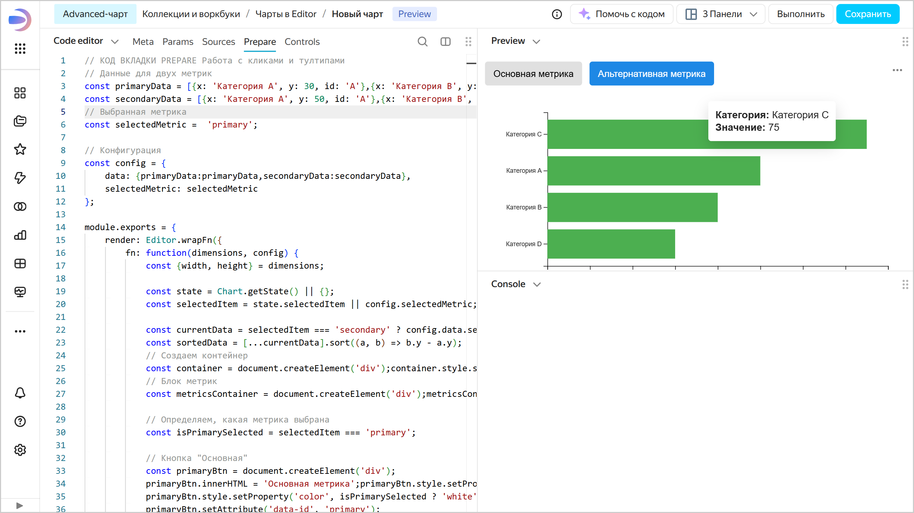

1. Сохраните чарт:

   1. В правом верхнем углу нажмите кнопку **Сохранить**.
   1. Введите название чарта `Advanced чарт` и нажмите кнопку **Сохранить**.