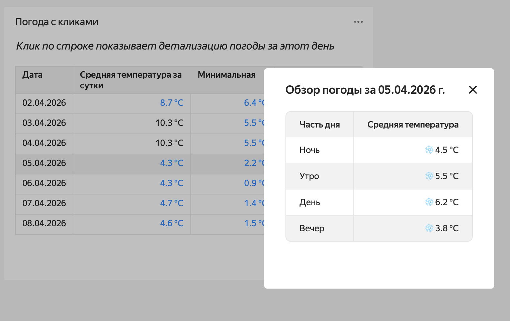

# Пример использования вкладки Activities в Editor


[Editor](../../datalens/charts/editor/index.md) — редактор для создания визуализации данных и селекторов с помощью кода на JavaScript. Editor позволяет загружать данные из одного или нескольких источников, управлять параметрами чартов и настраивать визуализации. В качестве источников данных вы можете использовать датасеты и подключения.

В этом руководстве вы сможете посмотреть, как работает вкладка Activities: построите таблицу, при нажатии на строки которой будет открываться более детальная информация.

В качестве источника данных будет использовано подключение API Connector к демонстрационной базе данных с информацией о погоде.





Для визуализации и исследования данных [подготовьте {{ datalens-short-name }} к работе](#before-you-begin), затем выполните следующие шаги:


1. [Создайте воркбук](#create-workbook).
1. [Создайте подключение](#create-connection).
1. [Создайте чарт в Editor](#create-chart).


## Перед началом работы {#before-you-begin}



## Создайте воркбук {#create-workbook}

1. Перейдите на [главную страницу]({{ link-datalens-main }}) {{ datalens-short-name }}.
1. На панели слева выберите  **Коллекции и воркбуки**.
1. В правом верхнем углу нажмите **Создать** → **Создать воркбук**.
1. Введите название [воркбука](../../datalens/workbooks-collections/index.md) — `Activities в Editor`.
1. Нажмите кнопку **Создать**.


## Создайте подключение {#create-connection}

1. Перейдите в созданный на предыдущем шаге воркбук и нажмите **Создать** → **Подключение**.
1. В разделе **Файлы и сервисы** выберите **API Connector**.
1. Укажите параметры подключения:

   * **Имя хоста** — `api.open-meteo.com`;
   * **Порт** — `443`;
   * **URL путь** — `v1/forecast/`;
   * **Разрешённые методы** — оставьте только `GET`.

   Остальные параметры оставьте без изменений. 
   
1. Нажмите **Создать подключение**. Введите название подключения и нажмите **Создать**.

1. Перейдите в воркбук `Activities в Editor` и на вкладке **Подключения** найдите созданное подключение.

1. Скопируйте идентификатор подключения: рядом с ним нажмите на  → **Копировать ID**. Идентификатор будет скопирован в буфер обмена.

## Создайте чарт в Editor {#create-chart}

1. В воркбуке `Activities в Editor` в правом верхнем углу нажмите **Создать** → **Чарт в Editor**. На открывшейся странице выберите тип визуализации **Таблица**.

1. Свяжите чарт с подключением: для этого перейдите на вкладку **Meta** и добавьте ID подключения в `links`:

   ```javascript
   {
    "links": {
        "weatherConnection": "<id_подключения>"
    }
   }
   ```

   Где:
   * `<id_подключения>` — идентификатор подключения, скопированный на предыдущем шаге.
   * `weatherConnection` — произвольное имя-алиас, которое вы присваиваете подключению, с помощью которого запрашиваете данные для чарта из источника.

1. Получите данные из источника. Для этого перейдите на вкладку **Source** и укажите:

   ```javascript
   module.exports = {
    "weather": {

        // Указываем, в какое подключение ходим за данными
        // Используем тут имя, которое мы дали подключению на табе Meta
        apiConnectionId: Editor.getId("weatherConnection"),

        // Метод запроса
        method: "GET",

        // Указываем путь до API-метода/страницы в источнике
        path: "?latitude=55.75&longitude=37.61&daily=temperature_2m_max,temperature_2m_min"
    }
   };
   ```

1. Настройте действие `runActivity` на вкладке **Config**: очистите содержимое вкладки **Config** и скопируйте предложенный код:

   ```javascript
   module.exports = {
       size: 'l',
       events: {
           click: [{handler: {type: 'runActivity'}, scope: 'row'}],
       },
       title: {
           text: 'Клик по строке показывает детализацию погоды за этот день',
           style: {
               'text-align': 'center',
               'font-size': '16px',
               'font-weight': 'normal',
               'margin-bottom': '16px',
               'font-style': 'italic',
           }
       },
   };
   ```

1. На вкладке **Prepare** сформируйте таблицу:

   ```javascript
   // Получаем скачанные данные
   const data = Editor.getLoadedData();
   const {daily, daily_units} = data.weather.data.body;
   const {time, temperature_2m_max, temperature_2m_min} = daily;

   const headCommonStyles = {
       'background-color': 'var(--g-color-base-neutral-light)',
   };

   // Формируем заголовок таблицы и описываем типы колонок
   const head = [
        {
            id: 'id-date',
            name: 'Дата',
            type: 'date',
            format: 'DD.MM.YYYY',
            css: headCommonStyles,
        },
        {
            id: 'id-mean',
            name: 'Средняя температура за сутки',
            type: 'text',
            css: {...headCommonStyles, width: 200},
        },
        {
            id: 'id-t-min',
            name: 'Минимальная',
            type: 'text',
            css: headCommonStyles,
        },
        {
            id: 'id-t-max',
            name: 'Максимальная',
            type: 'text',
             css: headCommonStyles,
        },
    ];

    // Наполняем таблицу содержимым
    const rows = [];

    for (var i = 0; i < time.length; i++) {
        const rowTime = time[i];
        const rowMin = temperature_2m_min[i];
        const rowMax = temperature_2m_max[i];

        const colorCold = {color: 'var(--g-color-text-info-heavy)'};
        const colorWarm = {color: 'var(--g-color-text-danger-heavy)'};

        const average = ((rowMin + rowMax) / 2).toFixed(1);

        const isAvCold = average < 10;
        const isAvWarm = average > 15;
        const isMinCold = rowMin < 10;
        const isMinWarm = rowMin > 15;
        const isMaxCold = rowMax < 10;
        const isMaxWarm = rowMax > 15;

        rows.push({
            cells: [
                {
                    value: rowTime
                },
               {
                    value: `${average} ${daily_units.temperature_2m_min}`,
                    css: {
                        textAlign: 'right', 
                        ...(isAvCold ? colorCold : {}),
                        ...(isAvWarm ? colorWarm : {}),
                    },
                },
                {
                    value: `${rowMin} ${daily_units.temperature_2m_min}`,
                    css: {
                        textAlign: 'right', 
                        ...(isMinCold ? colorCold : {}),
                        ...(isMinWarm ? colorWarm : {}),
                    },
                },
                {
                    value: `${rowMax} ${daily_units.temperature_2m_max}`,
                    css: {
                        textAlign: 'right', 
                        ...(isMaxCold ? colorCold : {}),
                        ...(isMaxWarm ? colorWarm : {}),
                    },
                },
            ]
        });
    }
   
    module.exports = {head, rows};
   ```

1. На вкладке **Activities** настройте интерактивное взаимодействие с таблицей:

   ```javascript
   module.exports = {
       sources: ({params}) => {
           const date = params.cells[0].value;
           return {
               weather: {
                   apiConnectionId: Editor.getId('weatherConnection'),
                   path: `?latitude=55.75&longitude=37.61&hourly=temperature_2m&start_date=${date}&end_date=${date}`,
                   method: "GET",
               },
           }; 
       },
       handleResponse: ({data: responseData}) => {
           const data = responseData.weather.data.body.hourly;
           const [date] = data.time[0].split('T');
           const [year, month, day] = date.split('-');
           const groups = {
               "Ночь": [],
               "Утро": [],
               "День": [],
               "Вечер": []
           };

           data.time.forEach((date, i) => {
               const temp = data.temperature_2m[i];
               const hour = parseInt(date.split('T')[1]);

               if (hour >= 0 && hour <= 5) {
                   groups["Ночь"].push(temp);
               } else if (hour >= 6 && hour <= 11) {
                   groups["Утро"].push(temp);
               } else if (hour >= 12 && hour <= 17) {
                   groups["День"].push(temp);
               } else {
                   groups["Вечер"].push(temp);
               }
           });

           let content = `
   | Часть дня | Средняя температура |
   | --- | ---: |`;

           for (const [part, temps] of Object.entries(groups)) {
               if (temps.length > 0) {
                   const avg = temps.reduce((a, b) => a + b, 0) / temps.length;
                   const emodji = avg > 15 ? '☀️' : (avg < 10 ? '❄️' : '');
                   content += `\n| ${part} | ${emodji} ${avg.toFixed(1)} °C |`;
               }
           }

           return {
               action: 'popup',
               title: `Обзор погоды за ${day}.${month}.${year} г.`,
               content,
           };
       }
   };
   ```


1. Вверху чарта нажмите **Выполнить**. В области предпросмотра отобразится простая таблица, которая выводит данные, получаемые из JSON API.

1. Чтобы сохранить чарт, в правом верхнем углу нажмите **Сохранить** и введите название чарта.

При нажатии на строку таблицы будет открываться всплывающее окно с более детальной информацией.



