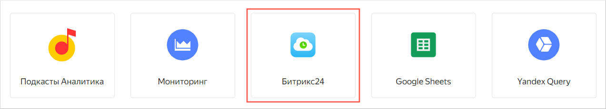
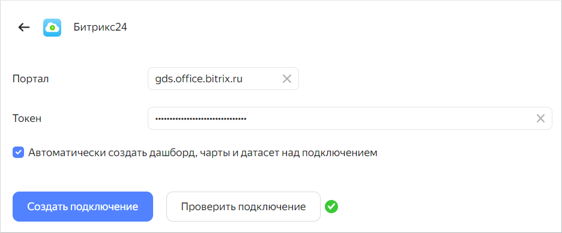
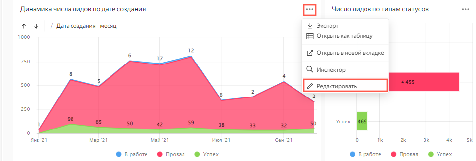
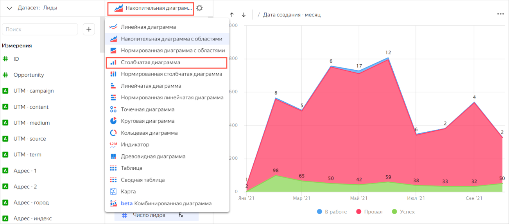
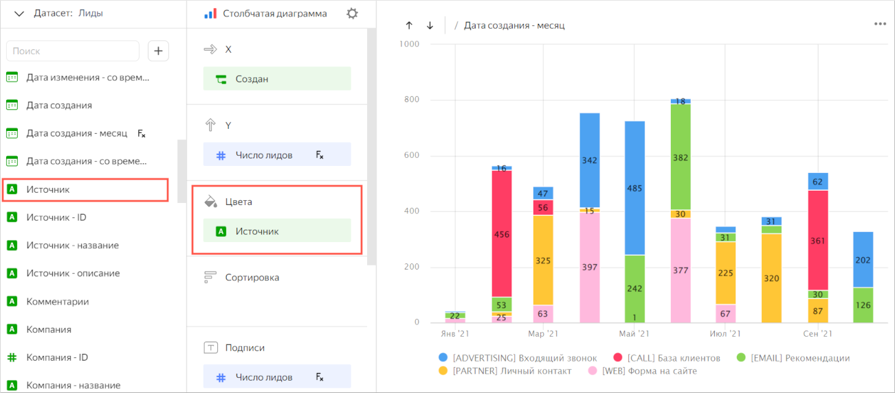
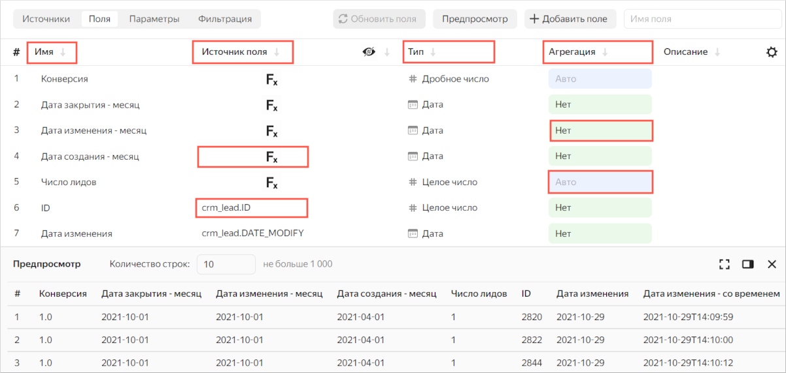
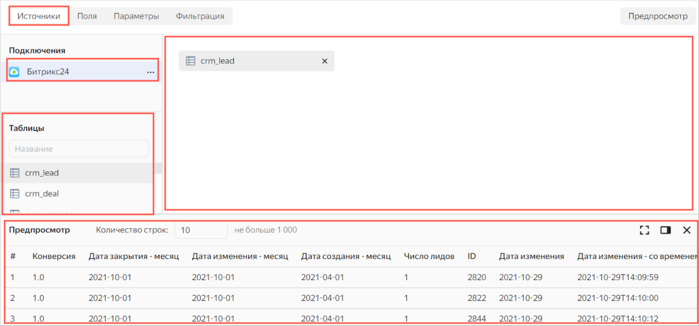
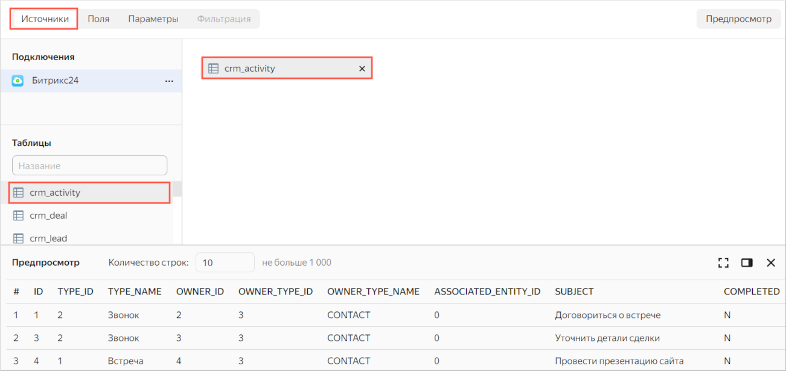
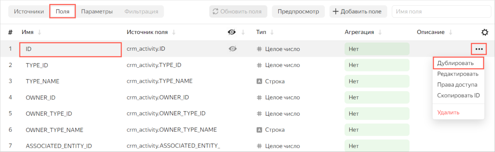
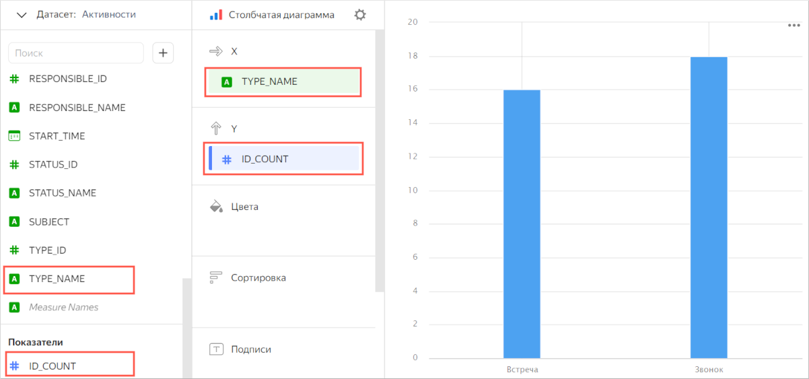

# Визуализация данных Битрикс24

Вы создадите подключение к демонстрационному источнику данных Битрикс24 и изучите дашборд и чарты, которые Битрикс24 готовит на базе {{ datalens-short-name }}. Также вы научитесь работать с [датасетами](../../datalens/concepts/dataset/index.md), [чартами](../../datalens/concepts/chart/index.md) и [дашбордами](../../datalens/concepts/dashboard.md).

Для визуализации и исследования данных [подготовьте {{ datalens-short-name }} к работе](#before-you-begin), затем выполните следующие шаги:

1. [Создайте подключение к Битрикс24](#create-connection-bitrix24).
1. [Изучите дашборд и чарты](#view-dashboard-bitrix24).
1. [Изучите датасет. Создайте свой датасет и чарт](#create-dataset-and-chart).

## Перед началом работы {#before-you-begin}



## Шаг 1. Создайте подключение к Битрикс24 {#create-connection-bitrix24}

1. Перейдите в [{{ datalens-short-name }}]({{ link-datalens-main }}).
1. На панели слева выберите  **Подключения** и нажмите кнопку **Создать подключение**.
1. Выберите тип подключения [**Битрикс24**]({{ link-datalens-main }}/connections/new/bitrix24).

   
  
   
   
   

1. Чтобы подключиться к демонстрационному источнику данных, укажите:

   * **Портал** — `gds.office.bitrix.ru`
   * **Токен** — `wJZIFjdYtbLRtfewYcnq71oSFyEgxlbQ`

   При подключении к рабочему источнику данных [Битрикс24](../../datalens/operations/connection/create-bitrix24.md), укажите:

   * **Портал** — адрес вашего портала Битрикс24 в формате `test.bitrix24.ru`.
   * **Токен** — получите секретный ключ в Битрикс24, в разделе **CRM** → **Аналитика** → **BI-аналитика** на вкладке **Yandex DataLens**. Подробнее см. [инструкцию](https://helpdesk.bitrix24.ru/open/17402692).

   Оставьте опцию **Автоматически создать дашборд, чарты и датасет над подключением** включенной.

1. Проверьте подключение и нажмите **Создать подключение**.

   
  
   
   
   

1. Укажите имя подключения, например, `Битрикс24` и нажмите **Создать**.

   После создания подключения откроется каталог **Битрикс24** с демонстрационным дашбордом **Дашборд Битрикс24** и вложенными каталогами **Лиды** и **Сделки**, в которых собраны датасеты и чарты.

## Шаг 2. Изучите дашборд {#view-dashboard-bitrix24}

В каталоге **Битрикс24** откройте **Дашборд Битрикс24**.

Дашборд интерактивный, на нем вы сможете:

* настроить всевозможные фильтры;
* сортировать строки в таблицах;
* переключаться между графиками;
* открывать более подробную детализацию на графиках.

У вас отображается копия основного дашборда. Вы можете изменить дашборд так, как вам удобно. Например, на вкладке **Лиды** вы можете изменить график **Динамика числа лидов по дате создания** и добавить его на дашборд:

1. В правом верхнем углу графика нажмите значок  и выберите **Редактировать**.

      
  
   
   
      

1. Выберите другой тип чарта — **Столбчатая диаграмма**.

      
  
   
   
      

1. Перетащите поле **Источник** в секцию **Цвета**.

   

   Чарт отображает число созданных лидов по каналам в разрезе месяцев.

1. Сохраните чарт как новый объект:

   1. В правом верхнем углу страницы нажмите значок  и выберите **Сохранить как**.

      

      Чтобы заменить исходный чарт на дашборде отредактированным, в правом верхнем углу нажмите **Сохранить**.

      

   1. Введите название нового чарта `Число лидов по каналам` и нажмите **Сохранить**.

1. Добавьте чарт на дашборд:

   1. Вернитесь на вкладку с дашбордом и в верхней части страницы нажмите кнопку **Редактировать**.
   1. Нажмите кнопку **Добавить** и выберите **Чарт**.
   1. В поле **Чарт** нажмите кнопку **Выбрать**.
   1. Выберите чарт **Число лидов по каналам**. После этого автоматически заполнится поле **Название**.
   1. Нажмите **Добавить**. Виджет отобразится на дашборде.
   1. Настройте размер и расположение виджетов на дашборде.
   1. Нажмите **Сохранить**, чтобы сохранить изменения дашборда.

   

## Шаг 3. Изучите подключение и датасет. Создайте свои датасет и чарт {#create-dataset-and-chart}

1. Ознакомьтесь с содержимым каталога **Битрикс24**. Для этого вернитесь в каталог Битрикс24: нажмите  и в панели навигации выберите **Битрикс24**.

   Помимо дашборда в каталоге есть еще 2 вложенных каталога, в которых находятся:

   *  — чарты, визуализирующие информацию в виде графиков, таблиц.
   *  — датасет, который описывает модель данных для создания отчетов по лидам.
 
1. Перейдите в каталог **Лиды** и откройте датасет **Лиды**. 

   На вкладке **Поля** отображается список полей из выбранной в источнике таблицы. Обратите внимание на следующие колонки:

   * **Имя** — название поля.
   * **Тип** — [тип данных](../../datalens/concepts/data-types.md) поля.
   * **Источник поля** — обозначение поля в таблице источника или формула для [вычисления](../../datalens/concepts/calculations/index.md) (обозначены значком ).
   * **Агрегация** — показывает [функцию агрегации данных](../../datalens/concepts/dataset/data-model.md#aggregation), если она применена к полю.
    

      
  
   
   
   

   На вкладке **Источники** отображаются:
  
   * Подключение, на основе которого создан датасет.
   * Список таблиц, доступных в источнике.
   * Рабочая область для таблиц, выбранных в качестве источника полей датасета.
   * Область предпросмотра информации из выбранных таблиц.
    

      

   

   

1. Перейдите в каталог **Сделка** и откройте датасет **Сделка**. Ознакомьтесь с содержимым вкладок **Поля** и **Источники**.

### Создайте свой датасет {#create-dataset}

Чтобы использовать данные подключения [Битрикс24](#create-connection-bitrix24), вы можете на его основе создать свой датасет.

1. Слева на панели навигации выберите **Датасеты**.
1. Вверху справа нажмите кнопку **Создать датасет**.
1. Перейдите на вкладку **Источники**.
1. В блоке **Подключения** нажмите кнопку **Добавить** и выберите ранее созданное подключение к Битрикс24.
1. Перенесите на рабочую область таблицу **crm_activity**. Дождитесь загрузки данных.

      

   

   

1. Перейдите на вкладку **Поля**.
1. Создайте поле с количеством записей — `ID_COUNT`:

   1. Продублируйте поле `ID`: наведите курсор на строку с полем, в конце строки нажмите значок  и выберите **Дублировать**.

         

      

      

   1. Переименуйте дубликат поля `ID (1)` в `ID_COUNT`: нажмите на имя строки, удалите текущее имя и введите новое.
   1. В столбце **Агрегация** для поля `ID_COUNT` выберите **Количество**. Поле станет [показателем](../../datalens/concepts/chart/measure-values.md) и поменяет цвет на синий.

   

   Вы можете добавить, переименовать поля, создать [вычисляемые поля](../../datalens/concepts/calculations/index.md), добавить к ним описания.

   

1. В верхнем правом углу нажмите кнопку **Сохранить**
1. Введите имя датасета `Активности` и нажмите **Создать**.

### Создайте новый чарт {#create-chart}

Для визуализации взаимодействий по типам создайте чарт — столбчатую диаграмму.

1. После сохранения датасета в правом верхнем углу нажмите кнопку **Создать чарт**. 
1. Выберите [тип визуализации](../../datalens/visualization-ref/index.md) **Столбчатая диаграмма**.
1. Добавьте на график типы взаимодействий с клиентами. Для этого из раздела **Измерения** перетащите поле `TYPE_NAME` в секцию **X**.
1. Добавьте на график количество взаимодействий каждого типа. Для этого из раздела **Показатели** перетащите поле  `ID_COUNT` в секцию **Y**.

   

1. Сохраните чарт:

   1. В правом верхнем углу страницы нажмите значок  и выберите **Сохранить**.
   1. Введите название нового чарта `Количество взаимодействий по типам` и нажмите **Сохранить**.

### Добавьте чарт на дашборд {#add-chart-on-dashboard}

Добавьте созданный чарт на дашборд:

1. В каталоге **Битрикс24** откройте **Дашборд Битрикс24** или [создайте дашборд](../../datalens/operations/dashboard/create.md).
1. В верхней части страницы нажмите кнопку **Редактировать**.
1. Нажмите кнопку **Добавить** и выберите **Чарт**.
1. Выберите чарт **Количество взаимодействий по типам**. После этого автоматически заполнится поле **Название**.
1. Нажмите **Добавить**. Виджет отобразится на дашборде.
1. Настройте размер и расположение виджетов на дашборде.
1. Нажмите **Сохранить**, чтобы сохранить изменения дашборда.
