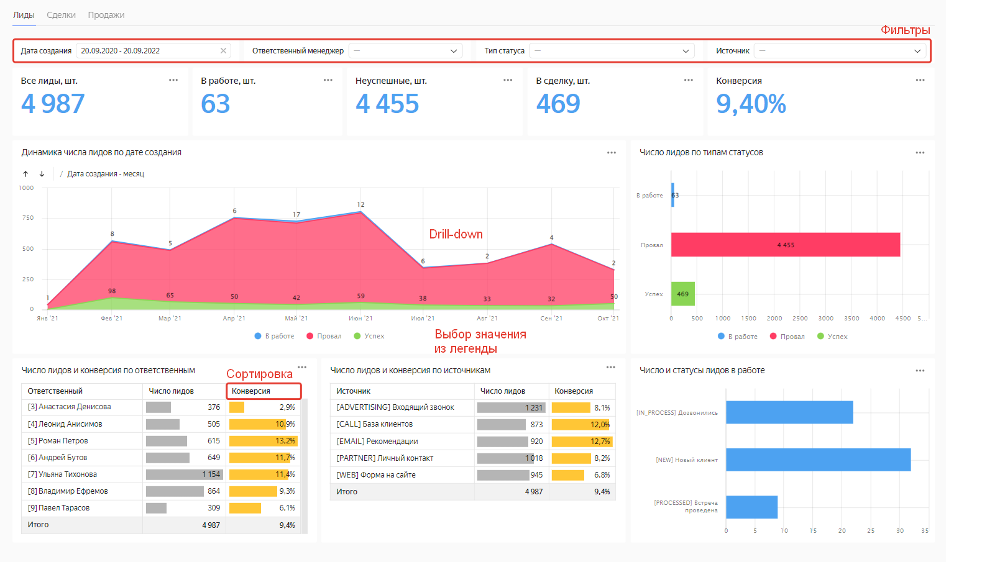
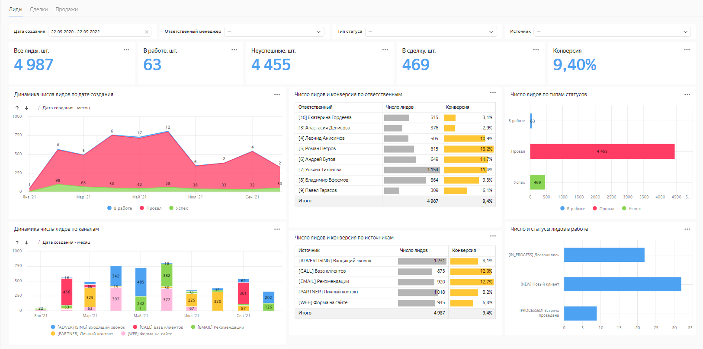

# Создание подключения к Битрикс24

В этом сценарии вы выполните подключение к демонстрационному источнику данных Битрикс24 и изучите дашборд и чарты, который Битрикс24 готовит на базе {{ datalens-short-name }}. Также вы научитесь работать с датасетами, чартами и дашбордами.

Сценарий состоит из следующих шагов:

1. [Создайте подключение к Битрикс24](#step1).
1. [Изучите дашборд и чарты](#step2).
1. [Изучите подключение и датасеты](#step3).

 

## Перед началом работы {#before-you-begin}



## Шаг 1. Создайте подключение к Битрикс24 {#step1}

1. Откройте главную страницу [{{ datalens-short-name }}]({{ link-datalens-main }}) и нажмите **Создать подключение**.

1. Выберите тип подключения [**Битрикс24**]({{ link-datalens-main }}/connections/new/bitrix24).

1. Чтобы подключиться к демонстрационному источнику данных, укажите:
   * **Портал** — `gds.office.bitrix.ru`
   * **Токен** — `wJZIFjdYtbLRtfewYcnq71oSFyEgxlbQ`

   Оставьте опцию **Автоматически создать дашборд, чарты и датасет над подключением** включенной.

1. Проверьте подключение и, если все в порядке, нажмите **Создать подключение**.

1. Укажите название подключения и нажмите кнопку **Создать**.

Подключение создано: у вас появился каталог **Битрикс24** с дашбордом и вложенными каталогами **Лиды** и **Сделки**, в которых собраны датасеты и чарты.

## Шаг 2. Изучите дашборд {#step2}

Откройте **Дашборд Битрикс24**. [Дашборд](../../datalens/concepts/dashboard.md) интерактивный, на нем вы сможете:
* настроить всевозможные фильтры;
* сортировать строки в таблицах;
* переключаться между графиками;
* открывать более подробную детализацию на графиках.

У вас отображается копия основного дашборда, так что ее можно редактировать по своему усмотрению.

Например, на дашборде, на странице **Лиды**, видоизменим график **Динамика числа лидов по дате создания** и добавим его на дашборд:

1. Откройте редактор чартов: нажмите  → **Редактировать**.

1. Смените тип чарта с **Накопительной диаграммы с областями** на **Столбчатую диаграмму**.

1. Перетащите поле **Источник** в секцию **Цвета**.
   Чарт отображает динамику создания лидов по каналам в виде столбчатой диаграммы.
1. Сохраните получившийся чарт как отдельный объект:
    1. Нажмите  → **Сохранить как**.
    1. Выберите расположение для нового чарта и укажите его название.
    1. Нажмите **Сохранить**.

   

    Чтобы заменить исходный чарт на дашборе отредактированным, нажмите **Сохранить** справа наверху.

   

1. Добавьте созданный чарт на дашборд:
    1. Откройте **Дашборд Битрикс24** и нажмите **Редактировать** → **Добавить** → **Чарт**.
    1. Укажите заголовок для чарта на дашборде, например, _Динамика числа лидов по каналам_.
    1. Выберите из каталога нужный чарт.
    1. Нажмите **Добавить**.
    1. Дашборд все еще находится в режиме редактирования: можно настроить расположение элементов с появлением нового и их размер нового чарта.
    1. Нажмите **Сохранить**.

## Шаг 3. Изучите подключение и датасеты {#step3}

Теперь ознакомимся с содержимым каталога **Битрикс24**.

1. Вернитесь в каталог Битрикс24: нажмите  и в панели навигации выберите **Битрикс24**: он располагается уровнем выше откртытого дашборда.

1. Помимо дашборда в каталоге есть еще 2 вложенных каталога: **Лиды** и **Сделки**. Откройте каталог **Лиды**:
   *  — [чарты](../../datalens/concepts/chart/index.md), то есть отдельные отчеты.
   *  — [датасет](../../datalens/concepts/dataset/index.md), описывает модель данных для создания отчетов по лидам.

1. Откройте датасет **Лиды**. Здесь для каждого поля вы увидите [тип](../../datalens/concepts/data-types.md) и источник данных: некоторые из них берутся из API Битрикс24, а некоторые, обозначенные , [вычисляются в {{ datalens-short-name }}](../../datalens/concepts/calculations/index.md).

Создайте свой датасет на основе данных Битрикс24. Для этого:
1. В левой панели выберите и нажмите иконку **Датасеты**. Вы увидите список всех своих датасетов в {{ datalens-short-name }}.
1. Нажмите **Создать датасет**.
1. На вкладке **Источники** нажмите **+ Добавить** и выберите подключение Битрикс24, которое создали на шаге 1.
   Вы увидите список таблиц, которые Битрикс24 могут обновлять. Для подключения Битрикс24 действует ограничение: нельзя [объединять](../../datalens/concepts/data-join.md) таблицы. Но при работе с другими типами подключений в {{ datalens-short-name }}, например, с базами данных или файлами, этого ограничения нет.
1. Выберите таблицу `crm_activity` и перетащите ее в рабочую область. Дождитесь загрузки данных.
1. Перейдите на вкладку **Поля**. Здесь вы можете поработать над данными из датасета: переименовать поля, создать вычисляемые поля, добавить описания. Укажите для поля `ID` тип агрегации **Количество** и переименуйте его в `ID_COUNT`. Получилось агрегируемое [поле-показатель](../../datalens/concepts/chart/measure-values.md).
1. Нажмите **Сохранить**.
1. Укажите название для создаваемого датасета и нажмите **Создать**.

Теперь построим чарт для созданного датасета.

1. Нажмите **Создать чарт**.
1. Добавьте на график типы взаимодействий с клиентами. Для этого из раздела **Измерения** перетащите поле `TYPE_NAME` в секцию **X**.
1. Добавьте на график количество взаимодействий каждого типа. Для этого из раздела Показатели перетащите поле  `ID_COUNT` в секцию **Y**.

Чарт можно сохранить, создать другие аналогично и добавить на дашборд.