# Битрикс24: прямое подключение



В этом руководстве вы создадите подключение к демонстрационному источнику данных Битрикс24 и изучите дашборд и чарты, которые Битрикс24 готовит на базе {{ datalens-short-name }}. Также вы научитесь работать с [датасетами](../../datalens/dataset/index.md), [чартами](../../datalens/concepts/chart/index.md) и [дашбордами](../../datalens/concepts/dashboard.md).

Для визуализации и исследования данных [подготовьте {{ datalens-short-name }} к работе](#before-you-begin), затем выполните следующие шаги:

1. [Создайте воркбук](#create-workbook).
1. [Создайте подключение к Битрикс24](#create-connection-bitrix24).
1. [Изучите дашборд и чарты](#view-dashboard-bitrix24).
1. [Изучите датасет. Создайте свой датасет и чарт](#create-dataset-and-chart).

## Перед началом работы {#before-you-begin}



## Создайте воркбук {#create-workbook}

1. Перейдите на [главную страницу]({{ link-datalens-main }}) {{ datalens-short-name }}.
1. На панели слева выберите  **Коллекции и воркбуки**.
1. В правом верхнем углу нажмите **Создать** → **Создать воркбук**.
1. Введите название [воркбука](../../datalens/workbooks-collections/index.md) — `Битрикс24`.
1. Нажмите кнопку **Создать**.

## Создайте подключение к Битрикс24 {#create-connection-bitrix24}

1. В правом верхнем углу воркбука нажмите **Создать** →  **Подключение**.
1. В разделе **Партнерские подключения** выберите подключение **Битрикс24**.
1. Чтобы подключиться к демонстрационному источнику данных, укажите:

   * **Портал** — `gds.office.bitrix.ru`
   * **Токен** — `wJZIFjdYtbLRtfewYcnq71oSFyEgxlbQ`

   При подключении к рабочему источнику данных [Битрикс24](../../datalens/operations/connection/create-bitrix24.md), укажите:

   * **Портал** — адрес вашего портала Битрикс24 в формате `test.bitrix24.ru`.
   * **Токен** — получите секретный ключ в Битрикс24, в разделе **CRM** → **Аналитика** → **BI-аналитика** на вкладке **Yandex DataLens**. Подробнее см. [инструкцию](https://helpdesk.bitrix24.ru/open/17402692).

   Оставьте опцию **Автоматически создать дашборд, чарты и датасет над подключением** включенной.

1. Проверьте подключение и нажмите **Создать подключение**.

   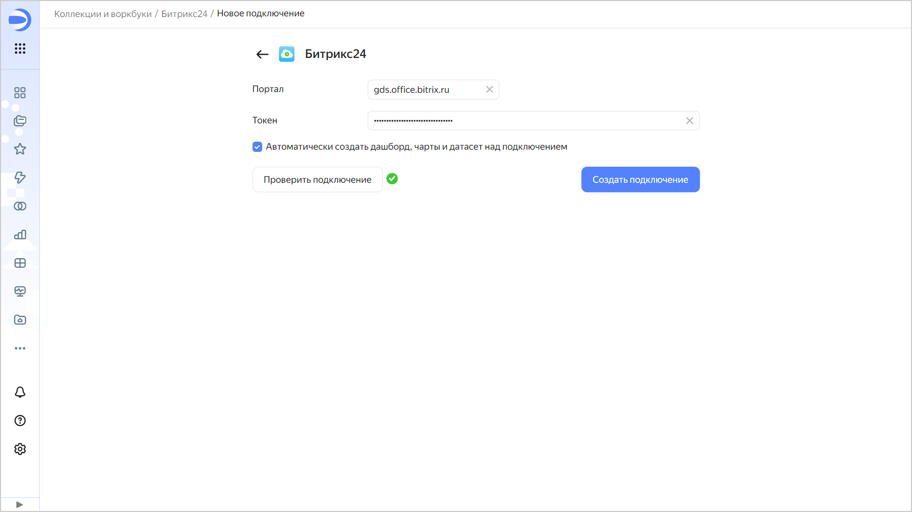

1. Укажите имя подключения, например, `Битрикс24` и нажмите **Создать**.

   После создания подключения откроется воркбук `Битрикс24` с демонстрационным дашбордом `Дашборд Битрикс24`, датасетами `Лиды` и `Сделки`', а также набором чартов.

## Изучите дашборд {#view-dashboard-bitrix24}

Откройте `Дашборд Битрикс24`. Дашборд интерактивный, на нем вы можете:

* настроить всевозможные фильтры;
* сортировать строки в таблицах;
* переключаться между графиками;
* открывать более подробную детализацию на графиках.

Установите фильтр по дате создания: `20.09.2020 - 20.09.2022`, чтобы отобразить статистику за выбранный период.

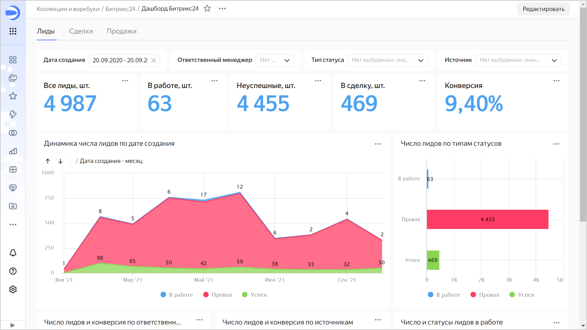

Стандартный дашборд можно настроить под себя: например, удалить, переместить или редактировать чарты. На вкладке `Лиды` измените график `Динамика числа лидов по дате создания` и добавьте его на дашборд:

1. В правом верхнем углу графика нажмите значок  и выберите  **Редактировать**.

   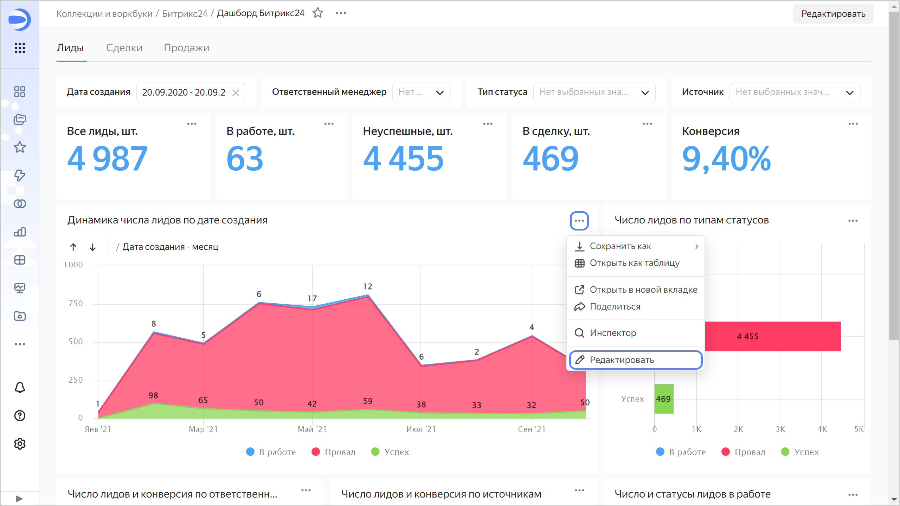

1. Выберите тип чарта — **Столбчатая диаграмма**.

   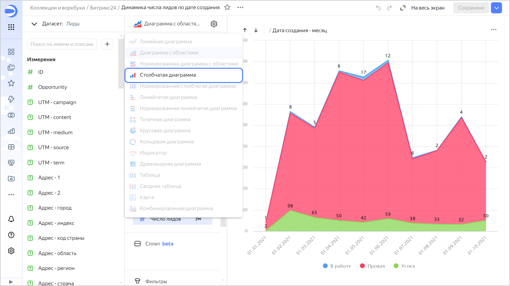

1. Замените типы статусов на источник в секции **Цвета** — из раздела **Измерения** перетащите поле `Источник` в секцию **Цвета** и наведите его над полем `Статус - тип`, пока то не станет красным.

   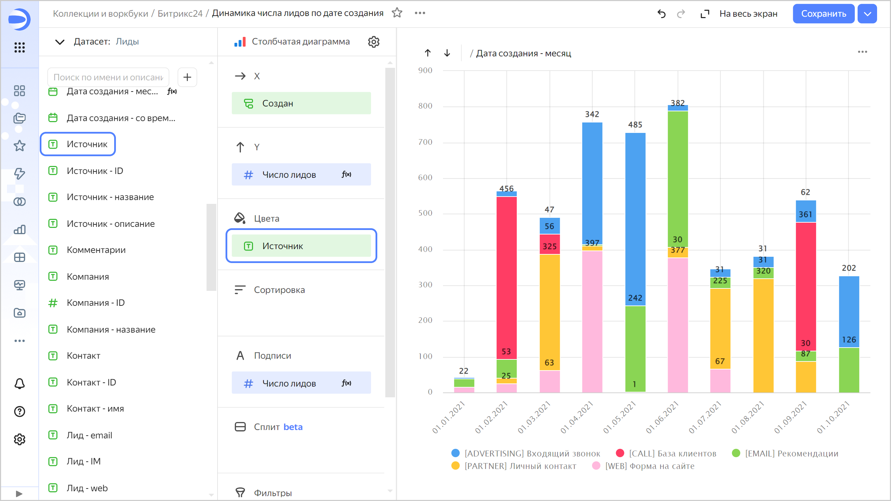

   Чарт отображает число созданных лидов по каналам в разрезе месяцев.

1. Сохраните чарт как новый объект:

   1. В правом верхнем углу страницы нажмите значок  и выберите **Сохранить как копию**.

      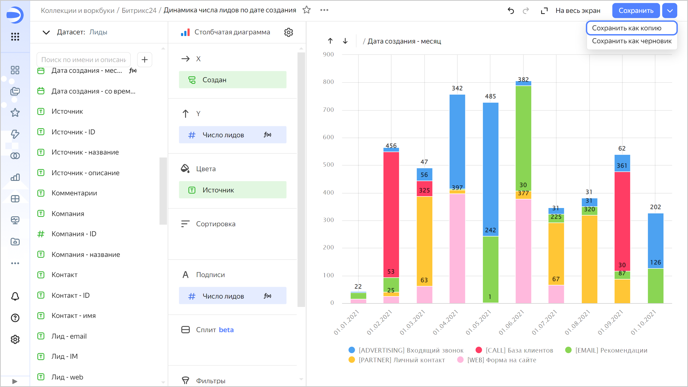

      

      Чтобы заменить исходный чарт на дашборде отредактированным, в правом верхнем углу нажмите **Сохранить**.

      

   1. Введите название нового чарта `Число лидов по каналам` и нажмите **Сохранить**.

1. Добавьте чарт на дашборд:

   1. Вернитесь на вкладку с дашбордом и в верхней части страницы нажмите кнопку **Редактировать**.
   1. На панели в нижней части страницы выберите виджет **Чарт**.
   
      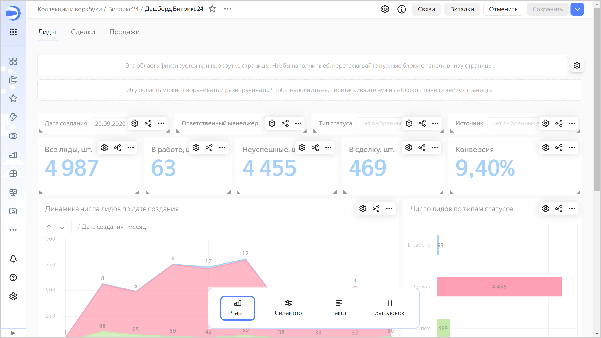
   
   1. В открывшемся окне нажмите кнопку **Выбрать**.
   1. Выберите чарт `Число лидов по каналам`. После этого автоматически заполнится поле **Название**.
   1. Нажмите кнопку **Добавить**. Виджет отобразится на дашборде.
   1. Установите размеры виджетов с помощью мыши и расположите их на дашборде в удобном для вас порядке.
   1. Сохраните дашборд: в правом верхнем углу дашборда нажмите кнопку **Сохранить**

   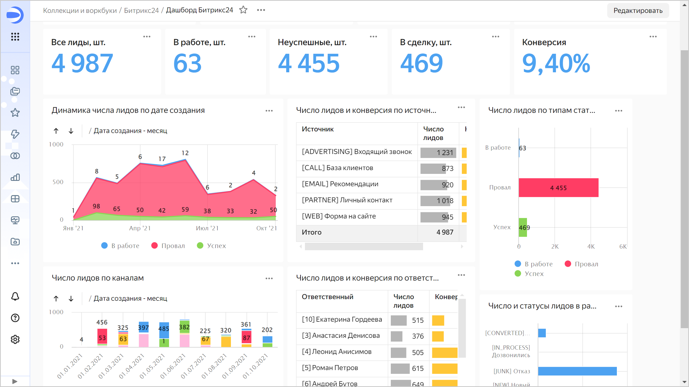

## Изучите подключение и датасет. Создайте свои датасет и чарт {#create-dataset-and-chart}

1. Перейдите в воркбук `Битрикс24` — нажмите его название в пути до дашборда. 

   

1. Откройте датасет `Лиды`.

   На вкладке **Поля** отображается список полей из выбранной в источнике таблицы. Обратите внимание на следующие колонки:

   * **Имя** — название поля.
   * **Тип** — [тип данных](../../datalens/dataset/data-types.md) поля.
   * **Источник поля** — обозначение поля в таблице источника или формула для [вычисления](../../datalens/concepts/calculations/index.md) (обозначены значком ).
   * **Агрегация** — показывает [функцию агрегации данных](../../datalens/dataset/data-model.md#aggregation), если она применена к полю.
    

   

   

   

   На вкладке **Источники** отображаются:

   * Подключение, на основе которого создан датасет.
   * Список таблиц, доступных в источнике.
   * Рабочая область для таблиц, выбранных в качестве источника полей датасета.
   * Область предпросмотра информации из выбранных таблиц.
    

   

   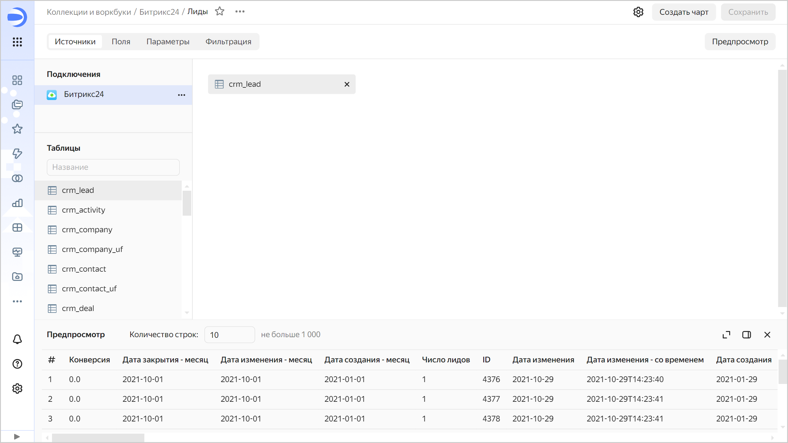

   

1. Перейдите в воркбук `Битрикс24` и откройте датасет `Сделка`. Ознакомьтесь с содержимым вкладок **Поля** и **Источники**.

### Создайте свой датасет {#create-dataset}

Чтобы использовать данные подключения `Битрикс24`, вы можете на его основе создать свой датасет:

1. На панели слева выберите  **Коллекции и воркбуки** и перейдите в воркбук `Битрикс24`.
1. В правом верхнем углу нажмите **Создать** →  **Создать датасет**.
1. Перейдите на вкладку **Источники**.
1. В блоке **Подключения** нажмите кнопку **Добавить** и выберите ранее созданное подключение к Битрикс24.
1. Перенесите на рабочую область таблицу `crm_activity`. Дождитесь загрузки данных.

   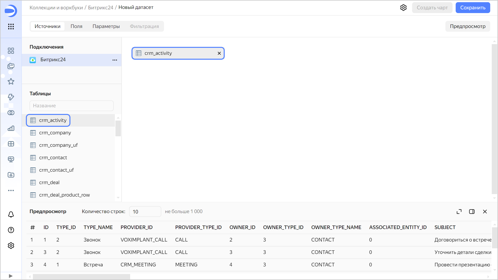

1. Перейдите на вкладку **Поля**.
1. Создайте поле с количеством записей — `ID_COUNT`:

   1. Продублируйте поле `ID` — в правой части строки с полем нажмите  и выберите **Дублировать**.

      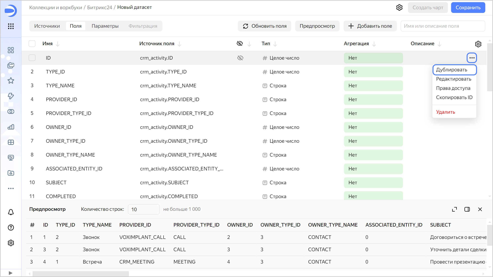

   1. Переименуйте дубликат поля `ID (1)` в `ID_COUNT`: нажмите на имя строки, удалите текущее имя и введите новое.
   1. В столбце **Агрегация** для поля `ID_COUNT` выберите **Количество**. Поле станет [показателем](../../datalens/concepts/chart/measure-values.md) и поменяет цвет на синий.

   

   Вы можете добавить, переименовать поля, создать [вычисляемые поля](../../datalens/concepts/calculations/index.md), добавить к ним описания.

   

1. Сохраните датасет:

   1. В правом верхнем углу нажмите кнопку **Сохранить**.
   1. Введите название датасета — `Активности` и нажмите кнопку **Создать**.

### Создайте новый чарт {#create-chart}

Для визуализации взаимодействий по типам создайте чарт — столбчатую диаграмму:

1. На странице датасета в правом верхнем углу нажмите кнопку **Создать чарт**.
1. Добавьте на график типы взаимодействий с клиентами. Для этого из раздела **Измерения** перетащите поле `TYPE_NAME` в секцию **X**.
1. Добавьте на график количество взаимодействий каждого типа. Для этого из раздела **Показатели** перетащите поле  `ID_COUNT` в секцию **Y**.

   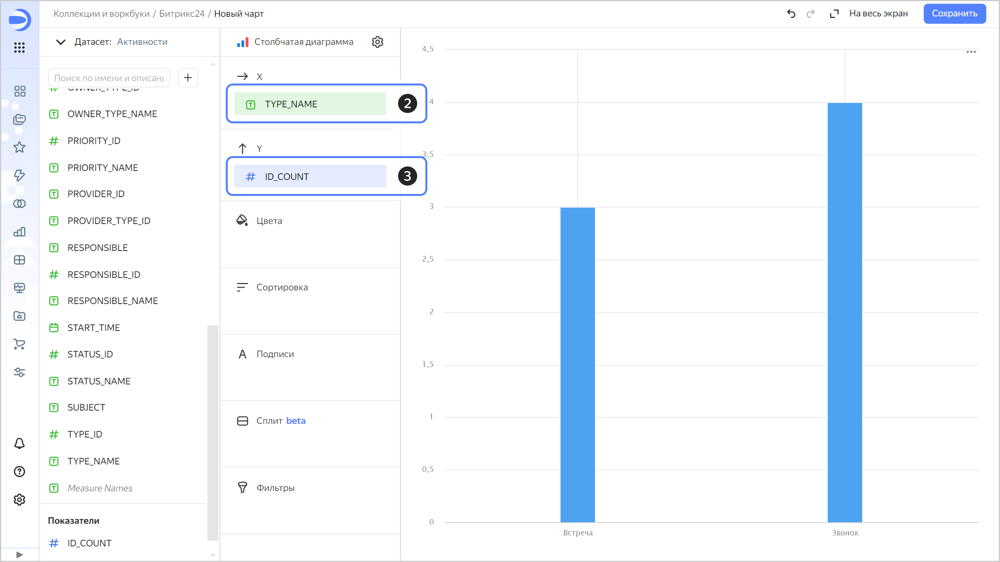

1. Сохраните чарт:

   1. В правом верхнем углу страницы нажмите значок  и выберите **Сохранить**.
   1. Введите название нового чарта `Количество взаимодействий по типам` и нажмите **Сохранить**.

### Добавьте чарт на дашборд {#add-chart-on-dashboard}

Добавьте созданный чарт на дашборд:

1. Перейдите в воркбук `Битрикс24` и откройте `Дашборд Битрикс24` или [создайте дашборд](../../datalens/operations/dashboard/create.md).
1. В верхней части страницы нажмите кнопку **Редактировать**.
1. Нажмите кнопку **Добавить** и выберите **Чарт**.
1. Выберите чарт `Количество взаимодействий по типам`.
1. Нажмите **Добавить**. Виджет отобразится на дашборде.
1. Установите размеры виджетов с помощью мыши и расположите их на дашборде в удобном для вас порядке.
1. Нажмите **Сохранить**, чтобы сохранить изменения дашборда.
