# Параметризация источников в {{ datalens-short-name }}





В этом руководстве вы создадите подключение к источнику данных и узнаете, как использовать параметризацию источников датасета в {{ datalens-short-name }}.

Параметризация позволит:

* Подменять таблицу в запросах.
* Передавать в SQL, определяющий датасет, параметр как часть запроса.

В качестве источника будет использована демонстрационная база данных {{ CH }} с информацией о продажах товаров в сети московских магазинов.

Для визуализации и исследования данных [подготовьте {{ datalens-short-name }} к работе](#before-you-begin), затем выполните следующие шаги:

1. [Создайте воркбук](#create-workbook).
1. [Создайте подключение](#create-connection).
1. [Создайте датасет с параметром для замены таблиц](#create-dataset-table-parameter).
1. [Создайте чарт с выбором таблицы в параметре](#create-chart-with-parameter).
1. [Создайте датасет с параметром для подзапроса](#create-dataset-sql-parameter).
1. [Создайте чарт с выбором условия для подзапроса в параметре](#create-chart-with-sql-parameter).


## Перед началом работы {#before-you-begin}



## Создайте воркбук {#create-workbook}

1. Перейдите на [главную страницу]({{ link-datalens-main }}) {{ datalens-short-name }}.
1. На панели слева выберите  **Коллекции и воркбуки**.
1. В правом верхнем углу нажмите **Создать** → **Создать воркбук**.
1. Введите название [воркбука](../../datalens/workbooks-collections/index.md) — `Dataset parametrisation`.
1. Нажмите кнопку **Создать**.


## Создайте подключение {#create-connection}

Для доступа к базе данных будет создано подключение **Sample ClickHouse**.



## Создайте датасет с параметром для замены таблиц {#create-dataset-table-parameter}

Создайте [датасет](../../datalens/dataset/index.md) на базе подключения `Sample ClickHouse`:

1. На странице подключения в правом верхнем углу нажмите кнопку **Создать датасет**.
1. Перенесите на рабочую область таблицу `samples.MS_SalesFacts`.
1. Включите [параметризацию](../../datalens/dataset/parametrization.md) в настройках датасета. Для этого вверху нажмите  → **Включить параметризацию**.

   

1. Сохраните датасет:

   1. В правом верхнем углу нажмите кнопку **Сохранить**.
   1. Введите название датасета — `Dataset with parametrisation` и нажмите кнопку **Создать**.

1. Добавьте параметр с именем таблицы:

   1. Перейдите на вкладку **Параметры**.
   1. Нажмите кнопку **Добавить** и укажите:
      
      * **Название** — `table_name`;
      * **Тип** — `Строка`;
      * **Значение по умолчанию** — `MS_SalesFacts`;
      * Включите опцию **Разрешить использовать в настройке источника** и оставьте валидацию по умолчанию.

      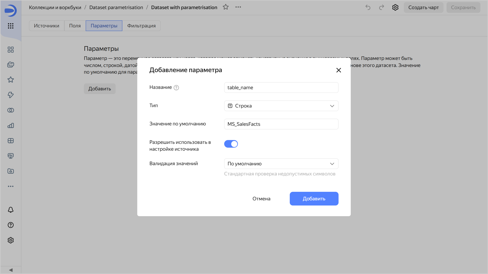

      При нажатии на кнопку **Добавить** отобразится ошибка, что датасет не прошел валидацию. По умолчанию в значении параметра, разрешенного для использования в источнике, не допускается присутствие символа нижнего подчеркивания `_`.

      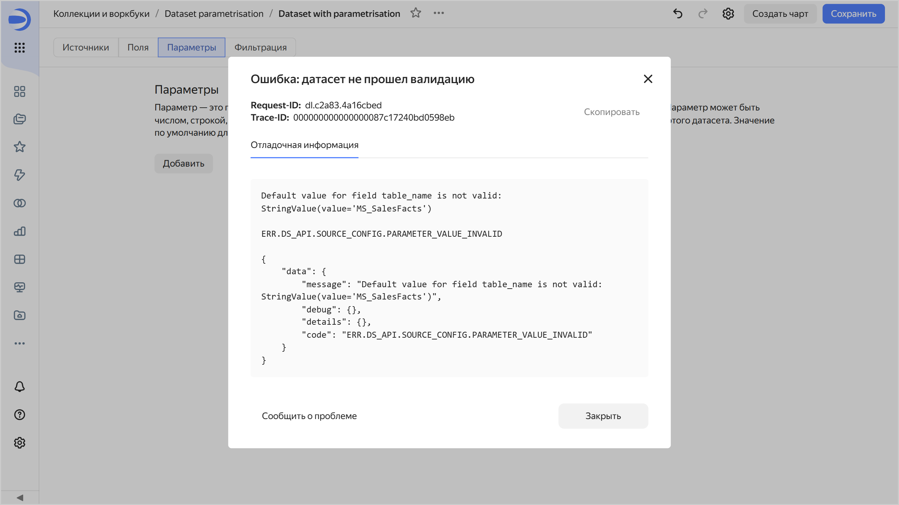

1. Измените валидацию датасета так, чтобы она проходила успешно для значения `MS_SalesFacts` в параметре. Для этого:
   
   1. Нажмите кнопку **Добавить** и укажите **Название**, **Тип** и **Значение по умолчанию** как на предыдущем шаге.
   1. Включите опцию **Разрешить использовать в настройке источника** и для валидации значений выберите `Регулярное выражение`.
   1. В поле введите регулярное выражение Python, позволяющее использовать заглавные и строчные символы, цифры и символ нижнего подчеркивания `_`:
   
      ```python
      ^[a-zA-Z0-9_]+$
      ```

   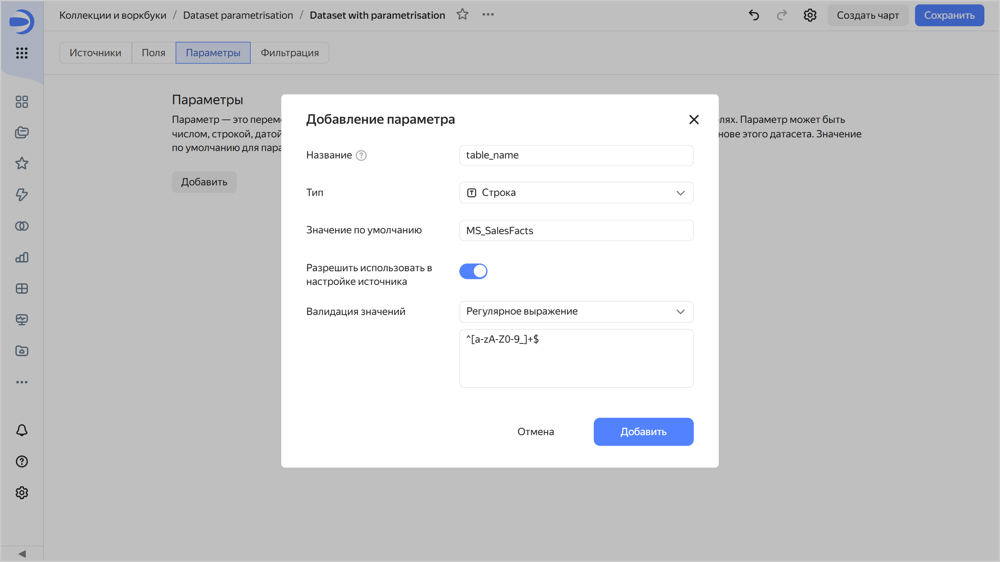

   Название таблицы `MS_SalesFacts` удовлетворяет такому регулярному выражению. При нажатии на кнопку **Добавить** валидация датасета пройдет успешно.

1. Сохраните датасет.
1. Измените определение имени таблицы по параметру:

   1. Перейдите на вкладку **Источники**.
   1. В списке таблиц напротив **MS_SalesFacts** нажмите  → **Изменить настройки**.
   1. Cправа от поля **Имя таблицы** со значением `MS_SalesFacts` нажмите  и выберите параметр `table_name`. Теперь имя таблицы будет определяться указанным параметром.
   
      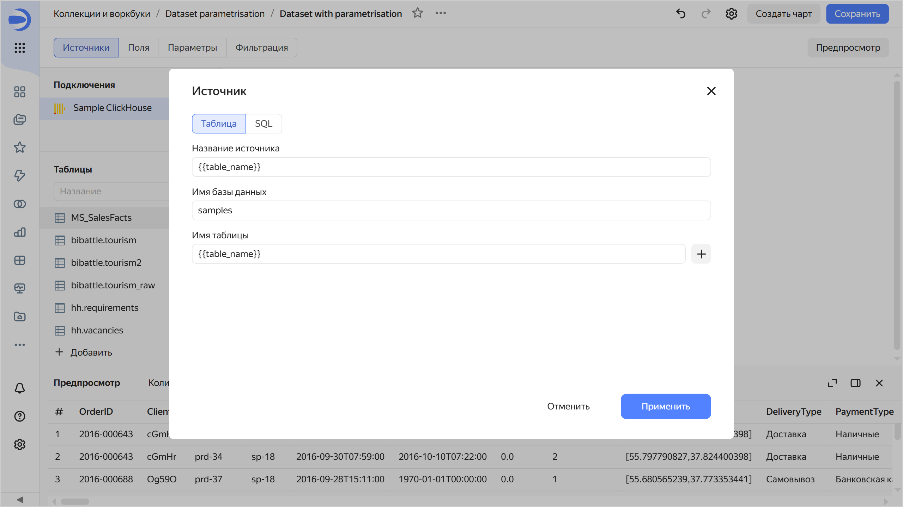

   1. Нажмите кнопку **Применить** и сохраните датасет.

## Создайте чарт с выбором таблицы в параметре {#create-chart-with-parameter}

1. Вверху датасета нажмите кнопку **Создать чарт**.
1. Выберите тип визуализации **Таблица**.
1. Создайте [вычисляемое поле](../../datalens/concepts/calculations/index.md):

   1. В левой части экрана над списком полей датасета нажмите  → **Поле**.
   1. Введите название: `Year`.
   1. Введите формулу: `YEAR([OrderDatetime])`.
   1. Нажмите кнопку **Создать**.

1. Добавьте в чарт новое поле. Для этого из раздела **Измерения** перетащите поле `Year` в секцию **Столбцы**.
1. Добавьте в чарт сумму продаж. Для этого из раздела **Измерения** перетащите поле `Sales` в секцию **Столбцы** и измените агрегацию для него:

   1. В секции **Столбцы** нажмите значок `#` у поля `Sales`.
   1. В поле **Агрегация** выберите **Сумма**, затем нажмите **Применить**.

   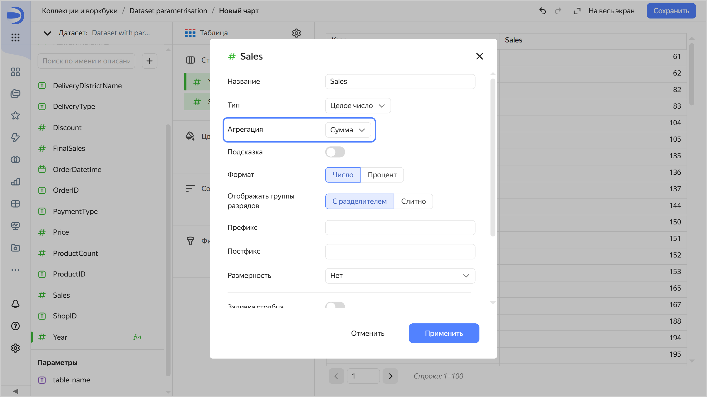

1. Откройте инспектор и убедитесь, что данные выбираются из таблицы `MS_SalesFacts`. Для этого в правом верхнем углу чарта нажмите  → **Инспектор**.

   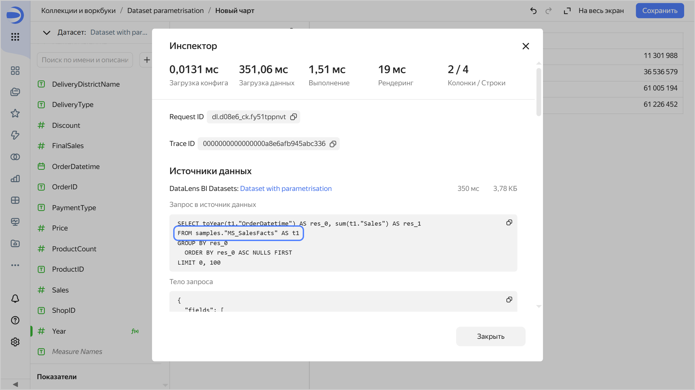

1. Сохраните чарт:

   1. В правом верхнем углу нажмите кнопку **Сохранить**.
   1. В открывшемся окне введите название чарта `Table with parametrisation` и нажмите кнопку **Сохранить**.

   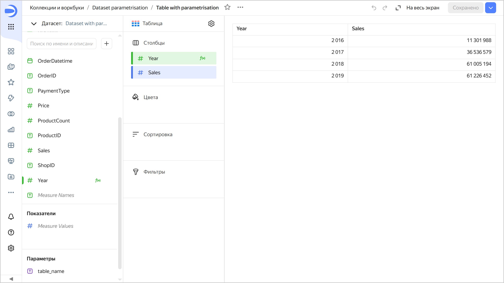

1. Измените имя таблицы в параметре чарта:

   1. В разделе **Параметры** нажмите значок у параметра `table_name`.
   1. Значение по умолчанию укажите `MS_SalesFacts_up`.

      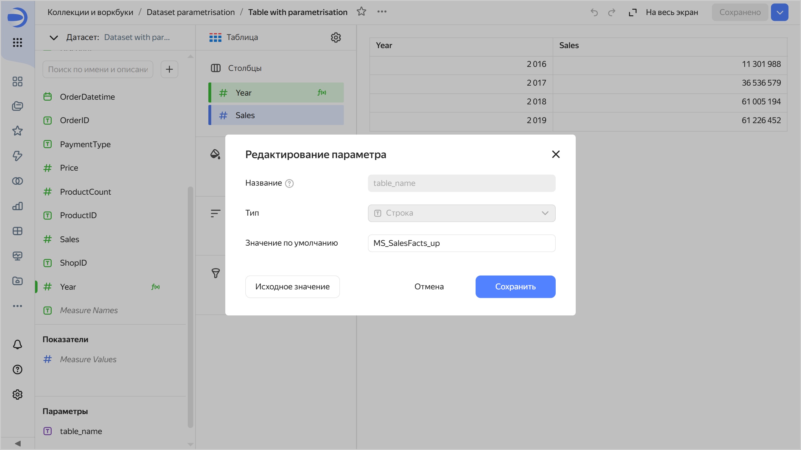

   1. Нажмите кнопку **Сохранить**. Теперь данные для чарта выбираются из таблицы `MS_SalesFacts_up`.

      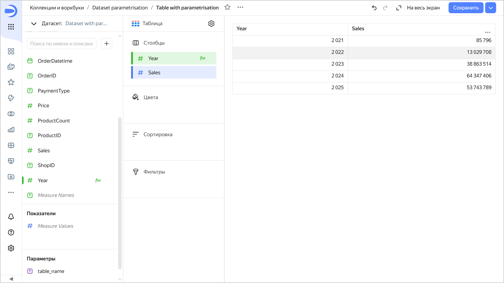

## Создайте датасет с параметром для подзапроса {#create-dataset-sql-parameter}

Создайте еще один датасет на базе подключения `Sample ClickHouse`:

1. Перейдите к подключению `Sample ClickHouse` и в правом верхнем углу нажмите кнопку **Создать датасет**.
1. Добавьте SQL-запрос к источнику:

   1. Внизу слева под списком таблиц нажмите  → **Добавить**.
   1. Перейдите на вкладку **SQL** и в поле **Подзапрос** введите текст запроса:
      
      ```sql
      SELECT * FROM samples.MS_SalesFacts
      ```

   1. Нажмите кнопку **Применить**.

1. Включите параметризацию в настройках датасета. Для этого вверху нажмите  → **Включить параметризацию**.
1. Сохраните датасет:

   1. В правом верхнем углу нажмите кнопку **Сохранить**.
   1. Введите название датасета — `Dataset with parametrisation for sql` и нажмите кнопку **Создать**.

1. Добавьте параметр с условием для подзапроса:

   1. Перейдите на вкладку **Параметры**.
   1. Нажмите кнопку **Добавить** и укажите:
      
      * **Название** — `custom_where`;
      * **Тип** — `Строка`;
      * **Значение по умолчанию** — `1=1`. Такое условие всегда будет возвращать значение `True`;
      * Включите опцию **Разрешить использовать в настройке источника** и для валидации значений выберите `Регулярное выражение`. В поле введите регулярное выражение Python, позволяющее использовать символы, которые могут понадобиться при составлении SQL-запросов:

        ```python
        ^[a-zA-Z0-9а-яАА-ЯёЁ_\s\(\)\.\'\=\-\+\*/\,\<\>!]+$
        ```

      При нажатии на кнопку **Добавить** валидация датасета пройдет успешно.

1. Сохраните датасет.

1. Добавьте условие в текст SQL-запроса, используя параметр:

   1. Перейдите на вкладку **Источники**.
   1. В списке таблиц напротив **SQL** нажмите  → **Изменить настройки**.
   1. В поле **Подзапрос** к тексту запроса добавьте строку `WHERE`:
   
      ```sql
      SELECT * FROM samples.MS_SalesFacts
      WHERE
      ```

   1. Под полем ввода запроса нажмите  **Вставить параметр** и выберите параметр `custom_where`. Теперь условие в SQL-запросе будет определяться указанным параметром:

      ```sql
      SELECT * FROM samples.MS_SalesFacts
      WHERE not_var{{custom_where}}
      ```

      

1. Сохраните датасет.

## Создайте чарт с выбором условия для подзапроса в параметре {#create-chart-with-sql-parameter}

1. Вверху датасета нажмите кнопку **Создать чарт**.
1. Выберите тип визуализации **Индикатор**.
1. Из раздела **Измерения** перетащите поле `Sales` в секцию **Показатель**. К полю автоматически применится агрегация, оно станет показателем.

   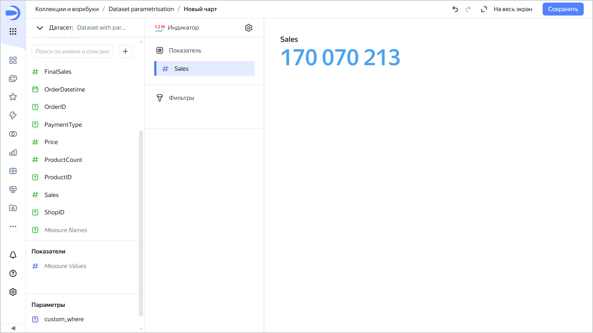

1. Откройте инспектор и убедитесь, что в тексте SQL-запроса используется значение параметра из датасета `1=1`.

   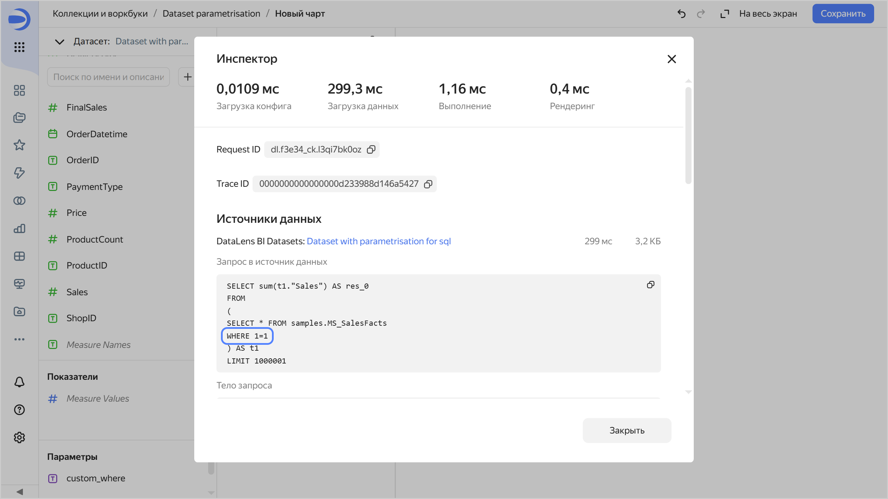

1. Измените условие SQL-запроса в параметре:

   1. В разделе **Параметры** нажмите значок у параметра `table_name`.
   1. Значение по умолчанию укажите: `ProductID IN (SELECT ProductID FROM samples.MS_Products WHERE ProductCategory='Техника для дома')`.
   1. Нажмите кнопку **Сохранить**. Данные в чарте отфильтрованы по условию: только продукты категории `Техника для дома`.
      
      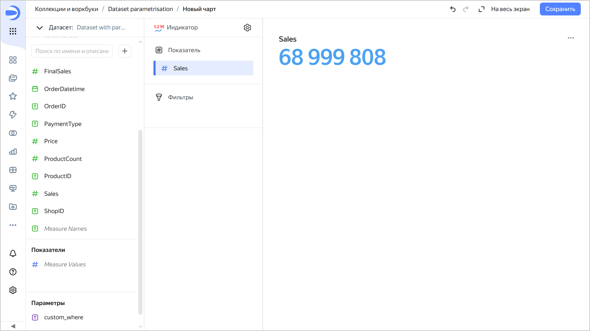

   1. Откройте инспектор и убедитесь, что в условии SQL-запроса теперь используется новое значение параметра.

      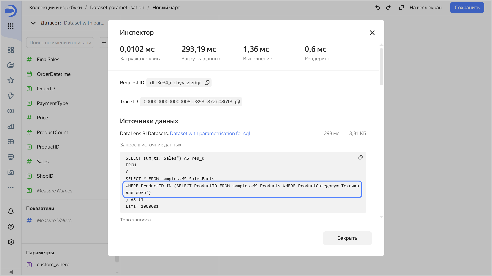

1. Сохраните чарт:

   1. В правом верхнем углу нажмите кнопку **Сохранить**.
   1. В открывшемся окне введите название чарта `Chart with parametrisation sql` и нажмите кнопку **Сохранить**.