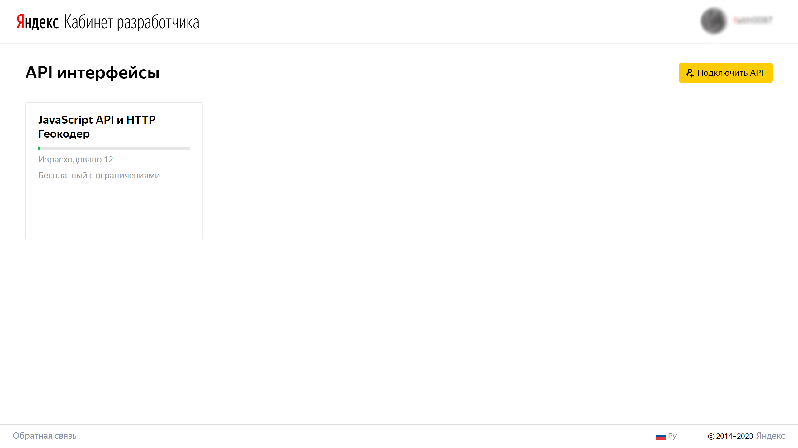
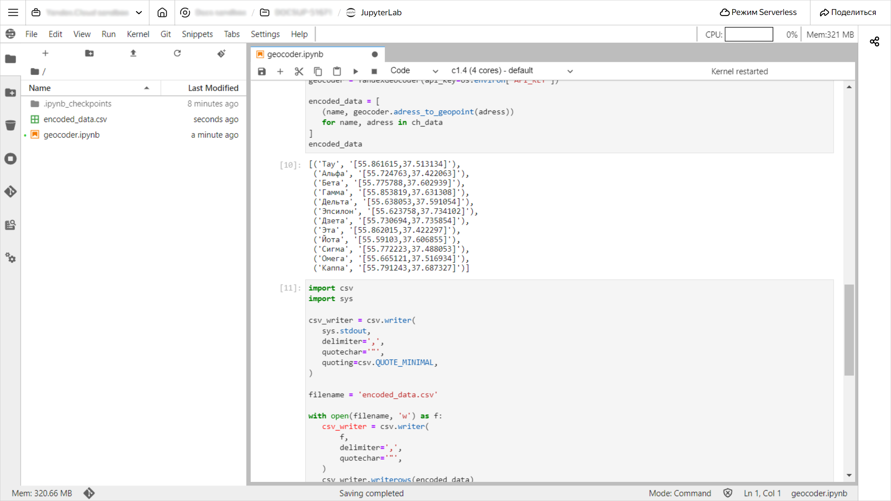
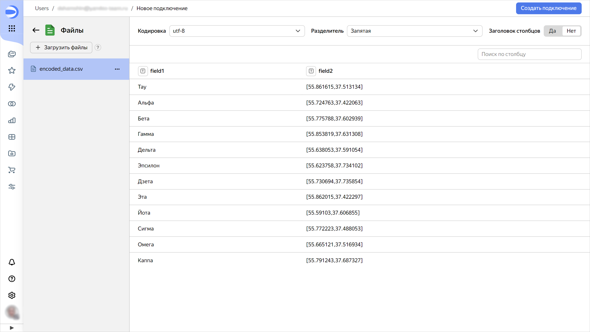
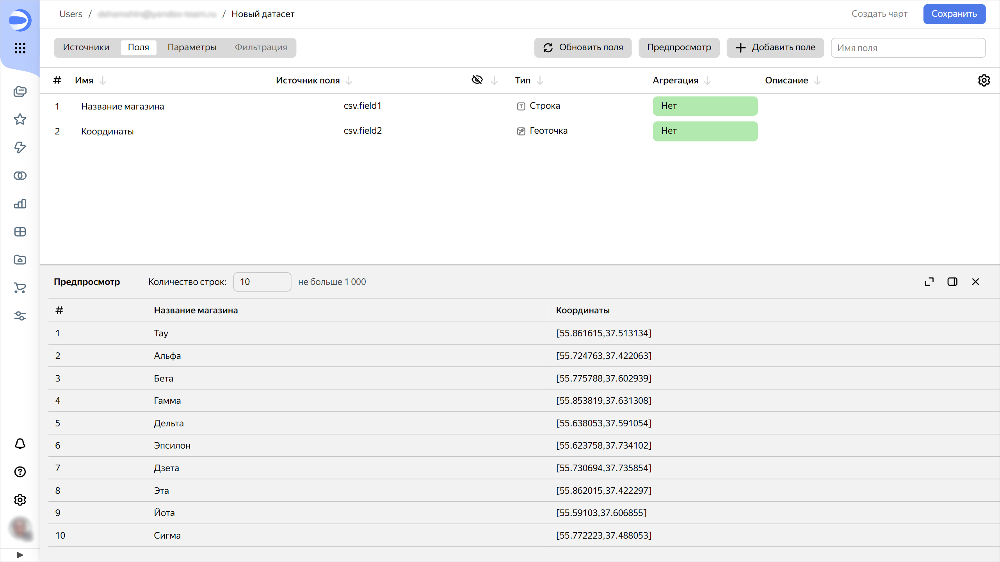
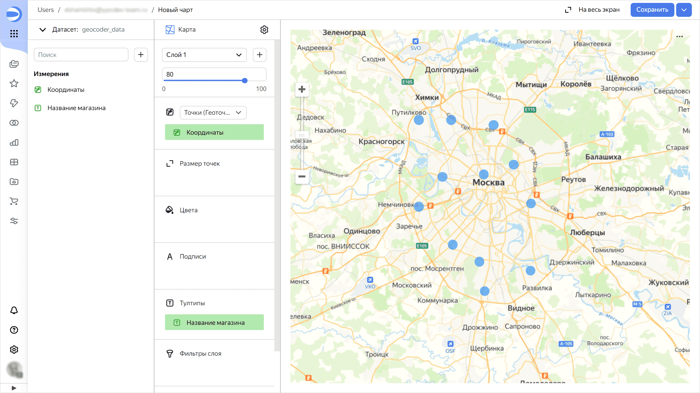

# Геокодинг с помощью API Яндекс Карт для визуализации в {{ datalens-short-name }}


В этом практическом руководстве вы научитесь преобразовывать адреса в геокоординаты с помощью API [Геокодера](https://yandex.ru/maps-api/products/geocoder-api) и визуализируете данные в {{ datalens-short-name }}. Обработка данных выполняется с помощью скриптов на языке Python, описанных в Jupyter ноутбуках в [{{ ml-platform-full-name }}](../../datasphere/).

В качестве источника данных будут использованы данные из [демонстрационной БД {{ CH }}](../../datalens/quickstart.md#create-connection).

1. [Подготовьте облако к работе](#before-you-begin).
1. [Получите ключ API Геокодера](#get-key).
1. [Преобразуйте данные в {{ ml-platform-short-name }}](#datasphere).
1. [Создайте подключение к файлу в {{ datalens-short-name }}](#create-connection).
1. [Создайте датасет на базе подключения](#create-dataset).
1. [Создайте чарт](#create-chart).

Если созданные ресурсы вам больше не нужны, [удалите их](#clear-out).

## Перед началом работы {#before-you-begin}





Чтобы {{ datalens-full-name }} и {{ ml-platform-full-name }} могли работать внутри сети {{ yandex-cloud }}, создавайте их экземпляры в рамках одной организации.



### Необходимые платные ресурсы {#paid-resources}

В стоимость развертывания инфраструктуры входит плата за использование [вычислительных ресурсов {{ ml-platform-name }}](../../datasphere/pricing.md).

## Получите ключ API Геокодера {#get-key}

Получите ключ для использования API Геокодера:

1. Перейдите в [Кабинет разработчика](https://developer.tech.yandex.ru) и нажмите кнопку **Подключить API**.

   

1. В открывшемся окне выберите **JavaScript API и HTTP Геокодер** и нажмите **Продолжить**.
1. Заполните форму и нажмите **Продолжить**.
1. В открывшемся окне нажмите **Перейти к API**.
1. В блоке **Ключи API** скопируйте значение ключа.

   

## Преобразуйте данные в {{ ml-platform-short-name }} {#datasphere}

### Создайте проект {#create-project}



### Создайте секрет {#create-secret}

Создайте [секрет](../../datasphere/concepts/secrets.md) для хранения [ключа API Геокодера](#get-key):

1. В блоке **{{ ui-key.yc-ui-datasphere.project-page.project-resources }}** на странице проекта нажмите **{{ ui-key.yc-ui-datasphere.resources.secret }}**.
1. Нажмите кнопку **{{ ui-key.yc-ui-datasphere.common.create }}**.
1. В поле **{{ ui-key.yc-ui-datasphere.secret.name }}** задайте имя секрета — `API_KEY`.
1. В поле **{{ ui-key.yc-ui-datasphere.secret.content }}** введите значение ключа.
1. Нажмите кнопку **{{ ui-key.yc-ui-datasphere.common.create }}**. Откроется страница с информацией о созданном секрете.

### Создайте ноутбук {#create-notebook}

1. 
1. Нажмите кнопку **{{ ui-key.yc-ui-datasphere.project-page.project-card.go-to-jupyter }}** и дождитесь окончания загрузки.
1. На верхней панели в окне проекта нажмите **File** и выберите **New** → **Notebook**.
1. Выберите ядро **{{ ml-platform-name }} Kernel** и нажмите **Select**.

   

### Установите зависимости {#dependencies}

1. Вставьте в ячейку ноутбука указанный ниже код и нажмите значок :

   ```py
   %pip install requests
   %pip install clickhouse-driver
   ```

1. Перезагрузите ядро: на верхней панели в окне проекта нажмите **Kernel** → **Restart Kernel**.

### Установите сертификаты {#certificates}

Установите сертификаты в локальное хранилище проекта:

```bash
#!:bash
mkdir --parents /home/jupyter/datasphere/project/Yandex/

wget "{{ crt-web-path-root }}" \
     --output-document /home/jupyter/datasphere/project/Yandex/RootCA.crt

wget "{{ crt-web-path-int }}" \
     --output-document /home/jupyter/datasphere/project/Yandex/IntermediateCA.crt
```

### Загрузите и преобразуйте данные {#load-and-transform}

1. Создайте класс для работы с Геокодером:

   ```py
   import requests
   from dataclasses import dataclass

   @dataclass
   class YandexGeocoder:
       api_key: str
       geocoder_url: str = 'https://geocode-maps.yandex.ru/1.x'

       def adress_to_geopoint(self, address: str) -> str:

           # Преобразование адреса в геокоординаты в формате DataLens

           response = requests.get(self.geocoder_url, params={
               'apikey': self.api_key,
               'geocode': address,
               'format': 'json',
           })
           response.raise_for_status()

           result = response.json()['response']['GeoObjectCollection']['featureMember']
           if not result:
               return None

           lat, lon = result[0]['GeoObject']['Point']['pos'].split(' ')
           return self._to_datalens_format(lon, lat)
       
       def _to_datalens_format(self, lon, lat):
           return f'[{lon},{lat}]'
    ```

1. Подключитесь к демонстрационной БД {{ CH }}:

   ```py
   from clickhouse_driver import Client

   ch_client = Client(
       host='rc1a-ckg8nrosr2lim5iz.mdb.yandexcloud.net',
       user='samples_ro',
       password='MsgfcjEhJk',
       database='samples',
       port=9440,
       secure=True,
       verify=True,
       ca_certs='/home/jupyter/datasphere/project/Yandex/RootCA.crt'
   )
   ```

1. Выполните проверку с помощью команды:

   ```py
   print(ch_client.execute('SELECT version()'))
   ```

   Если подключение установлено успешно, в терминале отобразится номер версии {{ CH }}.

1. Выгрузите данные из таблицы с адресами магазинов в переменную `ch_data`:

   ```py
   ch_data = ch_client.execute('SELECT ShopName, ShopAddress FROM MS_Shops')
   ch_data
   ```

1. Преобразуйте адреса магазинов из колонки `ShopAddress` в геокоординаты:

   ```py
   import os

   geocoder = YandexGeocoder(api_key=os.environ['API_KEY'])

   encoded_data = [
       (name, geocoder.adress_to_geopoint(adress))
       for name, adress in ch_data
   ]
   encoded_data
   ```

1. Сохраните полученные данные в файл:

   ```py
   import csv
   import sys

   csv_writer = csv.writer(
       sys.stdout,
       delimiter=',',
       quotechar='"',
       quoting=csv.QUOTE_MINIMAL,
   )

   filename = 'encoded_data.csv'

   with open(filename, 'w') as f:
       csv_writer = csv.writer(
           f,
           delimiter=',',
           quotechar='"',
       )
       csv_writer.writerows(encoded_data)  
   ```

   На панели слева появится файл `encoded_data.csv`.

   

1. Скачайте полученный файл — нажмите правой кнопкой мыши и выберите `Download`.

## Создайте подключение к файлу в {{ datalens-short-name }} {#create-connection}

1. Перейдите на [главную страницу ]({{ link-datalens-main }}) {{ datalens-short-name }}.
1. На панели слева выберите  **Подключения** и нажмите кнопку **Создать подключение**.
1. В разделе **Файлы и сервисы** выберите подключение **Файлы**.
1. Нажмите кнопку **Загрузить файлы** и укажите файл `encoded_data.csv`.

   

1. В правом верхнем углу нажмите кнопку **Создать подключение**.
1. Введите название подключения `geocoder_csv` и нажмите кнопку **Создать**.

## Создайте датасет на базе подключения {#create-dataset}

1. В правом верхнем углу нажмите кнопку **Создать датасет**.
1. Перейдите на вкладку **Поля**.
1. Переименуйте поля:

   * `field1` в `Название магазина`;
   * `field2` в `Координаты`.

1. Для поля `Координаты` измените тип данных на **Геоточка**.

   

1. В правом верхнем углу нажмите кнопку **Сохранить**.
1. Введите название датасета `geocoder_data` и нажмите кнопку **Создать**.

## Создайте чарт {#create-chart}

1. В правом верхнем углу нажмите кнопку **Создать чарт**.
1. Выберите тип визуализации **Карта**.
1. Перетащите поле `Координаты` в секцию **Точки (Геоточки)**.
1. Перетащите поле `Название магазина` в секцию **Тултипы**.

   

1. В правом верхнем углу нажмите кнопку **Сохранить**.
1. Введите название чарта и нажмите кнопку **Сохранить**.

## Как удалить созданные ресурсы {#clear-out}

Если вы больше не планируете работать с проектом в {{ ml-platform-short-name }}, [удалите его](../../datasphere/operations/projects/delete.md#delete-project).
