# Визуализация данных с помощью QL-чарта


В этом сценарии вы создадите чарты на основе SQL-запросов. SQL-запросы позволяют гибче настраивать данные для визуализации, чем стандартный способ — через датасет. Например, в SQL-запрос вы можете добавить параметры с дашбордов.

Рекомендуем использовать QL-чарт в случае, если создание обычного чарта с помощью датасета вам не подходит или вы хотите поэкспериментировать с данными.

В качестве источника данных будет использоваться прямое подключения к демонстрационной БД. 


Для визуализации и исследования данных [подготовьте {{ datalens-short-name }} к работе](#before-you-begin), затем выполните следующие шаги:


1. [Создайте подключение](#create-connection).
1. [Создайте QL-чарт](#create-sql-chart).
1. [Создайте дашборд](#create-dashboard).
1. [Добавьте QL-чарт на дашборд](#add-sql-chart-to-dashboard).
1. [Добавьте селекторы на дашборд](#add-selectors-to-dashboard).



SQL-запросы работают только с базами данных. File, GoogleSheets, Яндекс Метрика и другие сервисные подключения не поддерживают SQL-запросы.




## Перед началом работы {#before-you-begin}




## Создайте подключение {#create-connection}



## Создайте QL-чарт {#create-sql-chart}

1. Перейдите к уже созданному подключению БД.
1. Убедитесь, что в подключении активирована настройка **Уровень доступа SQL-запросов** → **Разрешить подзапросы в датасетах и запросы из чартов**.
1. В правом верхнем углу нажмите **Создать QL-чарт**.
1. На вкладке **Запрос** введите текст запроса:

   ```sql
   SELECT 
      toDate(t1.OrderDatetime) as "Дата",
      COUNT(t1.ClientID) as "Число новых клиентов", t3.ClientStatus as "Статус"
   FROM
      samples.MS_SalesFacts t1,
      (SELECT 
	      ClientID, 
         MIN(OrderDatetime) as FirstDate
      FROM samples.MS_SalesFacts
      GROUP BY ClientID) as t2,
         samples.MS_Clients t3
   WHERE not_var{{interval_from}} < "Дата" and "Дата" < not_var{{interval_to}} and t1.ClientID=t2.ClientID and t3.ClientID=t2.ClientID and t3.ClientStatus in not_var{{status}} -- status, interval_from и interval_to - переменные, связанные с параметрами, на которые влияют селекторы
   GROUP BY "Статус", "Дата"
   ORDER BY "Дата"
   ```

1. На вкладке **Параметры** нажмите **Добавить параметр** и заполните поля ввода:

   * Из выпадающего списка выберите `string` (по умолчанию).
   * В поле **Имя** введите `status`.
   * В поле **Значение по умолчанию** введите `Золотой`.
   * Ниже нажмите **Добавить значение** и введите `Серебряный`.
   * Ниже нажмите **Добавить значение** и введите `Базовый`.

     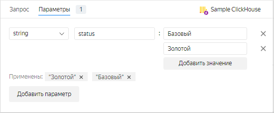

   Добавленный параметр будет связан с переменной `not_var{{status}}` в запросе.

1. Нажмите **Добавить параметр** и заполните поля ввода:

   * Из выпадающего списка выберите `date-interval`.
   * В поле **Имя** введите `interval`.
   * Нажмите на поле со значением периода и укажите:

     * **От:** `2017-03-01`;
     * **До:** `2017-03-31`.

       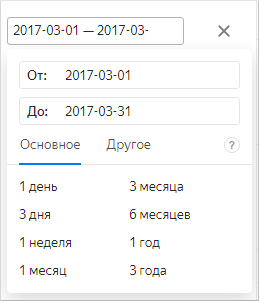

     Значения **От:** и **До:** добавленного параметра будут связаны соответственно с переменными `not_var{{interval_from}}` и `not_var{{interval_to}}` в SQL-запросе.

     
   
     Значениями параметров можно управлять при помощи селекторов на дашборде.

     

1. Вернитесь на вкладку **Запрос**. В левом нижнем углу нажмите кнопку **Запустить**. После выполнения запроса появится визуализация в правом окне.
1. Настройте визуализацию:

   * Выберите тип диаграммы **Столбчатая диаграмма**.

      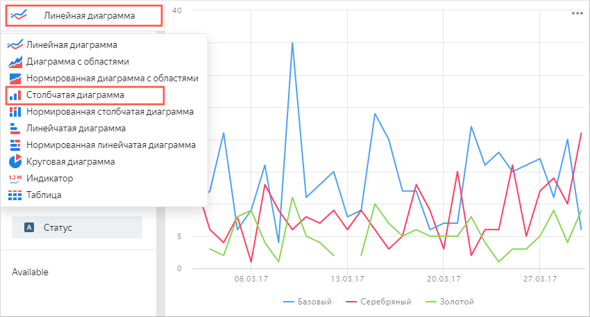

   * Убедитесь, что поле **Дата** расположено в секции **X**.
   * Убедитесь, что поле **Число новых клиентов** расположено в секции **Y**.
   * Убедитесь, что поле **Статус** расположено в секции **Colors**.
   * Проверьте, чтобы секция **Available** была пустая. В эту секцию попадают поля, не участвующие в расчетах. В противном случае визуализация будет отображаться некорректно.

      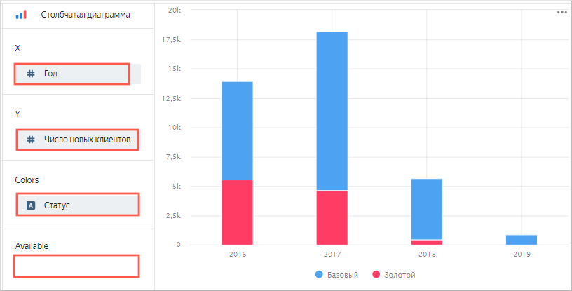

1. В правом верхнем углу нажмите **Сохранить**.
1. Введите название чарта: `Новые клиенты` и нажмите **Сохранить**.

Можете разместить созданный чарт на дашборде. Также на дашборд можно добавить селекторы для управления значениями параметров `status` и `interval` QL-чарта.

## Создайте дашборд {#create-dashboard}

Создайте [дашборд](../../datalens/concepts/dashboard.md), на который будут добавлены чарты.

1. Перейдите на [главную страницу]({{ link-datalens-main }}) {{ datalens-short-name }}.

1. Нажмите кнопку **Создать дашборд**.

    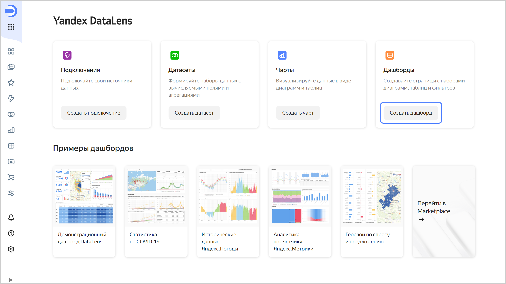

## Добавьте QL-чарт на дашборд {#add-sql-chart-to-dashboard}

1. В верхней части страницы нажмите кнопку **Добавить** и выберите **Чарт**.
   
   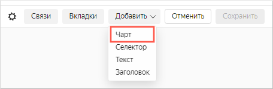

1. В поле **Чарт** нажмите **Выбрать** и выберите из списка чартов созданный ранее чарт **Новые клиенты**.
   
   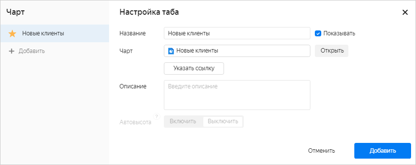

   Нажмите кнопку **Добавить**.

1. Чарт появился на дашборде. Растяните его для улучшения визуализации.

   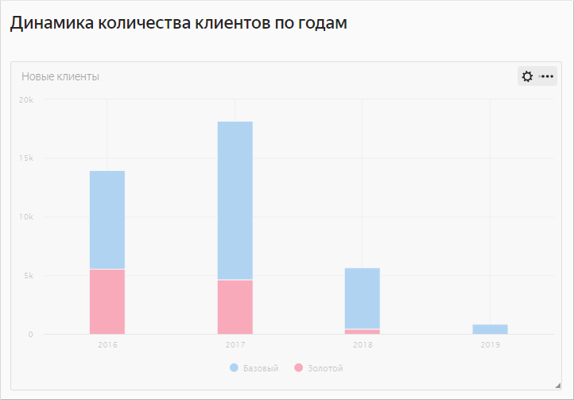

## Добавьте селекторы на дашборд {#add-selectors-to-dashboard}

1. Добавьте [селектор](../../datalens/dashboard/selector.md), чтобы иметь возможность фильтровать чарт по статусам клиентов:

   1. В верхней части страницы нажмите кнопку **Добавить**.
   1. Выберите **Селектор**.

      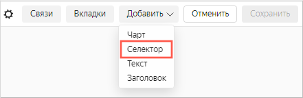

   1. Выберите тип источника **Ручной ввод**.
   1. В **Имя поля** введите `status`. В эту переменную SQL-запроса будут передаваться выбранные значения из селектора.
   1. Выберите тип селектора **Список**.
   1. Включите опцию **Множественный выбор**. 
   1. Рядом с параметром **Значение по умолчанию** нажмите на поле ввода. В открывшемся окне добавьте значения:

      * Золотой
      * Серебряный
      * Базовый

      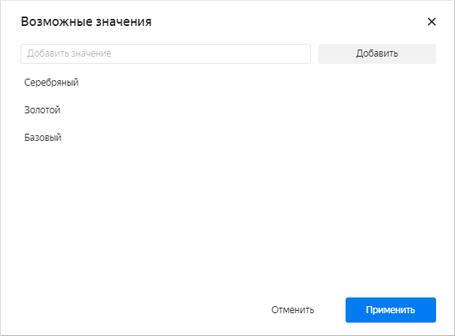

      Нажмите кнопку **Применить**.

   1. В списке **Значение по умолчанию** укажите **Выбрать все**.

      
   1. Включите опцию **Название** и введите `Выберите статус клиента`.

   1. Проверьте указанные параметры селектора.

      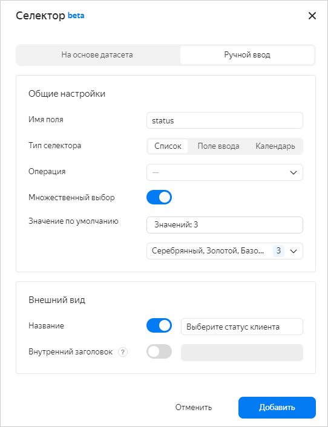

   1. Нажмите кнопку **Добавить**. 
   1. Расположите селектор на дашборде над чартом.

1. Добавьте еще один селектор, чтобы иметь возможность фильтровать чарт по диапазону дат:

   1. В верхней части страницы нажмите кнопку **Добавить**.
   1. Выберите **Селектор**.
   1. Выберите тип источника **Ручной ввод**.
   1. В **Имя поля** введите `interval`. В переменные `not_var{{interval_from}}` и `not_var{{interval_to}}` SQL-запроса будут передаваться значения начала и конца диапазона из селектора.
   1. Выберите тип селектора **Календарь**.
   1. Включите опцию **Диапазон**.
   1. Включите опцию **Название** и введите `Период заказов`.
   1. Проверьте указанные параметры селектора.

      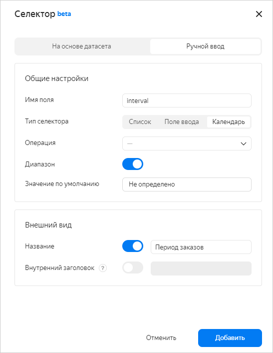

   1. Нажмите кнопку **Добавить**.
   1. Расположите селектор на дашборде над чартом рядом с первым селектором.
   1. В правом верхнем углу дашборда нажмите кнопку **Сохранить**.
   1. Введите название дашборда `Динамика количества клиентов по годам` и нажмите кнопку **Создать**.

      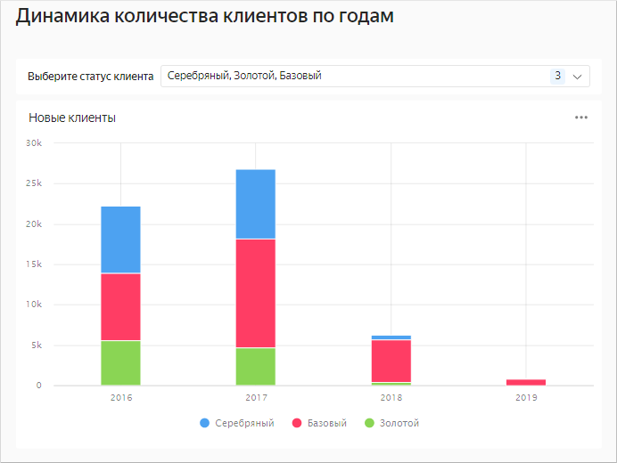

1. Дашборд готов. Теперь можно фильтровать чарт по статусу с использованием селектора.
   
   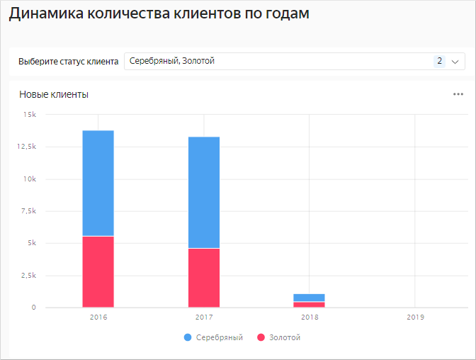

   Также можно фильтровать чарт по диапазону дат с использованием второго селектора.

   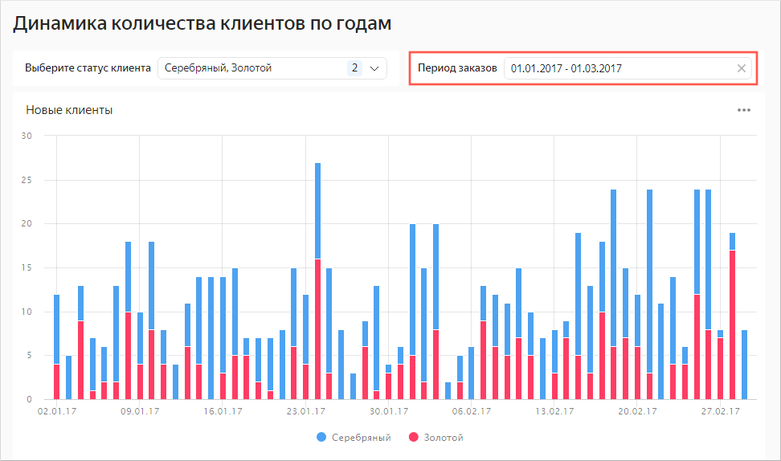

#### См. также {#see-also}

- [{#T}](../../datalens/operations/dashboard/add-chart.md)
- [{#T}](../../datalens/operations/dashboard/add-selector.md)
- [{#T}](../../datalens/operations/chart/create-sql-chart.md)
- [QL-чарты](../../datalens/concepts/chart/index.md#sql-charts)
