# Дашборд сети магазинов из БД {{ CH }}



В этом руководстве вы подготовите дашборд для анализа продаж в сети московских магазинов. На дашборде можно будет посмотреть:

* Динамику продаж по дням и месяцам.
* Продажи по продуктовым категориям.
* Тепловую карту заказов.

В качестве источника будет использована демонстрационная база данных {{ CH }} с информацией о продажах товаров в сети московских магазинов.

Для визуализации и исследования данных [подготовьте {{ datalens-short-name }} к работе](#before-you-begin), затем выполните следующие шаги:

1. [Создайте воркбук](#create-workbook).
1. [Создайте подключение](#create-connection).
1. [Создайте датасет](#create-dataset).
1. [Создайте чарт — линейная диаграмма](#create-line-chart).
1. [Создайте чарт — столбчатая диаграмма](#create-column-chart).
1. [Создайте чарт — сводная таблица](#create-pivot-chart).
1. [Создайте чарт — тепловая карта](#create-heat-map-chart).
1. [Создайте дашборд и добавьте на него чарты](#create-dashboard).
1. [Добавьте селекторы на дашборд](#add-selectors).

## Перед началом работы {#before-you-begin}



## Создайте воркбук {#create-workbook}

1. Перейдите на [главную страницу]({{ link-datalens-main }}) {{ datalens-short-name }}.
1. На панели слева выберите  **Коллекции и воркбуки**.
1. В правом верхнем углу нажмите **Создать** → **Создать воркбук**.
1. Введите название [воркбука](../../datalens/workbooks-collections/index.md) — `Практические руководства`.
1. Нажмите кнопку **Создать**.

## Создайте подключение {#create-connection}

Для доступа к базе данных будет создано подключение **Sample ClickHouse**.



## Создайте датасет {#create-dataset}

Создайте [датасет](../../datalens/dataset/index.md) на базе подключения `Sample ClickHouse`:

1. На странице подключения в правом верхнем углу нажмите кнопку **Создать датасет**.
1. Перенесите на рабочую область таблицу `MS_SalesFacts`.

   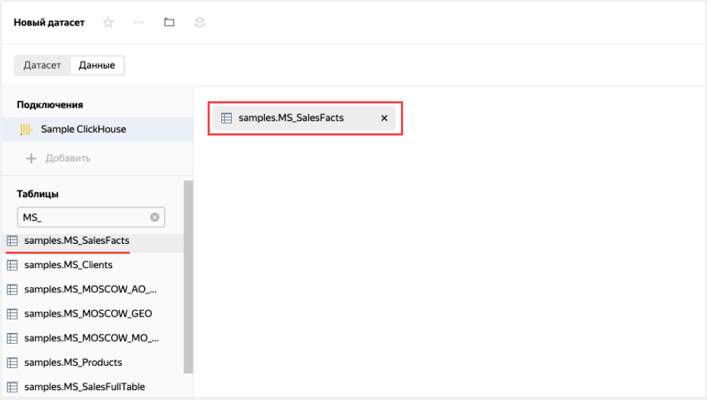

1. Перенесите на рабочую область таблицу `MS_Clients`. Таблицы автоматически свяжутся.

   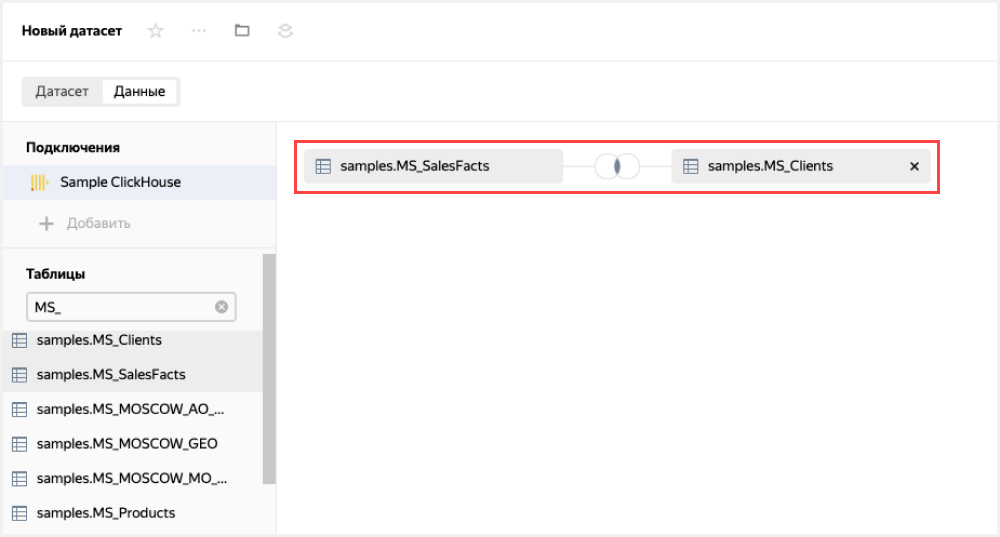

1. Для проверки связи нажмите значок связи между таблицами.

   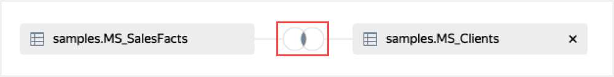

1. Таблицы связаны по полю `ClientID`. При необходимости связь можно изменить или дополнить, указав еще одну пару полей. Для закрытия окна связей нажмите значок  или за пределы окна.

   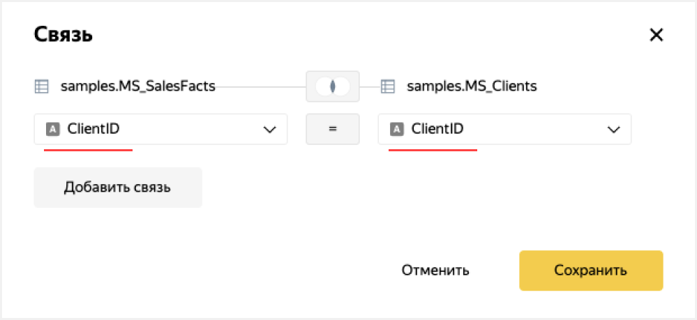

1. Перенесите на рабочую область таблицу `MS_Products`. Таблица автоматически свяжется с левой (корневой) таблицей `MS_SalesFacts`.

   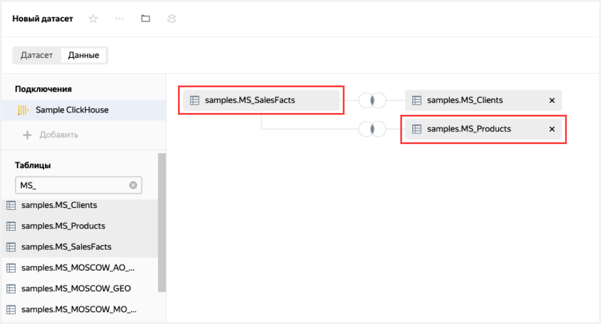

1. Перенесите на рабочую область таблицу `MS_Shops`. Таблица автоматически свяжется с левой (корневой) таблицей `MS_SalesFacts`.

   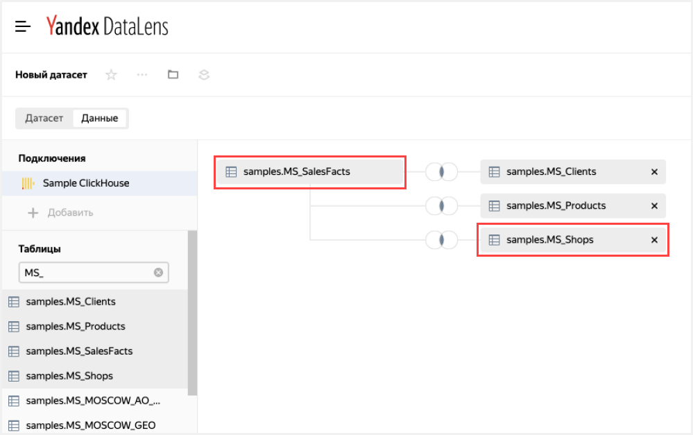

1. Перейдите на вкладку **Поля**.
1. Удалите дубликаты полей, получившиеся в результате соединения таблиц: `ClientID (1)`, `ProductID (1)` и `ShopID (1)`. Для этого сначала отметьте их, а затем на панели под списком полей нажмите  **Удалить**.

   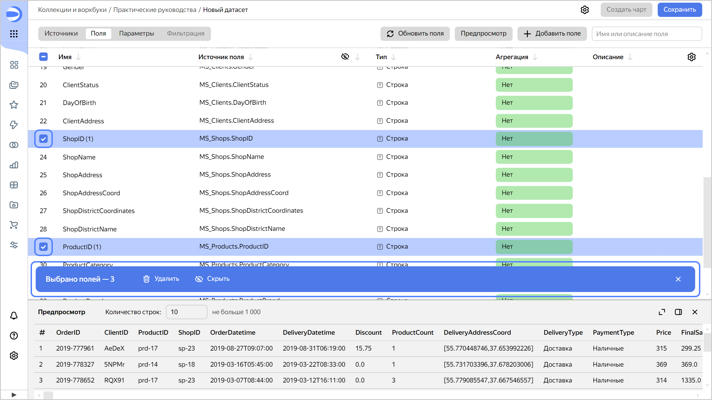

1. Создайте поле с датой заказа `OrderDate`:

   1. Продублируйте поле `OrderDatetime` — в правой части строки с полем нажмите  и выберите **Дублировать**.
   1. Переименуйте дубликат поля `OrderDatetime (1)` в `OrderDate`: нажмите на имя поля, удалите текущее имя и введите новое.
   1. В столбце **Тип** измените тип данных с **Дата и время** на **Дата**.

   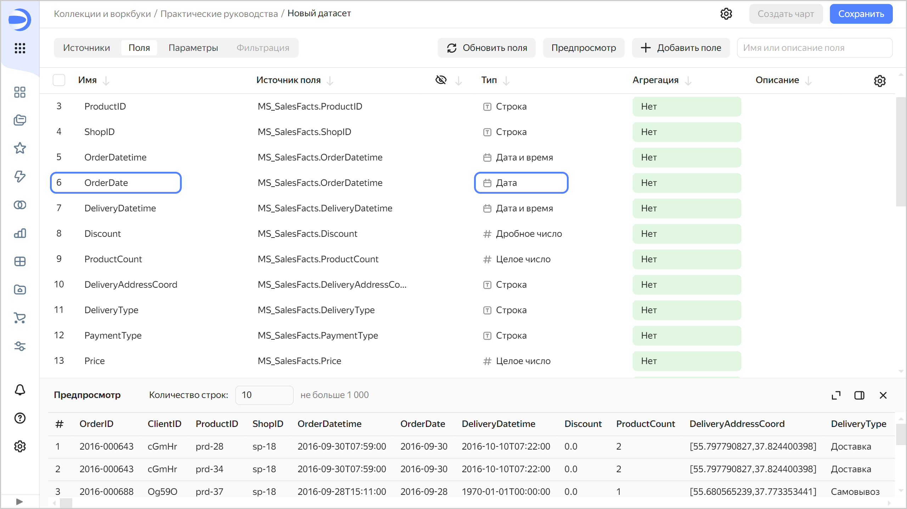

1. Измените тип данных для полей:

   * `ShopDistrictCoordinates` — на **Геополигон**;
   * `DeliveryDistrictCoordinates` — на **Геополигон**;
   * `DeliveryAddressCoord` — на **Геоточка**.

1. Создайте показатель с суммой заказа: в столбце **Агрегация** для поля `Price` выберите **Сумма**. Поле с агрегацией поменяет цвет на синий: оно стало показателем.

   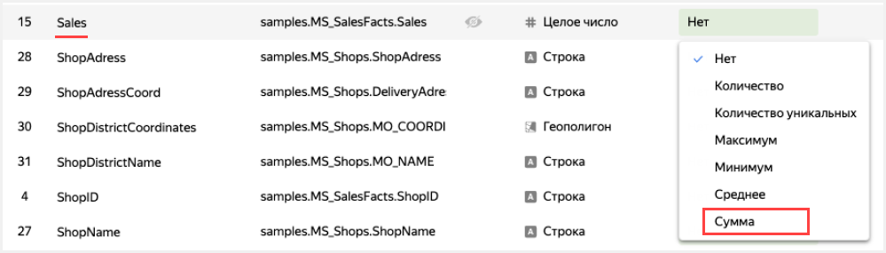

1. Создайте показатель с количеством заказов:

   1. Продублируйте поле `OrderID`.
   1. Переименуйте дубликат поля `OrderID (1)` в `OrderCount`.
   1. Измените тип агрегации на **Количество уникальных**.

1. Создайте вычисляемое поле для расчета средней суммы продаж на один заказ:

   1. В правом верхнем углу нажмите кнопку **Добавить поле**.
   1. Слева вверху укажите название поля — `Sales per Order`.
   1. Слева в колонке нажмите на поле `Price`.
   1. Введите символ `/`.
   1. Слева в колонке нажмите на поле `OrderCount`.
   1. Нажмите кнопку **Создать**.

   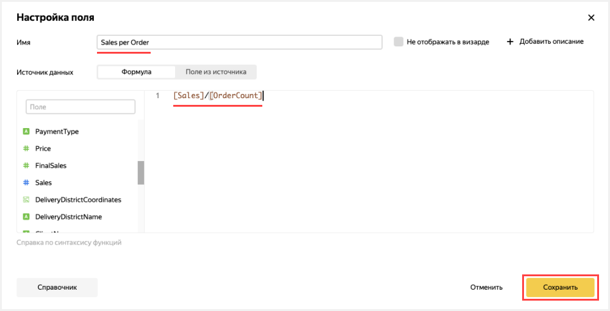

1. Сохраните датасет:

   1. В правом верхнем углу нажмите кнопку **Сохранить**.
   1. Введите название датасета — `Moscow Sales dataset` и нажмите кнопку **Создать**.

## Создайте чарт — линейная диаграмма {#create-line-chart}

Для визуализации динамики продаж по месяцам создайте [чарт](../../datalens/concepts/chart/index.md) — [линейную диаграмму](../../datalens/visualization-ref/line-chart.md):

1. На странице датасета в правом верхнем углу нажмите кнопку **Создать чарт**.
1. Выберите тип визуализации **Линейная диаграмма**.

   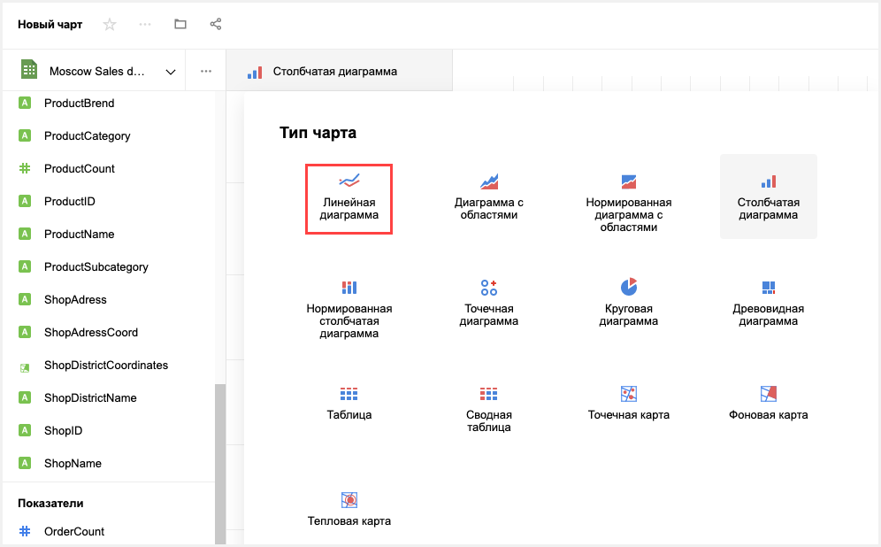

1. Добавьте в чарт дату продажи. Для этого из раздела **Измерения** перетащите поле `OrderDate` в секцию **X**.
1. Добавьте в чарт показатель продаж. Для этого из раздела **Показатели** перетащите поле `Price` в секцию **Y**.
1. Добавьте в чарт тип доставки. Для этого из раздела **Измерения** перетащите поле `PaymentType` в секцию **Цвета**.

   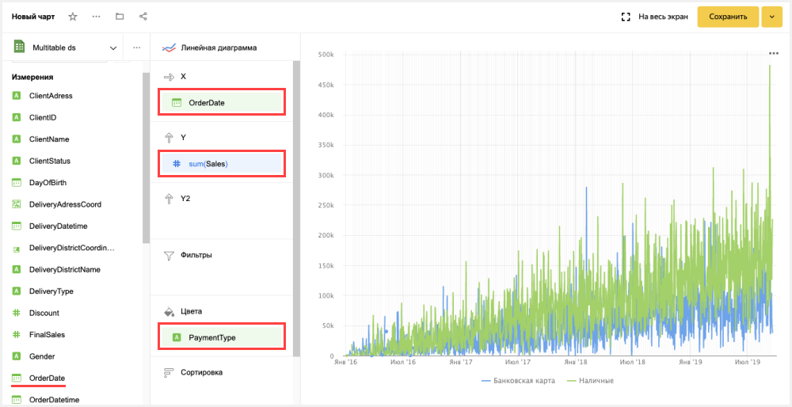

1. Отобразите чарт по месяцам:

   1. Нажмите на иконку с календарем у поля `OrderDate` в секции **X**.
   1. В поле **Группировка** выберите **Округление** ⟶ **Месяц**, затем нажмите **Применить**.

   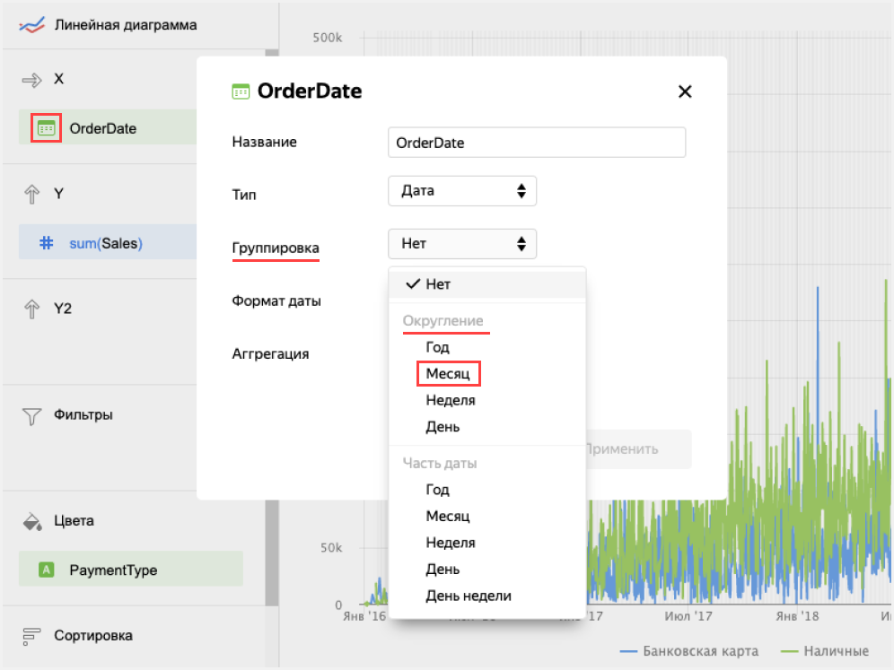

1. Сохраните чарт:

   1. В правом верхнем углу нажмите кнопку **Сохранить**.
   1. В открывшемся окне введите название чарта `Динамика продаж по месяцам и типам оплаты` и нажмите кнопку **Сохранить**.

   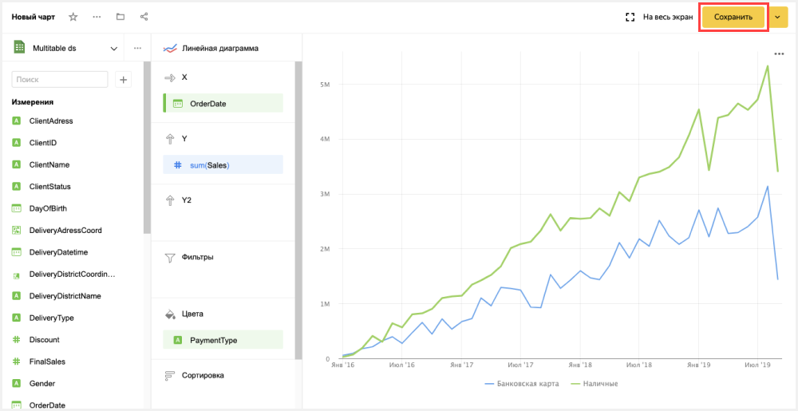

## Создайте чарт — столбчатая диаграмма {#create-column-chart}

Для визуализации продаж в разрезе брендов и продуктовых категорий создайте чарт — [столбчатую диаграмму](../../datalens/visualization-ref/column-chart.md).

1. Создайте копию чарта, созданного на предыдущем шаге:

   1. В правом верхнем углу нажмите значок  → **Сохранить как копию**.

      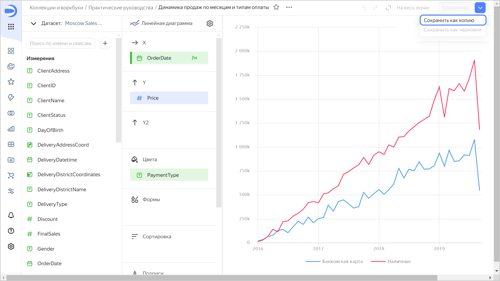

   1. В открывшемся окне введите название нового чарта `Продажи по брендам и категориям` и нажмите кнопку **Сохранить**.

1. Выберите тип визуализации **Столбчатая диаграмма**.

   

1. Поля `OrderDate`, `Price` и `PaymentType` автоматически попадут в секции **X**, **Y** и **Цвета** соответственно.
1. Замените месяцы на бренды на оси X. Для этого из раздела **Измерения** перетащите поле `ProductBrand` в секцию **X** и наведите его над полем `OrderDate`, пока то не станет красным.
1. Замените типы оплаты на категории товаров в секции **Цвета** — из раздела **Измерения** перетащите поле `ProductCategory` в секцию **Цвета** и наведите его над полем `PaymentType`, пока то не станет красным.
1. Отсортируйте чарт по убыванию показателя продаж. Для этого из раздела **Показатели** перетащите поле `Price` в секцию **Сортировка**.
1. Сохраните чарт — в правом верхнем углу нажмите кнопку **Сохранить**.

   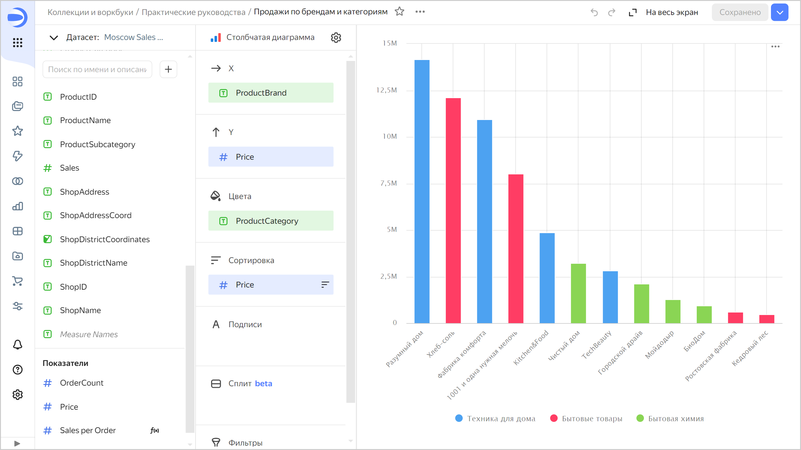

## Создайте чарт — сводная таблица {#create-pivot-chart}

Для визуализации продаж в разрезе продуктов и времени создайте чарт — [сводную таблицу](../../datalens/visualization-ref/pivot-table-chart.md):

1. Создайте копию чарта, созданного на предыдущем шаге:

   1. В правом верхнем углу нажмите значок  → **Сохранить как копию**.
   1. В открывшемся окне введите название нового чарта `Продажи в разрезе лет и продуктов` и нажмите кнопку **Сохранить**.

1. Выберите тип визуализации **Сводная таблица**.

   

1. Поля `ProductBrand` и `Price` автоматически попадут в секции **Столбцы** и **Показатели** соответственно.
1. Удалите `ProductBrand` из таблицы. Для этого в секции **Столбцы** напротив поля нажмите значок  (значок появляется при наведении указателя на поле).
1. Добавьте дату заказа в таблицу. Для этого из раздела **Измерения** перетащите поле `OrderDate` в секцию **Столбцы**.
1. Измените формат отображения `OrderDate` на годы:

   1. Нажмите значок календаря у поля `OrderDate` в секции **Столбцы**.
   1. В поле **Группировка** выберите **Часть даты** ⟶ **Год**, затем нажмите **Применить**.

   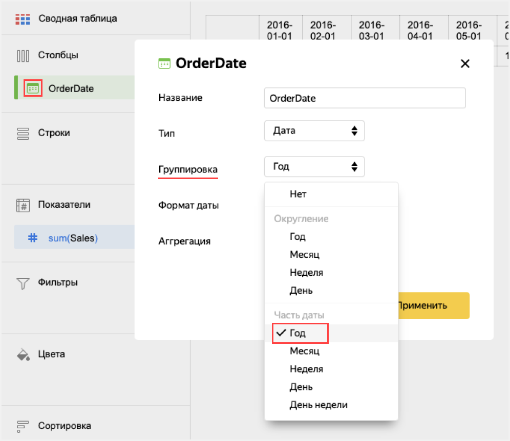

1. Добавьте в таблицу категорию и подкатегорию продуктов. Для этого из раздела **Измерения** перетащите поля `ProductCategory` и `ProductSubcategory` в секцию **Строки**.
1. Измените цвет показателя продаж в таблице. Для этого из раздела **Показатели** перетащите поле `Price` в секцию **Цвета**.
1. В правом верхнем углу нажмите кнопку **Сохранить**.

   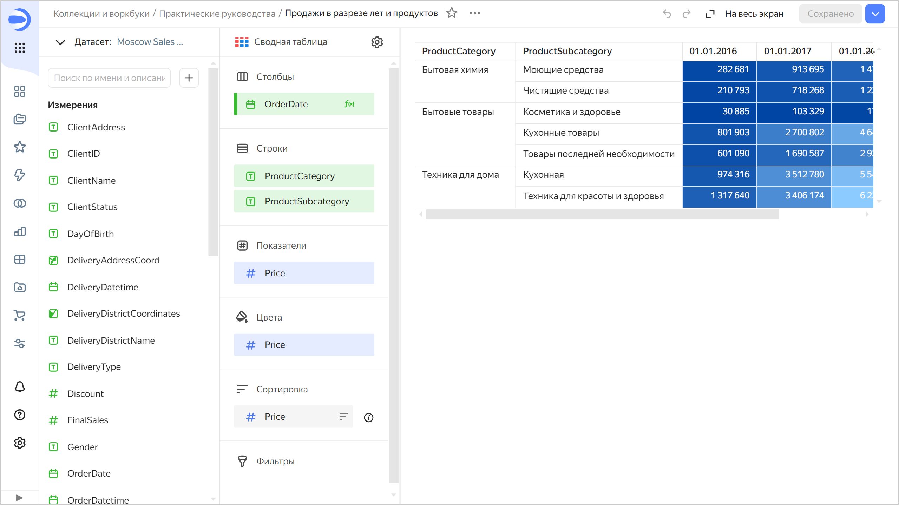

## Создайте чарт — тепловая карта {#create-heat-map-chart}

Для визуализации плотности заказов на карте Москвы создайте чарт — [тепловую карту](../../datalens/visualization-ref/heat-map-chart.md).

1. Создайте копию чарта, созданного на предыдущем шаге:

   1. В правом верхнем углу нажмите значок  → **Сохранить как копию**.
   1. В открывшемся окне введите название нового чарта `Тепловая карта продаж` и нажмите кнопку **Сохранить**.

1. Выберите тип визуализации **Карта**.

   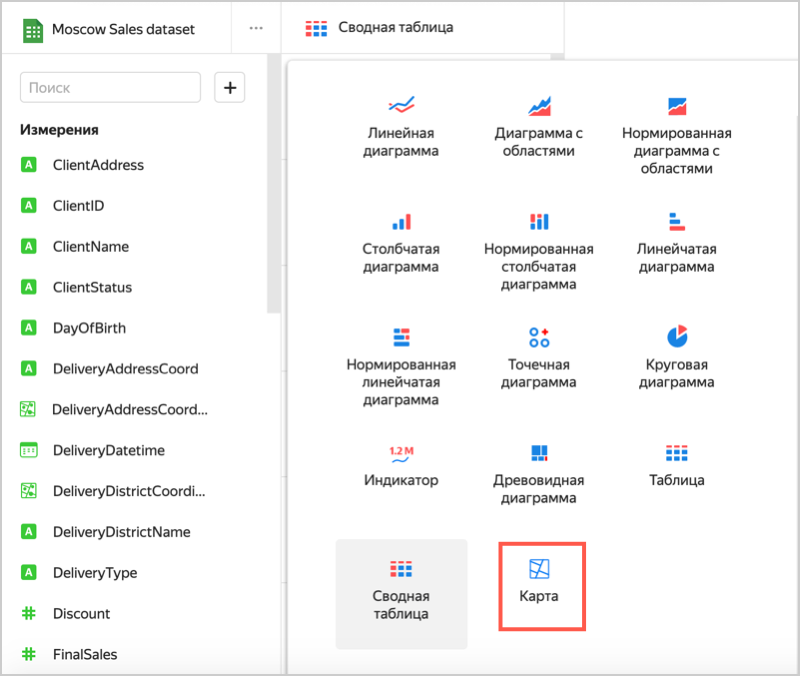

1. Выберите тип слоя **Теплокарта (Геоточки)**.

   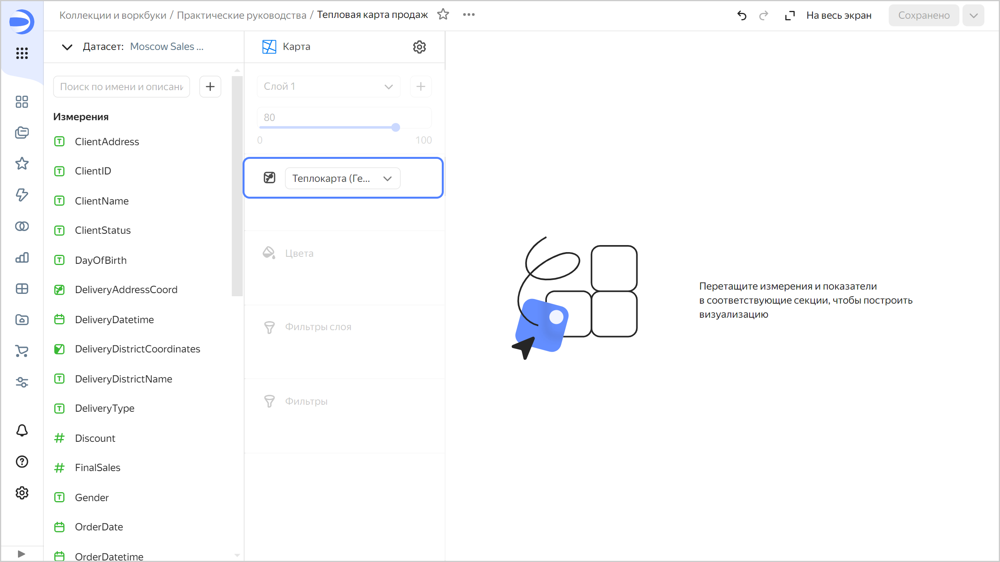

1. Добавьте на карту координаты точек доставки. Для этого из раздела **Измерения** перетащите поле `DeliveryAddressCoord` в секцию **Теплокарта (Геоточки)**.
1. В правом верхнем углу нажмите кнопку **Сохранить**.

   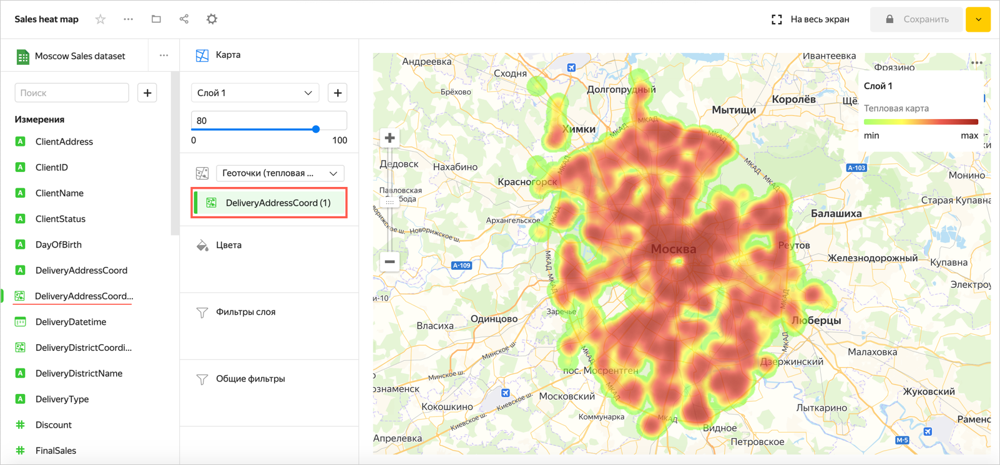

## Создайте дашборд и добавьте на него чарты {#create-dashboard}

Создайте [дашборд](../../datalens/concepts/dashboard.md), на который будут добавлены чарты и другие виджеты:

1. На панели слева выберите  **Коллекции и воркбуки** и перейдите в воркбук `Практические руководства`.
1. В правом верхнем углу нажмите **Создать** →  **Дашборд**.
1. На панели в нижней части страницы зажмите  **Чарт** и перетащите его в нужную область.

   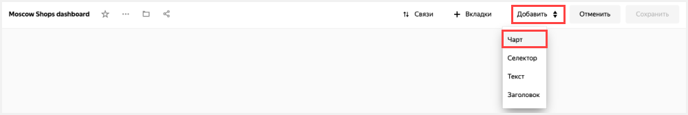

1. В открывшемся окне нажмите кнопку **Выбрать**.
1. Выберите чарт `Динамика продаж по месяцам и типам оплаты`.
1. Нажмите кнопку **Добавить**.

   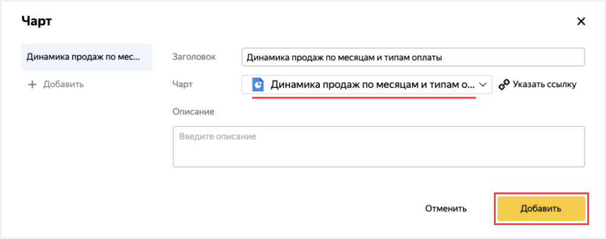

1. Повторите шаги 3-6, чтобы добавить чарты:

   * `Продажи по брендам и категориям`
   * `Продажи в разрезе лет и продуктов`
   * `Тепловая карта продаж`

1. Установите размеры чартов с помощью мыши и расположите их на дашборде в удобном для вас порядке.

   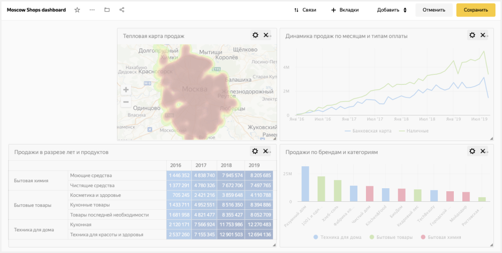

## Добавьте селекторы на дашборд {#add-selectors}

Добавьте [селекторы](../../datalens/dashboard/selector.md), чтобы фильтровать чарты по дате, районам Москвы, продуктам и статусам клиентов:

1. На панели в нижней части страницы зажмите   **Селектор** и перетащите его в нужную область.

   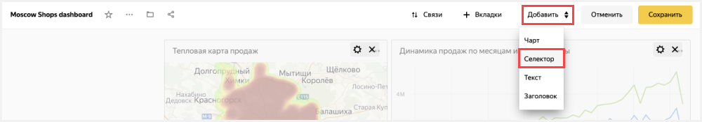

1. Добавьте селектор с календарем по датам заказа:

   1. Выберите датасет `Moscow Sales dataset`.
   1. Выберите поле `OrderDate`.
   1. Включите опцию **Диапазон**.
   1. Нажмите кнопку **Сохранить**.

   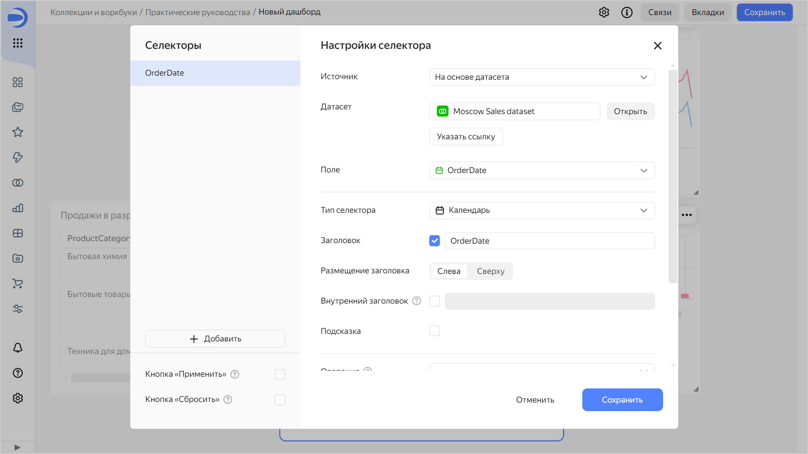

1. Добавьте селектор по категории продуктов:

   1. Убедитесь, что выбран датасет `Moscow Sales dataset`.
   1. Выберите поле `ProductCategory`.
   1. Включите опцию **Множественный выбор**.
   1. Нажмите кнопку **Сохранить**.

1. Аналогичным способом добавьте селекторы по полям:

   * `ProductBrand`
   * `DeliveryDistrictName`
   * `DeliveryType`
   * `PaymentType`

1. Расположите селекторы на дашборде в удобном для вас порядке.
1. Сохраните дашборд:

   1. В правом верхнем углу дашборда нажмите кнопку **Сохранить**.
   1. Введите название дашборда `Moscow Shops dashboard` и нажмите кнопку **Создать**.

Дашборд готов.

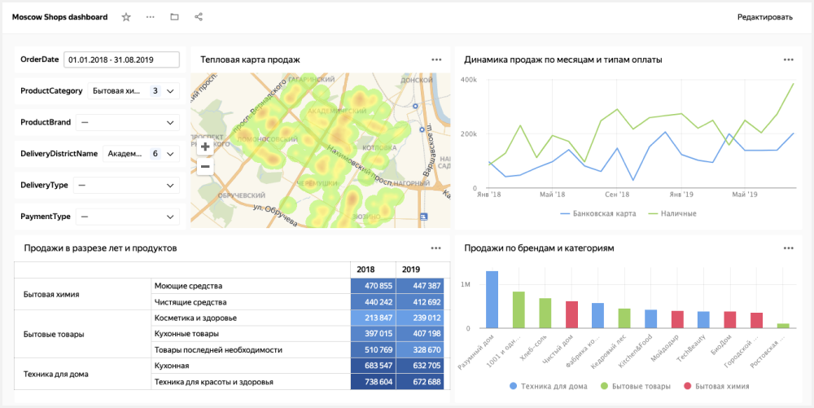

Применяя разные комбинации фильтров можно проанализировать, как менялись продажи товаров в различных разрезах. Например, проанализировать, как менялась динамика продаж с доставкой товаров по категориям `Бытовые товары` и `Техника для дома` в районе доставки `Измайлово` за период `01.01.2017 - 31.12.2018` и оценить плотность продаж на тепловой карте. Для этого задайте значения в селекторах:

* `OrderDate` — `01.01.2017 - 31.12.2018`;
* `ProductCategory` — `Бытовые товары` и `Техника для дома`;
* `DeliveryDistrictName` — `Измайлово`;
* `DeliveryType` — `Доставка`.

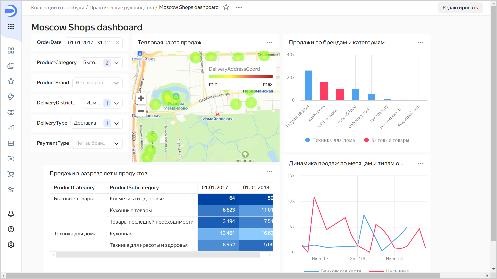
