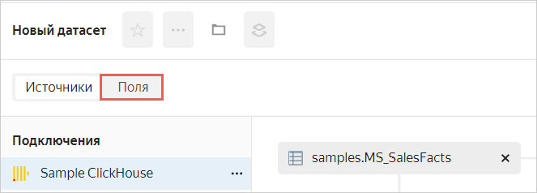
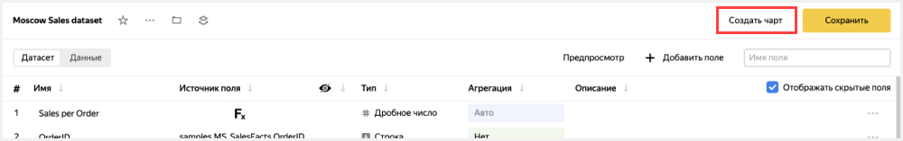

# Анализ продаж сети магазинов из БД ClickHouse

В качестве источника будет использована демонстрационная база данных ClickHouse с информацией о продажах товаров в сети московских магазинов.

С помощью {{ datalens-short-name }} в данном примере будут визуализированы:
* Динамика продаж по дням и месяцам.
* Продажи по продуктовым категориям.
* Тепловая карта заказов.

Для доступа к базе данных будет создано подключение **Sample ClickHouse**.

Для визуализации и исследования данных [подготовьте {{ datalens-short-name }} к работе](#before-you-begin), затем выполните следующие шаги:

1. [Определите источник данных датасета](#step1).
1. [Настройте поля датасета](#step2).
1. [Создайте чарт — линейная диаграмма](#step3).
1. [Создайте чарт — столбчатая диаграмма](#step4).
1. [Создайте чарт — сводная таблица](#step5).
1. [Создайте чарт — тепловая карта](#step6).
1. [Создайте дашборд](#step7).
1. [Добавьте чарты на дашборд](#step8).
1. [Добавьте селекторы на дашборд](#step9).

## Перед началом работы {#before-you-begin}



## Шаг 1. Создайте подключение и датасет {#step1}



1. В правом верхнем углу нажмите кнопку **Создать датасет**.

## Шаг 2. Настройте поля датасета {#step2}

1. Перенесите на рабочую область таблицу **MS_SalesFacts**.

    

1. Перенесите на рабочую область таблицу **MS_Clients**. Таблицы автоматически свяжутся.

    

1. Для проверки связи нажмите значок связи между таблицами.

    

1. Таблицы связаны полем **ClientID**. При необходимости связь можно изменить или дополнить, указав еще одну пару полей. Для закрытия окна связей нажмите на крестик или кликните за пределы окна.

    

1. Перенесите на рабочую область таблицу **MS_Products**. Таблица автоматически свяжется с левой (корневой) таблицей **MS_SalesFacts**.

    

1. Перенесите на рабочую область таблицу **MS_Shops**. Таблица автоматически свяжется с левой (корневой) таблицей **MS_SalesFacts**.

    

1. Перейдите на вкладку **Поля**.

    

1. Удалите дубликаты полей получившиеся в результате соединения таблиц: **ClientID (1)**, **ProductID (1)** и **ShopID (1)**.

    

1. Создайте поле с датой заказа **OrderDate**.

    1. Продублируйте поле  **OrderDatetime**.

        

    1. Переименуйте дубликат поля **OrderDatetime (1)** в **OrderDate**: нажмите на имя строки, удалите текущее имя и введите новое.

       

    1. Измените тип данных с **Дата и время** на **Дата**.

        

1. Для поля **ShopDistrictCoordinates** измените тип данных на **Геополигон**.

1. Для поля **DeliveryDistrictCoordinates** измените тип данных на **Геополигон**.

1. Для поля **DeliveryAddressCoord** измените тип данных на **Геоточка**.

1. В столбце **Агрегация** для поля **Sales** выберите **Сумма**.

    

    Поле с агрегацией поменяет цвет на синий: поле **Sales** стало показателем.

    

1. Создайте показатель с количеством заказов.

    1. Продублируйте поле  **OrderID**.

    1. Переименуйте дубликат поля **OrderID (1)** в **OrderCount**.

    1. Измените тип агрегации на **Количество уникальных**.

    

1. Создайте вычисляемое поле для расчета средней суммы продаж на один заказ.
    1. В правом верхнем углу нажмите кнопку **Добавить поле**.
    1. В поле **Имя** укажите **Sales per Order**.
    1. Слева в колонке нажмите на поле **Sales**.
    1. Введите символ `/`.
    1. Слева в колонке нажмите на поле **OrderCount**.
    1. Нажмите кнопку **Создать**.

        

1. Нажмите кнопку **Сохранить** в верхнем правом углу и сохраните датасет.

    

1. Введите имя датасета **Moscow Sales dataset**, нажмите **Создать**.

1. После сохранения датасета нажмите **Создать чарт**.

    

## Шаг 3. Создайте чарт — линейная диаграмма {#step3}

Для визуализации динамики продаж по месяцам создайте [чарт](../../datalens/concepts/chart/index.md) — линейную диаграмму.

1. Выберите тип визуализации **Линейная диаграмма**.

    

1. Добавьте на чарт дату продажи. Для этого из раздела **Измерения** перетащите поле **OrderDate** в секцию **X**.
1. Добавьте на чарт показатель продаж. Для этого из раздела **Показатели** перетащите поле **Sales** в секцию **Y**.
1. Добавьте на чарт тип доставки. Для этого из раздела **Измерения** перетащите поле **PaymentType** в секцию **Цвета**.

    

1. Отобразите чарт по месяцам.
    1. Нажмите на иконку с календарем у поля **OrderDate** в секции **X**.
    1. В поле **Группировка** выберите **Округление** ⟶ **Месяц**, затем нажмите **Применить**.

    

1. Сохраните чарт.
    1. Нажмите кнопку **Сохранить** в верхнем правом углу и сохраните чарт.

       

    1. В открывшемся окне введите название чарта **Динамика продаж по месяцам и типам оплаты** и нажмите кнопку **Сохранить**.
## Шаг 4. Создайте чарт — столбчатая диаграмма {#step4}

Для визуализации продаж в разрезе брендов и продуктовых категорий создайте [чарт](../../datalens/concepts/chart/index.md) — столбчатую диаграмму.

1. Скопируйте чарт, получившийся на предыдущем шаге.
    1. Нажмите значок галочки рядом с кнопкой **Сохранить** в верхнем правом углу.
    1. Выберите **Сохранить как**.

        

    1. В открывшемся окне введите название нового чарта **Продажи по брендам и категориям** и нажмите кнопку **Сохранить**.

1. Выберите тип визуализации **Столбчатая диаграмма**.

    

1. Поля **OrderDate**, **Sales** и **PaymentType** автоматически попадут в секции **X**, **Y** и **Цвета** соответственно.

1. Замените месяцы на бренды на оси X. Из раздела **Измерения** перетащите поле **ProductBrand** в секцию **X** и наведите его над полем **OrderDate**, пока то не станет красным.

    

1. Замените типы оплаты на категории товаров в секции **Цвета**. Из раздела **Измерения** перетащите поле **ProductCategory** в секцию **Цвета** и наведите его над полем **PaymentType**, пока то не станет красным.

    

1. Отсортируйте чарт по убыванию по показателю продаж. Из раздела **Показатели** перетащите поле **Sales** в секцию **Сортировка**.

    

1. Сохраните чарт.

## Шаг 5. Создайте чарт — сводная таблица {#step5}

Для визуализации продаж в разрезе продуктов и времени создайте [чарт](../../datalens/concepts/chart/index.md) — сводную таблицу.

1. Скопируйте чарт, получившийся на предыдущем шаге.
    1. Нажмите значок галочки рядом с кнопкой **Сохранить** в верхнем правом углу.
    1. Нажмите **Сохранить как**.
    1. В открывшемся окне введите название нового чарта **Продажи в разрезе лет и продуктов**.
    1. Нажмите кнопку **Сохранить**.

1. Выберите тип визуализации **Сводная таблица**.

    

1. Поля **ProductBrand** и **Sales** автоматически попадут в секции **Столбцы** и **Показатели** соответственно.

    

1. Удалите **ProductBrand** из таблицы.

1. Добавьте дату заказа в таблицу. Для этого из раздела **Измерения** перетащите поле **OrderDate** в секцию **Столбцы**.

1. Измените формат отображения **OrderDate** на годы.
    1. Нажмите значок календаря у поля **OrderDate** в секции **Столбцы**.
    1. В поле **Группировка** выберите **Часть даты** ⟶ **Год**, затем нажмите **Применить**.

    

1. Добавьте в таблицу категорию и подкатегорию продуктов. Для этого из раздела **Измерения** перетащите поля **ProductCategory** и **ProductSubcategory** в секцию **Строки**.

    

1. Измените цвет показателя продаж в таблице. Для этого из раздела **Показатели** перетащите поле **Sales** в секцию **Цвета**.

    

1. Сохраните чарт.

## Шаг 6. Создайте чарт — тепловая карта {#step6}

Для визуализации плотности заказов на карте Москвы создайте [чарт](../../datalens/concepts/chart/index.md) — тепловую карту.

1. Скопируйте чарт, полученный на предыдущем шаге.
    1. Нажмите значок рядом с кнопкой **Сохранить** в верхнем правом углу и выберите **Сохранить как**.
    1. В открывшемся окне введите название нового чарта **Тепловая карта продаж**.
    1. Нажмите кнопку **Сохранить**.

1. Выберите тип визуализации **Карта**.

    

1. Выберите тип слоя **Геоточки (тепловая карта)**.

1. Добавьте на карту координаты точек доставки. Для этого из раздела **Измерения** перетащите поле **DeliveryAddressCoord** в секцию **Геоточки (тепловая карта)**.

    

1. Сохраните чарт.

## Шаг 7. Создайте дашборд {#step7}

Создайте [дашборд](../../datalens/concepts/dashboard.md), на который будут добавлены чарты.

1. Перейдите на [главную страницу]({{ link-datalens-main }}) {{ datalens-short-name }}.

1. Нажмите кнопку **Создать дашборд**.

    

1. Введите название дашборда **Moscow Shops dashboard** и нажмите кнопку **Создать**.

## Шаг 8. Добавьте чарты на дашборд {#step8}

1. При первом открытии после сохранения дашборд открывается в режиме редактирования. Если вы открыли его повторно, то нажмите **Редактировать** в правом верхнем углу.

    

1. Нажмите кнопку **Добавить** и выберите **Чарт**.

    

1. В открывшемся окне нажмите кнопку **Выбрать**.
1. Выберите чарт **Динамика продаж по месяцам и типам оплаты**. После этого автоматически заполнится поле **Заголовок** по названию выбранного чарта.
1. Нажмите кнопку **Добавить**.

    

1. Аналогичным способом добавьте чарты:
    * **Продажи по брендам и категориям**
    * **Продажи в разрезе лет и продуктов**
    * **Тепловая карта продаж**

1. Расположите чарты на дашборде в удобном для вас порядке.  

    

## Шаг 9. Добавьте селекторы на дашборд {#step9}

Добавьте [селекторы](../../datalens/dashboard/selector.md), чтобы иметь возможность фильтровать чарты по дате, районам Москвы, продуктам и статусам клиентов.

1. Нажмите кнопку **Добавить**.
1. Выберите **Селектор**.

    

1. Добавьте селектор с календарем по датам заказа.
    1. Выберите датасет **Moscow Sales dataset**.
    1. Выберите поле **OrderDate**.
    1. После этого автоматически заполнится **Заголовок** по названию выбранного поля. Нажмите галочку **Показывать** напротив заголовка селектора.
    1. Выберите тип **Календарь**.
    1. Включите опцию **Диапазон**.
    1. Нажмите кнопку **Добавить**.

    

1. Добавьте селектор по категории продуктов.
    1. Выберите датасет **Moscow Sales dataset**.
    1. Выберите поле **ProductCategory**.
    1. После этого автоматически заполнится **Заголовок** по названию выбранного поля. Нажмите галочку **Показывать** напротив заголовка селектора.
    1. Включите опцию **Множественный выбор**.
    1. Нажмите кнопку **Добавить**.

    

1. Аналогичным способом добавьте селекторы по полям:
    * **ProductBrand**
    * **DeliveryDistrictName**
    * **DeliveryType**
    * **PaymentType**

1. Расположите селекторы на дашборде в удобном для вас порядке.

1. Сохраните дашборд.

    

1. Дашборд готов. Теперь можно фильтровать чарты с использованием селекторов.

    
