# Визуализация данных с использованием параметров

Параметр — это переменная, которая может заменять константные значения в вычисляемых полях.

Вы научитесь управлять визуализацией с помощью параметров:

* создадите параметры на уровне датасета и на уровне чарта; 
* поработаете с формулами и визуализацией в чарте с помощью параметров;
* поменяете значение параметра на дашборде с помощью селекторов с ручным вводом.

В качестве источника данных будет использовано прямое подключение к демонстрационной базе данных {{ CH }}. 


Для визуализации и исследования данных [подготовьте {{ datalens-short-name }} к работе](#before-you-begin), затем выполните следующие шаги:


1. [Создайте подключение](#create-connection).
1. [Создайте датасет](#create-dataset).
1. [Добавьте параметры в датасет](#create-dataset-parameters).
1. [Создайте чарт с возможностью управления группировкой даты](#create-chart-grouping).
1. [Создайте чарт с выбором измерения для визуализации](#create-chart-measure-select).
1. [Создайте дашборд](#create-dashboard).
1. [Добавьте чарты на дашборд](#add-charts-on-dashboard).
1. [Добавьте селекторы на дашборд](#add-selectors-on-dashboard).


## Перед началом работы {#before-you-begin}




## Создайте подключение {#create-connection}



## Создайте датасет {#create-dataset}

1. В правом верхнем углу нажмите кнопку **Создать датасет**.

1. Перенесите на рабочую область таблицу **MS_SalesFullTable**.

   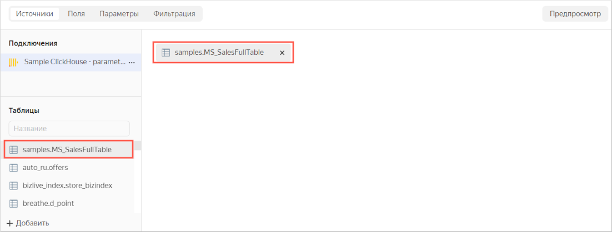

1. Перейдите на вкладку **Поля**.

   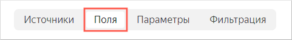

1. Создайте поле с датой заказа **OrderDate**.

   1. Продублируйте поле **OrderDatetime**.

      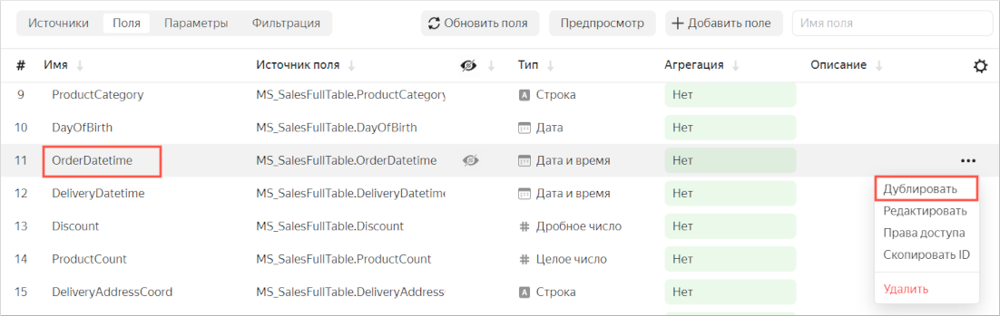

   1. Переименуйте дубликат поля **OrderDatetime (1)** в **OrderDate**: нажмите на имя строки, удалите текущее имя и введите новое.
   1. Измените тип данных с **Дата и время** на **Дата**.

      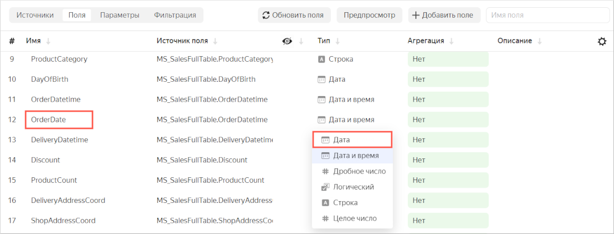

1. В столбце **Агрегация** для поля **Sales** выберите **Сумма**.

   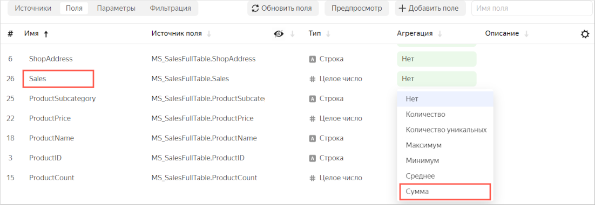

   Поле с агрегацией станет показателем и поменяет цвет на синий.

1. В правом верхнем углу нажмите кнопку **Сохранить**.
1. Введите имя датасета **Moscow Sales dataset with parameters**, нажмите **Создать**.

## Добавьте параметры в датасет {#create-dataset-parameters}

1. Перейдите на вкладку **Параметры**.

   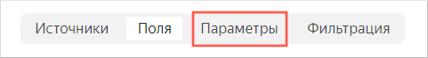

1. Добавьте параметры `scale` и `dimension`:

   1. Нажмите кнопку **Добавить** и в открывшемся окне укажите:

      * **Название** — `scale`.
      * **Тип** — `Строка`.
      * **Значение по умолчанию** — `month`.

      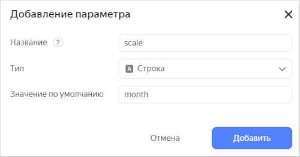

      Нажмите кнопку **Добавить**.
 
   1. Нажмите кнопку **Добавить** и в открывшемся окне укажите:

      * **Название** — `dimension`.
      * **Тип** — `Строка`.
      * **Значение по умолчанию** — `Статус`.

      Нажмите кнопку **Добавить**.

1. Нажмите кнопку **Сохранить**.

## Создайте чарт с возможностью управления группировкой даты {#create-chart-grouping}

1. В верхнем правом углу датасета нажмите **Создать чарт**.
1. Выберите тип визуализации **Накопительная диаграмма с областями**.

   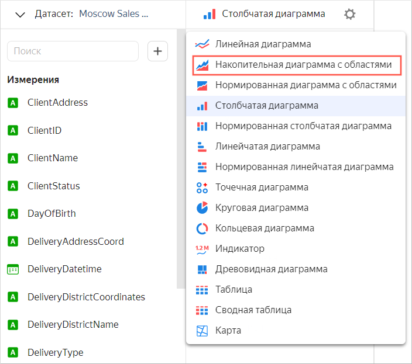

1. Добавьте в чарт вычисляемое поле:

   1. В левой части экрана под датасетом нажмите значок  и выберите **Поле**.
   1. В окне **Настройка поля** введите:
   
      * В поле **Название** — `Date`.
      * В поле для ввода формулы — `DATETRUNC([OrderDate], [scale])`. Дата заказа будет округляться в зависимости от значения параметра датасета `scale`.

        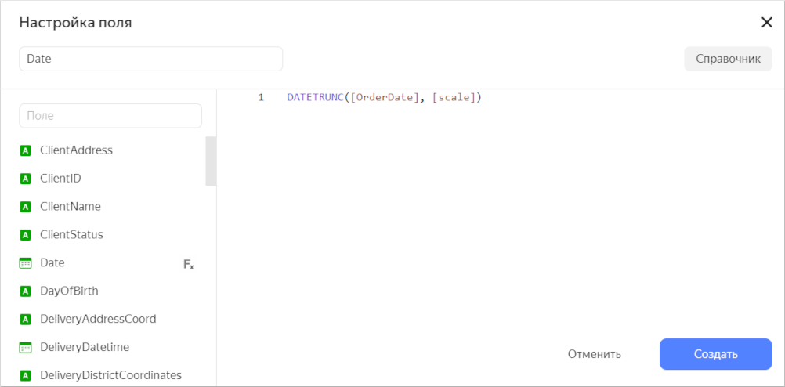

   1. Нажмите **Создать**.
   1. Перетащите новое поле **Date** в секцию **X**.

1. Перетащите показатель **Sales** в секцию **Y**.
1. Добавьте в чарт группировку по типу категорий товара. Для этого из раздела **Измерения** перетащите поле **ProductCategory** в секцию **Цвета**. Области диаграммы для каждой категории товара окрасятся в разные цвета.
1. Сохраните чарт.

   1. В правом верхнем углу нажмите кнопку **Сохранить**.
   1. Введите название чарта **Продажи по категориям товаров** и нажмите кнопку **Сохранить**.

      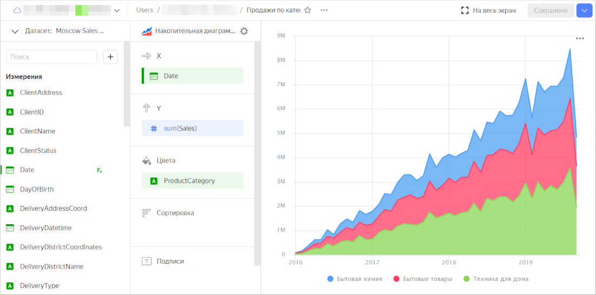

## Создайте чарт с возможностью выбора измерения для визуализации {#create-chart-measure-select}

1. В верхнем правом углу датасета нажмите **Создать чарт**.
1. Выберите тип визуализации **Линейчатая диаграмма**.
1. Добавьте в чарт вычисляемое поле для выбора измерения:

   1. В левой части экрана под датасетом нажмите значок  и выберите **Поле**.
   1. В окне **Настройка поля** введите:
   
      * В поле **Название** — `Field`.
      * В поле для ввода формулы: 
      
        ```
        if(
             [dimension] = 'Статус', [ClientStatus],
             [dimension] = 'Категория', [ProductCategory],
             [dimension] = 'Тип оплаты', [PaymentType],
             null
           )
        ```
      
        Измерение для визуализации будет меняться в зависимости от значения параметра датасета `dimension`.

   1. Нажмите **Создать**.
   1. Перетащите новое поле **Field** в секцию **Y**.

1. Перетащите показатель **Sales** в секцию **X**.
1. Сохраните чарт.

   1. В правом верхнем углу нажмите кнопку **Сохранить**.
   1. Введите название чарта **Чарт с выбором измерения для визуализации** и нажмите кнопку **Сохранить**.

      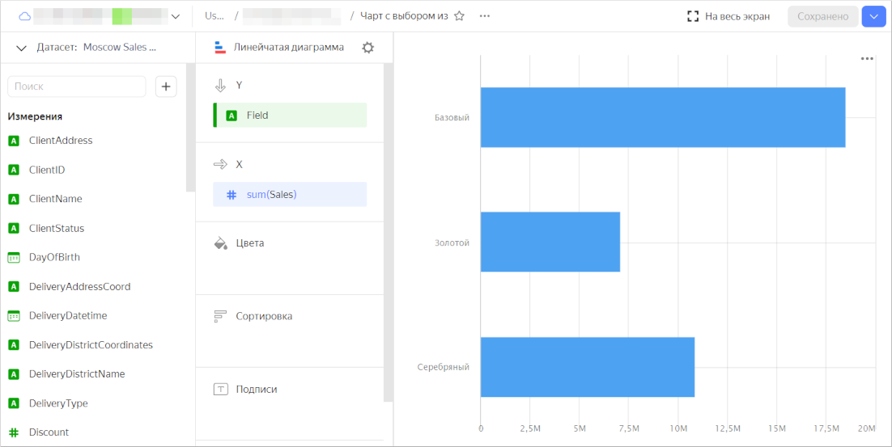

## Создайте дашборд {#create-dashboard}

Создайте [дашборд](../../datalens/concepts/dashboard.md), на который будут добавлены чарты.

1. Перейдите на [главную страницу]({{ link-datalens-main }}) {{ datalens-short-name }}.
1. Нажмите кнопку **Создать дашборд**.

   

## Добавьте чарты на дашборд {#add-charts-on-dashboard}

1. При первом открытии после сохранения дашборд открывается в режиме редактирования. Если вы открыли его повторно, то нажмите **Редактировать** в правом верхнем углу.
1. Нажмите кнопку **Добавить** и выберите **Чарт**.

   

1. В поле **Чарт** нажмите кнопку **Выбрать**.
1. Выберите чарт **Продажи по категориям товаров**. После этого автоматически заполнится поле **Название**.
1. Нажмите кнопку **Добавить**.

   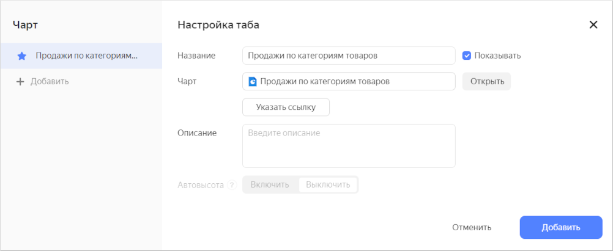

1. Аналогичным способом добавьте чарт **Чарт с выбором измерения для визуализации**.
1. Расположите чарты на дашборде в удобном для вас порядке.  
1. Сохраните дашборд:

   1. В правом верхнем углу нажмите кнопку **Сохранить**.
   1. Введите название дашборда **Визуализация данных с использованием параметров** и нажмите кнопку **Создать**.

## Добавьте селекторы на дашборд {#add-selectors-on-dashboard}

Добавьте [селекторы](../../datalens/dashboard/selector.md) с ручным вводом, чтобы менять значения параметров в чартах.



После добавления селектора разорвите его связь с другими селекторами на этой вкладке дашборда.



1. Чтобы перейти в режим редактирования дашборда, нажмите **Редактировать** в правом верхнем углу.
1. Добавьте селектор для чарта **Продажи по категориям товаров**:

   1. В верхней части страницы нажмите кнопку **Добавить**.
   1. Выберите **Селектор**.

      

   1. Выберите тип источника **Ручной ввод**.
   1. В **Имя поля или параметра** введите `scale`. В этот параметр датасета будет передаваться выбранное значение из селектора.
   1. Выберите тип селектора **Список**.
   1. Рядом с параметром **Значение по умолчанию** нажмите на поле ввода и добавьте значения:

      * `day`
      * `week`
      * `month`
      * `year`

      

      Нажмите кнопку **Применить**.

   1. В списке **Значение по умолчанию** укажите **month**.
   1. Включите опцию **Название** и введите `Группировка`.
   1. Проверьте указанные параметры селектора.

      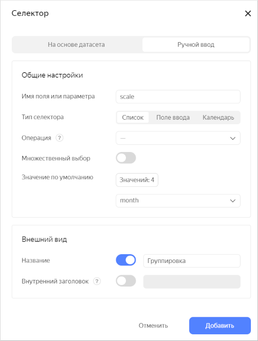

   1. Нажмите кнопку **Добавить**. 
   1. Расположите селектор на дашборде над чартом **Продажи по категориям товаров**. Теперь вы можете управлять группировкой даты в этом чарте.

      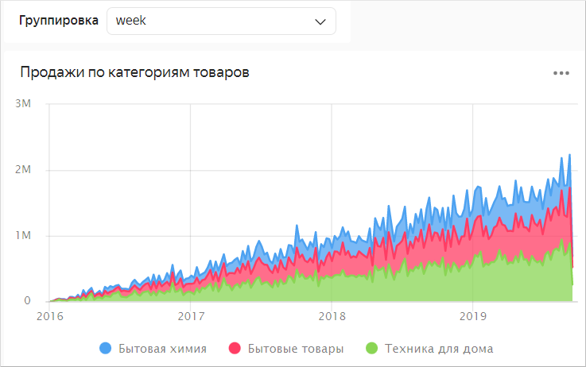

      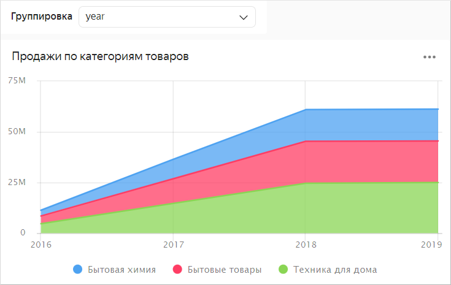

1. Добавьте селектор для чарта **Чарт с выбором измерения для визуализации**:

   1. В верхней части страницы нажмите кнопку **Добавить**.
   1. Выберите **Селектор**.
   1. Выберите тип источника **Ручной ввод**.
   1. В **Имя поля или параметра** введите `dimension`. В этот параметр датасета будет передаваться выбранное значение из селектора.
   1. Выберите тип селектора **Список**.
   1. Рядом с параметром **Значение по умолчанию** нажмите на поле ввода и добавьте значения:

      * `Статус`
      * `Категория`
      * `Тип оплаты`

      Нажмите кнопку **Применить**.

   1. В списке **Значение по умолчанию** укажите **Статус**.
   1. Включите опцию **Название** и введите `Измерение`.
   1. Нажмите кнопку **Добавить**. 
   1. Расположите селектор на дашборде над чартом **Чарт с выбором измерения для визуализации**. 
   1. Разорвите связь этого селектора с селектором **Группировка**:

      1. В верхней части страницы нажмите кнопку **Связи**. 
      1. В окне **Связи** выберите **Измерение**.
      1. Проверьте, что с чартом **Чарт с выбором измерения для визуализации** установлен тип связи **Исх.связь**. Для селектора **Группировка** установите тип связи **Игнор**.

         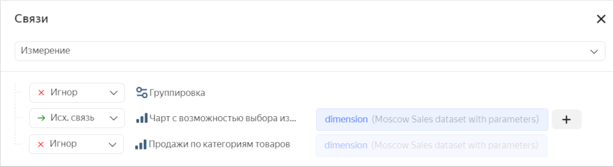

      1. Нажмите кнопку **Сохранить**. Теперь с помощью этого селектора вы можете выбирать измерение для визуализации.

         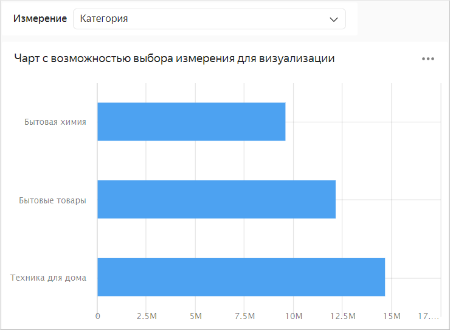

         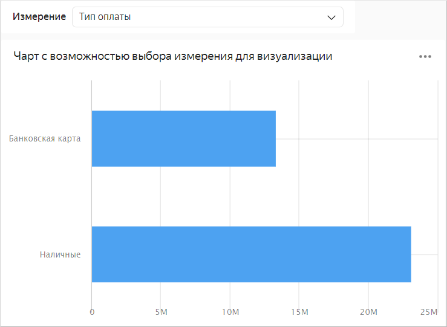

#### См. также {#see-also}

* [{#T}](../../datalens/concepts/parameters.md)
* [{#T}](../../datalens/operations/dashboard/add-parameters.md)
* [{#T}](../../datalens/operations/chart/add-parameter-chart.md)
* [{#T}](../../datalens/operations/dataset/add-parameter-dataset.md)
