# Анализ открытых данных ДТП на дорогах России



В этом руководстве будут [проанализированы открытые данные](../../glossary/data-analytics.md) о дорожно-транспортных происшествиях на дорогах РФ. Помимо выявления фактов статистики ДТП в России, в процессе анализа вы научитесь:

* работать с основными сущностями {{ datalens-short-name }}: [подключения](../../datalens/concepts/connection.md), [датасеты](../../datalens/dataset/index.md), [чарты](../../datalens/concepts/chart/index.md), [дашборды](../../datalens/concepts/dashboard.md);
* объединять несколько источников на уровне одного датасета;
* работать с типом данных `Дата и время`, изменять группировку на уровне чарта;
* работать с геоданными: геоточками и геополигонами;
* создавать публичные дашборды, которые будут доступны всем с любых устройств без аутентификации.

В качестве исходных данных будут использоваться файлы:

* [Данные статистики ДТП](https://storage.yandexcloud.net/doc-files/dtp201804-1.csv) за апрель-декабрь 2018 года в формате CSV.
* [Справочник полигонов](https://storage.yandexcloud.net/doc-files/Regions.csv) для регионов РФ в формате CSV.

Скачайте их перед прохождением руководства.

Для визуализации и исследования данных [подготовьте {{ datalens-short-name }} к работе](#before-you-begin), затем выполните следующие шаги:

1. [Создайте воркбук](#create-workbook).
1. [Создайте подключение к файлам](#create-connection).
1. [Создайте датасет](#create-dataset).
1. [Проанализируйте плотность распределения ДТП](#create-heat-map).
1. [Проанализируйте количество ДТП и смертность](#create-bar-chart).
1. [Проанализируйте статистику по неделям, дням недели и времени суток](#create-line-chart).
1. [Создайте карту с заливкой регионов](#create-map-geopolygon-chart).
1. [Создайте дашборд и добавьте на него чарты](#create-dashboard).
1. [Добавьте селекторы на дашборд](#add-selectors).
1. [Добавьте карту с заливкой регионов на дашборд](#add-geopolygon-chart).
1. [Опубликуйте дашборд](#publish-dashboard).

## Перед началом работы {#before-you-begin}



## Создайте воркбук {#create-workbook}

1. Перейдите на [главную страницу]({{ link-datalens-main }}) {{ datalens-short-name }}.
1. На панели слева выберите  **Коллекции и воркбуки**.
1. В правом верхнем углу нажмите **Создать** → **Создать воркбук**.
1. Введите название [воркбука](../../datalens/workbooks-collections/index.md) — `Практические руководства`.
1. Нажмите кнопку **Создать**.

## Создайте подключение к файлам {#create-connection}

Создайте [подключение](../../datalens/concepts/connection.md) к файлам с исходными данными:

1. В правом верхнем углу воркбука нажмите **Создать** →  **Подключение**.

1. В разделе **Файлы и сервисы** выберите подключение **Файлы**.
1. Нажмите кнопку **Загрузить файлы**.
1. Выберите файл `dtp201804-1.csv`. Дождитесь, когда на экране появится содержимое таблицы.

   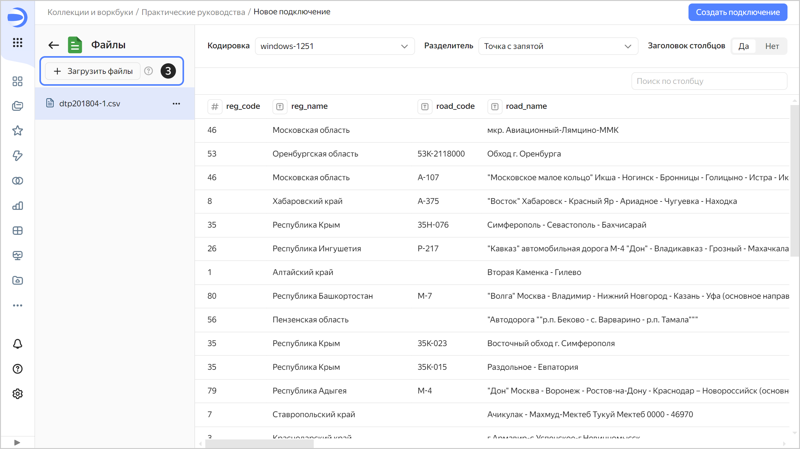

1. Добавьте таблицу с геослоями регионов. Нажмите кнопку **Загрузить файлы**.
1. Выберите файл `Regions.csv`. Дождитесь загрузки данных.
1. Выберите загруженный файл `Regions.csv` в списке слева.
1. Для параметра **Заголовок столбцов** установите значение `Да`.
1. Нажмите кнопку **Создать подключение**.

   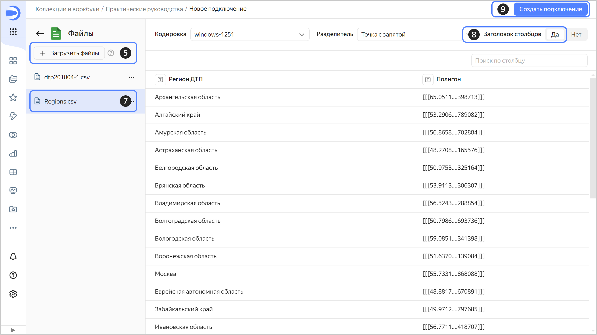

1. Введите название подключения `dtp_data` и нажмите кнопку **Создать**.

## Создайте датасет {#create-dataset}

Создайте датасет на базе подключения `dtp_data`:

1. На странице подключения в правом верхнем углу нажмите кнопку **Создать датасет**.
1. Перетащите таблицу `dtp201804-1.csv` на рабочую область.
1. Перетащите таблицу `Regions.csv` на рабочую область. Появится сообщение об ошибке, поскольку данные таблиц еще не объединены.
1. Нажмите значок связи между таблицами.

   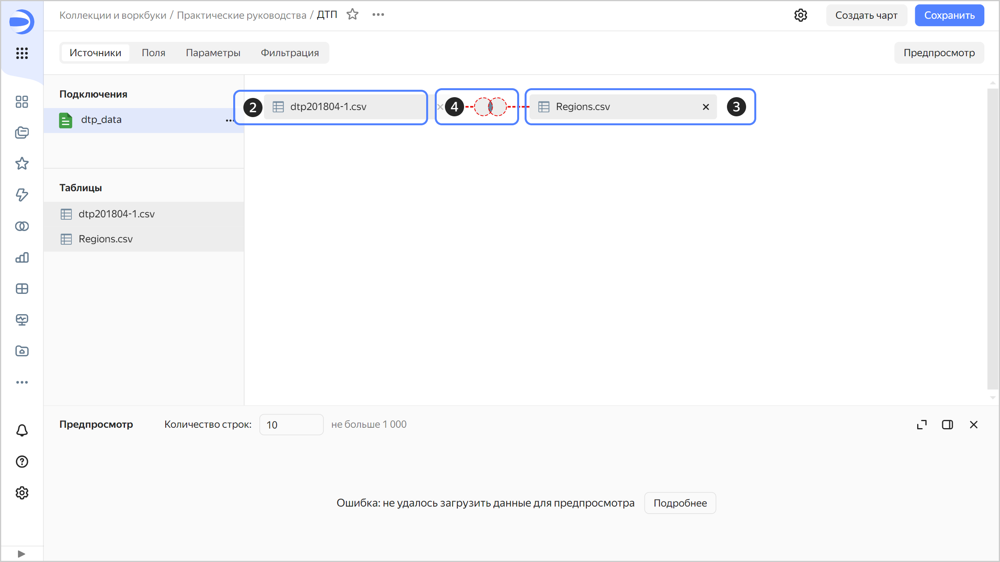

1. Нажмите кнопку **Добавить связь**.
1. Выберите поля, которые будут связаны: `reg_name` и `Регион ДТП`.
1. Нажмите кнопку **Применить**.

   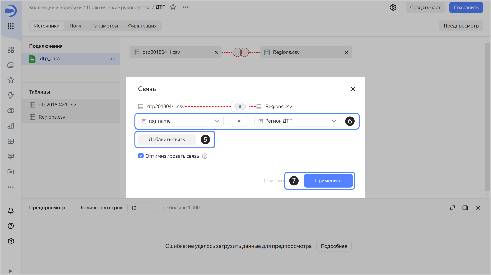

   Убедитесь, что данные в области предпросмотра отображаются корректно.

   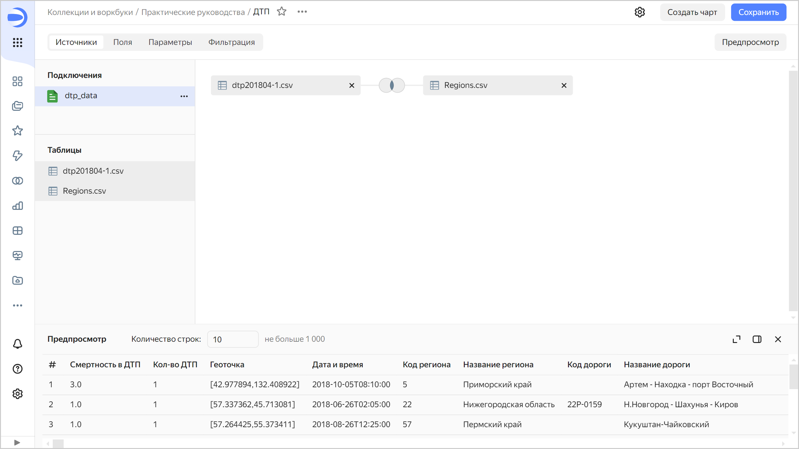

1. Перейдите на вкладку **Поля**. На этой вкладке можно добавить [поля данных](../../datalens/dataset/data-model.md#field) и [вычисляемые поля](../../datalens/concepts/calculations/index.md), изменить тип данных поля, правила агрегации, переименовать поле.
1. Переименуйте поля:

   * `reg_code` — в `Код региона`;
   * `reg_name` — в `Название региона`;
   * `road_code` — в `Код дороги`;
   * `road_name` — в `Название дороги`;
   * `road_type` — в `Тип дороги`;
   * `oktmo` — в `ОКТМО`;
   * `address` — в `Адрес`;
   * `crash_type_name` — в `Тип ДТП`.

    Чтобы изменить название поля, нажмите на его имя, удалите текущее имя и введите новое.

   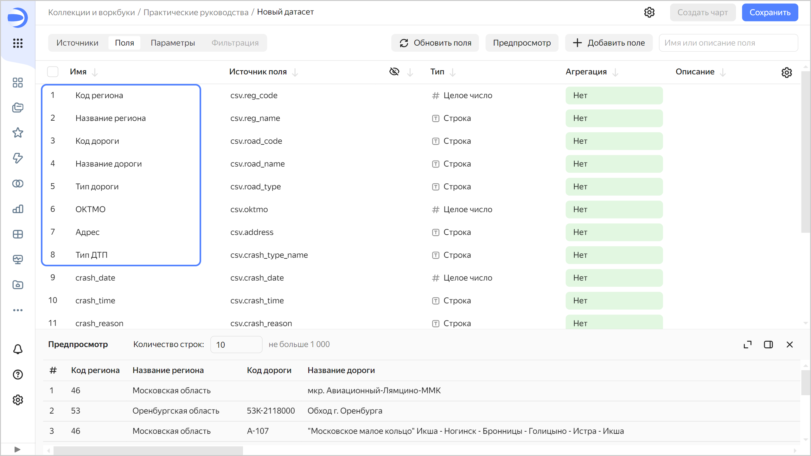

1. Дата и время ДТП представлены в следующих полях:

   * `crash_date` — дата, записанная числом, вида `20190218`;
   * `crash_time` — время, записанное текстом, вида `19:34`.

   Они не будут использоваться в чартах в таком виде. Скройте их, нажав значок  (значок появляется при наведении указателя на поле).

   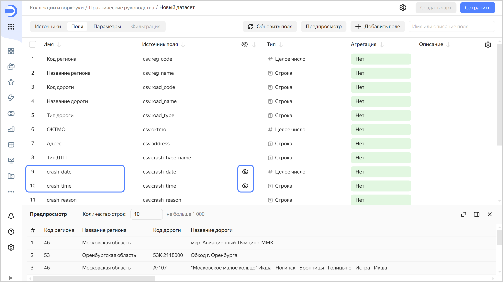

1. Создайте вычисляемое поле для отображения сведений о дате и времени ДТП:

   1. В правом верхнем углу нажмите кнопку **Добавить поле**.
   1. Слева вверху укажите название поля — `Дата и время`.
   1. В поле для формулы введите: `DATETIME_PARSE(str([crash_date])+' '+str([crash_time]))`.

      

      * Чтобы избежать ошибок, не вводите поля для формулы вручную, а выбирайте их из списка слева.
      * Чтобы отобразить информацию по функциям, нажмите справа вверху кнопку **Справочник**.

      

   1. Нажмите кнопку **Создать**.

   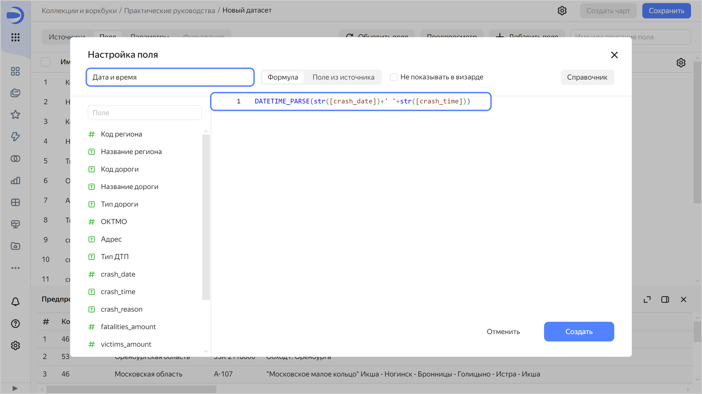

   В области предпросмотра появится корректное отображение даты и времени ДТП в виде значения типа `Дата и время` с разделителем `T`. Новое поле находится в таблице сверху. По значку  доступно редактирование формулы поля.

   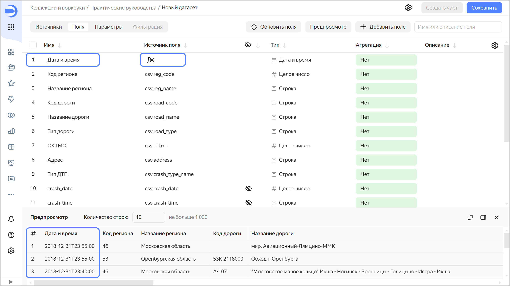

1. Переименуйте поля:

   * `crash_reason` — в `Причина ДТП`;
   * `fatalities_amount` — в `Кол-во погибших`;
   * `victims_amount` — в `Кол-во пострадавших`;
   * `vehicles_amount` — в `Кол-во ТС`;
   * `participants_amount` — в `Кол-во участников`.

1. Для полей `Кол-во погибших`, `Кол-во пострадавших` `Кол-во ТС` и `Кол-во участников` укажите тип агрегации **Сумма**. Поля с определенными функциями агрегации становятся показателями и меняют свой цвет на синий.

   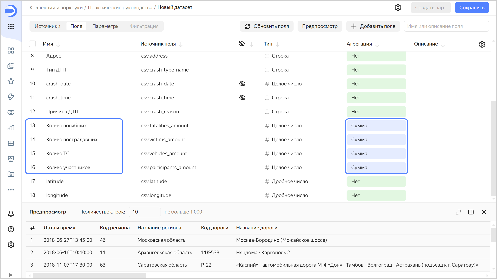

1. Создайте поле с координатами ДТП:

   1. В правом верхнем углу нажмите кнопку **Добавить поле**.
   1. Слева вверху укажите название поля — `Геоточка`.
   1. В поле для формулы введите: `GEOPOINT([latitude],[longitude])`.
   1. Нажмите **Создать**.

      

      
      В примере используются готовые данные в формате координат. 

      

    В списке полей появится новое поле с типом `Геоточка`, а в области предпросмотра отобразятся данные по нему.

    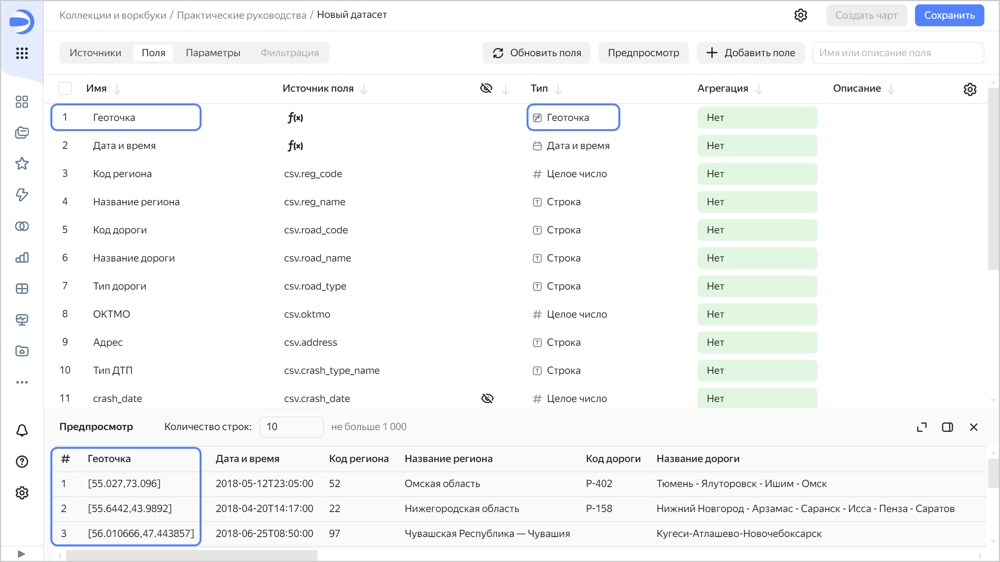

1. Создайте поля:

   * `Кол-во ДТП` с формулой `SUM(1)`. Тип агрегации для этого поля устанавливать не нужно, {{ datalens-short-name }} при добавлении поля в чарт применит функцию агрегации автоматически.
   * `Смертность в ДТП` с формулой `[Кол-во погибших]/[Кол-во ДТП]`.

1. Измените тип данных для поля `Полигон` на **Геополигон**.

   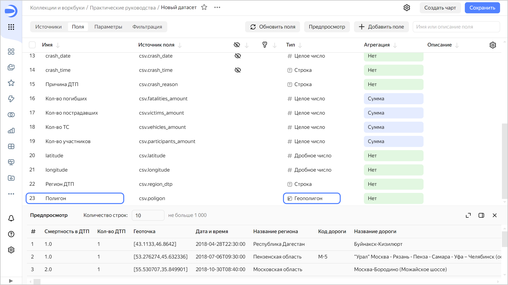

1. Сохраните датасет:

   1. В правом верхнем углу нажмите кнопку **Сохранить**.
   1. Введите название датасета — `ДТП` и нажмите кнопку **Создать**.

## Проанализируйте плотность распределения ДТП {#create-heat-map}

Для визуализации плотности распределения ДТП по регионам создайте [тепловую карту](../../datalens/visualization-ref/heat-map-chart.md):

1. На странице датасета в правом верхнем углу нажмите кнопку **Создать чарт**.
1. Выберите тип визуализации **Карта**.

   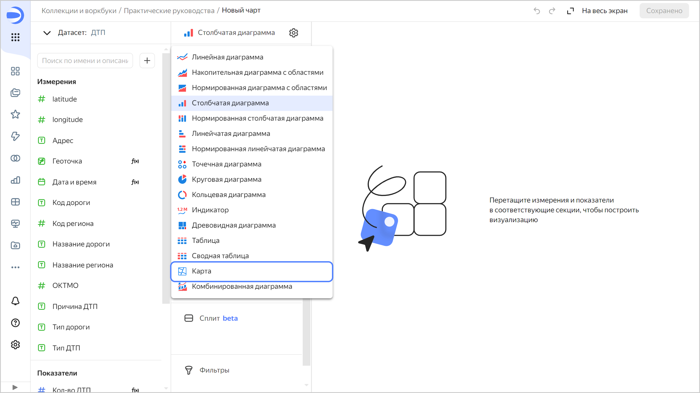

1. Выберите тип слоя **Теплокарта (Геоточки)**.

   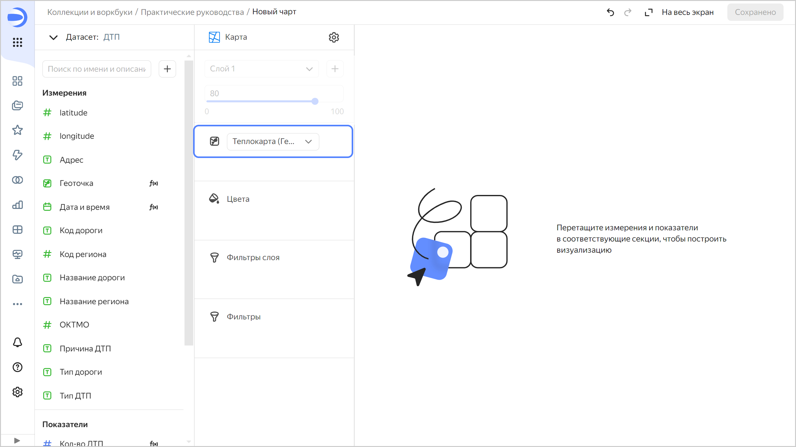

1. Добавьте на карту точки с координатами. Для этого из раздела **Измерения** перетащите поле `Геоточка` в секцию **Теплокарта (Геоточки)**.
1. Сохраните чарт:

   1. В правом верхнем углу нажмите кнопку **Сохранить**.
   1. В открывшемся окне введите название чарта `Тепловая карта ДТП` и нажмите кнопку **Сохранить**.

      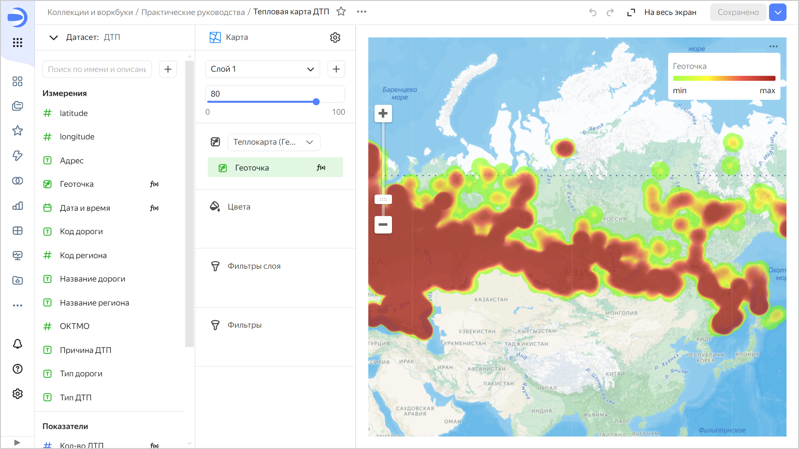

## Проанализируйте количество ДТП и смертность {#create-bar-chart}

Чтобы проанализировать количество ДТП по регионам, создайте [линейчатую диаграмму](../../datalens/visualization-ref/bar-chart.md):

1. Создайте копию чарта, созданного на предыдущем шаге:

   1. В правом верхнем углу нажмите значок  → **Сохранить как копию**.

      

   1. В открывшемся окне введите название нового чарта `Количество ДТП по регионам` и нажмите кнопку **Сохранить**.

1. Выберите тип визуализации **Линейчатая диаграмма**.

   

1. Добавьте в чарт названия регионов. Для этого из раздела **Измерения** перетащите поле `Название региона` в секцию **Y**.
1. Добавьте в чарт количество ДТП. Для этого из раздела **Показатели** перетащите поле `Кол-во ДТП` в секцию **X**.
1. Отсортируйте диаграмму по убыванию количества ДТП. Для этого из раздела **Показатели** перетащите поле `Кол-во ДТП` в секцию **Сортировка**.

   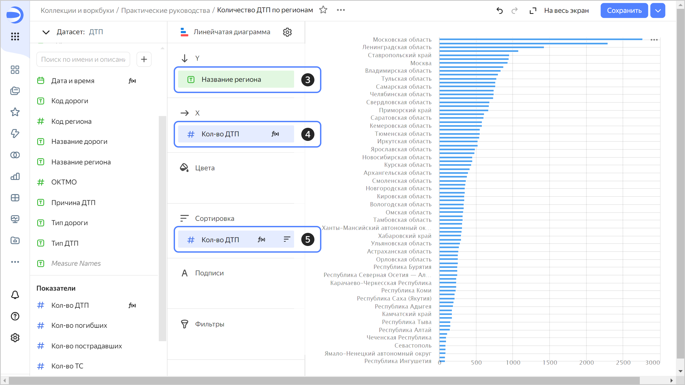

   На диаграмме отобразится количество ДТП по регионам. Больше всего ДТП в Московской области.

   

   Не все линии диаграммы подписаны. Если линия не подписана, наведите на нее указатель, и название региона отобразится в подсказке.

   

1. Сохраните чарт — в правом верхнем углу нажмите кнопку **Сохранить**.

Чтобы проанализировать смертность в ДТП по регионам, создайте еще одну линейчатую диаграмму:

1. Создайте копию чарта `Количество ДТП по регионам`:

   1. В правом верхнем углу нажмите значок  → **Сохранить как копию**.
   1. В открывшемся окне введите название нового чарта `Смертность по регионам` и нажмите кнопку **Сохранить**.

1. Замените показатель количества ДТП на показатель смертности в ДТП на оси X. Для этого из раздела **Показатели** перетащите поле `Смертность в ДТП` в секцию **X** и наведите его над полем `Кол-во ДТП`, пока то не станет красным.
1. Смените сортировку по количеству ДТП на сортировку по убыванию смертности в ДТП. Для этого из раздела **Показатели** перетащите поле `Смертность в ДТП` в секцию **Сортировка** и наведите его над полем `Кол-во ДТП`, пока то не станет красным.

   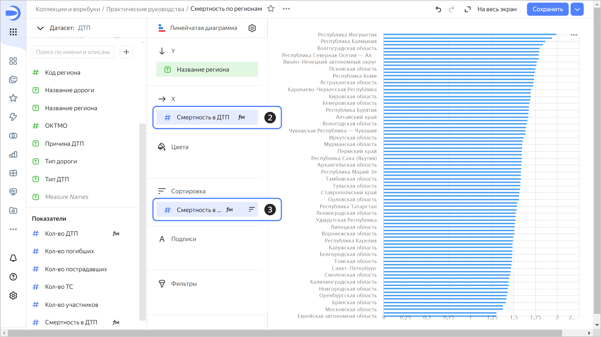

   На этот раз в лидерах с большим отрывом Ингушетия, Калмыкия и Волгоградская область.

1. Сохраните чарт — в правом верхнем углу нажмите кнопку **Сохранить**.

## Проанализируйте статистику по неделям, дням недели и времени суток {#create-line-chart}

Посмотрите, как распределяется количество ДТП и смертность в них по неделям, дням недели и времени суток.

1. Проанализируйте количество ДТП и смертность по неделям:

   1. Создайте копию чарта, созданного на предыдущем шаге:

      1. В правом верхнем углу нажмите значок  → **Сохранить как копию**.
      1. В открывшемся окне введите название нового чарта `Кол-во ДТП и смертность по неделям` и нажмите кнопку **Сохранить**.

   1. Выберите тип визуализации **Линейная диаграмма**.

      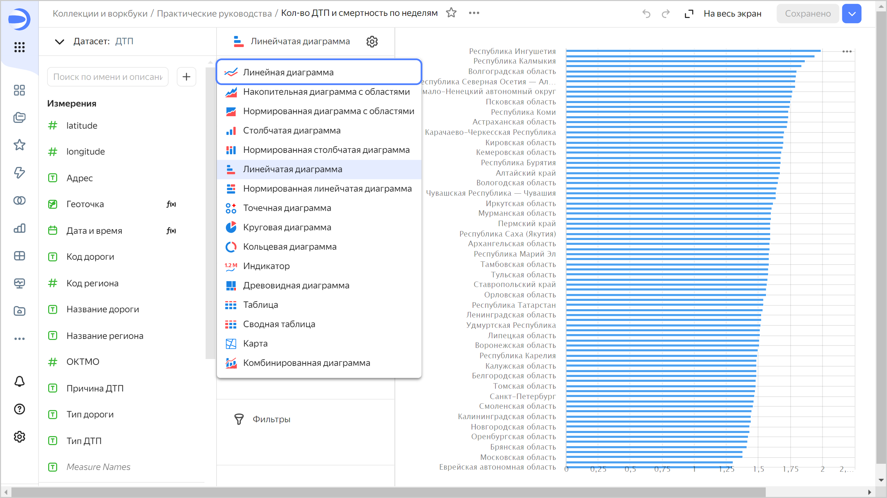

   1. Удалите поля во всех секциях чарта. Для этого в секции напротив поля нажмите значок  (значок появляется при наведении указателя на поле).
   1. Добавьте в чарт дату и время ДТП. Для этого из раздела **Измерения** перетащите поле `Дата и время` в секцию **X**.
   1. Сгруппируйте даты по неделям:

      1. Нажмите на иконку с календарем у поля `Дата и время` в секции **X**.
      1. В поле **Группировка** выберите **Часть даты** ⟶ **Неделя**, затем нажмите **Применить**.

      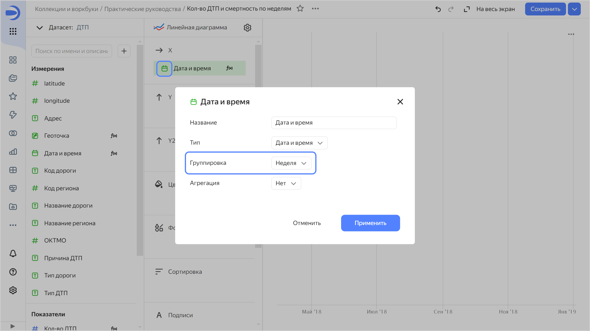

   1. Перетащите:

      * поле `Кол-во ДТП` — в секцию **Y**;
      * поле `Смертность в ДТП` — в секцию **Y2**.

      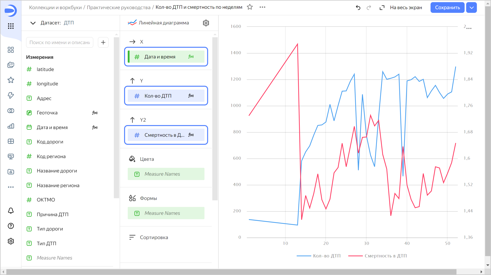

      Появится диаграмма с двумя графиками — количества ДТП и смертности. Если навести указатель на точку графика, в подсказке отобразятся конкретные значения.

   1. Сохраните чарт — в правом верхнем углу нажмите кнопку **Сохранить**.

1. Проанализируйте количество ДТП и смертность по дням недели:

   1. Создайте копию чарта, созданного на предыдущем шаге:

      1. В правом верхнем углу нажмите значок  → **Сохранить как копию**.
      1. В открывшемся окне введите название нового чарта `Кол-во ДТП и смертность по дням недели` и нажмите кнопку **Сохранить**.

   1. Измените группировку по дате и времени на **Часть даты** ⟶ **День недели**.

      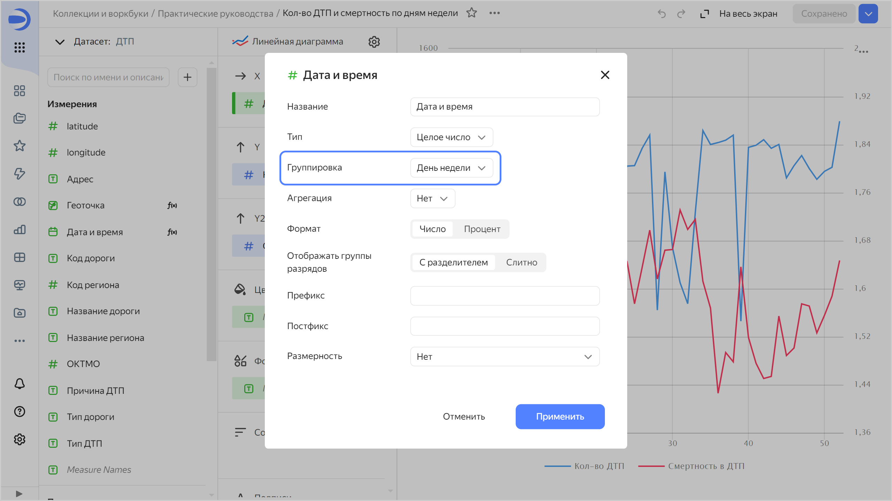

      На этой диаграмме заметны более явные тенденции — оба показателя увеличиваются ближе к концу недели.

      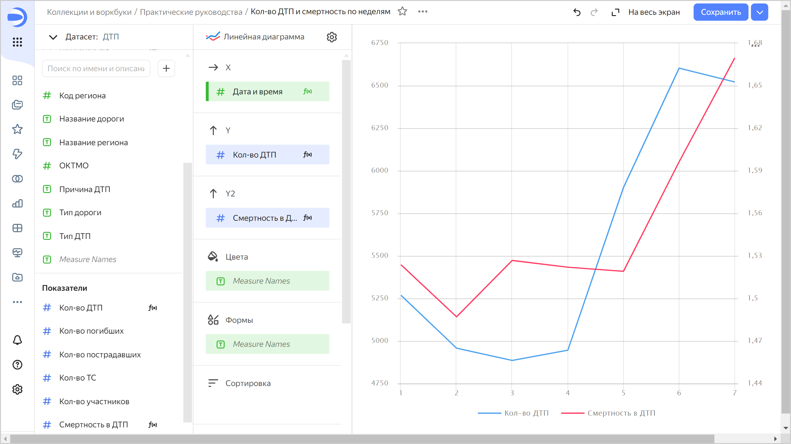

   1. Сохраните чарт — в правом верхнем углу нажмите кнопку **Сохранить**.

1. Проанализируйте количество ДТП и смертность по часам суток.

   1. Создайте копию чарта, созданного на предыдущем шаге:

      1. В правом верхнем углу нажмите значок  → **Сохранить как копию**.
      1. В открывшемся окне введите название нового чарта `Кол-во ДТП и смертность по часам в течение дня` и нажмите кнопку **Сохранить**.

   1. Измените группировку по дате и времени, укажите: **Часть даты** ⟶ **Час**.

      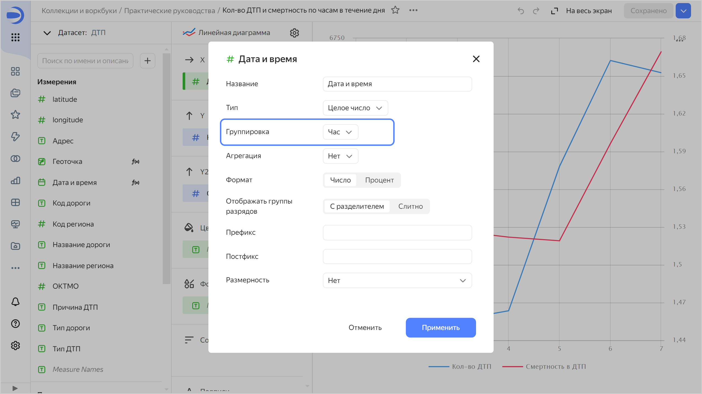

      Диаграмма показывает: ночью количество ДТП меньше, но среди них больше происшествий со смертельным исходом.

      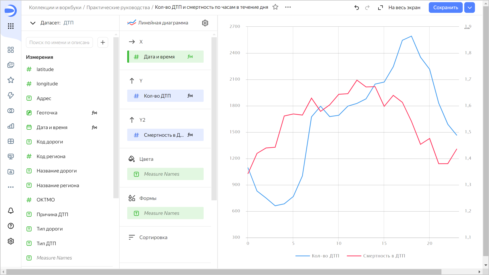

   1. Сохраните чарт — в правом верхнем углу нажмите кнопку **Сохранить**.

## Создайте карту с заливкой регионов {#create-map-geopolygon-chart}

1. Создайте копию чарта, созданного на предыдущем шаге:

   1. В правом верхнем углу нажмите значок  → **Сохранить как копию**.
   1. В открывшемся окне введите название нового чарта `Карта регионов` и нажмите кнопку **Сохранить**.

1. Выберите тип визуализации **Карта**.
1. Выберите тип слоя **Полигоны (Геополигоны)**.

   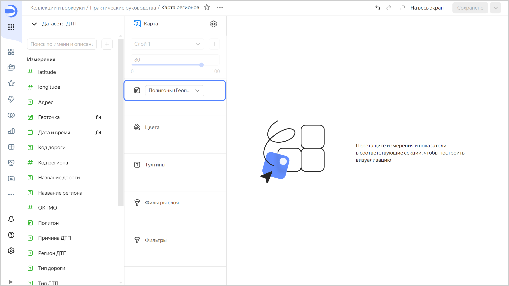

1. Добавьте полигоны на карту. Из раздела **Измерения** перетащите поле `Полигон` в секцию **Геополигоны**.

1. Измените цвета полигонов относительно показателя количества ДТП. Для этого из раздела **Показатели** перетащите поле `Кол-во ДТП` в секцию **Цвета**.

1. Перетащите следующие поля в раздел **Тултипы**:

   * `Название региона`;
   * `Кол-во ДТП`;
   * `Кол-во погибших`;
   * `Кол-во пострадавших`;
   * `Кол-во ТС`;
   * `Кол-во участников`;
   * `Смертность в ДТП`.

   На диаграмме отобразится карта с заливкой регионов. Если навести указатель на регион, появятся сведения по этому региону.

   

1. Сохраните чарт — в правом верхнем углу нажмите кнопку **Сохранить**.

## Создайте дашборд и добавьте на него чарты {#create-dashboard}

Создайте [дашборд](../../datalens/concepts/dashboard.md), на который будут добавлены чарты и другие виджеты:

1. На панели слева выберите  **Коллекции и воркбуки** и перейдите в воркбук `Практические руководства`.
1. В правом верхнем углу нажмите **Создать** →  **Дашборд**.

1. На панели в нижней части страницы выберите виджет **Чарт**.

   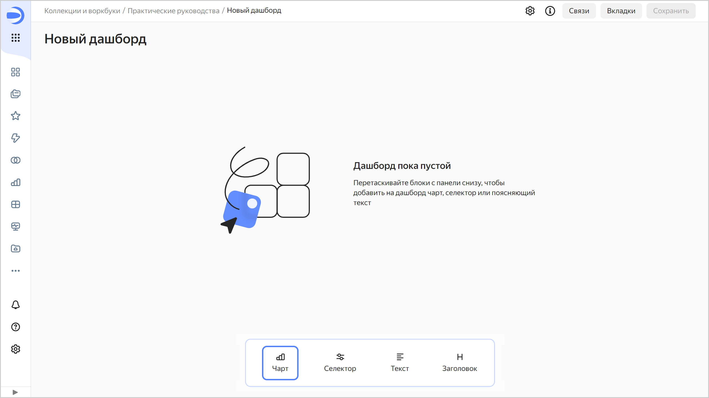

1. В открывшемся окне нажмите кнопку **Выбрать**.
1. Выберите чарт `Тепловая карта ДТП`.
1. Нажмите кнопку **Добавить**.

   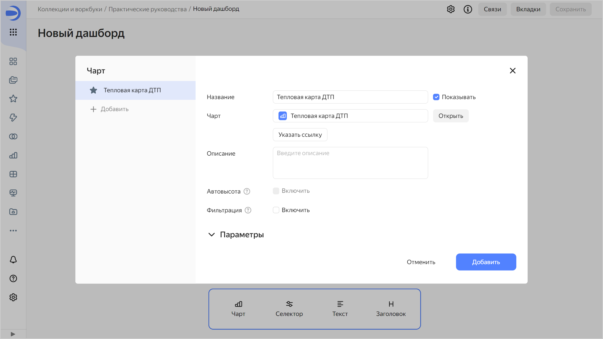

1. Повторите шаги 3-6, чтобы добавить на дашборд чарты:

   * `Количество ДТП по регионам`
   * `Кол-во ДТП и смертность по неделям`
   * `Кол-во ДТП и смертность по дням недели`
   * `Кол-во ДТП и смертность по часам в течение дня`

1. Создайте на дашборде виджет с двумя вкладками:

   1. В правом верхнем углу чарта `Количество ДТП по регионам` нажмите значок .
   1. В левой части окна нажмите кнопку **Добавить**.
   1. На новой вкладке нажмите кнопку **Выбрать**.
   1. Выберите чарт `Смертность по регионам`.
   1. Нажмите кнопку **Сохранить**.

   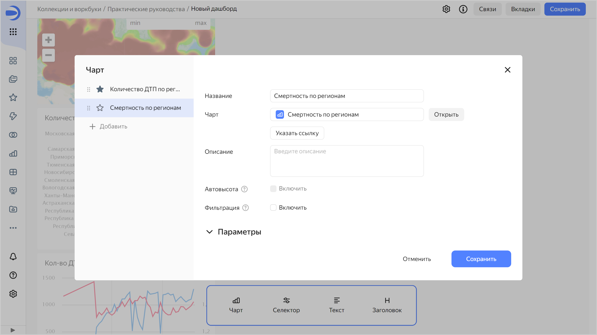

1. Установите размеры чартов с помощью мыши и расположите их на дашборде в удобном для вас порядке.

   

## Добавьте селекторы на дашборд {#add-selectors}

[Селекторы](../../datalens/concepts/dashboard.md#selector) позволяют фильтровать данные по значениям.

1. Добавьте виджет для фильтрации данных:

   1. На панели в нижней части страницы выберите виджет **Селектор**.

      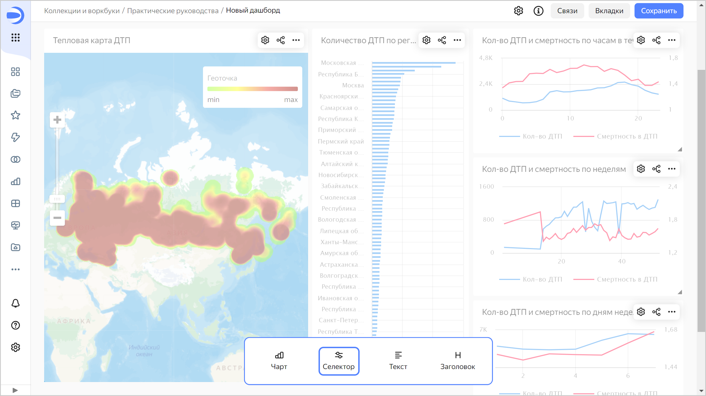

   1. Выберите датасет `ДТП`.
   1. Выберите поле `Название региона`.

      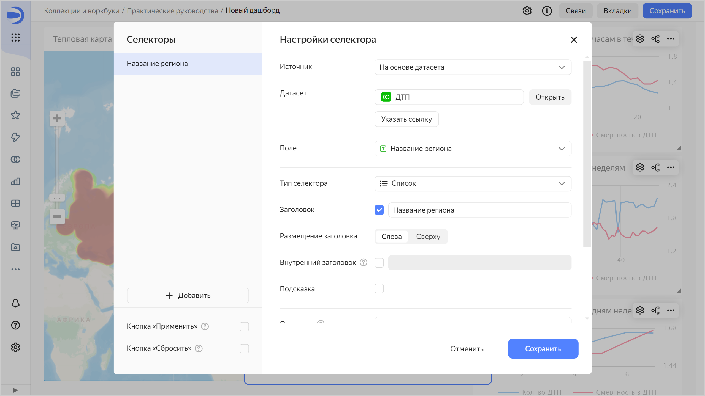

   1. Добавьте в виджет селекторы по полям:

      * `Название дороги`
      * `Причина ДТП`
      * `Тип ДТП`
      * `Тип дороги`

      Для этого слева в блоке **Селекторы** нажмите кнопку  **Добавить** и выберите название поля.

      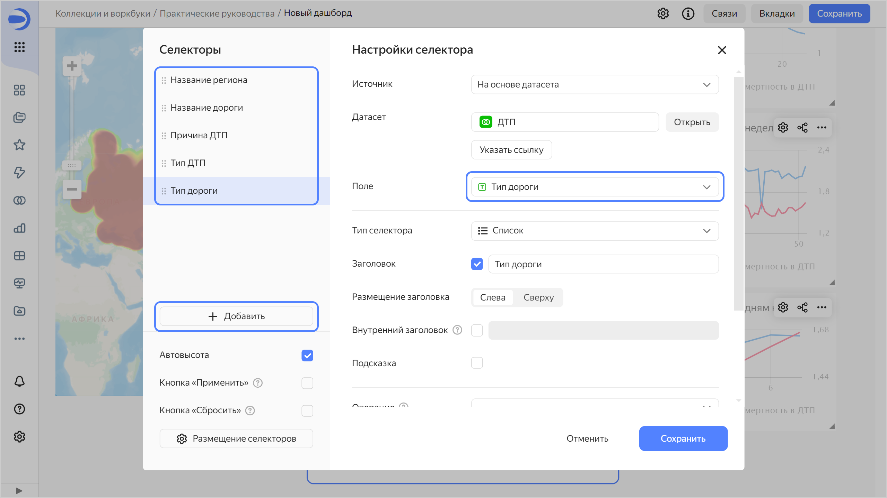

   1. Нажмите кнопку **Сохранить**.

1. Расположите виджет на дашборде в удобном для вас месте.

   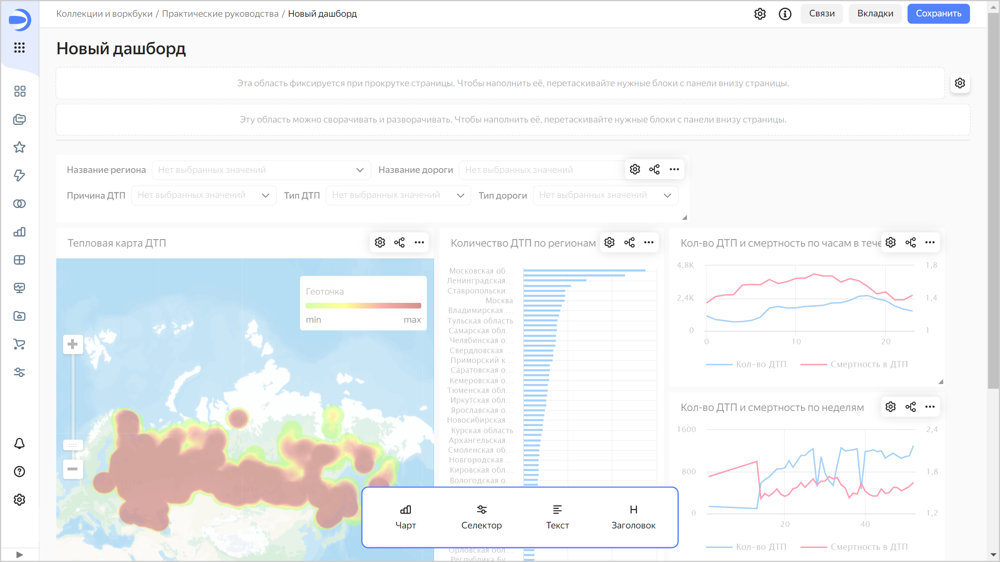

1. Сохраните дашборд:

   1. В правом верхнем углу дашборда нажмите кнопку **Сохранить**.
   1. Введите название дашборда `ДТП в РФ` и нажмите кнопку **Создать**.

Дашборд готов.

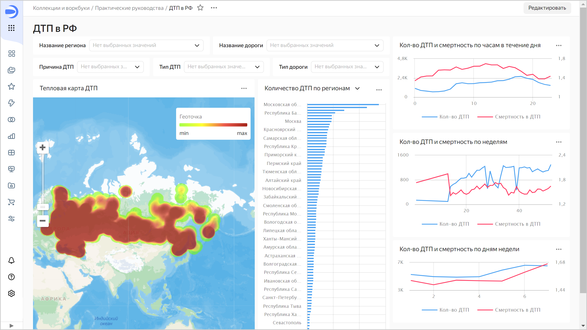

На дашборде вы можете:

* Выбрать значения в селекторах, чтобы фильтровать данные.
* Изменить масштаб карты.
* Переключить чарт `Количество ДТП по регионам` на `Смертность по регионам` и обратно. Для этого справа от названия чарта нажмите значок  и выберите нужную вкладку.

## Добавьте карту с заливкой регионов на дашборд {#add-geopolygon-chart}

1. Справа вверху нажмите кнопку **Редактировать**.
1. В правом верхнем углу чарта `Тепловая карта ДТП` нажмите значок .
1. В левой части окна нажмите кнопку **Добавить**.
1. На новой вкладке нажмите кнопку **Выбрать**.
1. Выберите чарт `Карта регионов`.
1. Нажмите кнопку **Сохранить**.

   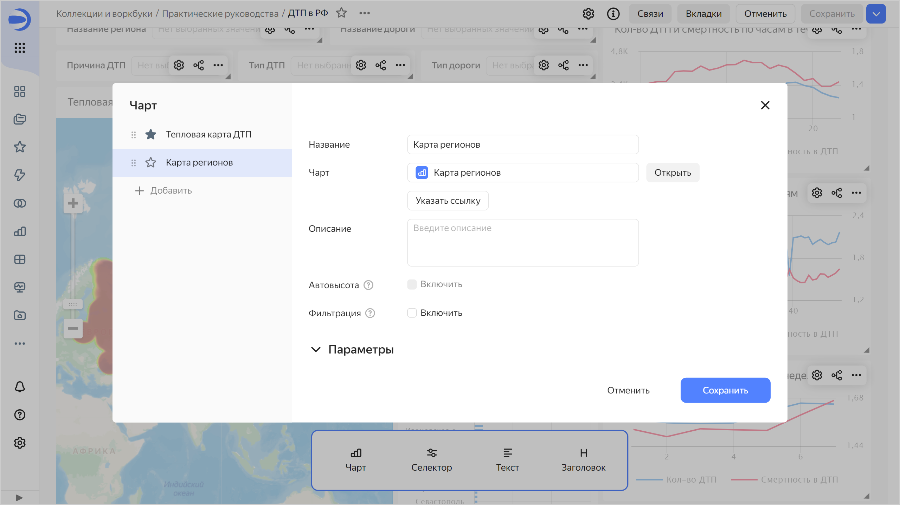

1. В правом верхнем углу нажмите кнопку **Сохранить**.

Теперь можно переключаться между чартами: тепловая карта с плотностью ДТП или карта с заливкой регионов.

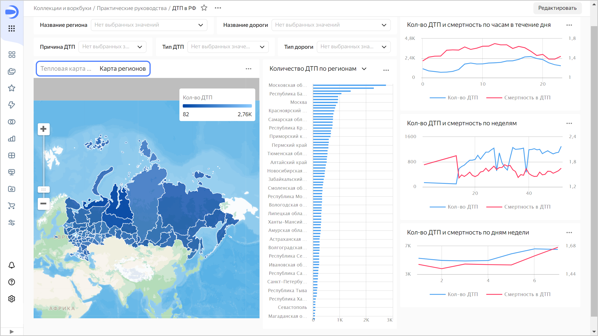

## Опубликуйте дашборд {#publish-dashboard}

Чтобы настроить публичный доступ к дашборду:

1. Вверху нажмите значок  →  **Публичный доступ**.
1. В открывшемся окне напротив названия дашборда включите опцию для открытия доступа по ссылке.
1. Нажмите кнопку **Продолжить**, чтобы подтвердить публикацию дашборда и связанных с ним данных.
1. Нажмите кнопку **Скопировать ссылку**, чтобы скопировать уникальный URL дашборда.

   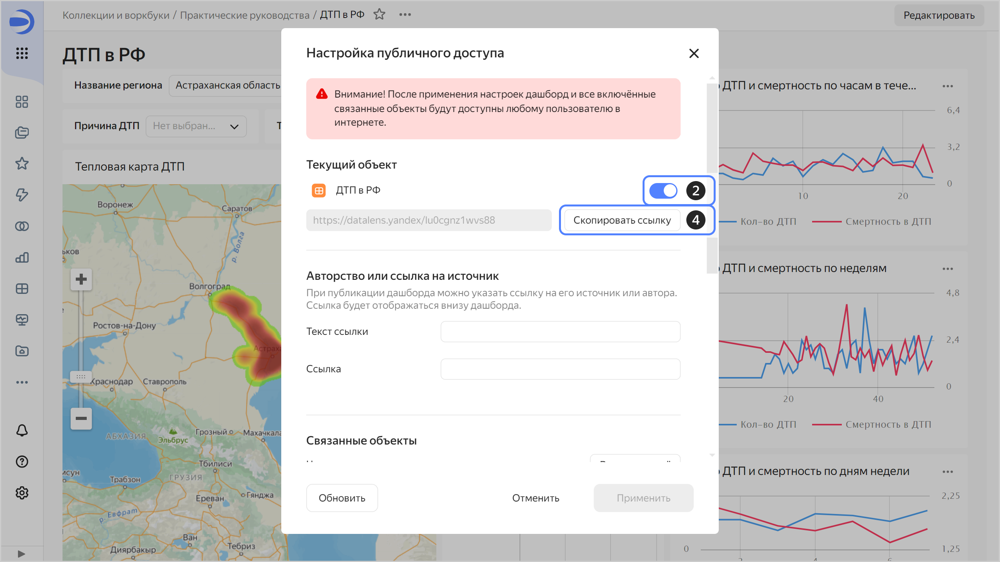

1. Нажмите кнопку **Применить**.
1. Откройте новую вкладку в браузере и перейдите по скопированной ссылке.

   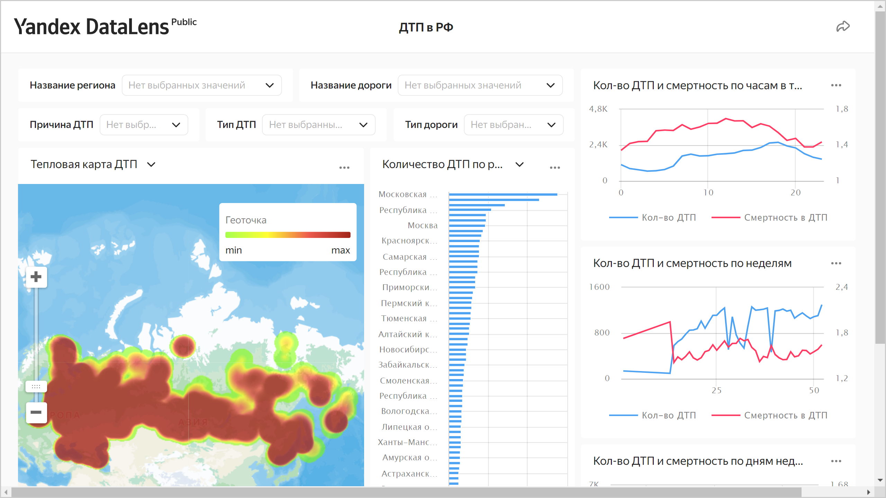

   Этой ссылкой можно поделиться с коллегами, партнерами или друзьями. При переходе по ссылке дашборда не требуется авторизация и аутентификация.

   

   Вы можете включить или выключить публичный доступ отдельно для каждого чарта и датасета, связанного с дашбордом.

   

   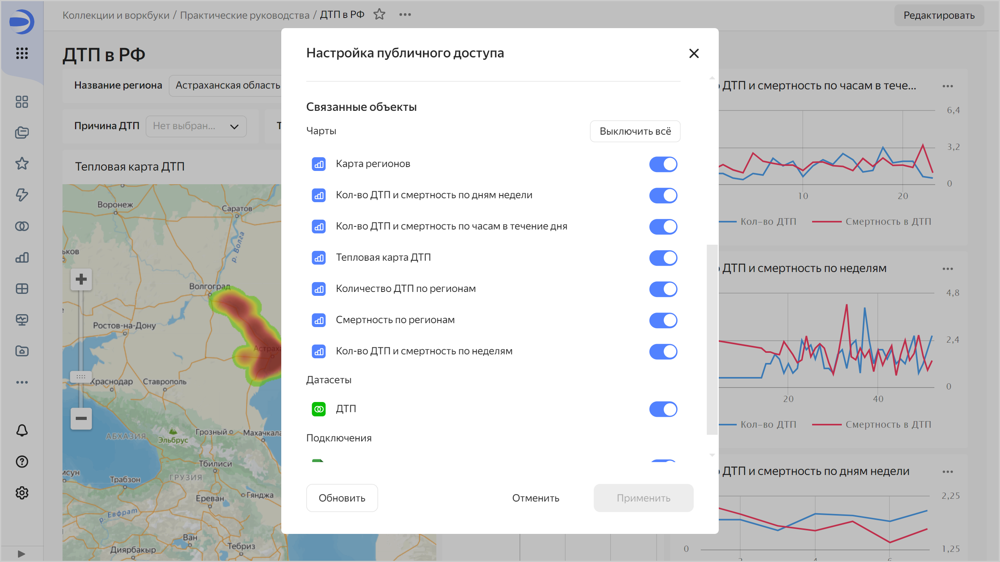

   

   

