# Анализ открытых данных ДТП на дорогах России

В этом сценарии будут [проанализированы открытые данные](../../glossary/data-analytics.md) по дорожно-транспортным происшествиям на дорогах РФ. Помимо выявления фактов статистики ДТП в России, в процессе анализа вы научитесь:

* работать с основными сущностями {{ datalens-short-name }}: Подключения, Датасеты, Чарты, Дашборды;
* объединять несколько источников на уровне одного датасета;
* работать с типом данных `Дата и время`, изменять группировки на уровне чарта;
* работать с геоданными: геоточками и геополигонами;
* создавать публичные дашборды, которые будут доступны всем с любых устройств без аутентификации.

Для визуализации и исследования данных [подготовьте {{ datalens-short-name }} к работе](#before-you-begin), затем выполните следующие шаги:

1. [Создайте подключение к CSV-файлу](#step1).
1. [Создайте датасет и настройте его поля](#step2).
1. [Создайте первый чарт — Тепловую карту](#step3).
1. [Создайте второй чарт — Линейчатую диаграмму](#step4).
1. [Создайте еще чарты — Линейные диаграммы](#step5).
1. [Создайте дашборд](#step6).
1. [Добавьте чарты на дашборд](#step7).
1. [Добавьте селекторы и сформируйте дашборд](#step8).
1. [Подключите дополнительный источник с геослоями регионов](#step9).
1. [Добавьте новые поля в датасет](#step10).
1. [Создайте чарт с использованием новых полей](#step11).
1. [Добавьте новый чарт на дашборд](#step12).
1. [Опубликуйте дашборд](#step13).

## Перед началом работы {#before-you-begin}



## Шаг 1. Создайте подключение к CSV-файлу {#step1}

1. Скачайте [файл с данными статистики ДТП](https://storage.yandexcloud.net/doc-files/dtp201804-1.csv) за апрель-декабрь 2018 года в формате CSV.

1. Откройте главную страницу [{{ datalens-short-name }}]({{ link-datalens-main }}).
1. На панели слева выберите  **Подключения** и нажмите кнопку **Создать подключение**.
1. Выберите тип подключения **Файлы**.

   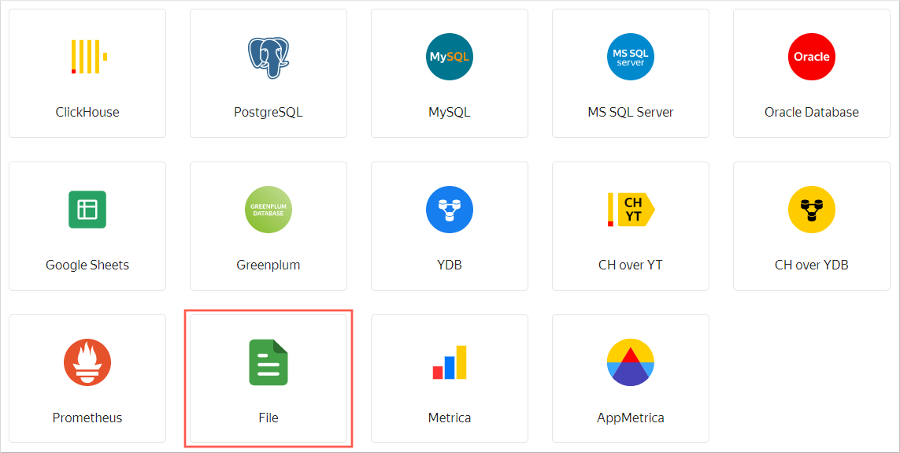

1. Нажмите кнопку **Загрузить файлы**, затем выберите скачанный ранее файл. Загрузка может занять до нескольких минут, в зависимости от скорости подключения к интернету.

   

   После успешной загрузки вы увидите превью данных файла. Для просмотра используйте полосы прокрутки справа и внизу.

   

1. В правом верхнем углу нажмите кнопку **Создать подключение**.
1. Введите имя подключения `dtp_data` и нажмите кнопку **Создать**.

Подключение к файлу создано. Данные представлены в том же виде, что и в файле. Для дальнейшей работы с ними нужно создать датасет.

## Шаг 2. Создайте датасет и настройте его поля {#step2}

Датасет будет состоять из одного источника — файла CSV.

1. Нажмите кнопку **Создать датасет**.

   

1. Перейдите на вкладку **Поля**.

   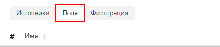

   Здесь есть возможность добавить [поля данных](../../datalens/concepts/dataset/data-model.md#field) и [вычисляемые поля](../../datalens/concepts/calculations/index.md), изменить тип данных поля, правила агрегации, переименовать поле.

   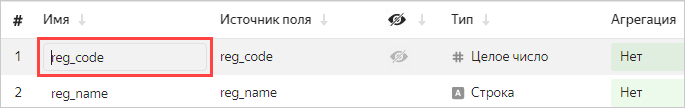

1. Измените имена полей на русские, по порядку:

   - Код региона
   - Название региона
   - Код дороги
   - Название дороги
   - Тип дороги
   - ОКТМО
   - Адрес
   - Тип ДТП

   

1. Дата и время ДТП показаны в следующих полях:

   - crash_date — дата, записанная числом, вида `20190218`;
   - crash_time — время, записанное текстом, вида `19:34`.

   В таком виде они не будут использоваться в датасете. Скройте их, нажав значок видимости.

   

1. Для отображения сведений о дате и времени ДТП добавьте новое поле.

   1. Нажмите **Добавить поле**.

      

   1. Укажите для него данные:

      - **Название поля**: Дата и время
      - **Формула**: `DATETIME_PARSE(str([crash_date])+' '+str([crash_time]))`

      

      Чтобы избежать ошибок, не вводите поля для формулы вручную, а выбирайте их из списка слева.

      

      

      

      Если хотите самостоятельно изучить документацию по этим функциям, нажмите справа вверху диалогового окна кнопку **Справочник**.

      

   1. Нажмите **Создать**.

   В разделе предпросмотра появилось корректное отображение даты и времени ДТП в виде значения типа `Дата и время` с разделителем **T**. Новое поле **Дата и время** находится в таблице сверху. По значку  доступно редактирование формулы поля.

   
   
1. Продолжите переименование полей по порядку:

   - Причина ДТП
   - Кол-во погибших
   - Кол-во пострадавших
   - Кол-во ТС
   - Кол-во участников

   Для следующих полей установите тип агрегации **Сумма**:

   - Кол-во погибших
   - Кол-во пострадавших
   - Кол-во ТС
   - Кол-во участников

   

1. Добавьте поле для отображения геоточки.

   1. Справа вверху нажмите кнопку **Добавить поле**.

      

   1. Введите данные для нового поля:

      - **Название поля**: Геоточка
      - **Формула**: `GEOPOINT([latitude],[longitude])`

      где [latitude] и [longitude] — поля датасета.

      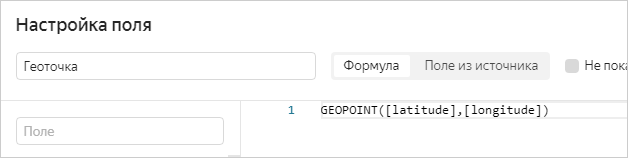

   1. Нажмите **Создать**.

      
      
      
      В примере используются готовые данные в формате координат. 

      

   1. Убедитесь, что в таблице и превью появилось новое поле с типом `Геоточка`.

      

1. Добавьте поле для отображения количества ДТП.

   1. Нажмите **Добавить поле**.

      

   1. Введите данные для нового поля:

      - **Название поля**: Кол-во ДТП
      - **Формула**: `SUM(1)`

      

   1. Нажмите **Создать**. 

   Тип агрегации для этого поля устанавливать не нужно, {{ datalens-short-name }} при добавлении поля на чарт применит функцию агрегации автоматически.

1. Добавьте поле для данных о смертности в ДТП.

   1. Нажмите **Добавить поле**.

      

   1. Введите данные для нового поля:

      - **Название поля**: Смертность в ДТП
      - **Формула**: `[Кол-во погибших]/[Кол-во ДТП]`

      

   1. Нажмите **Создать**

   

   Вычисляемые поля можно создавать непосредственно в чарте. Однако удобнее сделать это на уровне датасета, чтобы они были доступны во всех чартах.

   

1. Сохраните датасет, нажав справа вверху кнопку **Сохранить**.

1. В открывшемся окне укажите название датасета: **ДТП**. Нажмите **Создать**.

Датасет создан.

## Шаг 3. Создайте первый чарт — Тепловую карту {#step3}

Приступайте к созданию первого [чарта](../../datalens/concepts/chart/index.md).

1. Нажмите **Создать чарт**.

   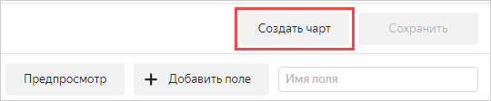

1. В появившемся окне визарда нажмите на поле, в котором по умолчанию указано **Столбчатая диаграмма**, и выберите тип чарта **Карта**.

   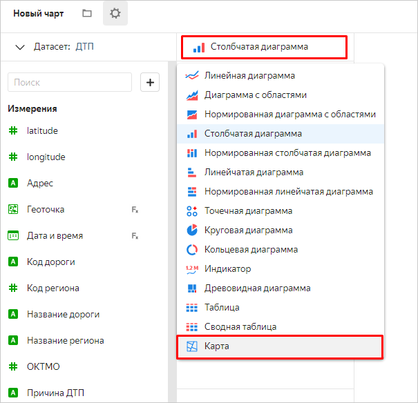

1. Выберите в разделе **Геоточки** тип слоя **Геоточки (тепловая карта)**.

   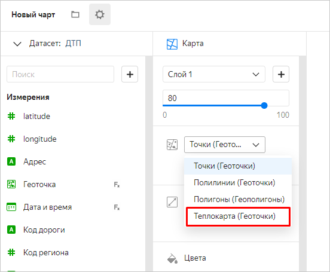

1. Перетащите поле **Геоточка** в раздел **Геоточки**.

   

   Вы получили первый чарт на карте.

1. Для сохранения чарта сначала рядом с кнопкой **Сохранить** нажмите значок стрелки, затем выберите **Сохранить как**.

   

1. В диалоговом окне укажите название чарта: **Тепловая карта** и нажмите **Сохранить**.

## Шаг 4. Создайте второй чарт — Линейчатую диаграмму {#step4}

1. Проанализируйте количество ДТП по регионам. 

   1. В том же окне выберите тип чарта **Линейчатая диаграмма**.

      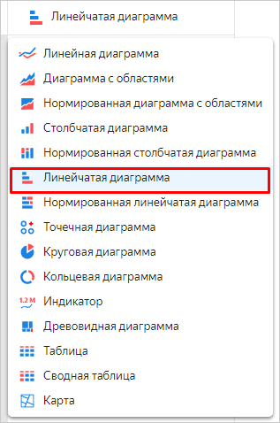

   1. Перетащите:

      - поле **Название региона** — в раздел **Y**;
      - поле **Кол-во ДТП** — в раздел **X**;
      - поле **Кол-во ДТП** — в раздел **Сортировка**.

      

      На диаграмме отобразилось количество ДТП по регионам. Больше всего ДТП в Московской области.

      

      Не все линии диаграммы подписаны. Если линия не подписана, наведите на нее указатель, и название региона отобразится в подсказке.

      

   1. Сохраните диаграмму по кнопке **Сохранить как**.

   1. В открывшемся окне укажите название чарта: **Количество ДТП по регионам** и сохраните его.

1. Проанализируйте смертность в ДТП по регионам.

   1. Замените показатель **Кол-во ДТП** на **Смертность в ДТП** с помощью перетаскивания.

      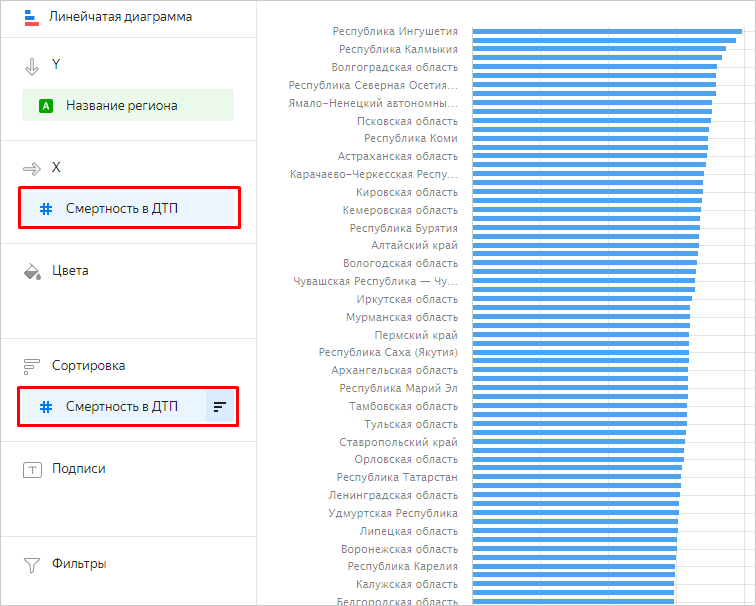

      На этот раз в лидерах с большим отрывом Ингушетия, Калмыкия и Волгоградская область.

   1. Сохраните чарт по кнопке **Сохранить как** с названием **Смертность по регионам**.

## Шаг 5. Создайте еще чарты — Линейные диаграммы {#step5}

Посмотрите, как распределяется количество ДТП и смертность в них по неделям, дням недели и времени суток.

1. Проанализируйте количество ДТП и смертность по неделям.

   1. В том же окне выберите тип чарта **Линейная диаграмма**.

      

   1. В разделах управления чартом остались предыдущие значения. Удалите их с помощью значка .

   1. Перетащите поле **Дата и время** в раздел **X** и нажмите зеленый значок календаря.

      

   1. В поле **Группировка** выберите **Часть даты** ⟶ **Неделя**, затем нажмите **Применить**.

      

   1. Перетащите:
      - поле **Кол-во ДТП** — в раздел **Y**;
      - поле **Смертность в ДТП** — в раздел **Y2**.

      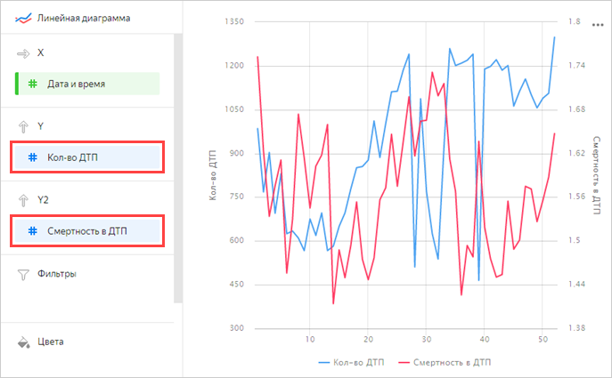

      Появилась диаграмма с двумя графиками — количества ДТП и смертности. Если навести указатель на точку графика, в подсказке отобразятся конкретные значения.

   1. Сохраните чарт по кнопке **Сохранить как** с названием **Кол-во ДТП и смертность по неделям**.

1. Теперь проанализируйте количество ДТП и смертность по дням недели.

   1. Измените группировку по дате и времени на **Часть даты** ⟶ **День недели**.

      

      На этой диаграмме заметны более явные тенденции.

      

   1. Сохраните чарт по кнопке **Сохранить как** с названием **Кол-во ДТП и смертность по дням недели**.

1. Проанализируйте количество ДТП и смертность по часам суток.

   1. Измените группировку по дате и времени, укажите: **Часть даты** ⟶ **Час**.

      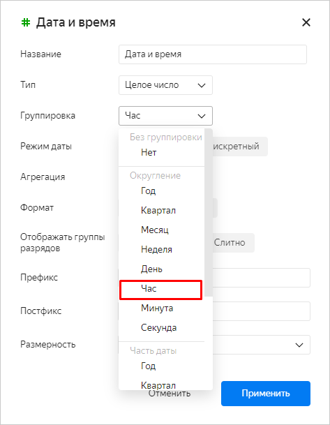

      Диаграмма показывает: ночью количество ДТП меньше, но среди них больше происшествий со смертельным исходом.

      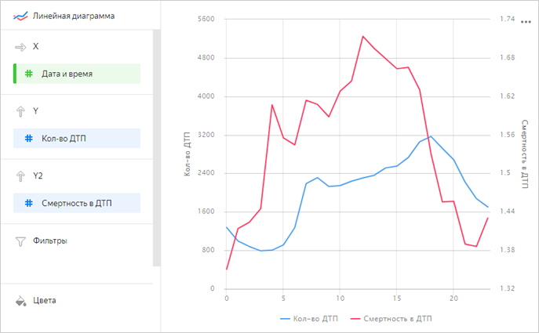

   1. Сохраните чарт по кнопке **Сохранить как** с названием **Кол-во ДТП и смертность по часам в течение дня**.

## Шаг 6. Создайте дашборд {#step6}

1. Откройте меню по значку слева от логотипа и выберите пункт **Дашборды**.

   

1. Нажмите кнопку **Создать дашборд**.

   

1. Введите название дашборда **ДТП в РФ** и нажмите **Создать**.



Если это первый дашборд, созданный в каталоге, он откроется сразу после создания. Если в каталоге уже есть другие дашборды, то откроется их список. В этом случае нужно из списка открыть дашборд **ДТП в РФ**.



## Шаг 7. Добавьте чарты на дашборд {#step7}

1. Добавьте первый чарт.

   1. Нажмите **Добавить** и в выпадающем списке выберите **Чарт**.

      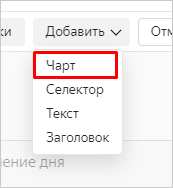

   1. В поле **Чарт** нажмите **Выбрать** и выберите из списка чартов созданный ранее чарт **Тепловая Карта**.

      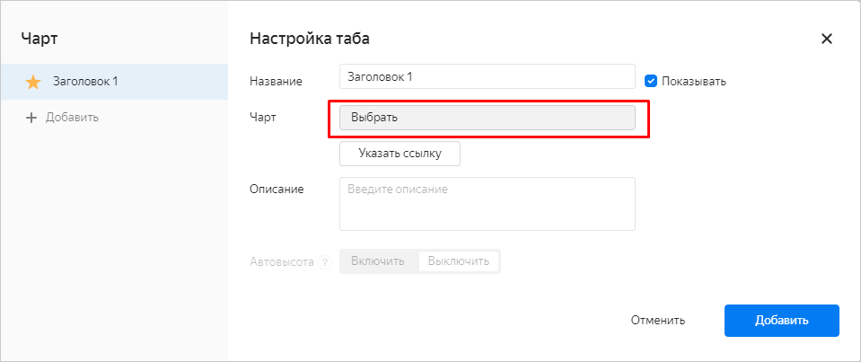

   1. Нажмите кнопку **Добавить**.

      Чарт появился на дашборде.

1. Повторите предыдущие три шага для чартов **Количество ДТП по регионам**, **Кол-во ДТП и смертность по неделям**, **Кол-во ДТП и смертность по дням недели**, **Кол-во ДТП и смертность по часам в течение дня**, добавив их на дашборд.

1. Создайте на дашборде переключатель чартов **Количество ДТП по регионам** и **Смертность по регионам**.

   1. Откройте настройки чарта **Количество ДТП по регионам** по значку.

      

   1. В левой части окна нажмите **Добавить**.

      

   1. В поле **Чарт** нажмите **Выбрать** и выберите чарт **Смертность по регионам**.

      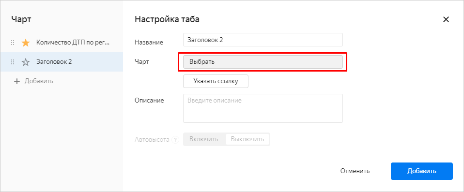

   1. Нажмите **Сохранить**.

## Шаг 8. Добавьте селекторы и сформируйте дашборд {#step8}

[Селекторы](../../datalens/concepts/dashboard.md#selector) позволяют фильтровать данные по значениям.

1. Добавьте селектор для отбора по названию региона.

   1. Нажмите **Добавить** и выберите **Селектор**.

      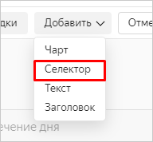

   1. Отметьте **На основе датасета**, затем нажмите **Выбрать** и выберите созданный ранее датасет **ДТП**.

      

   1. В реквизите **Поле** выберите **Название региона**, затем рядом с названием селектора поставьте отметку **Показывать**. Нажмите кнопку **Добавить**.

      

   Селектор появился на дашборде в виде прямоугольного элемента.

1. Повторите предыдущие три шага для полей:

   - Причина ДТП
   - Тип ДТП
   - Тип дороги
   - Название дороги

1. Элементы дашборда можно перетаскивать и менять их размер. Сформируйте расположение элементов в соответствии со скриншотом или любым другим удобным образом, затем сохраните дашборд по кнопке **Сохранить**.

   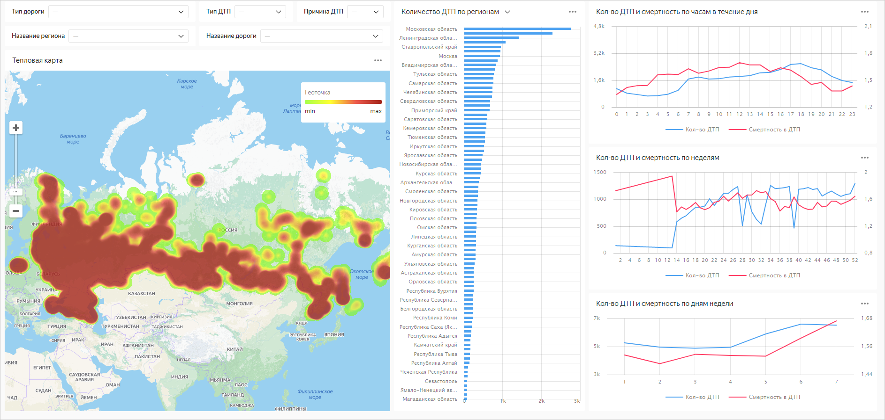

Если в селекторах выбрать значения, на чартах отобразятся данные для этих значений.

Чарт **Количество ДТП по регионам** можно переключить на **Смертность по регионам**.

## Шаг 9. Добавьте таблицу с геослоями регионов {#step9}

Тепловая карта не всегда является самой информативной. Загрузите справочник полигонов и добавьте чарт с цветовой заливкой регионов РФ.

1. Скачайте на свой компьютер файл [**Regions.csv**](https://{{ s3-storage-host }}/doc-files/Regions.csv).
1. Откройте подключение `dtp_data`.
1. Нажмите кнопку **Загрузить файлы** и выберите скачанный файл.
1. Просмотрите превью данных файла. Для параметра **Заголовок столбцов** установите значение **Да**.

   

1. Справа вверху нажмите кнопку **Сохранить изменения**.

## Шаг 10. Добавьте новые поля в датасет {#step10}

Необходимо обогатить созданный ранее датасет **ДТП** новыми полями.

1. Через левое меню перейдите в раздел **Датасеты**.

   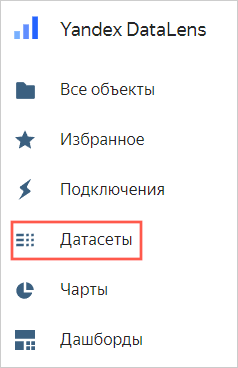

1. Выберите датасет **ДТП**.

   

1. Перейдите на вкладку **Источники**.
1. Перетащите таблицу **Regions.csv** в рабочую область.

   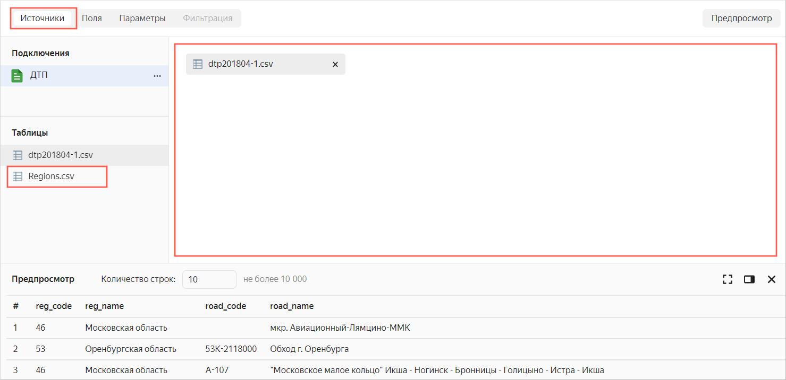

   Поскольку данные таблиц еще не объединены, может появиться сообщение об ошибке. Выполните последующие действия.

1. Нажмите значок объединения данных.

   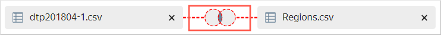

1. Нажмите кнопку **Добавить связь**.

   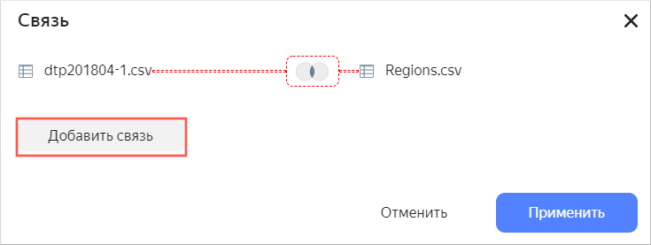

1. Выберите поля, которые будут связаны: **reg_name** и **Регион ДТП**. Затем нажмите **Применить**. 

   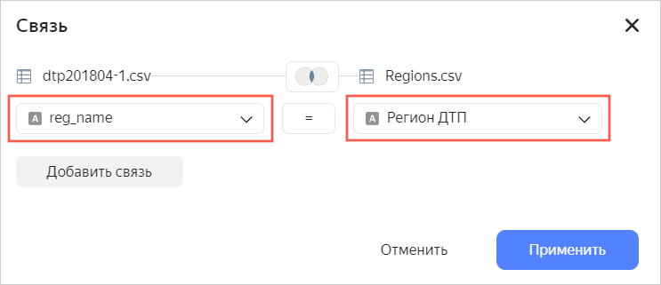

   Убедитесь, что превью данных отобразилось корректно.

   

1. Перейдите на вкладку **Поля**.
1. Внизу списка появились новые поля. Для поля **Полигон** укажите тип данных **Геополигон**.

   

1. В правом верхнем углу нажмите кнопку **Сохранить**.

## Шаг 11. Создайте чарт с использованием новых полей {#step11}

1. Нажмите кнопку **Создать чарт**.

   

1. Выберите тип чарта **Карта**.

   

1. Добавьте полигоны на карту. Из раздела **Измерения** перетащите поле **Полигон** в секцию **Геополигоны**.

1. Измените цвета полигонов относительно показателя количества ДТП. Из раздела **Показатели** перетащите поле **Кол-во ДТП** в секцию **Цвета**.

1. Перетащите следующие поля в раздел **Тултипы**:

   - Название Региона;
   - Кол-во ДТП;
   - Кол-во погибших;
   - Кол-во пострадавших;
   - Кол-во ТС;
   - Кол-во участников;
   - Смертность в ДТП.

   На диаграмме отобразилась карта с заливкой регионов. Если навести указатель на регион, появятся сведения по этому региону.

   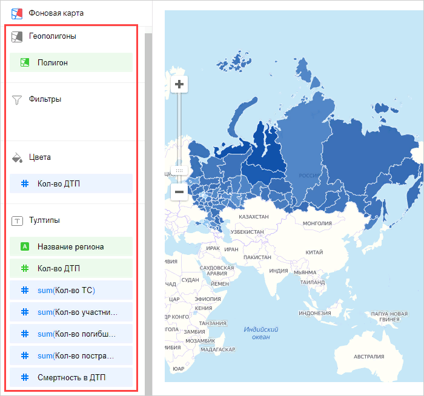

1. В правом вверхнем углу нажмите кнопку **Сохранить**.

1. Введите название чарта: **Карта регионов** и снова нажмите **Сохранить**.

## Шаг 12. Добавьте новый чарт на дашборд {#step12}

1. Через левое верхнее меню перейдите в раздел **Дашборды**.

   

1. Выберите ранее созданный дашборд с ДТП.

   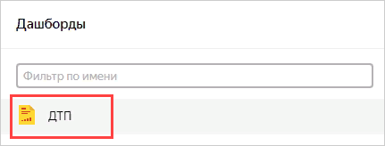

1. Справа вверху нажмите кнопку **Редактировать**.

   

1. Откройте  настройки **Тепловой карты** по значку.

   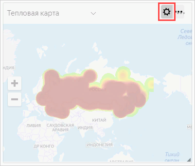

1. В левой части окна нажмите **Добавить**.

   

1. В поле **Чарт** нажмите **Выбрать** и выберите последний чарт **Карта регионов**.

   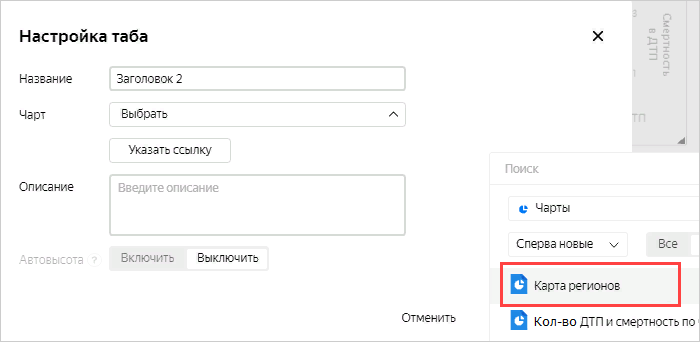

1. Нажмите **Сохранить**.

Появилась возможность переключать тип визуализации данных на карте: тепловая карта или заливка регионов.

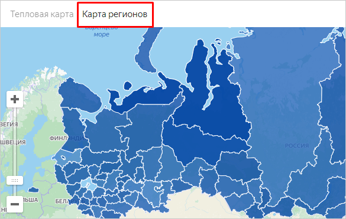

 

## Шаг 13. Опубликуйте дашборд {#step13}

Чтобы настроить публичный доступ к дашборду:

1. В левом верхнем углу экрана нажмите .

   

1. В выпадающем меню нажмите **Публичный доступ**.

   

1. Включите доступ по ссылке. Появившуюся ссылку можно скопировать и делиться ею. По ссылке дашборд будет доступен всем, с любых устройств и без аутентификации. Нажмите **Применить**.

   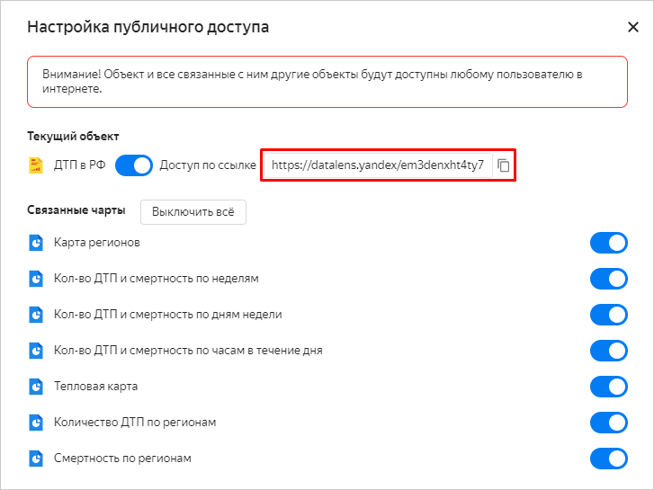

   

   Вы можете включить или выключить публичный доступ отдельно для каждого чарта и датасета, связанного с дашбордом.

   

   Дашборд опубликован и доступен для пользователей.
   
   
   