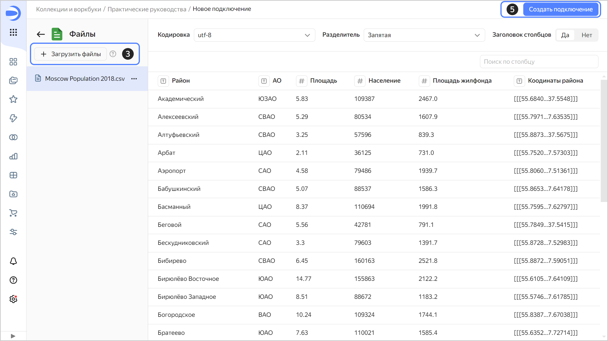
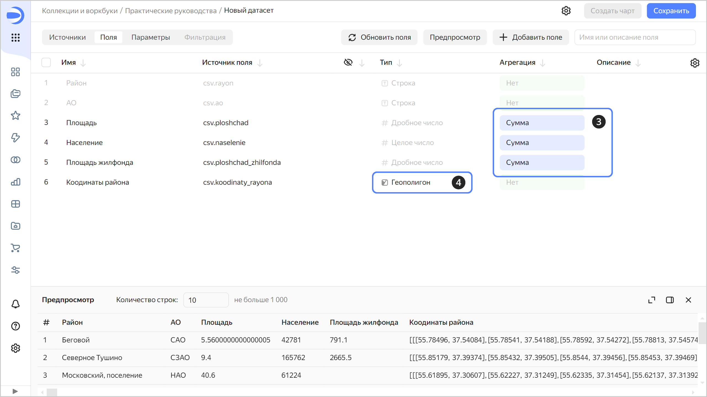
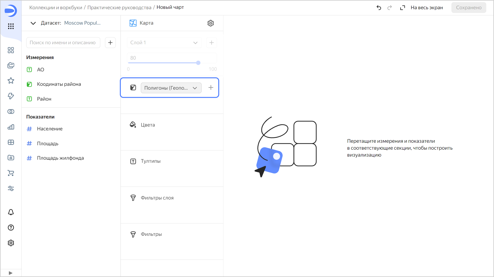
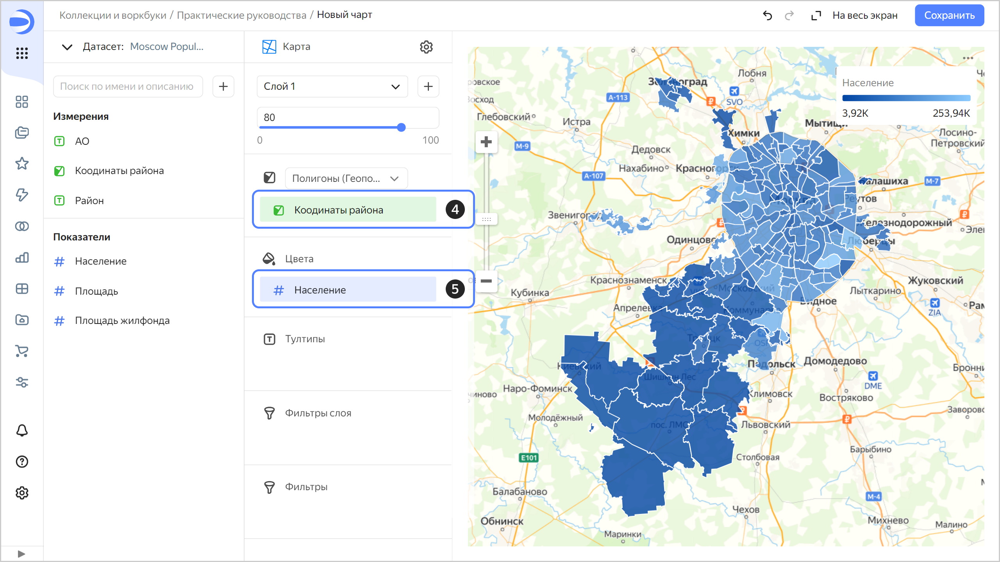
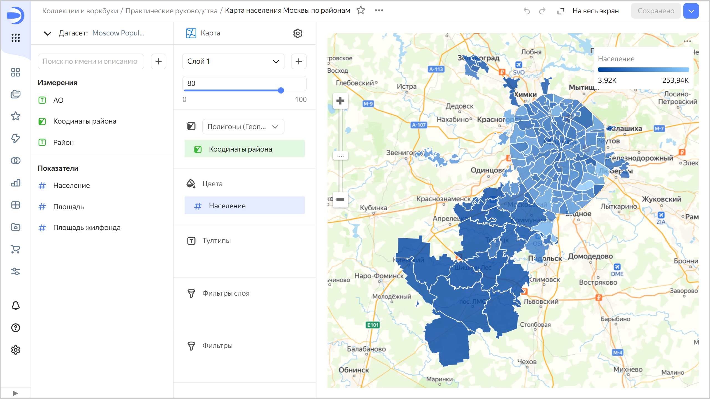
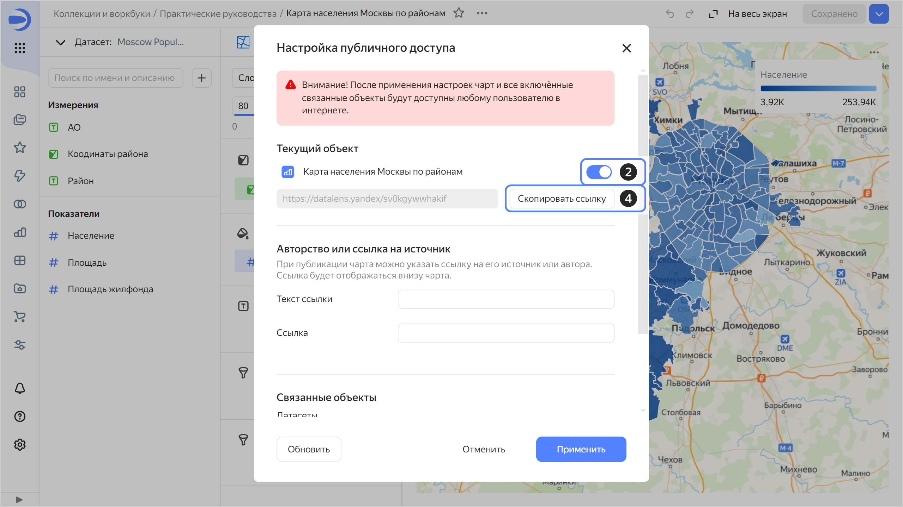
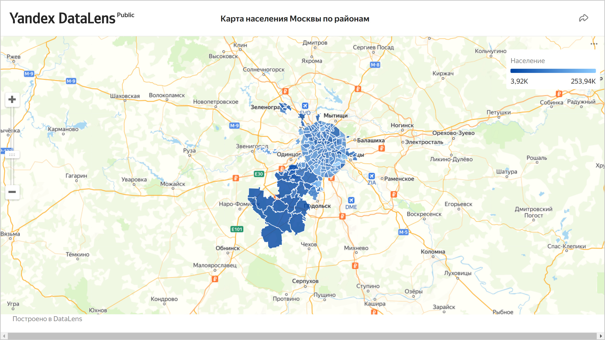
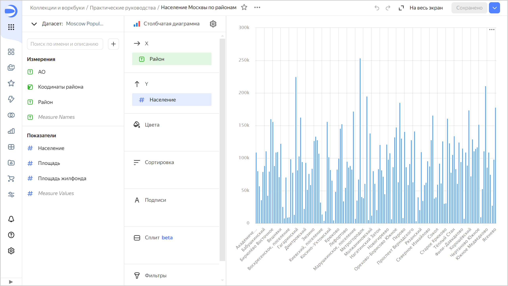

# Публичный чарт с картой Москвы из CSV-файла



В {{ datalens-short-name }} вы можете предоставлять [публичный доступ](../../datalens/concepts/datalens-public.md) к созданным чартам и дашбордам.



Перед публикацией убедитесь, что данные на чартах и дашбордах не являются персональными данными или коммерческой тайной. Доступ к опубликованным данным не ограничен.



В этом руководстве с помощью {{ datalens-short-name }} будут визуализированы и опубликованы показатели населения на карте районов Москвы.

В качестве исходных данных будет использоваться файл `Moscow Population 2018.csv` с информацией о населении и площади Москвы на 2018 год. [Скачайте](https://storage.yandexcloud.net/doc-files/Moscow%20Population%202018.csv) его перед прохождением руководства. Источник — [список районов и поселений Москвы](https://ru.wikipedia.org/wiki/%D0%A1%D0%BF%D0%B8%D1%81%D0%BE%D0%BA_%D1%80%D0%B0%D0%B9%D0%BE%D0%BD%D0%BE%D0%B2_%D0%B8_%D0%BF%D0%BE%D1%81%D0%B5%D0%BB%D0%B5%D0%BD%D0%B8%D0%B9_%D0%9C%D0%BE%D1%81%D0%BA%D0%B2%D1%8B).

Для визуализации и исследования данных [подготовьте {{ datalens-short-name }} к работе](#before-you-begin), затем выполните следующие шаги:

1. [Создайте воркбук](#create-workbook).
1. [Создайте подключение](#create-connection).
1. [Создайте датасет](#create-dataset).
1. [Создайте чарт с картой районов Москвы](#create-map-chart).
1. [Опубликуйте чарт](#publish-chart).

## Перед началом работы {#before-you-begin}



## Создайте воркбук {#create-workbook}

1. Перейдите на [главную страницу]({{ link-datalens-main }}) {{ datalens-short-name }}.
1. На панели слева выберите  **Коллекции и воркбуки**.
1. В правом верхнем углу нажмите **Создать** → **Создать воркбук**.
1. Введите название [воркбука](../../datalens/workbooks-collections/index.md) — `Практические руководства`.
1. Нажмите кнопку **Создать**.

## Создайте подключение {#create-connection}

Создайте [подключение](../../datalens/concepts/connection.md) к файлу с исходными данными.

1. В правом верхнем углу воркбука нажмите **Создать** →  **Подключение**.
1. В разделе **Файлы и сервисы** выберите подключение **Файлы**.
1. Нажмите кнопку **Загрузить файлы**.
1. Выберите файл **Moscow Population 2018.csv**.

   Дождитесь, когда на экране появится содержимое таблицы. Загрузка может занять до нескольких минут, в зависимости от скорости подключения к интернету.

1. Нажмите кнопку **Создать подключение**.

   

1. Введите название подключения — `Moscow Population 2018` и нажмите кнопку **Создать**.

Подключение к файлу создано. Данные представлены в том же виде, что и в файле. Для дальнейшей работы с ними нужно создать датасет.

## Создайте датасет {#create-dataset}

Создайте [датасет](../../datalens/dataset/index.md) на базе подключения `Moscow Population 2018`:

1. На странице подключения в правом верхнем углу нажмите кнопку **Создать датасет**.
1. В датасете перейдите на вкладку **Поля**.
1. Для полей `Площадь`, `Население` и `Площадь жилфонда` укажите тип агрегации **Сумма**. Поля с определенными функциями агрегации становятся показателями и меняют свой цвет на синий.
1. Для поля `Координаты района` измените тип данных на **Геополигон**: в столбце **Тип** выберите **Геополигон**.

   

1. Сохраните датасет:

   1. В правом верхнем углу нажмите кнопку **Сохранить**.
   1. Введите название датасета — `Moscow Population dataset` и нажмите кнопку **Создать**.

## Создайте чарт с картой районов Москвы {#create-map-chart}

Для визуализации распределения населения Москвы по районам создайте [чарт](../../datalens/concepts/chart/index.md) — [тепловую карту](../../datalens/visualization-ref/choropleth-map-chart.md):

1. На странице датасета в правом верхнем углу нажмите кнопку **Создать чарт**.
1. Выберите тип визуализации **Карта**.

   

1. Выберите тип слоя **Полигоны (Геополигоны)**.

   

1. Добавьте на карту полигоны районов. Для этого из раздела **Измерения** перетащите поле `Координаты района` в секцию **Полигоны (Геополигоны)**.
1. Измените цвета районов относительно показателя населения. Для этого из раздела **Показатели** перетащите поле `Население` в секцию **Цвета**.

   

1. Сохраните чарт:

   1. В правом верхнем углу нажмите кнопку **Сохранить**.
   1. В открывшемся окне введите название чарта `Карта населения Москвы по районам` и нажмите кнопку **Сохранить**.

      

## Опубликуйте чарт {#publish-chart}

1. Вверху нажмите значок  →  **Публичный доступ**.
1. В открывшемся окне напротив названия чарта включите опцию для открытия доступа по ссылке.
1. Нажмите кнопку **Продолжить**, чтобы подтвердить публикацию чарта и связанных с ним данных.
1. Нажмите кнопку **Скопировать ссылку**, чтобы скопировать уникальный URL чарта.

   

1. Нажмите кнопку **Применить**.
1. Откройте новую вкладку в браузере и перейдите по скопированной ссылке.

   

Этой ссылкой можно поделиться с коллегами, партнерами или друзьями. При переходе по ссылке чарта не требуется авторизация и аутентификация.

**Попробуйте еще:**

* Построить столбчатую диаграмму по районам и населению.

  

  

  

* [Создать дашборд](../../datalens/operations/dashboard/create.md) с картой, столбчатой диаграммой и [селекторами](../../datalens/operations/dashboard/add-selector.md).
* [Опубликовать дашборд](../../datalens/concepts/datalens-public.md#how-to-publish).
