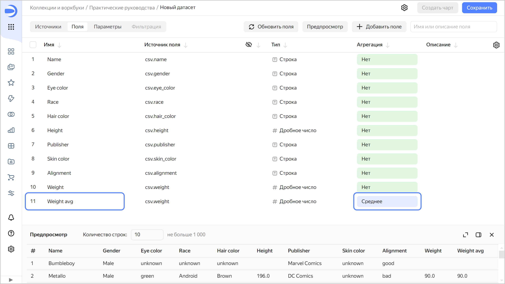
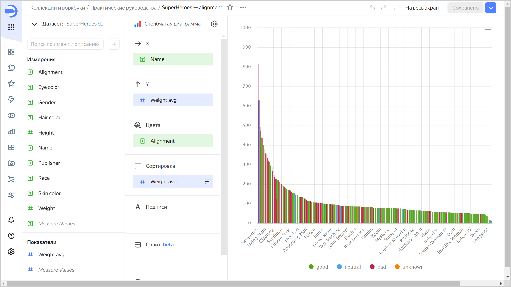
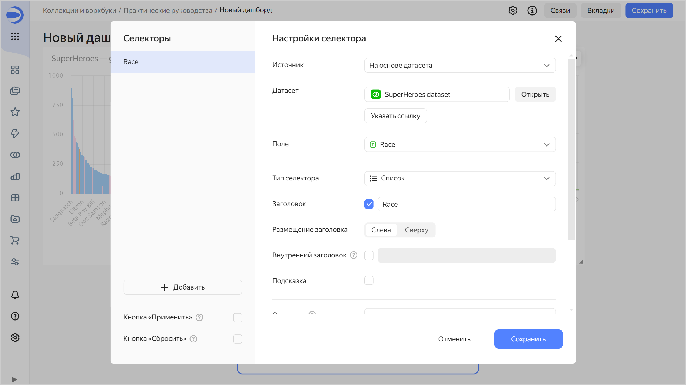

# Простой дашборд из CSV-файла



В этом руководстве будет продемонстрировано, как {{ datalens-short-name }} можно использовать для исследования зависимостей, например:

* Веса супергероя от его пола.
* Веса супергероя от его принадлежности к лагерю хороших или плохих.

В качестве исходных данных будет использоваться файл `SuperHeroes.csv` с информацией о супергероях — имя, пол, раса, издатель комиксов и т. д. [Скачайте](https://storage.yandexcloud.net/datalens/SuperHeroes.csv) его перед прохождением руководства.

Для визуализации и исследования данных [подготовьте {{ datalens-short-name }} к работе](#before-you-begin), затем выполните следующие шаги:

1. [Создайте воркбук](#create-workbook).
1. [Создайте подключение](#create-connection).
1. [Создайте датасет](#create-dataset).
1. [Создайте первый чарт](#create-column-chart1).
1. [Создайте второй чарт](#create-column-chart2).
1. [Создайте дашборд и добавьте на него чарты](#create-dashboard).
1. [Добавьте селекторы на дашборд](#add-selectors).
1. [Приступите к исследованию зависимостей и данных о супергероях](#search-on-dashboard).

## Перед началом работы {#before-you-begin}



## Создайте воркбук {#create-workbook}

1. Перейдите на [главную страницу]({{ link-datalens-main }}) {{ datalens-short-name }}.
1. На панели слева выберите  **Коллекции и воркбуки**.
1. В правом верхнем углу нажмите **Создать** → **Создать воркбук**.
1. Введите название [воркбука](../../datalens/workbooks-collections/index.md) — `Практические руководства`.
1. Нажмите кнопку **Создать**.

## Создайте подключение {#create-connection}

Создайте [подключение](../../datalens/concepts/connection.md) к файлу с исходными данными.

1. В правом верхнем углу воркбука нажмите **Создать** →  **Подключение**.

1. В разделе **Файлы и сервисы** выберите подключение **Файлы**.
1. Нажмите кнопку **Загрузить файлы**.
1. Выберите файл **SuperHeroes.csv**. Дождитесь, когда на экране появится содержимое таблицы.
1. Нажмите кнопку **Создать подключение**.

   

1. Введите название подключения — `SuperHeroes` и нажмите кнопку **Создать**.

## Создайте датасет {#create-dataset}

Создайте [датасет](../../datalens/dataset/index.md) на базе подключения `SuperHeroes`:

1. На странице подключения в правом верхнем углу нажмите кнопку **Создать датасет**.
1. Перейдите на вкладку **Поля**.
1. Создайте поле с показателем среднего веса супергероя:

   1. Продублируйте поле  `Weight` — в правой части строки с полем нажмите  и выберите **Дублировать**.
   1. Переименуйте дубликат поля `Weight (1)` в `Weight avg`: нажмите на имя поля, удалите текущее имя и введите новое.
   1. В столбце **Агрегация** выберите **Среднее**. Поле с агрегацией поменяет цвет на синий: оно стало показателем.

      

1. Сохраните датасет:

   1. В правом верхнем углу нажмите кнопку **Сохранить**.
   1. Введите название датасета — `SuperHeroes dataset` и нажмите кнопку **Создать**.

## Создайте первый чарт {#create-column-chart1}

Для визуализации разделения по половому признаку создайте [чарт](../../datalens/concepts/chart/index.md) — [столбчатую диаграмму](../../datalens/visualization-ref/column-chart.md):

1. На странице датасета в правом верхнем углу нажмите кнопку **Создать чарт**.
1. Добавьте в чарт имена супергероев. Для этого из раздела **Измерения** перетащите поле `Name` в секцию **X**.
1. Добавьте в чарт веса супергероев. Для этого из раздела **Показатели** перетащите поле `Weight avg` в секцию **Y**.
1. Отсортируйте столбцы по убыванию веса. Для этого из раздела **Показатели** перетащите поле `Weight avg` в секцию **Сортировка**.

   

1. Добавьте на график цветовое разделение супергероев по половому признаку. Для этого из раздела **Измерения** перетащите поле `Gender` в секцию **Цвета**.
1. Переопределите цвета значений измерения `Gender`:

   1. Нажмите значок  в секции **Цвета** (значок появляется при наведении указателя на секцию).
   1. Выберите цвета: **Female** — розовый, **Male** — синий, **unknown** — оранжевый.
   1. Нажмите кнопку **Применить**.

      

1. Оставьте на графике только тех супергероев, чей вес известен (больше нуля):

   1. Из раздела **Показатели** перетащите поле `Weight avg` в секцию **Фильтры**.
   1. В открывшемся окне укажите операцию **Больше** и значение **0**.
   1. Нажмите кнопку **Применить фильтр**.

   

1. Сохраните чарт:

   1. В правом верхнем углу нажмите кнопку **Сохранить**.
   1. В открывшемся окне введите название чарта `SuperHeroes — gender` и нажмите кнопку **Сохранить**.

   

## Создайте второй чарт {#create-column-chart2}

Для визуализации по принадлежности к лагерю хороших или плохих создайте второй чарт — столбчатую диаграмму.

1. Создайте копию чарта, созданного на предыдущем шаге:

   1. В правом верхнем углу нажмите значок  → **Сохранить как копию**.

            

   1. В открывшемся окне введите название нового чарта `SuperHeroes — alignment` и нажмите кнопку **Сохранить**.

1. Замените цветовое разделение супергероев по половому признаку на цветовое разделение супергероев по принадлежности к лагерю хороших или плохих. Для этого из раздела **Измерения** перетащите поле `Alignment` в секцию **Цвета** и наведите его над полем `Gender`, пока то не станет красным.
1. Переопределите цвета значений измерения `Alignment`:

    1. Нажмите значок  в секции **Цвета** (значок появляется при наведении указателя на секцию).
    1. Выберите цвета: **good** — зеленый, **neutral** — синий, **bad** — красный, **unknown** — оранжевый.

1. Сохраните чарт — в правом верхнем углу нажмите кнопку **Сохранить**.

   

## Создайте дашборд и добавьте на него чарты {#create-dashboard}

Создайте [дашборд](../../datalens/concepts/dashboard.md), на который будут добавлены чарты и другие виджеты:

1. На панели слева выберите  **Коллекции и воркбуки** и перейдите в воркбук `Практические руководства`.
1. В правом верхнем углу нажмите **Создать** →  **Дашборд**.

1. На панели в нижней части страницы выберите виджет **Чарт**.

      

1. В открывшемся окне нажмите кнопку **Выбрать**.
1. Выберите чарт `SuperHeroes — gender`.
1. Нажмите кнопку **Добавить**.

   

1. Повторите шаги 3-6, чтобы добавить чарт `SuperHeroes — alignment`.
1. Установите размеры чартов с помощью мыши и расположите их на дашборде в удобном для вас порядке.

   

## Добавьте селекторы на дашборд {#add-selectors}

Добавьте [селекторы](../../datalens/dashboard/selector.md), чтобы фильтровать супергероев по расам (поле `Race`) и издательствам (поле `Publisher`):

1. На панели в нижней части страницы выберите виджет **Селектор**.

      

1. Добавьте селектор по расам:

   1. Выберите датасет `SuperHeroes dataset`.
   1. Выберите поле `Race`.
   1. Включите опцию **Множественный выбор**.
   1. Нажмите кнопку **Сохранить**.

   

1. Добавьте селектор по издательствам:

   1. Убедитесь, что выбран датасет `SuperHeroes dataset`.
   1. Выберите поле `Publisher`.
   1. Включите опцию **Множественный выбор**.
   1. Нажмите кнопку **Сохранить**.

1. Расположите селекторы на дашборде в удобном для вас порядке.
1. Сохраните дашборд:

   1. В правом верхнем углу дашборда нажмите кнопку **Сохранить**.
   1. Введите название дашборда `SuperHeroes dashboard` и нажмите кнопку **Создать**.

1. Дашборд готов.

   

## Исследуйте данные о супергероях {#search-on-dashboard}

1. Примените различные фильтры и исследуйте зависимости веса от пола и лагеря супергероя.

   

   В датасете, который был исследован, прослеживаются следующие зависимости:

   * Мужчины в основном тяжелее женщин.
   * Плохие супергерои в основном тяжелее хороших.

1. Вы можете создать новые показатели в датасете, например, средний рост (среднее от поля `Height`) и количество супергероев (количество уникальных от поля `Name`) и ответить на вопросы:

   * Представителей какой расы больше всего?
   * Есть ли зависимость роста от принадлежности к лагерю хороших или плохих?
   * Какая студия создала больше всего супергероев?
