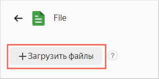
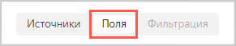
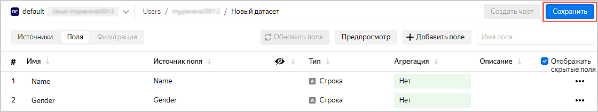
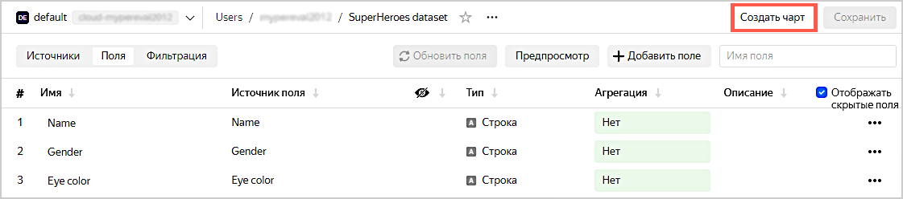
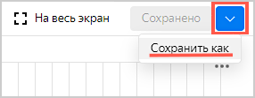
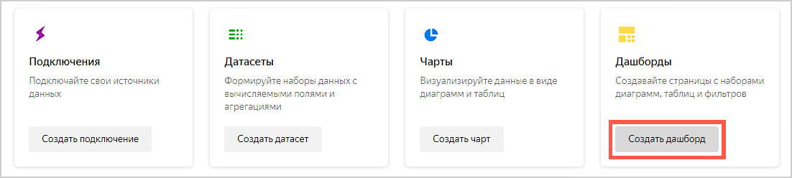
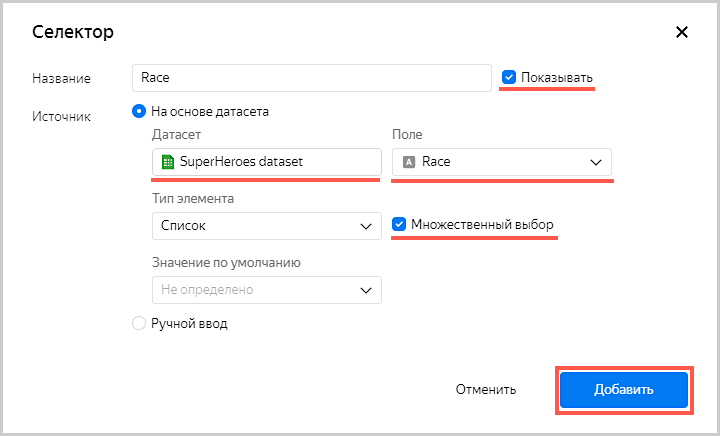
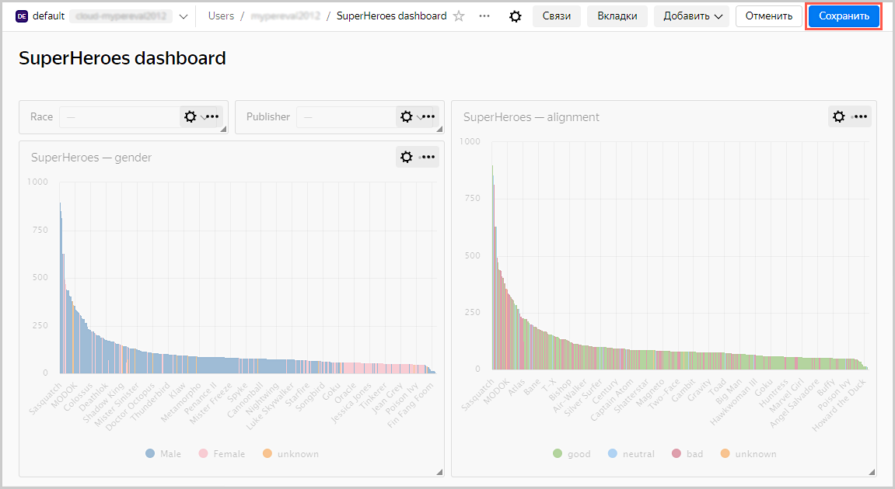

# Визуализация данных из файла

В качестве исходных данных будет использоваться файл [SuperHeroes.csv](https://storage.yandexcloud.net/datalens/SuperHeroes.csv) с информацией о супергероях — имя, пол, раса, издатель комиксов и т. д.

В этом сценарии продемонстрировано, как {{ datalens-short-name }} можно использовать для исследования зависимостей, например:
- Веса супергероя от его пола.
- Веса супергероя от его принадлежности к лагерю хороших или плохих.

Для визуализации и исследования данных [подготовьте {{ datalens-short-name }} к работе](#before-you-begin), затем выполните следующие шаги:

1. [Создайте подключение](#step1).
1. [Создайте датасет](#step2).
1. [Создайте первый чарт](#step3).
1. [Создайте второй чарт](#step4).
1. [Создайте дашборд](#step5).
1. [Добавьте чарты на дашборд](#step6).
1. [Добавьте селекторы на дашборд](#step7).
1. [Настройте отображение виджетов и приступите к исследованию зависимостей](#step8).
1. [Продолжите исследования данных о супергероях](#step9).

## Перед началом работы {#before-you-begin}



## Шаг 1. Создайте подключение и датасет {#step1}

Создайте датасет на основе [подключения](../../datalens/concepts/connection.md) типа **Файлы**.

1. Перейдите на [главную страницу]({{ link-datalens-main }}) {{ datalens-short-name }}.
1. На панели слева выберите  **Подключения** и нажмите кнопку **Создать подключение**.
1. Выберите **Файлы**.

   

1. Нажмите кнопку **Загрузить файлы**.

   

1. Выберите необходимый файл. В данном примере **SuperHeroes.csv** ([ссылка на скачивание](https://storage.yandexcloud.net/datalens/SuperHeroes.csv)).

   Дождитесь, когда на экране появится содержимое таблицы.

1. Нажмите кнопку **Создать подключение**.

   

1. Введите имя подключения `SuperHeroes` и нажмите **Создать**.

   

1. После сохранения нажмите кнопку **Создать датасет**.

   

## Шаг 2. Создайте датасет {#step2}

1. Если в рабочей области нет таблицы **SuperHeroes.csv**, то перетащите таблицу из панели выбора в рабочую область.

    

1. Перейдите на вкладку **Поля**.

    

1. Создайте поле с показателем среднего веса супергероя:

    1. Нажмите значок  в строке **Weight**.
    1. Выберите **Дублировать**.

         

    1. Переименуйте дубликат поля **Weight (1)** в **Weight avg**: нажмите на имя строки, удалите текущее имя и введите новое.
    1. В столбце **Агрегация** для поля **Weight avg** выберите **Среднее**.

        

1. В правом верхнем углу нажмите кнопку **Сохранить**.

    

1. Введите имя датасета **SuperHeroes dataset**, нажмите **Создать**.

1. После сохранения датасета нажмите **Создать чарт**.

    

## Шаг 3. Создайте первый чарт {#step3}

Для визуализации разделения по половому признаку создайте [чарт](../../datalens/concepts/chart/index.md) — столбчатую диаграмму.

1. Добавьте на график имена супергероев. Для этого из раздела **Измерения** перетащите поле **Name** в секцию **X**.
1. Добавьте на график веса супергероев. Для этого из раздела **Показатели** перетащите поле **Weight avg** в секцию **Y**.

    

1. Отсортируйте график по весам, например, по убыванию.

    1. Из первой колонки из раздела **Показатели** перетащите поле **Weight avg** в секцию **Сортировка**.

        

1. Оставьте на графике только тех супергероев, чей вес известен (больше нуля).

    1. Из первой колонки из раздела **Показатели** перетащите поле **Weight avg** в секцию **Фильтры**.
    1. В открывшемся окне укажите операцию **Больше** и значение **0**.
    1. Нажмите кнопку **Применить фильтр**.

        

1. Добавьте на график цветовое разделение супергероев по половому признаку. Для этого из раздела **Измерения** перетащите поле **Gender** в секцию **Цвета**.

    

1. Переопределите цвета значений измерения **Gender**.

    1. Нажмите значок настройки в секции **Цвета**.

        

    1. Выберите цвета: **Female** — розовый, **Male** — синий, **unknown** — оранжевый.

        

1. Сохраните чарт.

    1. В правом верхнем углу нажмите кнопку **Сохранить**.

        

    1. В открывшемся окне введите название чарта **SuperHeroes — gender** и нажмите кнопку **Сохранить**.

## Шаг 4. Создайте второй чарт {#step4}

Для визуализации по принадлежности к лагерю хороших или плохих создайте чарт — столбчатую диаграмму.

1. Скопируйте чарт, получившийся на предыдущем шаге.

    1. Нажмите значок галочки рядом с кнопкой **Сохранить** в верхнем правом углу.
    1. Нажмите **Сохранить как**.

        

    1. В открывшемся окне введите название нового чарта **SuperHeroes — alignment**.
    1. Нажмите кнопку **Готово**.

1. Добавьте на график цветовое разделение супергероев по принадлежности к лагерю хороших или плохих. Для этого из раздела **Измерения** перетащите поле **Alignment** в секцию **Цвета**.

    Предыдущее значение секции (поле **Gender**) будет заменено на **Alignment**.

    

1. Переопределите цвета значений измерения **Alignment**.

    1. Нажмите значок настройки в секции **Цвета**.
    1. Выберите цвета: **good** — зеленый, **neutral** — синий, **bad** — красный, **unknown** — оранжевый.

        

1. В правом верхнем углу нажмите кнопку **Сохранить**.

## Шаг 5. Создайте дашборд {#step5}

Создайте [дашборд](../../datalens/concepts/dashboard.md), на который будут добавлены чарты.

1. Перейдите на [главную страницу]({{ link-datalens-main }}) {{ datalens-short-name }}.
1. Нажмите кнопку **Создать дашборд**.

    

## Шаг 6. Добавьте чарты на дашборд {#step6}

1. При первом открытии после сохранения дашборд открывается в режиме редактирования. Если вы открыли его повторно, то нажмите **Редактировать** в правом верхнем углу.

    

1. Нажмите кнопку **Добавить**.
1. Выберите **Чарт**.

    

1. В открывшемся окне нажмите кнопку **Выбрать** и выберите чарт **SuperHeroes — gender**.

   После этого автоматически заполнится поле **Название**.

1. Нажмите кнопку **Добавить**.

    

1. Добавьте еще один чарт. Пройдите шаг 6 сначала и укажите в пункте 4 чарт **SuperHeroes — alignment**.

    

## Шаг 7. Добавьте селекторы на дашборд {#step7}

Добавьте [селекторы](../../datalens/dashboard/selector.md), чтобы иметь возможность фильтровать супергероев по расам (поле **Race**) и издательствам (поле **Publisher**).

1. Нажмите кнопку **Добавить**.
1. Выберите **Селектор**.

    

1. Выберите датасет **SuperHeroes dataset**.
1. Выберите поле **Race**.

    После этого автоматически заполнится поле **Название**.

1. Нажмите галочку **Показывать** напротив заголовка селектора.
1. Включите опцию **Множественный выбор**.
1. Нажмите кнопку **Добавить**.

    

1. Добавьте еще один селектор. Пройдите шаг 7 сначала и укажите в пункте 4 поле **Publisher**.

    

## Шаг 8. Настройте отображение виджетов и приступите к исследованию зависимостей {#step8}

1. Перетащите селекторы наверх страницы рядом друг с другом.
1. Растяните чарты по ширине и расположите рядом друг с другом.
1. В правом верхнем углу нажмите кнопку **Сохранить**.

    

1. Введите название дашборда **SuperHeroes dashboard** и нажмите кнопку **Создать**.
1. Примените различные фильтры и исследуйте зависимости веса от пола и лагеря супергероя.

    

    В датасете, который был исследован, прослеживаются следующие зависимости:
    - Мужчины в основном тяжелее женщин.
    - Плохие супергерои в основном тяжелее хороших.

## Шаг 9. Продолжите исследование данных о супергероях {#step9}

Вы можете создать новые показатели в датасете, например, средний рост (среднее от поля **Height**) и количество супергероев (количество уникальных от поля **Name**) и ответить на вопросы:

- Представителей какой расы больше всего?
- Есть ли зависимость роста от принадлежности к лагерю хороших или плохих?
- Какая студия создала больше всего супергероев?
