# Визуализация данных из {{ forms-full-name }}

Воспользуйтесь готовыми решениями этого сценария, чтобы использовать данные из сервиса [{{ forms-full-name }}](https://forms.yandex.ru/) для визуализации в {{ datalens-short-name }}.

Для визуализации и исследования данных выполните следующие шаги:

1. [Подготовьте данные в YT](#prepare-data)
   1. [Настройте экспорт ответов в YT](#export-answers)
   1. [Откройте таблицу с данными из формы](#data-table)
1. [Создайте подключение CH over YT](#create-connection)
1. [Создайте датасет](#create-dataset)
1. [Добавьте данные из Стаффа](#join-data)

## 1. Подготовьте данные в YT {#prepare-data}

### 1.1 Настройте экспорт ответов в YT {#export-answers}

Чтобы формы хранили ответы на [YT](https://yt.yandex-team.ru/docs/), укажите это в настройках формы:

1. Откройте форму.
1. Перейдите на вкладку **Настройки**.
1. В боковом меню выберите **Дополнительно**.
1. Отметьте опцию **Экспортировать ответы в YT.Hahn**.

	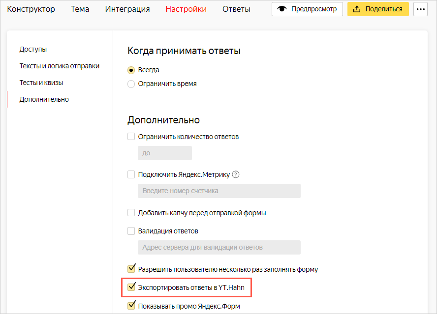

### 1.2 Откройте таблицу с данными из формы {#data-table}

1. В форме перейдите на вкладку **Ответы**.
1. Перейдите по ссылке в разделе **Забрать ответы из YT**.

   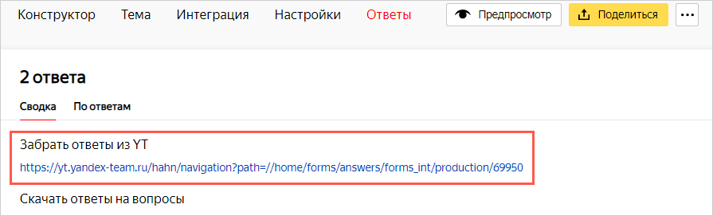

   После перехода по ссылке откроется таблица `data` с данными из формы.

	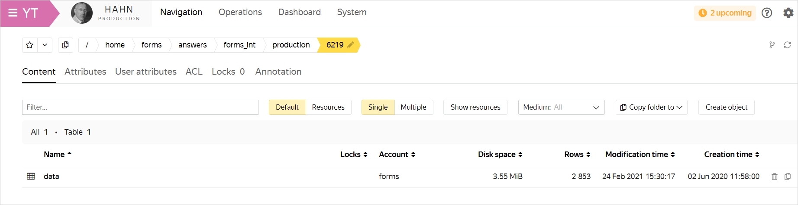

1. Если таблица не отображается, запросите к ней доступ. Для этого нажмите кнопку **Request permissions**.

   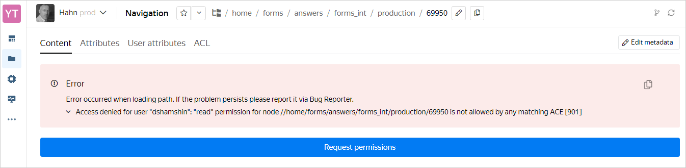

## 2. Создайте подключение CH over YT {#create-connection}

1. Перейдите на [страницу подключений](https://datalens.yandex-team.ru/connections).
1. В правом верхнем углу нажмите кнопку **Создать подключение**.
1. Выберите подключение **CH over YT**.
1. В открывшемся окне укажите параметры подключения:

	* Название подключения — `YT Form`.
	* Метод аутентификации — **OAuth-токен**.
	* Токен — нажмите кнопку **Получить токен**.
	* Кластер — `Hahn`.
	* Клика — укажите алиас запущенной клики. Для работы с {{ datalens-short-name }} рекомендуеся создать [приватную клику](https://yt.yandex-team.ru/docs/description/chyt/cliques/start). Если вы используете публичную клику, ознакомьтесь с [ограничениями](data-from-ch-over-yt.md#before-you-begin).
	* Время жизни кеша в секундах — **По умолчанию**.
	* Уровень доступа SQL запросов — **Разрешить подзапросы в датасетах**.

	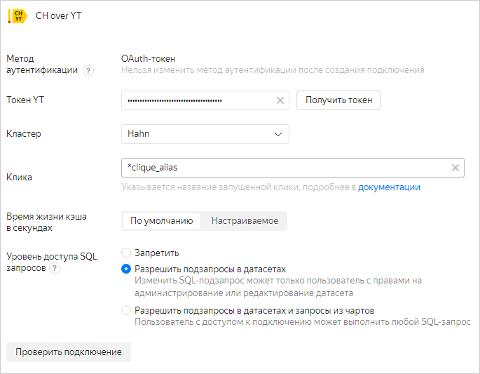

1. Проверьте подключение и нажмите кнопку **Создать**.

## 3. Создайте датасет {#create-dataset}

Все ответы на вопросы из формы хранятся в столбце `answer` таблицы `data`. Чтобы получить эти данные, определите источник данных датасета с помощью SQL-запроса.

1. Перейдите на [страницу датасетов](https://datalens.yandex-team.ru/datasets).
1. В правом верхнем углу нажмите кнопку **Создать датасет**.
1. В левой части экрана под блоком **Подключения** нажмите **Добавить**.
1. Выберите подключение `YT Form`.
1. В левой части экрана под блоком **Таблицы** нажмите **Добавить**.
1. Выберите тип источника **SQL**.
1. Введите название источника: `adaptation`.
1. Откройте форму и перейдите на вкладку **Конструктор**.
1. Нажмите на строку с нужным вопросом и скопируйте его идентификатор. Идентификаторы вопросов потребуются для написания SQL-запроса в датасете.

   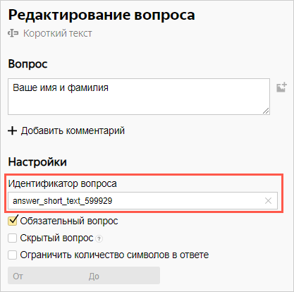

1. Перейдите на вкладку **Ответы** и скопируйте путь до таблицы `data` из параметра `path` в URL-адресе. Путь до таблицы `data` потребуется для написания SQL-запроса в датасете.

   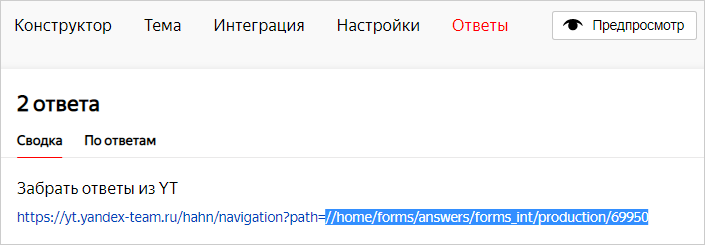

1. Вернитесь в датасет и напишите SQL-запрос, чтобы получить данные из таблицы `data`. В запросе передайте нужные идентификаторы вопросов в функции `cast` и путь до таблицы `data` в секции `from`.

	```sql
   select
    t.id as answer_id,
    t.uid as uid,
    t.created as created,
    cast(YPathString(answer, '/data/answer_choices_44736/value/0/text') as String) as answer_44736,
    cast(YPathString(answer, '/data/answer_choices_233283/value/0/text') as String) as answer_233283,
    cast(YPathString(answer, '/data/answer_choices_37608/value/0/text') as String) as answer_37608,
    cast(YPathString(answer, '/data/answer_long_text_37611/value') as String) as answer_37611,
    cast(YPathString(answer, '/data/answer_short_text_183050/value') as String) as answer_183050,
    cast(YPathString(answer, '/data/answer_long_text_37612/value') as String) as answer_37612,
    cast(YPathString(answer, '/data/answer_long_text_39363/value') as String) as answer_39363,
    cast(YPathString(answer, '/data/answer_choices_37565/value/0/text') as String) as answer_37565,
    cast(YPathString(answer, '/data/answer_choices_37850/value/0/text') as String) as answer_37850,
    cast(YPathString(answer, '/data/answer_choices_37606/value/0/text') as String) as answer_37606,
    cast(YPathString(answer, '/data/answer_long_text_37607/value') as String) as answer_37607,
    cast(YPathString(answer, '/data/answer_long_text_39360/value') as String) as answer_39360,
    cast(YPathString(answer, '/data/answer_choices_37514/value/0/text') as String) as answer_37514,
    cast(YPathString(answer, '/data/answer_choices_37516/value/0/text') as String) as answer_37516,
    cast(YPathString(answer, '/data/answer_choices_37517/value/0/text') as String) as answer_37517,
    cast(YPathString(answer, '/data/answer_choices_37518/value/0/text') as String) as answer_37518,
    cast(YPathString(answer, '/data/answer_choices_37519/value/0/text') as String) as answer_37519,
    cast(YPathString(answer, '/data/answer_choices_37642/value/0/text') as String) as answer_37642,
    cast(YPathString(answer, '/data/answer_choices_37522/value/0/text') as String) as answer_37522,
    cast(YPathString(answer, '/data/answer_choices_408273/value/0/text') as String) as answer_408273,
    cast(YPathString(answer, '/data/answer_choices_408269/value/0/text') as String) as answer_408269,
    cast(YPathString(answer, '/data/answer_choices_39365/value/0/text') as String) as answer_39365,
    cast(YPathString(answer, '/data/answer_long_text_39366/value') as String) as answer_39366,
    cast(
        arrayStringConcat(
            arrayMap(
                i -> cast(YSONExtractString(YPathRaw(answer, '/data/answer_choices_37851/value', 'text'), i + 1, 'text') as String),
                range(YSONLength(coalesce(YPathRaw(answer, '/data/answer_choices_37851/value', 'text'), '')))
            ),
            ', '
        )
        as String
    ) as answer_37851
   from `//home/forms/answers/forms_int/production/6219/data` as t
   ```

   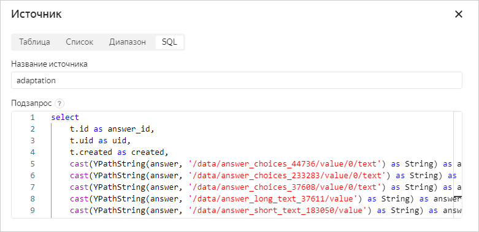

## 4. Добавьте данные из Стаффа {#join-data}

В [YT-таблице](https://yt.yandex-team.ru/hahn/navigation?path=//home/hr-stat/charts/staff/employees) с данными сотрудников из Стаффа не хранятся логины сотрудников, ответивших на форму. Вместо них хранятся идентификаторы (UID). Чтобы определить, кто именно заполнил форму, создайте аналогичную таблицу в YT с помощью Staff API или другими способами и добавьте ее в датасет:

1. В левой части экрана под блоком **Таблицы** нажмите **Добавить**.

   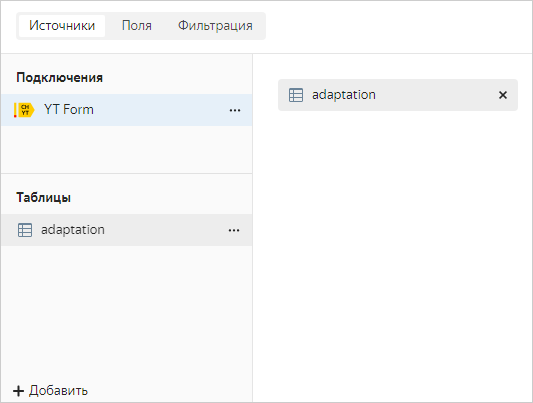

1. Выберите тип источника **Таблица**.
1. Введите название источника: `staff`.
1. Укажите путь к созданной таблице с данными из Стаффа.

   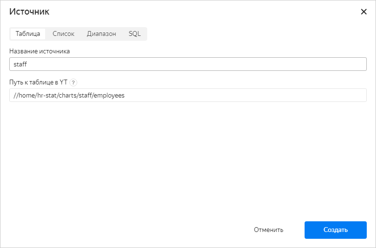

1. Нажмите кнопку **Создать**.
1. Свяжите добавленную таблицу с таблицей `adaptation`:

   1. Нажмите на место соединения таблиц.

      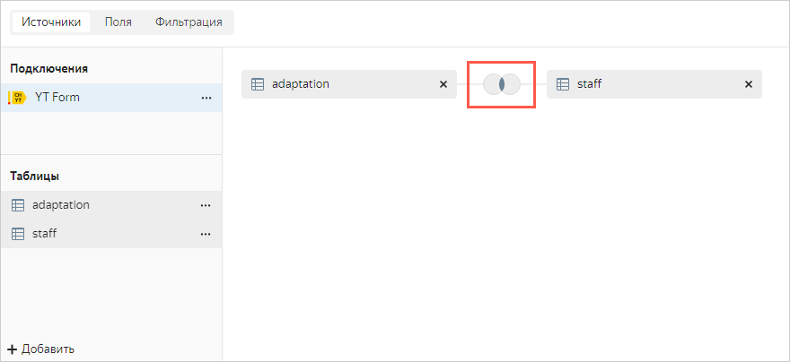

   1. Нажмите **Добавить связь** и выберите поле `uid` в обеих таблицах.

      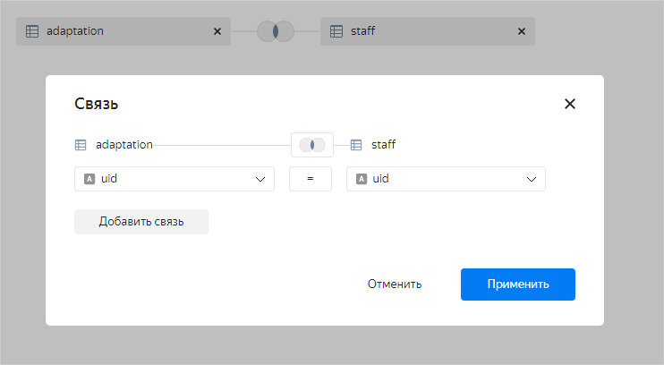

   1. Нажмите **Применить**.

1. В правом вернем углу нажмите **Сохранить**. Датасет готов.

   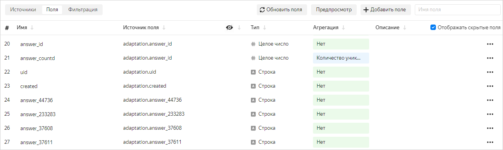

   Над созданным датасетом вы можете создавать различные чарты и размещать их на дашбордах.
