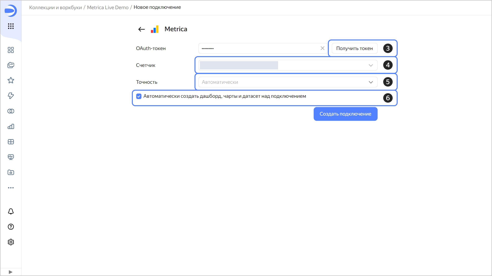
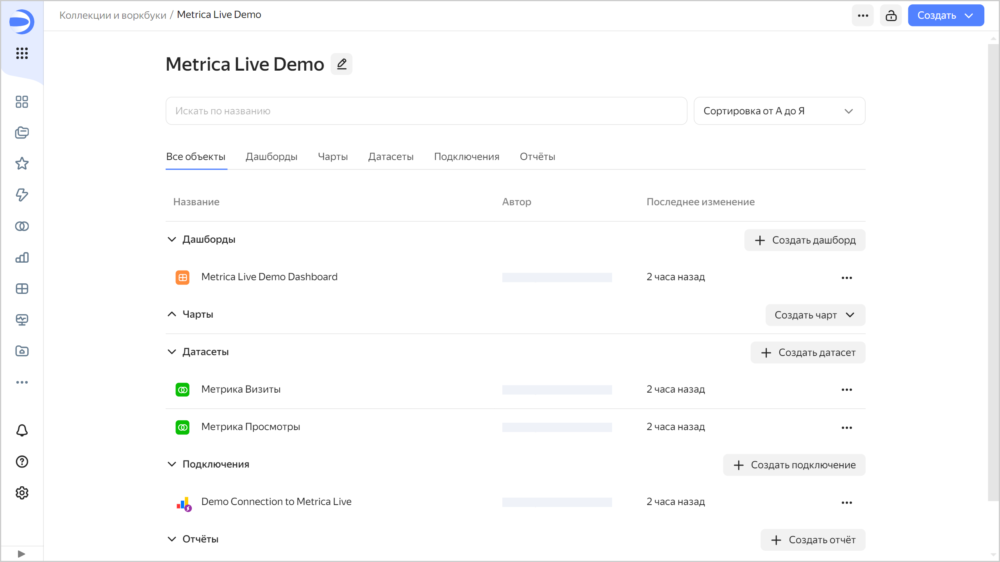

# Яндекс Метрика: прямое подключение



В этом руководстве демонстрируется работа {{ datalens-full-name }} с сервисом {{ metrika }} в режиме прямого доступа.

В качестве источника данных используйте один из счетчиков Яндекс Метрики, к которому у вас есть доступ. Посмотреть список доступных счетчиков можно по [ссылке](https://metrika.yandex.ru/list).

Если в вашем списке не оказалось доступных счетчиков, используйте [демонстрационный дашборд]({{ link-datalens-main }}/marketplace/f2e5hpq5mc7bscsjc6jr) Яндекс Метрики.



Для визуализации и исследования данных [подготовьте {{ datalens-short-name }} к работе](#before-you-begin), затем выполните следующие шаги:

1. [Создайте воркбук](#create-workbook).
1. [Создайте подключение и стандартный дашборд](#create-connection).
1. [Измените стандартный дашборд](#edit-dashboard).
1. [Измените чарт](#edit-chart).

## Перед началом работы {#before-you-begin}



## Создайте воркбук {#create-workbook}

1. Перейдите на [главную страницу]({{ link-datalens-main }}) {{ datalens-short-name }}.
1. На панели слева выберите  **Коллекции и воркбуки**.
1. В правом верхнем углу нажмите **Создать** → **Создать воркбук**.
1. Введите название [воркбука](../../datalens/workbooks-collections/index.md) — `Metrica Live Demo`.
1. Нажмите кнопку **Создать**.

## Создайте подключение и стандартный дашборд {#create-connection}



На этом шаге описываются действия для пользователей, у которых есть права на какой-либо счетчик Яндекс Метрики. Если у вас нет прав на счетчик, разверните [дашборд из {{ datalens-short-name }} {{ marketplace-short-name }}]({{ link-datalens-main }}/marketplace/f2e5hpq5mc7bscsjc6jr) и перейдите к шагу [Измените стандартный дашборд](#edit-dashboard).



1. В правом верхнем углу воркбука нажмите **Создать** →  **Подключение**.
1. В разделе **Файлы и сервисы** выберите подключение **{{ metrika }}**.
1. Нажмите кнопку **Получить токен**.

   Если вы первый раз создаете подключение к счетчику Яндекс Метрики, то предоставьте сервису необходимые разрешения.

1. Выберите необходимый счетчик из выпадающего списка.

   Максимальное количество счетчиков Яндекс Метрики — 1 000.

1. Выберите уровень [точности](https://yandex.ru/dev/metrika/doc/api2/api_v1/sampling-docpage/) из выпадающего списка.
1. Включите опцию **Автоматически создать дашборд, чарты и датасет над подключением**.
1. Нажмите кнопку **Создать подключение**.

   

   1. Введите название подключения — `Demo Connection to Metrica Live`.
   1. Нажмите кнопку **Создать**.

   После создания подключения откроется воркбук или папка с набором датасетов, чартов и дашбордом.

   

   

## Измените стандартный дашборд {#edit-dashboard}



Если вы пропустили шаг [Создайте подключение и стандартный дашборд](#create-connection), разверните [дашборд из {{ datalens-short-name }} {{ marketplace-short-name }}]({{ link-datalens-main }}/marketplace/f2e5hpq5mc7bscsjc6jr).



Стандартный [дашборд](../../datalens/concepts/dashboard.md) можно настроить под себя: например, удалить, переместить или редактировать чарты.

1. Откройте `Metrica Live Demo Dashboard`.
1. В правом верхнем углу дашборда нажмите кнопку **Редактировать**.
1. Удалите чарт `Глубина просмотров`. Для этого в правом верхнем углу чарта нажмите значок  и выберите **Удалить**.

   

1. Разместите чарты `Отказы` и `Время на сайте` так, чтобы они заполнили пустое пространство после удаления чарта на предыдущем шаге:

   

1. Удалите чарты `Доля визитов по браузерам` и `Визиты, просмотры и посетители по браузерам`.
1. В правом верхнем углу дашборда нажмите кнопку **Сохранить**.

## Измените чарт {#edit-chart}

Вы можете отредактировать любой чарт на дашборде. Например, поменяйте тип визуализации для диаграммы `Визиты по типам устройств и ОС` из раздела **Технологии**.

1. В правом верхнем углу чарта `Визиты по типам устройств и ОС` нажмите значок .
1. Выберите **Редактировать**.

   

1. Выберите другой тип чарта — **Круговая диаграмма**.

   

1. В правом верхнем углу нажмите кнопку **Сохранить**.
1. Закройте страницу с редактированием чарта и вернитесь в окно с дашбордом.
1. Обновите дашборд и убедитесь, что в разделе **Технологии** чарт изменился.

   
