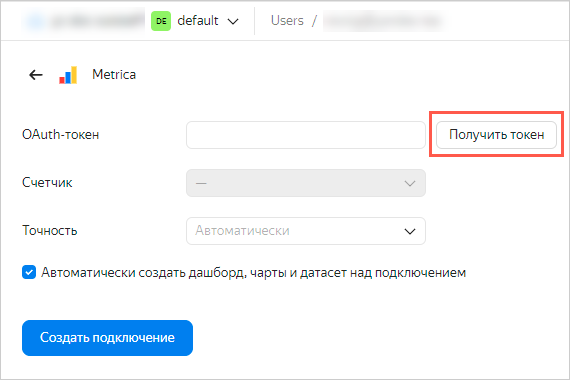
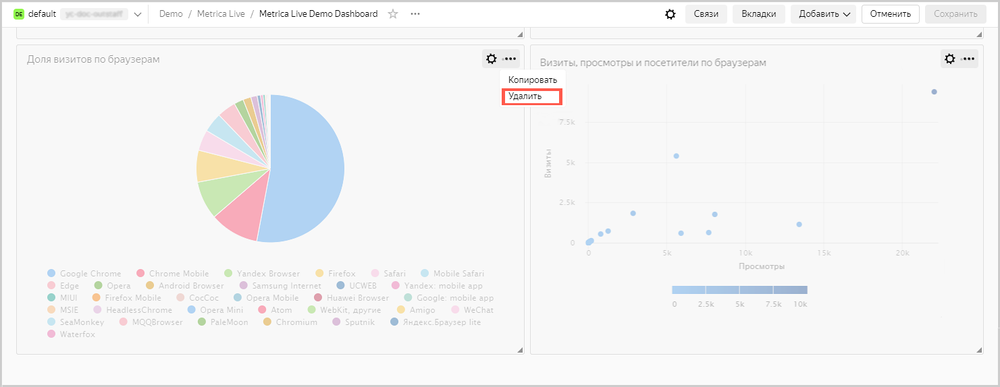
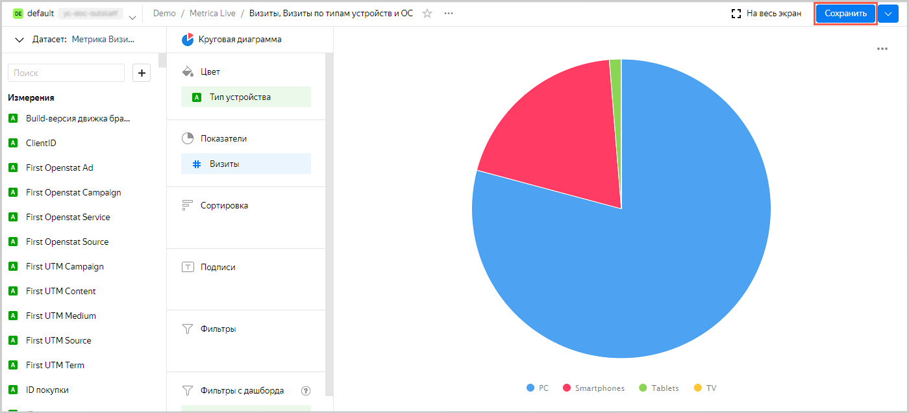

# Веб-аналитика с подключением к Яндекс Метрике



В качестве источника данных будет использован один из счетчиков Яндекс Метрики, к которому у вас есть доступ. Просмотреть список доступных вам счетчиков можно по ссылке [https://metrika.yandex.ru/list](https://metrika.yandex.ru/list).

Если в вашем списке не оказалось доступных счетчиков, то получите доступ к счетчику или используйте демонстрационный дашборд Яндекс Метрики. Он создается автоматически при создании экземпляра {{ datalens-short-name }}.

Для визуализации и исследования данных [подготовьте {{ datalens-short-name }} к работе](#before-you-begin), затем выполните следующие шаги:

1. [Создайте подключение и стандартный дашборд](#step1).
1. [Измените стандартный дашборд](#step2).
1. [Измените чарт](#step3).

## Перед началом работы {#before-you-begin}



## Шаг 1. Создайте подключение и стандартный дашборд {#step1}



Данный шаг доступен для пользователей, у которых есть права на какой-либо счетчик Яндекс Метрики. Если у вас нет прав на счетчик, разверните [дашборд из {{ datalens-short-name }} {{ marketplace-short-name }}](https://datalens.yandex.ru/marketplace/f2e5hpq5mc7bscsjc6jr) и перейдите к шагу 2.



1. Перейдите на [главную страницу]({{ link-datalens-main }}) {{ datalens-short-name }}.
1. На панели слева выберите  **Подключения** и нажмите кнопку **Создать подключение**.
1. Выберите **Metrica**.

   

1. Нажмите кнопку **Получить токен**.

   

   Если вы первый раз создаете подключение к счетчику Яндекс Метрики, то предоставьте сервису необходимые разрешения.

1. Выберите необходимый счетчик из выпадающего списка.

   

1. Выберите уровень [точности](https://yandex.ru/dev/metrika/doc/api2/api_v1/sampling-docpage/) из выпадающего списка.

   

1. Включите опцию **Автоматически создать дашборд, чарты и датасет над подключением**.
1. Нажмите кнопку **Создать подключение**.

   

   После создания подключения откроется папка с набором датасетов, чартов и дашбордом.

   

1. Перейдите на **Дашборд по данным Метрики**.

   

## Шаг 2. Измените стандартный дашборд {#step2}



Если у вас нет счетчика Яндекс Метрики и вы пропустили шаг 1, разверните [дашборд из {{ datalens-short-name }} {{ marketplace-short-name }}](https://datalens.yandex.ru/marketplace/f2e5hpq5mc7bscsjc6jr).



Вы можете изменять стандартный [дашборд](../../datalens/concepts/dashboard.md) так, как вам удобно. Например, вы можете удалить ненужный график.

1. В правом верхнем углу дашборда нажмите кнопку **Редактировать**.

   

1. Удалите чарт **Глубина просмотров**. Для этого в правом верхнем углу графика нажмите значок  и выберите **Удалить**.

   

1. Разместите чарты **Отказы** и **Время на сайте** таким образом, чтобы они заполнили пустое пространство после удаления чарта на предыдущем шаге. Перетащите чарт, нажав на сам чарт. Измените размер чарта, потянув за треугольник в нижнем правом углу чарта.

   

1. Удалите чарты **Доля визитов по браузерам** и **Визиты, просмотры и посетители по браузерам**.

   

1. В правом верхнем углу нажмите кнопку **Сохранить**.

   

## Шаг 3. Измените чарт {#step3}

Вы можете отредактировать любой чарт на дашборде. Например, поменяйте тип визуализации для диаграммы **Визиты по типам устройств и ОС** из раздела **Технологии**.

1. В правом верхнем углу графика **Визиты по типам устройств и ОС** нажмите значок .
1. Выберите **Редактировать**.

   

1. Выберите другой тип чарта — **Круговая диаграмма**.

   

1. В правом верхнем углу нажмите кнопку **Сохранить**.

   

1. Закройте вкладку с редактированием чарта и вернитесь в окно с дашбордом.
1. Обновите дашборд и убедитесь, что в разделе **Технологии** чарт изменился.

   
