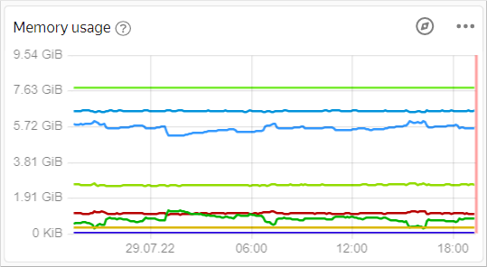
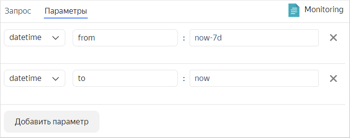
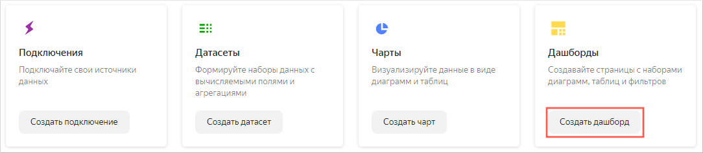
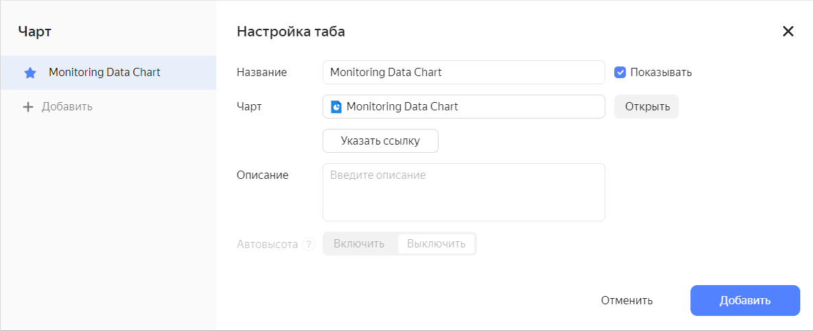
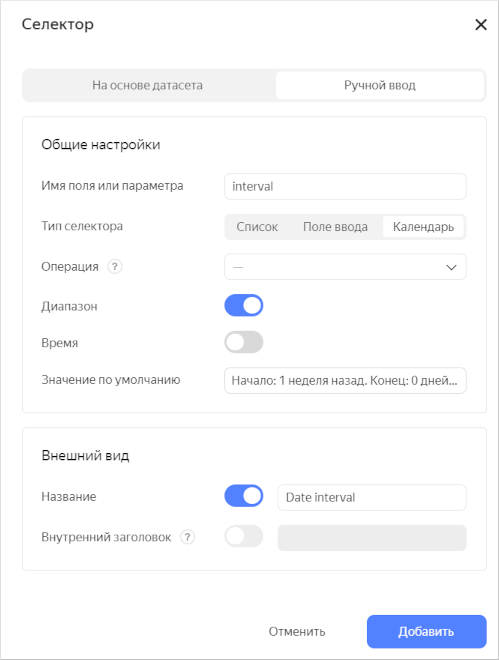
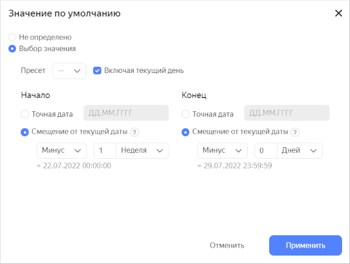
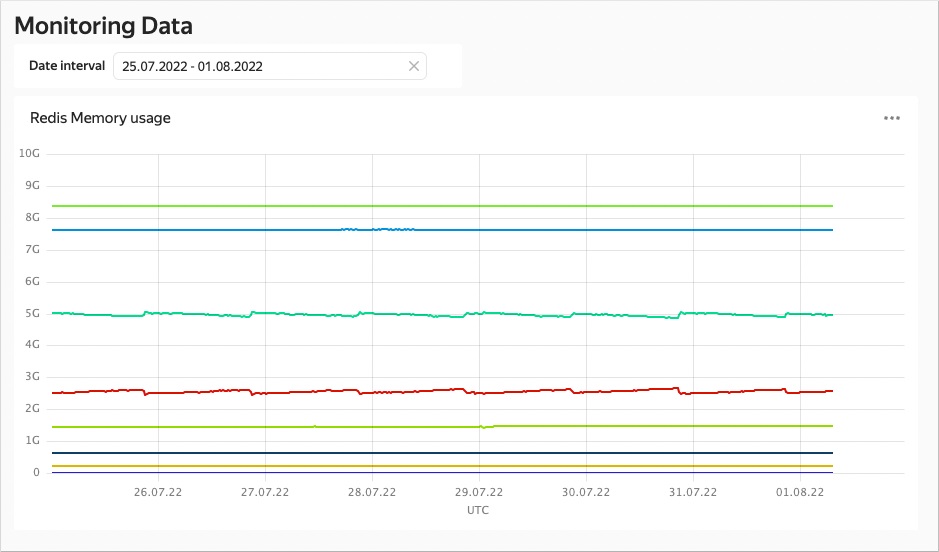

# Визуализация данных {{ monitoring-name }}

Сценарий будет полезен пользователям, у которых уже развернут и запущен один из сервисов {{ yandex-cloud }}.

Вы создадите чарт на основе [языка запросов {{ monitoring-full-name }}](../../monitoring/concepts/querying.md) и разместите его на дашборде.


Для визуализации и исследования данных [подготовьте {{ datalens-short-name }} к работе](#before-you-begin), затем выполните следующие шаги:


1. [Создайте подключение](#create-connection).
1. [Создайте QL-чарт](#create-sql-chart).
1. [Создайте дашборд](#create-dashboard).
1. [Добавьте QL-чарт на дашборд](#add-sql-chart-to-dashboard).
1. [Добавьте селекторы на дашборд](#add-selectors-to-dashboard).


## Перед началом работы {#before-you-begin}

Чтобы начать работать с {{ datalens-short-name }}:

1. [Войдите]({{ link-passport-login }}) в ваш аккаунт на Яндексе.
1. Откройте [главную страницу]({{ link-datalens-main }}) {{ datalens-short-name }}.
1. Нажмите **Открыть DataLens**.
1. Выберите один из вариантов:

   * Если у вас уже есть организация, выберите ее в выпадающем меню на вкладке **Организации** и нажмите **Открыть DataLens**.
      
      

      Для активации экземпляра {{ datalens-short-name }} пользователю нужна роль `admin` или `owner`. Подробнее про роли см. в разделе [{#T}](../../organization/security/index.md).

      

   * Если у вас есть облако, но нет организации, нажмите **Добавить новый DataLens**. В открывшемся окне введите название и описание организации и нажмите **Создать организацию и DataLens**. Подробнее о работе с организациями см. в разделе [Начало работы с организациями](../../organization/quickstart.md).

   Если у вас возник технический вопрос по работе сервиса, обратитесь в [службу поддержки]({{ link-console-support }}) {{ yandex-cloud }}. Чтобы спросить совета, обсудить решение вашей задачи или лучшие практики работы сервиса, напишите в чат [{{ datalens-short-name }}](https://t.me/YandexDataLens) в Telegram. 


## Создайте подключение {#create-connection}



Для создания подключения требуется [сервисный аккаунт](../../iam/concepts/users/service-accounts.md) с [ролью](../../iam/operations/sa/assign-role-for-sa.md) `{{ roles-monitoring-viewer }}` (или `{{ roles-viewer }}`).
Для написания запросов в QL-чартах используйте [язык запросов {{ monitoring-full-name }}](../../monitoring/concepts/querying.md).



### Подключение к {{ monitoring-name }} {#monitoring-connection}

Чтобы создать подключение к {{ monitoring-name }}:

1. Перейдите на [страницу подключений]({{ link-datalens-main }}/connections).
1. Нажмите кнопку **Создать подключение**.
1. Выберите подключение **{{ monitoring-name }}**.
1. Укажите параметры подключения:

   * **Облако и каталог**. Выберите каталог, в котором находится ваш сервисный аккаунт.
   * **Сервисный аккаунт**. Выберите существующий сервисный аккаунт или создайте новый.

1. Нажмите **Создать подключение**.
1. Укажите имя подключения и нажмите **Создать**. Подключение появится в списке.

## Создайте QL-чарт {#create-sql-chart}

1. Перейдите к уже созданному подключению.
1. В правом верхнем углу нажмите **Создать QL-чарт**.
1. На вкладке **Запрос** введите текст запроса. Его можно написать самостоятельно, либо скопировать из {{ monitoring-name }}.

   
   
   1. Перейдите на интересующий вас дашборд в сервисе {{ monitoring-name }}. Для доступности дашбордов у вас должен быть запущен один из сервисов {{ yandex-cloud }}.
   1. Откройте нужный график в Metric Explorer. Для этого нажмите значок  в правом верхнем углу графика.
   
      

   1. В нижней части экрана перейдите на вкладку **Запросы**.
   1. В строке с нужным запросом нажмите  и выберите пункт **Скопировать как текст**.
      
      Пример запроса:
      
      ```sql
      alias(series_max("systag", trunc("mem.*"{service="managed-clickhouse", host="rc1a-jn5r2zlul3iydlo2.{{ dns-zone }}", resource_id="Test", resource_type="cluster", node="*", systag!="-"})), "not_var{{systag}}")
      ```

   

1. На вкладке **Параметры** укажите необходимый временной интервал.

   

1. Нажмите кнопку **Запустить**. Проверьте, что запрос отрабатывает без ошибок и график с данными отображается.
1. В правом верхнем углу нажмите **Сохранить**.
1. Введите название чарта: `Monitoring Data Chart` и нажмите **Сохранить**.

Можете разместить созданный чарт на дашборде. Также на дашборд можно добавить селектор для управления значением параметра `interval` QL-чарта.

## Создайте дашборд {#create-dashboard}

Создайте [дашборд](../../datalens/concepts/dashboard.md), на который будут добавлены чарты.

1. Перейдите на [главную страницу]({{ link-datalens-main }}) {{ datalens-short-name }}.

1. Нажмите кнопку **Создать дашборд**.

    

1. Введите название дашборда `Monitoring Data` и нажмите кнопку **Создать**.

   Созданный дашборд откроется в режиме редактирования. 

## Добавьте QL-чарт на дашборд {#add-sql-chart-to-dashboard}

1. В верхней части страницы нажмите кнопку **Добавить** и выберите **Чарт**.
   
   

1. В поле **Чарт** нажмите **Выбрать** и выберите из списка чартов созданный ранее чарт `Monitoring Data Chart`.
   
   

   Нажмите кнопку **Добавить**.

1. Чарт появился на дашборде. Растяните его для улучшения визуализации.
1. Сохраните дашборд.

## Добавьте селекторы на дашборд {#add-selectors-to-dashboard}

Добавьте [селектор](../../datalens/dashboard/selector.md), чтобы выбирать временной промежуток, за который отображаются данные:

1. В верхней части страницы нажмите кнопку **Добавить**.
1. Выберите **Селектор**.

   

1. Выберите тип источника **Ручной ввод**.
1. В **Имя поля или параметра** введите `interval`. В эту переменную запроса будут передаваться выбранные значения из селектора.
1. Выберите тип селектора **Календарь**.
1. Включите опцию **Диапазон**.

   

1. В поле **Значение по умолчанию** укажите значения в смещениях от текущей даты и нажмите кнопку **Применить**.

   

1. Включите опцию **Название** и введите `Date interval`.
1. Нажмите кнопку **Добавить**.
1. Расположите селектор на дашборде над чартом.
1. Сохраните дашборд.
1. Дашборд готов. Теперь можно выбирать временной диапазон с использованием селектора.
   
   

#### См. также {#see-also}

* [{#T}](../../datalens/operations/dashboard/add-chart.md)
* [{#T}](../../datalens/operations/dashboard/add-selector.md)
* [{#T}](../../datalens/operations/chart/create-sql-chart.md)
* [QL-чарты](../../datalens/concepts/chart/index.md#sql-charts)
