# Подкасты Яндекс Музыки: статистика

В качестве источника данных будет использован подкаст из Яндекс Музыки, к которому у вас есть доступ. 
Аналитика подкастов позволяет получать статистику и [анализировать данные](../../glossary/data-analytics.md) по прослушиваниям и подписчикам подкастов в Яндекс Музыке. Для работы с аналитикой подкастов у вас должен быть доступ к одному или более подкастам.

Для визуализации и исследования данных выполните следующие шаги:

1. [Настройте подключение](#configure-connection).
    1. [Подготовьте {{ datalens-short-name }} к работе](#before-you-begin).
    1. [Создайте подключение](#create-connection).
    1. [Изучите статистику подкастов в DataLens](#podcasts-in-datalens). 
1. [Отредактируйте чарт, дашборд и создайте новые](#edit-dashboard-chart).
    1. [Измените дашборд](#changing-dashboard).
    1. [Измените чарт](#changing-chart).
    1. [Создайте новый чарт и добавьте его на дашборд](#creating-chart).
1. [Поделитесь аналитикой по подкасту с другими пользователями](#share-analytics).
    1. [Предоставьте доступ к DataLens](#open-access).
    1. [Поделитесь аналитикой по отдельному подкасту или эпизоду](#share-analytics-on-podcast-or-episode).
        1. [Ограничьте общие права доступа](#restrict-access). 
        1. [Ограничьте права доступа к данным (подкастам/эпизодам)](#provide-access-to-podcast).
        1. [Предоставьте доступ к вашему экземпляру DataLens](#access-to-datalens-instance).
        1. [Предоставьте ограниченный доступ к данным для отдельного пользователя](#provide-access-to-podcast-episode).
    1. [Отзовите права доступа у пользователя](#revoke-access).
1. [Сделайте публичным дашборд или чарт](#publish-dashboard-chart).
1. [Добавьте чарт или дашборд на свой сайт](#add-dashboard-chart).

Рекомендуем ознакомиться с разделом [Вопросы и ответы](#qa), который поможет ответить на основные вопросы, возникающие у пользователей статистики подкастов Яндекс Музыки.

## 1. Настройте подключение {#configure-connection}

### 1.1 Подготовьте {{ datalens-short-name }} к работе {#before-you-begin}

{{ datalens-full-name }} разворачивается в облачной платформе {{ yandex-cloud }}. 

Подготовьтесь к работе с {{ datalens-short-name }}, исходя из своего опыта:

* Вы новый пользователь (хотите использовать {{ datalens-full-name }} только для исследования подкастов).
* Вы уже используете {{ datalens-full-name }} (в других целях).



### 1.2. Создайте подключение {#create-connection}



 Создание подключения и работа с данными по аналитике подкастов возможна для пользователей, у которых есть права на какой-либо подкаст в Яндекс Музыке. Если у вас нет доступа к подкасту, то данные не отобразятся на дашборде.
 
 Вы получите доступ, загрузив подкаст на Яндекс Музыку. К подкасту привязана почта на Яндексе, указанная при загрузке.
   


1. Перейдите по ссылке, которую вы получили в письме, заполнив форму для подключения.
1. Введите имя подключения **Мой Подкаст** (название может быть произвольным).
1. Нажмите кнопку **Получить ключ**. Если вы в первый раз создаете подключение к подкастам Яндекс Музыки, предоставьте сервису необходимые разрешения.

    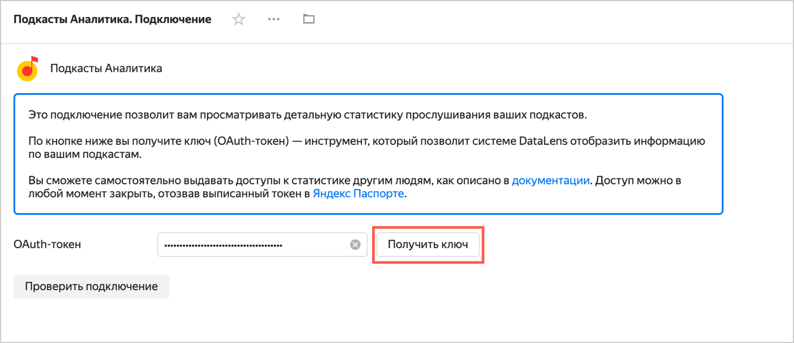

1. Нажмите кнопку **Проверить подключение**.
1. После успешной проверки подключения нажмите кнопку **Создать**.
1. Перейдите в меню **Дашборды** и откройте дашборд **Аналитика подкастов на Яндекс Музыке**. Если данных нет, убедитесь, что у вашего текущего аккаунта есть доступ к подкастам, написав в [службу поддержки](https://yandex.ru/support/music/podcast-authors/statistics.html).

### 1.3. Изучите статистику подкастов в {{ datalens-short-name }} {#podcasts-in-datalens}

1. После создания подключения откроется папка с набором стандартных объектов, на основе которых построена ваша статистика:

     Дашборд **Аналитика подкастов на Яндекс Музыке** — основная страница для просмотра статистики, с набором всех виджетов (графиков, таблиц, фильтров). Чтобы иметь быстрый доступ к дашборду, сохраните ссылку на страницу в удобном месте.
        
    
    
    *  Подключение — набор параметров доступа к данным подкастов. Это ключ, который необходим пользователю, чтобы открыть статистику.
    *  Датасеты — наборы измерений и показателей, на основе которых строятся чарты.
        * Датасет **D01. Прослушивания подкастов** — датасет с данными про прослушиваниям.
        * Датасет **D02. Подписчики подкастов** — датасет с данными по подписчикам.
    *  Чарты  — набор отдельных визуализаций в виде диаграмм и таблиц, используемых на дашборде.
    *  Дашборд **Metrica Live Demo Dashboard** и **Дашборд по продажам** — примеры, которые могут открыться в вашем подключении. При необходимости их можно удалить.
   
    
 
1. Откройте дашборд **Аналитика подкастов на Яндекс Музыке**.
   1. Дашборд содержит четыре вкладки:
    * Прослушивания — общая статистика прослушиваний, динамика прослушиваний, статистика прослушиваний отдельных эпизодов и распределения прослушиваний по дням недели и времени суток.
    * Аудитория — статистика по аудитории слушателей, включая социально-демографические данные.
    * Подписчики — статистика по аудитории подписчиков, динамика подписок и отписок, социально-демографические данные.
    * Справочник — справка по расчетным показателям и терминам, используемых в данных и на дашбордах.
    
    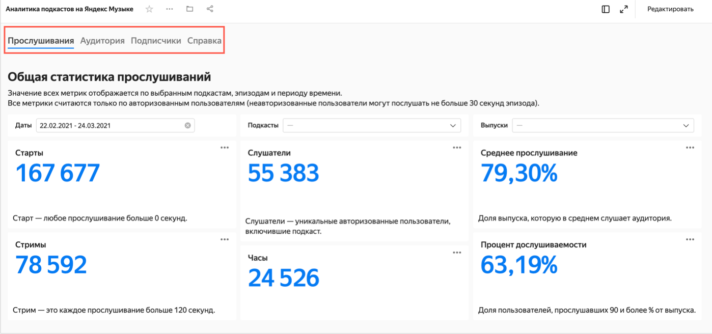
    
   1. Каждая вкладка содержит:     
    * Текстовые виджеты — заголовки, комментарии и подсказки.
    * Селекторы — фильтры по различным измерениям, которыми можно фильтровать содержимое дашбордов.
    * Чарты — графики, таблицы и другие визуализации.    
 
    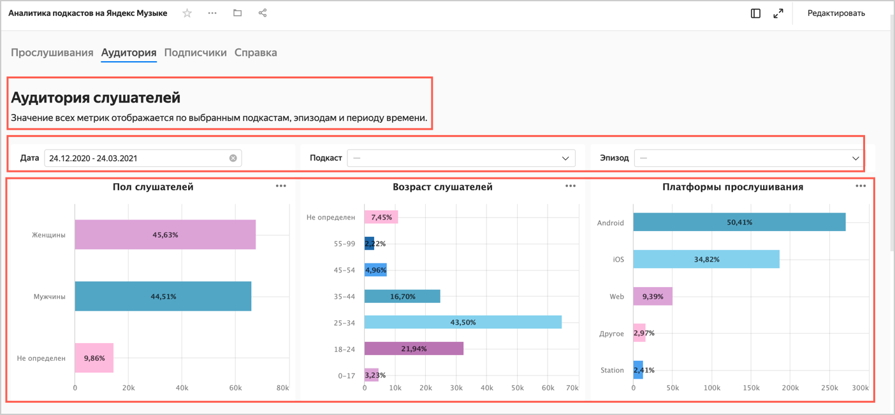
    
Вы можете вносить правки и дополнять стандартные объекты по своему усмотрению. Например, удалить ненужный график с дашборда или добавить новый, изменить существующий график или добавить селектор на дашборд.    

## 2. Отредактируйте дашборд, чарт и создайте новые {#edit-dashboard-chart}

### 2.1. Отредактируйте дашборд {#changing-dashboard}

Вы можете изменять порядок графиков и селекторов, увеличивать или уменьшать их, отказаться от каких-то данных и, наоборот, собрать вместе самое нужное. Попробуйте отредактировать дашборд, предварительно сделав его копию:

1. В меню слева перейдите в раздел **Дашборды**.
1. Напротив дашборда **Аналитики подкастов на Яндекс Музыке** нажмите значок   и выберите **Копировать**.
1. Откройте копию дашборда и перейдите на вкладку **Аудитория**.
1. Нажмите кнопку **Редактировать** в правом верхнем углу.
1. Предположим, вы хотите удалить чарт **Платформы прослушивания**. Для этого нажмите значок   в верхнем правом углу графика и выберите **Удалить**.
            
     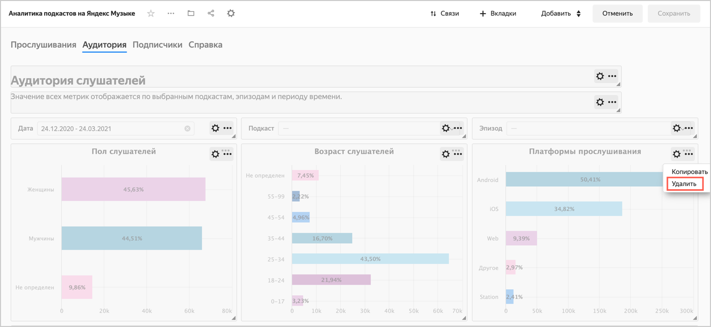       
    
1. Попробуйте разместить чарты **Пол слушателей** и **Возраст слушателей** таким образом, чтобы они заполнили пустое пространство после удаления чарта на предыдущем шаге. 
    1. Перетащите чарт, кликнув на сам чарт. Измените размер чарта, потянув за треугольник в нижнем правом углу чарта.
    
    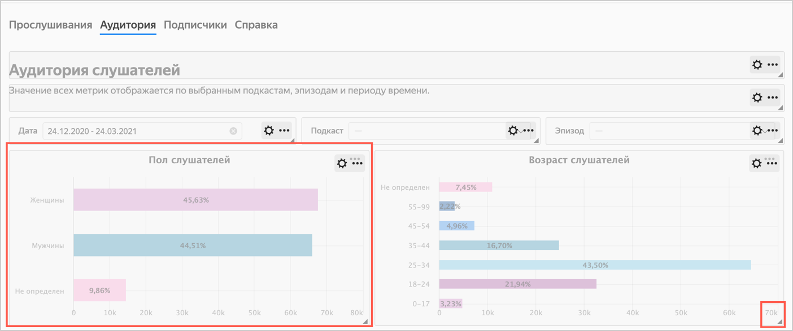  
    
1. Нажмите кнопку **Добавить** и выберите **Селектор**.
    
    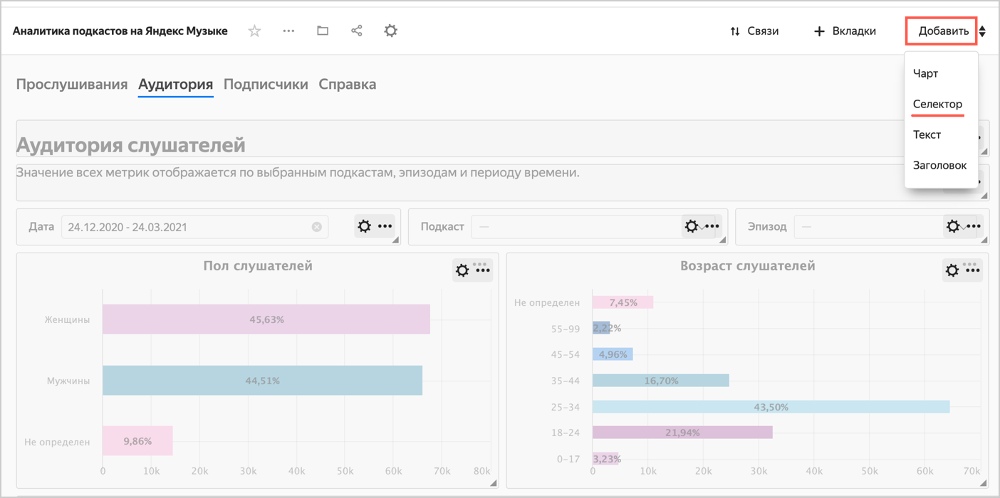
    
    1. Выберите датасет **D02.Подписчики подкастов**.
    1. Выберите поле **Страна**. После этого автоматически заполнится **Заголовок** по имени выбранного поля.        
    1. Активируйте опцию **Показывать напротив заголовка селектора**.
    1. Нажмите галочку **Показывать** напротив заголовка селектора.
    1. Включите опцию **Множественный выбор**.
    1. В списке **Значение по умолчанию** выберите **Россия** (можно выбрать любую другую страну).
    1. Нажмите кнопку **Добавить**.
   
     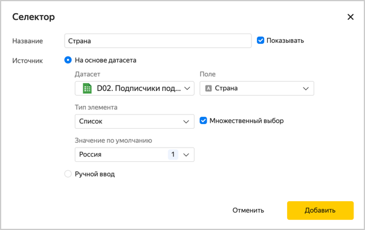 
   
1. Перенесите селектор наверх, при необходимости скорректируйте размеры чартов.
1. Разместите селекторы на одной линии, изменяя их размер.

     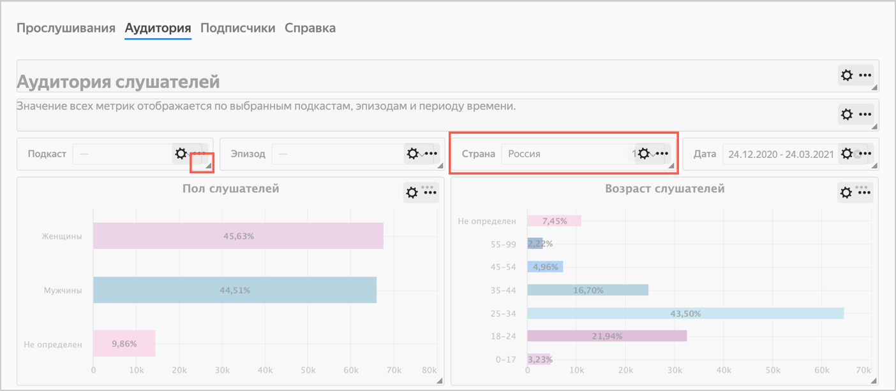 
     
1. Нажмите кнопку **Сохранить** в правом верхнем углу дашборда.

### 2.2. Отредактируйте чарт {#changing-chart}

Вы можете редактировать и настраивать любые графики. Предположим, что мы хотим видеть на графике относительную активность слушателей разных полов в течение суток.

1. Откройте дашборд **Аналитика подкастов на Яндекс Музыке** и перейдите на вкладку **Прослушивания**.
1. Прокрутите дашборд вниз до чарта **Время прослушивания по времени суток**.
1. Нажмите значок  в верхнем правом углу графика и выберите **Редактировать**.

    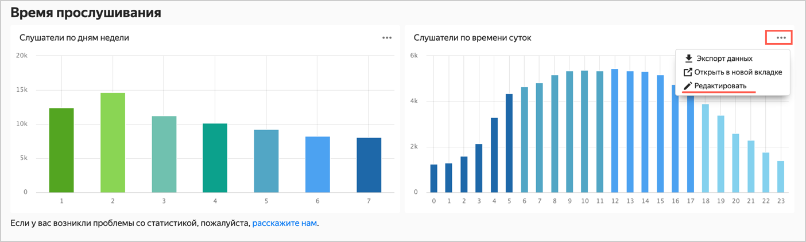 

1. Область конфигурации чарта (визард) состоит из трех основных частей:
   * Панель выбора со списком доступных измерений и показателей для построения чарта.
   * Панель настройки визуализации с различными секциями, с помощью которых можно настроить чарт.
   * Предпросмотр чарта.
   
   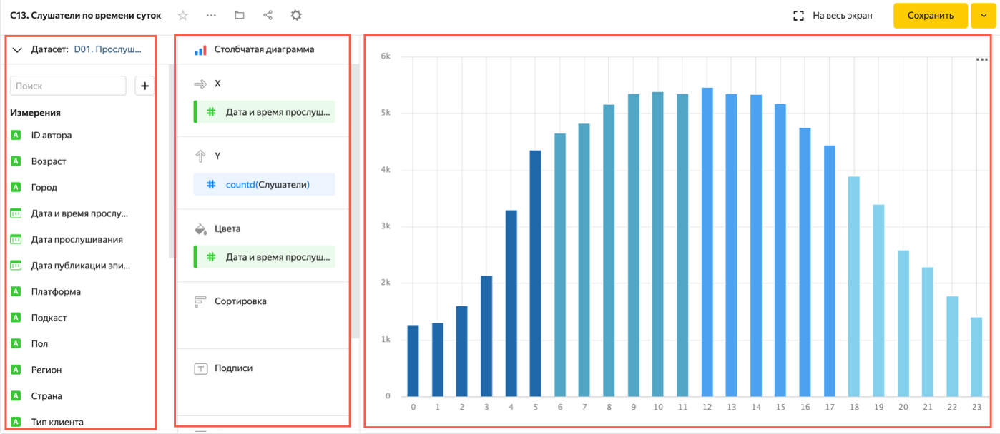 
   
1. Удалите измерение **Дата и время прослушивания** из секции **Цвета**.
1. Добавьте измерение **Пол** в секцию **Цвета**.

   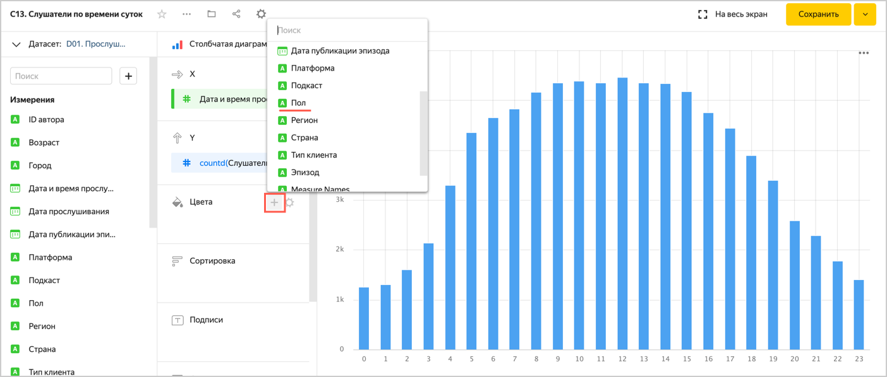 
    
1. Выберите другой тип визуализации — **Нормированная столбчатая диаграмма**.
    
   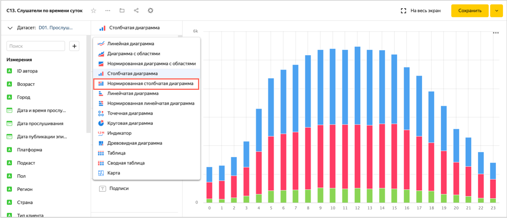 

1. Теперь каждый столбец показывает относительное распределение **Слушателей** по **Полу** в разрезе **Времени суток**. Нажмите **Сохранить** в правом верхнем углу чарта.

   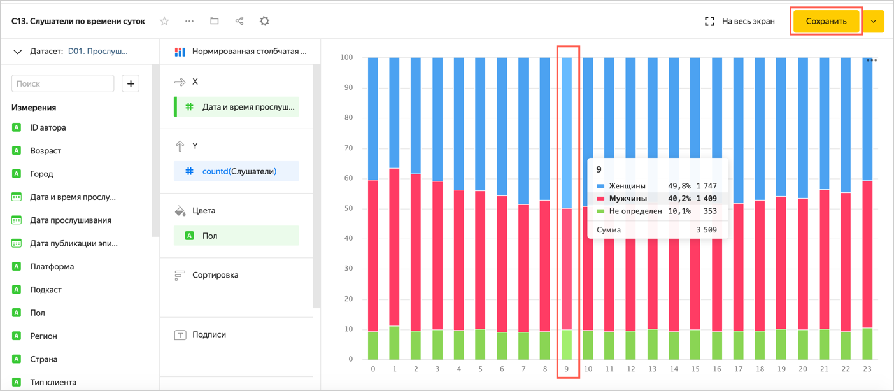  

Обновите страницу с дашбордом, чтобы применить изменения чарта.

### 2.3. Создайте новый чарт и добавьте его на дашборд {#creating-chart}

Предположим, что мы хотим построить диаграмму с общим количеством прослушиваний по стримам за весь период.
1. Откройте [главную страницу сервиса]({{ link-datalens-main }}).
1. Нажмите **Создать чарт**.
1. Перейдите в папку **Подкасты**.
1. Выберите датасет **D01. Прослушивания подкастов**.

   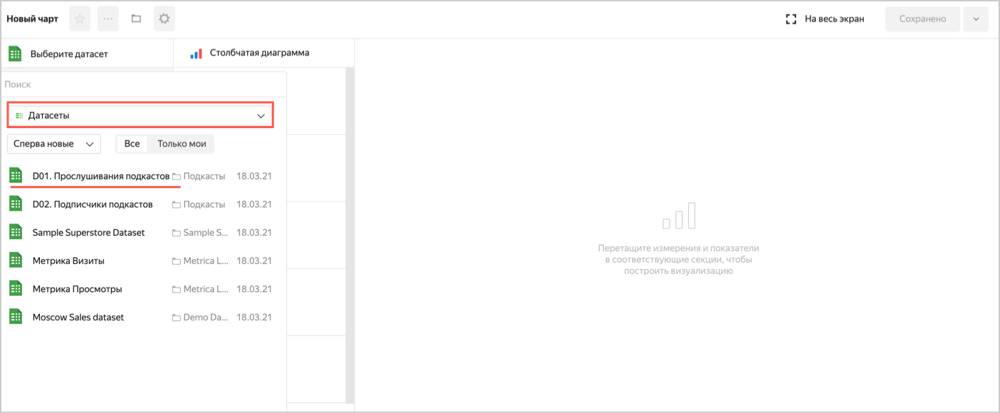  

1. Выберите тип визуализации **Накопительная диаграмма с областями**.
1. Добавьте измерение **Дата прослушивания** в секцию **Х**.
1. Добавьте показатель **Слушатели** в секцию **Y**.
1. Добавьте измерение **Дата прослушивания** в секцию **Фильтры**.

   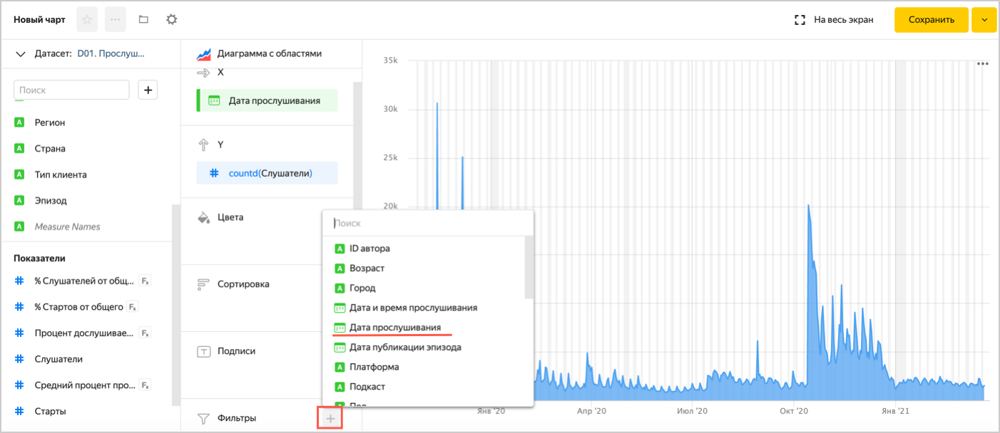 
   
   1. Нажмите иконку  поля **Дата прослушивания** в секции **Фильтры**.
        1. В списке **Пресет** выберите **Последние 365 дней** и нажмите **Применить фильтр**.
1. Нажмите иконку  поля **Дата прослушивания** в секции **Х**.
   1. В списке **Группировка** выберите **Месяц**, затем нажмите **Применить**.
1. Добавьте измерение **Эпизод** в секцию **Цвета**.   
1. Если у вас слишком большое количество эпизодов, скройте легенду внизу графика. Для этого нажмите значок  ⟶ **Скрыть**, затем кнопку **Применить**.

    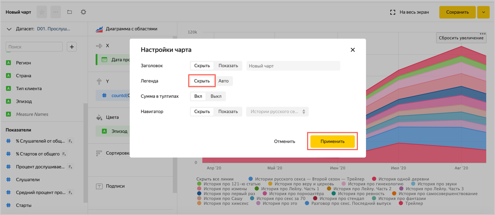 

1. Нажмите кнопку **Сохранить** в правом верхнем углу чарта.
    1. Введите название **Динамика прослушиваний по эпизодам** и нажмите **Применить фильтр**.
   
   
    
    Если фильтр поля **Дата прослушивания** добавлен на дашборд, фильтрация в чарте по этому полю будет игнорироваться.
  
   

1. Перейдите к верхней панели чарта и нажмите иконку навигации . 
1. В открывшемся окне выберите дашборд **Аналитика подкастов на Яндекс Музыке**.
1. В правом верхнем углу дашборда нажмите кнопку **Редактировать**.
1. Нажмите кнопку **Добавить** ⟶ **Чарт**.

    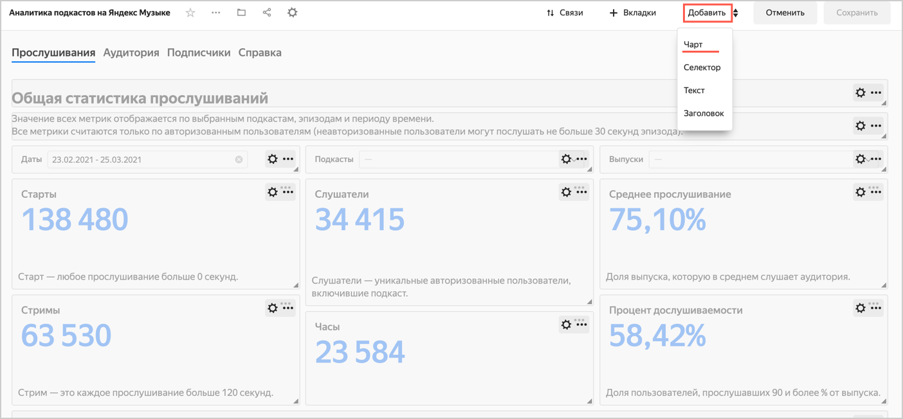

1. В открывшемся окне нажмите кнопку **Выбрать**.
   1. Выберите чарт **Динамика прослушиваний по эпизодам**. После этого автоматически заполнится поле **Заголовок** по названию выбранного чарта.
   1. Нажмите кнопку **Добавить**.
1. Расположите график рядом с таблицей в разделе **Статистика прослушиваний эпизодов** и нажмите **Сохранить**. 
    
   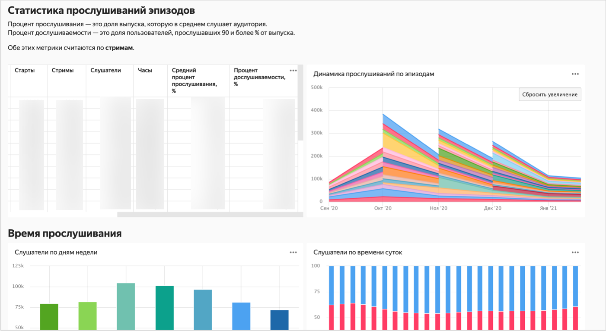

## 3. Поделитесь аналитикой по подкасту {#share-analytics}

### 3.1. Предоставьте доступ к {{ datalens-short-name }} {#open-access}

Вы можете предоставить доступ к личному кабинету другим пользователям. Для этого понадобится только аккаунт на Яндексе.

Настройте доступ к {{ datalens-full-name }}:

1. Откройте страницу [Управление доступом]({{ link-console-access-management }}).
1. В правом верхнем углу нажмите кнопку **Добавить пользователя**. 
1. Введите электронную почту пользователя в Яндексе. Новый пользователь появится в списке пользователей.
1. Нажмите значок  напротив нового пользователя и выберите **Изменить роли**.
1. В блоке **Роли в каталогах** выберите каталог. В столбце **Роли** нажмите значок . Назначьте роль `datalens.instances.user`.
   После этого вы можете поделиться ссылкой на дашборд с новым пользователем.
1. Убедитесь, что у нового пользователя есть права доступа к дашборду со статистикой по подкастам. Откройте дашборд.
1. Нажмите значок  → **Права доступа**. 

    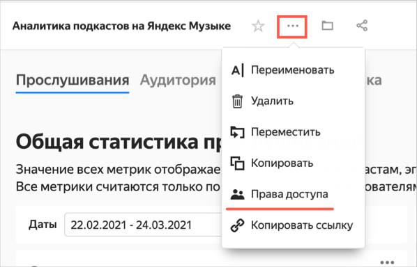 

1. Права должны быть у группы **Все** или у конкретного пользователя. Если прав нет, нажмите **Добавить**.
1. В поле **Добавить участника** введите Все или имя пользователя, которому нужны расширенные доступы.
1. Перейдите к блоку **Текущий объект** и установите права доступа для дашборда **Аналитика подкастов на Яндекс Музыке**: 
   * Исполнение — доступно выполнение запросов к объекту.
   * Просмотр — доступен только просмотр.
   * Редактирование — доступны просмотр и редактирование.
   * Администрирование — доступны просмотр, редактирование и управление.
   
    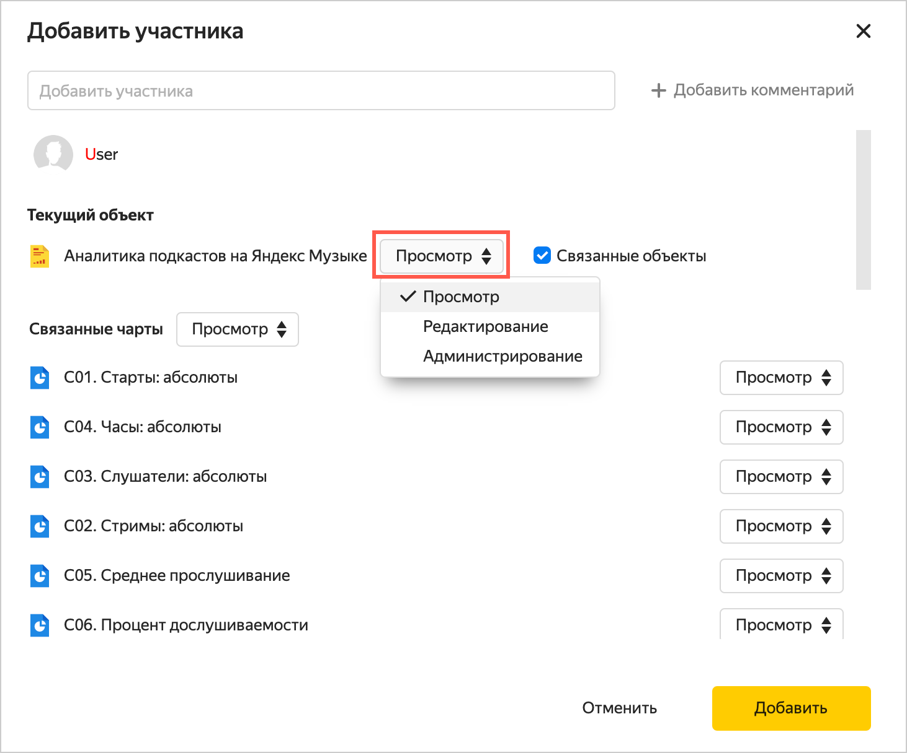 
   
1. Включите опцию **Связанные объекты**, чтобы предоставить права на другие связанные с дашбордом объекты (подключение, дасететы и чарты).
   
   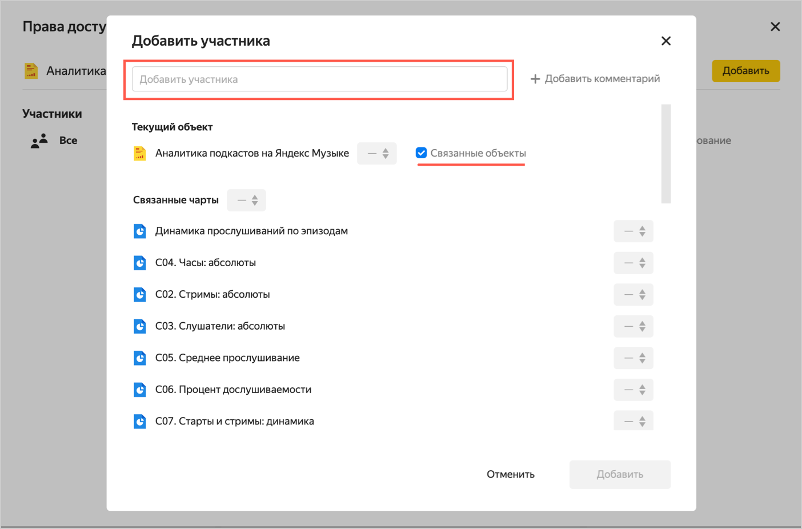 
   


Пользователь сразу сможет посмотреть статистику, а настроить дополнительные доступы для его аккаунта можно будет уже через несколько часов.

Права доступа можно настраивать для каждого объекта отдельно. Подробнее о [правах в {{ datalens-short-name }}](../../datalens/security/index.md).


  
### 3.2. Поделитесь аналитикой по отдельному подкасту или эпизоду {#share-analytics-on-podcast-or-episode}

Вы можете предоставить доступ пользователю, например, партнеру или рекламодателю, не ко всему кабинету статистики подкастера, а к отдельному подкасту или эпизоду. Для этого пользователю также потребуется аккаунт на Яндексе.

Чтобы пользователь смог запрашивать данные к эпизоду через чарты, но не смог посмотреть или поменять настройки подключения и датасета, [ограничьте общие права доступа](#restrict-access). 

После этого предоставьте доступ пользователю к объектам: **Подкасты Аналитика. Подключение**, **D01. Прослушивания подкастов** и **D02. Подписчики подкастов**. Укажите, к какому именно подкасту или эпизоду будет выдан доступ.

#### 3.2.1. Ограничьте общие права доступа {#restrict-access}

Чтобы ограничить общие права доступа:

1. Откройте дашборд **Аналитика подкастов на Яндекс Музыке**. 
1. Перейдите к верхней панели чарта и нажмите иконку навигации . 
1. В открывшемся окне выберите подключение **Подкасты Аналитика. Подключение**. Нажмите значок  → **Права доступа**. 
1. Нажмите на группу Все и установите права на **Исполнение**. Общий доступ будет ограничен: другие пользователи смогут посмотреть статистику на дашборде, например, только по отдельным эпизодам, но не смогут поменять эти настройки.

Повторите действие для датасетов **D01. Прослушивание подкастов** и **D02. Подписчики подкастов**.
Если вы не хотите делиться с пользователями аналитикой по подписчикам, то можете отозвать права датасета **D02. Подписчики подкастов** для группы Все.
   
#### 3.2.2. Ограничьте права доступа к данным (подкастам/эпизодам) {#provide-access-to-podcast}

При настройке прав на отдельные подкасты и эпизоды необходимо указать:

* пользователей, которые получат права на подкаст или эпизод;
* пользователей, которые получат доступ ко всему. 

В этом шаге сохраните доступ ко всем подкастам для себя и коллег.

Выберите, к каким данным вы хотите ограничить доступ:



- Подкасты

    1. Откройте датасет **D01. Прослушивания подкастов**.
    1. В меню поля **Подкаст** нажмите **Права доступа**.
    
        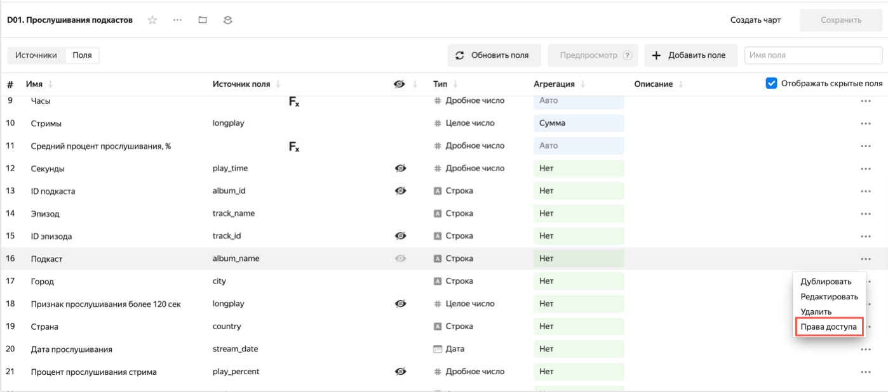
    
    1. В окне **Настройка прав доступа для поля** укажите фильтр как в примере:
       `* : my-login@yandex.ru`
       где:
        * `*` — доступ ко всем подкастам.
        * `my-login@yandex.ru` — ваш логин.
        
         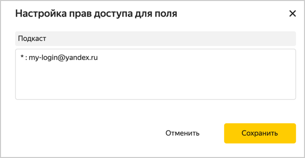 
    
    1. Нажмите кнопку **Сохранить**. После сохранения датасета данные в нем будут доступны только одному пользователю `my-login@yandex.ru`.  
    1. При необходимости укажите через запятую логины остальных пользователей, которым потребуется доступ ко всем подкастам и эпизодам. Например, `* : my-login@yandex.ru, friend-login@yandex.ru`.       
    
- Эпизоды

    1. Откройте датасет **D01. Прослушивания подкастов**.
    1. В меню поля **Эпизод** нажмите **Права доступа**.
    
        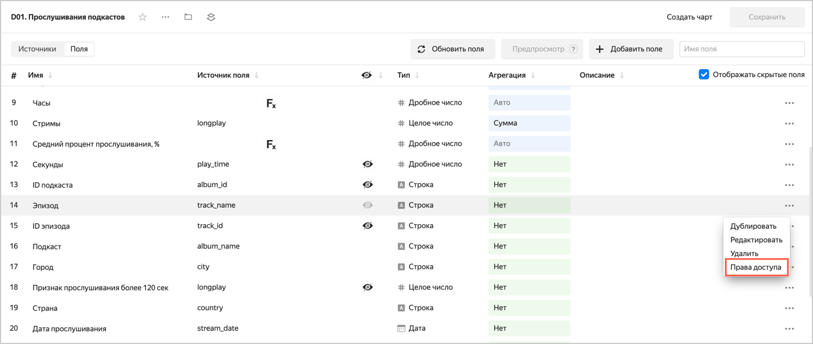    
    
    1. В окне **Настройка прав доступа для поля** укажите фильтр как в примере:
       `* : my-login@yandex.ru`
       где:
        * `*` — доступ ко всем эпизодам.
        * `my-login@yandex.ru` — ваш логин.
        
        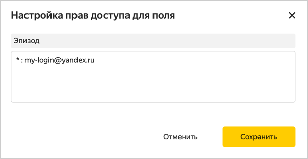 
        
    1. Нажмите кнопку **Сохранить**. После сохранения датасета данные в нем будут доступны только одному пользователю `my-login@yandex.ru`. 
    1. При необходимости укажите через запятую логины остальных пользователей, которым потребуется доступ ко всем подкастам и эпизодам. Например, `* : my-login@yandex.ru, friend-login@yandex.ru`.   



#### 3.2.3. Предоставьте доступ к вашему экземпляру {{ datalens-short-name }} {#access-to-datalens-instance}

Чтобы предоставить доступ пользователю к вашему экземпляру {{ datalens-short-name }}:

1. Откройте страницу [Управление доступом]({{ link-console-access-management }}).
1. В правом верхнем углу нажмите кнопку **Добавить пользователя**. 
1. Введите электронную почту пользователя в Яндексе. Новый пользователь появится в списке пользователей.
1. Нажмите значок  напротив нового пользователя и выберите **Изменить роли**.
1. В блоке **Роли в каталогах** выберите каталог. В столбце **Роли** нажмите значок . Назначьте роль `datalens.instances.user`.


   
  Пользователь сразу сможет посмотреть статистику, а настроить дополнительные доступы для его аккаунта можно будет уже через несколько часов.
  


#### 3.2.4. Предоставьте ограниченный доступ к данным для отдельного пользователя {#provide-access-to-podcast-episode}

1. Откройте датасет **D01. Прослушивания подкастов**.

1. Выберите, к каким данным вы хотите ограничить доступ для отдельного пользователя:

    
    
    - Подкасты
        
        1. В меню поля **Подкаст** нажмите **Права доступа**.
        
            
        
        1. В окне **Настройка прав доступа для поля** укажите фильтр как в примере:
           `'Самый интересный подкаст': partner-login@yandex.ru`
           где:
            * `Самый интересный подкаст` — название подкаста.
            * `partner-login@yandex.ru` — логин партнера.    
        
            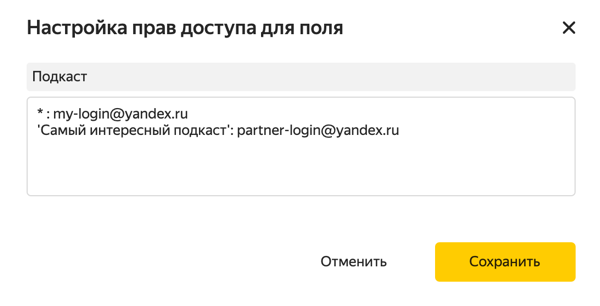
    
    - Эпизоды
        
        1. Откройте датасет **D01. Прослушивания подкастов**.
        1. В меню поля **Эпизод** нажмите **Права доступа**.
      
            
        
        1. В окне **Настройка прав доступа для поля** укажите фильтр как в примере:
           `'Эпизод номер 5': partner-login@yandex.ru`
           где:
            * `Эпизод номер 5` — название эпизода.
            * `partner-login@yandex.ru` — логин партнера.    
        
            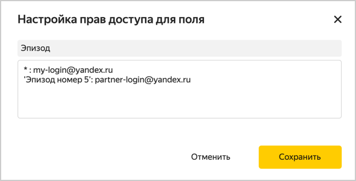
    
        
    
    Если вы хотите предоставить права к нескольким эпизодам, добавьте дополнительные строки для каждого эпизода по отдельности. 
    Подробнее о [правах доступа на уровне данных](../../datalens/security/row-level-security.md).

    
    
     Указывайте такие же названия, как на сервисе (прописные и заглавные буквы имеют значение при фильтрации).
    
    

    Права доступа у пользователя будут сохраняться до момента [отзыва прав](#revoke-access).

1. Поделитесь с пользователем ссылкой на дашборд **Аналитика подкастов на Яндекс Музыке**. Для этого на дашборде нажмите значок  → **Копировать ссылку**.

### 3.3. Отзовите права доступа у пользователя {#revoke-access}

При необходимости вы можете отозвать права у пользователя:

1. Перейдите к подключению **Подкасты Аналитика. Подключение**.
1. Нажмите на значок  и выберите **Права доступа**.
1. Выберите пользователя, у которого вы хотите отозвать права.
1. В появившемся окне нажмите кнопку **Отозвать права**.
1. Чтобы полностью ограничить доступ пользователя к вашему кабинету статистики подскастера:
    1. Откройте страницу [Управление доступом]({{ link-console-access-management }}).
    1. Найдите пользователя, нажмите значок напротив нового пользователя и выберите **Удалить**.

## 4. Сделайте публичным дашборд или чарт {#publish-dashboard-chart}

Данные в {{ datalens-short-name }} доступны только пользователям конкретного экземпляра. Если требуется предоставить публичный неограниченный доступ к аналитике подкастов, [опубликуйте](../../datalens/concepts/datalens-public.md) дашборд или отдельный чарт.



- Публикация дашборда {#dashboard} 
    
    1. Откройте дашборд **Аналитика подкастов на Яндекс Музыке**.
    1. В верхней части интерфейса дашборда нажмите значок .
    1. В открывшемся окне настройки публичного доступа включите **Доступ по ссылке**.
    1. Подтвердите публикацию, нажмите **Продолжить**.
    1. Выберите чарты, которые вы хотите опубликовать вместе с дашбордом.
    1. Скопируйте ссылку публичного доступа и нажмите **Применить**.
 
- Публикация чарта {#chart}

    1. На странице навигации найдите чарт, например **C07. Старты и стримы: динамика**, и откройте его.
    1. В верхней части интерфейса чарта нажмите значок .
    1. В открывшемся окне настройки публичного доступа включите **Доступ по ссылке**.
    1. Подтвердите публикацию, нажмите **Продолжить**.        
    1. Скопируйте ссылку публичного доступа и нажмите **Применить**.



## 5. Добавьте чарт или дашборд на свой сайт {#add-dashboard-chart}

Вы можете встроить опубликованные чарты на сайт или в приложение с помощью элемента `iframe`. Для этого:

1. Перейдите по публичной ссылке на чарт.
1. Нажмите в правом верхнем углу чарта значок  и выберите **Код для вставки**.
1. Скопируте код вставки `iframe` в светлой или темной теме.
1. Вставте код на свой сайт.



Встроить можно только отдельные чарты. Встраивание дашборда целиком не поддерживается.



## Вопросы и ответы {#qa}
      


   Использование аккаунта на Яндексе в Яндекс Музыке и {{ datalens-short-name }} обеспечивает высокие меры безопасности данных.



   
   
  Данные обновляются ежедневно в 13:00. Если после этого времени кто-то послушал подкаст, данные появятся в статистике только на следующий день. Также в статистике не учитываются воспроизведения меньше 1 секунды.

 


  
   На сервисе новые подписчики появляются мгновенно, а в статистике — только на следующий день. Если человек подписался на подкаст сегодня, число подписчиков в статистике увеличится завтра.

   


 
   В статистике отображаются только те выпуски, в которых уже были прослушивания. Если какой-то выпуск сейчас не виден, он появится на графиках позже, как только произойдет первое прослушивание.
   
    



   Периоды продвижения и промо-тайтлы отдельно не отображаются в статистике, однако резкий скачок прослушиваний может говорить о том, что подкаст получил промо.

   

   
  
   Да, вы можете изменять дашборд и связанные с ним объекты.
   
  

    
   
   Пересоздайте подключение, дашборд развернется еще раз.
   
  

      
   
   {{ datalens-short-name }} — полноценный инструмент анализа и визуализации данных. Обширный набор настроек открывает возможность построения различных видов визуализаций, отвечающих тем или иным требованиям пользователей.

     
   


   Вы не ограничены в использовании {{ datalens-short-name }}. Можно подключаться к своим источникам данных, строить чарты и дашборды, делиться ими с коллегами.
   
     
