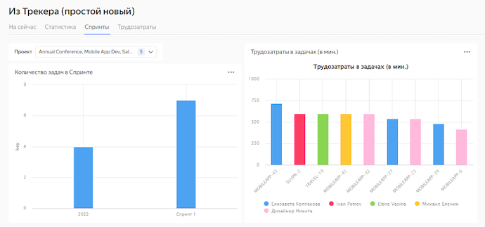
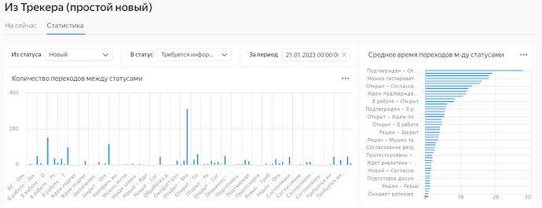

# Визуализация данных из {{ tracker-full-name }}

Визуализация данных из {{ tracker-short-name }} в {{ datalens-full-name }} позволяет построить более сложную аналитику, чем это возможно средствами самого {{ tracker-short-name }}.

Для визуализации данных из {{ tracker-short-name }} в {{ datalens-short-name }} необходимо:
* организовать регулярный экспорт данных во внешнее хранилище;
* визуализировать необходимые метрики и данные с помощью {{ datalens-short-name }}.

Для визуализации данных выполните следующие шаги:
1. [Подготовьте облако к работе](#before-you-begin).
1. [Создайте БД для хранения данных {{ tracker-short-name }}](#database-create).
1. [Создайте OAuth токен для доступа к {{ tracker-short-name }}](#oauth-token).
1. [Создайте функцию {{ sf-name }} для импорта данных](#function-import).
1. [Создайте подключение к {{ datalens-short-name }}](#connection-create).
1. [Создайте дашборд в {{ datalens-short-name }}](#dashboard-create).
1. [Создайте датасет](#dataset-create).
1. [Создайте чарт](#chart-create).
1. [Добавьте чарты на дашборд](#dashboard-create).

## Перед началом работы {#before-you-begin}




Рекомендуется [создать](../../tracker/enable-tracker.md) отдельную учетную запись {{ tracker-short-name }} для работы с сервисом.







### Необходимые платные ресурсы {#paid-resources}

* Постоянно запущенный кластер {{ mch-name }} (см. [тарифы {{ mch-name }}](../../managed-clickhouse/pricing.md));
* Использование функции {{ sf-name }} (см. [тарифы {{ sf-name }}](../../functions/pricing.md)).

Если созданные ресурсы вам больше не нужны, [удалите их](#clear-out).


## Создайте БД для хранения данных {{ tracker-short-name }} {#database-create}

1. Перейдите в [консоль управления]({{ link-console-main }}).
1. В левом верхнем углу нажмите кнопку  **Все сервисы**.
1. Выберите **Платформа данных** → **{{ mch-name }}**.
1. Нажмите кнопку **Создать кластер {{ CH }}**.
1. Укажите параметры кластера:
    * Базовые параметры:
        * **Окружение** — `PRODUCTION`;
        * **Версия** — `22.8 LTS`; 
    * Ресурсы:
        * **Платформа** — `Intel Ice Lake`;
        * **Тип** — `standart`;
        * **Класс хоста** — `{{ s3-c2-m8 }}`;
    * Размер хранилища — `30 ГБ`;
    * Хосты:
        * **Публичный доступ** — `Включено`;
    * Настройки СУБД:
        * **Управление пользователями через SQL** — `Выключено`;
        * **Управление базами данных через SQL** — `Выключено`;
        * **Имя пользователя** — `tracker_data`;
        * **Имя БД** — `db1`;
    * Сервисные настройки:
        * **Доступ из {{ datalens-short-name }}** — `Включено`;
        * **Доступ из Serverless** — `Включено`.
    Полный список настроек см. в разделе [Настройки {{ mch-name }}](../../managed-clickhouse/concepts/settings-list.md).
1. Нажмите кнопку **Создать кластер**. Дождитесь, когда статус созданного кластера сменится на `Alive`. 
1. Скопируйте и сохраните имя хоста для дальнейшей настройки {{ sf-name }}.


## Создайте OAuth токен для доступа к {{ tracker-short-name }} {#oauth-token}

1. Перейдите на страницу [Создание приложения](https://oauth.yandex.ru/client/new).
1. Заполните поля:
    * **Название вашего сервиса**;
    * **Платформы** — `Веб-сервисы`;
    * **Redirect URI** — нажмите на строку **Подставить URL для отладки** или впишите адрес `https://oauth.yandex.ru/verification_code`.
1. В разделе **Доступ к данным** укажите:
    * `Чтение из трекера`;
    * `Запись в трекер`.
1. Нажмите кнопку **Создать приложение**.
1. В новом окне введите в адресную строку браузера адрес:

    ```
    https://oauth.yandex.ru/authorize?response_type=token&client_id=ID
    ```

    Где `ID` — идентификатор созданного приложения в поле **ClientID**.

1. Авторизуйтесь с помощью учетной записи {{ tracker-short-name }}, которая будет использоваться для визуализации.
1. Сохраните полученный [OAuth токен](https://cloud.yandex.ru/docs/tracker/concepts/access#section_about_OAauth).

## Создайте функцию {{ sf-name }} для импорта данных {#function-import}

1. Перейдите в [консоль управления]({{ link-console-main }}).
1. В левом верхнем углу нажмите кнопку  **Все сервисы**.
1. Выберите **Бессерверные вычисления** → **{{ sf-name }}**.
1. Нажмите кнопку **Создать функцию**.
1. Укажите название функции и нажмите кнопку **Создать**.
1. В открывшемся окне **Редактор** выберите среду выполнения `Python / 3.9`.
1. Нажмите кнопку **Продолжить**.
1. В поле **Способ** нажмите кнопку **ZIP-Архив**.
1. Прикрепите [тестовый архив](https://github.com/yandex-cloud/yc-architect-solution-library/raw/main/yc-tracker/tracker-data-import/build/tracker-data-import.zip).
1. В поле **Точка входа** укажите `tracker_import.handler`.
1. В разделе **Параметры** укажите:
    * **Таймаут, с** — `60`;
    * **Память** — `1024`;
    * **Переменные окружения**:
        * `TRACKER_ORG_ID` — [ID организации](https://tracker.yandex.ru/admin/orgs).
        * `TRACKER_OAUTH_TOKEN` — [OAuth токен](#oauth-token) учетной записи {{ tracker-short-name }}.
        * `CH_HOST` — имя [хоста](#database-create).
        * `CH_DB` — название [базы данных](#database-create).
        * `CH_USER` — [имя пользователя](#database-create).
        * `CH_PASSWORD` — [пароль](#database-create).
        * `CH_ISSUES_TABLE` — `tracker_issues`.
        * `CH_CHANGELOG_TABLE` — `tracker_changelog`.
        * `TRACKER_INITIAL_HISTORY_DEPTH` — `1d`.
        * `CH_STATUSES_VIEW` — `v_tracker_statuses`.
1. Нажмите кнопку **Создать версию**.
1. На вкладке **Тестирование** нажмите кнопку **Запустить тест**.
1. Результат теста — лог импорта данных:
    ```json
    {
        "statusCode": 200,
        "headers": {
        "Content-Type": "text/plain"
        },
        "isBase64Encoded": false,
        "body": "OK"
    }
    ```
1. Создайте [триггер](../../functions/concepts/trigger/index.md) для регулярного экспорта новых данных в БД:
    1. Откройте раздел **{{ sf-name }}**.
    1. Нажмите  → **Создать триггер**.
    1. Укажите тип триггера — **Таймер**.
    1. В поле **Cron-выражение** выберите `Каждый день`.
    1. В разделе **Настройки функции** нажмите кнопку **Создать новый**.
    1. Укажите имя аккаунта. По умолчанию аккаунту присвоена роль `serverless.functions.invoker` для работы с триггером.
    1. Нажмите кнопку **Создать**.
    1. Нажмите кнопку **Создать триггер**.

## Создайте подключение в {{ datalens-short-name }} {#connection-create}

1. Откройте [кластер](#database-create) **{{ mch-name}}**.
1. Откройте вкладку **{{ datalens-short-name }}**.
1. Нажмите **Создать подключение**.
1. Укажите настройки подключения:
    * **Подключение** — `Выбрать в каталоге`;
    * **Кластер** — кластер, указанный при [создании базы данных](#database-create);
    * **Имя хоста** — хост, указанный при [создании базы данных](#database-create);
    * **Порт HTTP-интерфейса** — `8443`;
    * **Имя пользователя** — имя пользователя, указанное при [создании базы данных](#database-create);
    * **Пароль** — пароль, указанный при [создании базы данных](#database-create);
    * **Время жизни кеша в секундах** — `По умолчанию`;
    * **Уровень доступа SQL-запросов** — `Запретить`;
    * **HTTPS** — `Включено`.
    
1. Нажмите кнопку **Создать подключение**.

## Создайте датасет {#dataset-create}

1. Перейдите на [страницу подключений]({{ link-datalens-main }}/connections).
1. Выберите [подключение](#connection-create).
1. В правом верхнем углу нажмите кнопку **Создать датасет**.
1. Перенесите на рабочую область одну или несколько таблиц:
    * `db1.v_tracker_issues` — текущий (последний) срез задач; 
    * `db1.v_tracker_changelog` — история изменения параметров задач;
    * `Db1.v_tracker_statuses` – время переходов между статусами на основе истории изменения задач.
1. Нажмите кнопку **Сохранить**.

## Создайте чарт {#chart-create}


1. Перейдите на главную страницу [{{ datalens-short-name }}]({{ link-datalens-main }}).
1. Нажмите кнопку **Создать чарт**.
1. В левом верхнем углу нажмите  **Выберите датасет**.
1. В выпадающем списке **Датасеты** выберите [датасет](#dataset-create), созданный на предыдущем шаге.


1. На верхней панели выберите [тип визуализации](../../datalens/visualization-ref/index.md). По умолчанию выбран тип **Столбчатая диаграмма**.

## Создайте дашборд {#dashboard-create}

1. На главной странице [{{ datalens-full-name }}]({{ link-datalens-main }}) нажмите **Создать дашборд**.
1. В открывшемся окне введите название дашборда. Дашборд появится в списке на странице навигации.

Подробнее о настройке дашбордов см. в разделе [Дашборд {{ datalens-full-name }}](../../datalens/concepts/dashboard.md).

## Добавьте чарты на дашборд {#add-charts}

1. В верхней части страницы [дашборда](#dashboard-create) нажмите кнопку **Добавить** → **Чарт**.
1. Заполните параметры виджета. Обратите внимание на следующие поля:
    * **Название**. Задает имя виджета. Отображается на верхней части виджета.
    * **Чарт**. Задает добавляемый виджет.
    * **Описание**. Задает описание виджета. Отображается на нижней части виджета.
    * **Автовысота**. Задает автоматическую высоту для виджетов типа **Таблица** и **Markdown**. Если параметр отключен, то высоту виджета на странице можно установить с помощью мыши.
1. Нажмите кнопку **Добавить**. Виджет отобразится на дашборде.













## Как удалить созданные ресурсы {#clear-out}

Чтобы перестать платить за созданные ресурсы:
* [Удалите {{ CH }}-кластер](../../managed-clickhouse/operations/cluster-delete.md);
* [Удалите функцию {{ sf-name }}](../../functions/operations/function/function-delete.md).