# Визуализация данных из {{ objstorage-full-name }} в {{ datalens-full-name }}


С помощью интеграции {{ yq-full-name }} и {{ datalens-full-name }} можно визуализировать данные, хранимые в {{ objstorage-full-name }}. {{ datalens-short-name }} формирует запрос на языке YQL, {{ yq-full-name }} исполняет запрос и возвращает результаты, которые визуализируются с помощью чартов.

Ниже приведена архитектура решения.

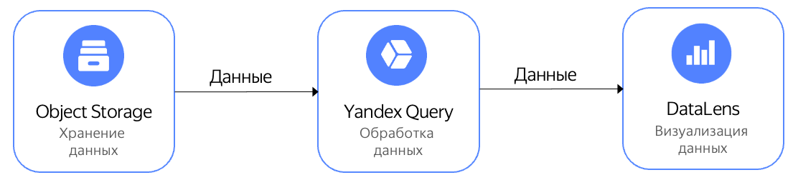

Рассмотрим визуализацию зависимости количества и средней стоимости поездок Нью-Йоркского желтого такси от времени суток. Данные заранее размещены в {{ objstorage-full-name }} в общедоступном бакете `yq-sample-data` в каталоге `nyc_taxi_csv`.







Для визуализации и исследования данных [подготовьте облако к работе](#before-you-begin), затем выполните следующие шаги:

1. [Подключитесь к данным в {{ objstorage-name }}](#create_connection).
1. [Создайте подключение в {{ datalens-full-name }}](#create_connection_lens).
1. [Настройте поля датасета](#create_dataset).
1. [Настройте визуализацию](#create_comdo_chart).

## Перед началом работы {#before-you-begin}





Для создания в {{ datalens-short-name }} подключения к {{ yq-full-name }} требуется [сервисный аккаунт](../../iam/concepts/users/service-accounts.md) с [ролью](../../iam/operations/sa/assign-role-for-sa.md) `{{ roles-editor }}` на каталог, в котором будет [создано соединение](#create_connection) с [бакетом](../../storage/concepts/bucket.md) {{ objstorage-short-name }}.



## Подключитесь к данным в {{ objstorage-name }} {#create_connection}

1. В [консоли управления]({{ link-console-main }}) выберите каталог, в котором нужно создать [соединение](../../query/concepts/glossary.md#connection).

   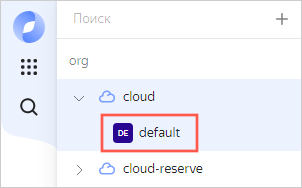

1. В списке сервисов выберите **{{ ui-key.yacloud.iam.folder.dashboard.label_yq_ru }}**.

   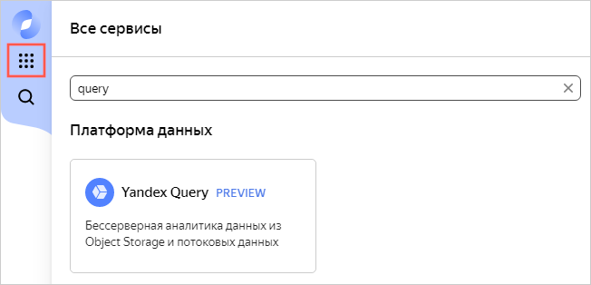

1. На панели слева выберите  **{{ ui-key.yql.yq-navigation.tutorial.menu-text }}**.
1. Нажмите кнопку **{{ ui-key.yql.yq-tutorial.create-connection.button-label }}**. В блоке создания соединения все поля ввода параметров уже заполнены — введите описание (опционально) и нажмите кнопку **{{ ui-key.yql.yq-connection-form.create.button-text }}**. Вы перейдете на экран создания [привязки](../../query/concepts/glossary.md#binding) к данным.
1. Введите описание привязки к данным (опционально) и нажмите кнопку **{{ ui-key.yql.yq-binding-form.binding-create.button-text }}**. Будут созданы нужные для обучения ресурсы.

## Создайте подключение в {{ datalens-full-name }} {#create_connection_lens}

Чтобы создать подключение к {{ yq-full-name }}:

1. Перейдите на [главную страницу]({{ link-datalens-main }}) {{ datalens-short-name }}.
1. На панели слева выберите  **Подключения** и нажмите кнопку **Создать подключение**.
1. Выберите подключение **{{ yq-full-name }}**.
1. Укажите параметры подключения:

   * **Облако и каталог**. Выберите каталог, в котором находится ваш сервисный аккаунт.
   * **Сервисный аккаунт**. Выберите существующий [сервисный аккаунт](../../iam/concepts/users/service-accounts.md) или создайте новый.
   * **Время жизни кеша в секундах**. Укажите время жизни кеша или оставьте значение по умолчанию.
   * **Уровень доступа SQL запросов**. Выберите вариант **Разрешить подзапросы из датасетов и запросы из чартов**.

1. Нажмите кнопку **Создать подключение**.
1. Введите имя подключения `yq-connect` и нажмите **Создать**.

## Настройте поля датасета {#create_dataset}

1. На странице создания подключения в правом верхнем углу нажмите кнопку **Создать датасет**.

   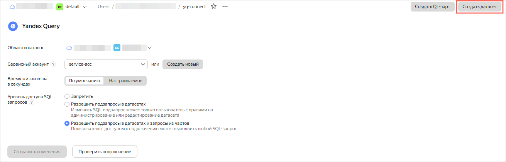

1. В открывшемся окне введите текст запроса, указанный ниже, и нажмите кнопку **Создать**.

   ```sql
   SELECT 
       *
   FROM 
       bindings.`tutorial-analytics`
   ```

   Если все настроено правильно, то в нижней части экрана в блоке **Предпросмотр** появятся данные следующего вида:

   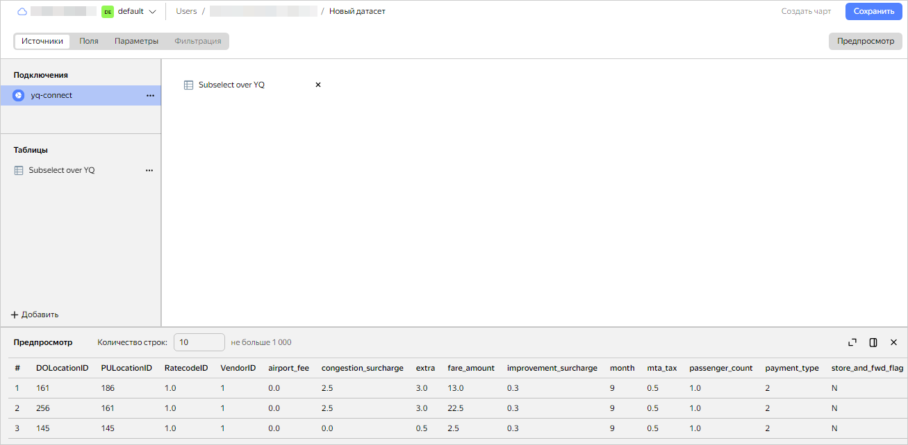

1. Создайте вычисляемое поле, содержащее данные часа посадки:

   1. Перейдите на вкладку **Поля** и нажмите кнопку **Добавить поле**.

      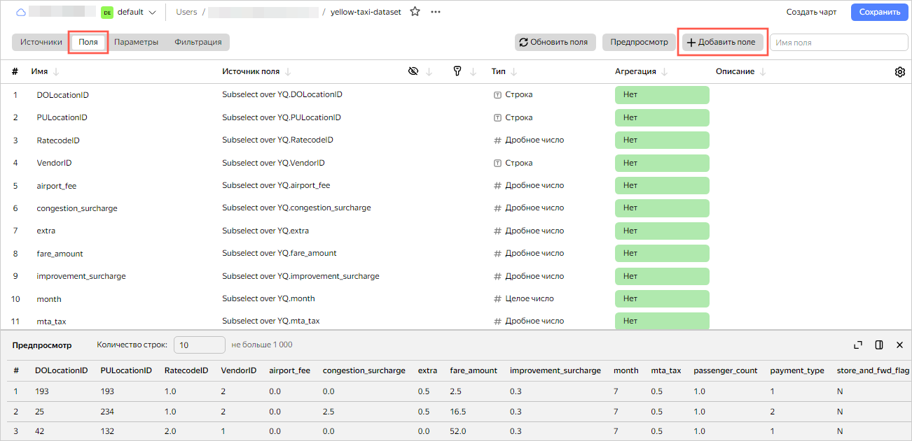

   1. В поле **Название поля** укажите `hour_trip`.
   1. В строке формул введите:

      ```
      HOUR([tpep_pickup_datetime])
      ```

   1. Нажмите кнопку **Создать**. Новое поле `hour_trip` отобразится в списке полей датасета.

1. В столбце **Агрегация** для поля `total_amount` выберите тип агрегации **Среднее**.

   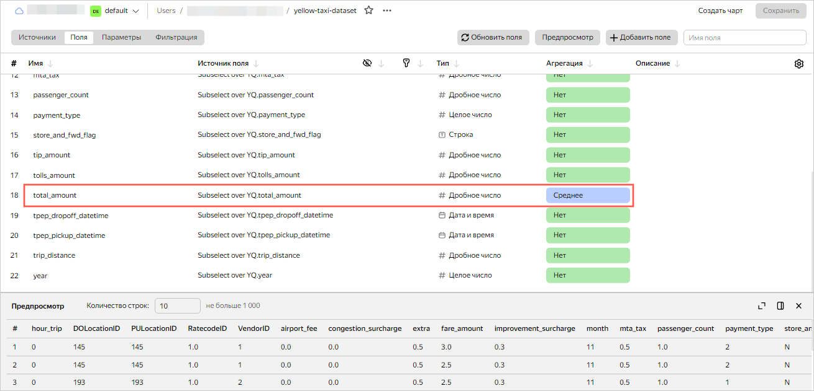

1. В правом верхнем углу нажмите кнопку **Сохранить**. Введите имя датасета `yellow-taxi-dataset` и нажмите **Создать**.
1. После сохранения датасета в правом верхнем углу нажмите **Создать чарт**.

   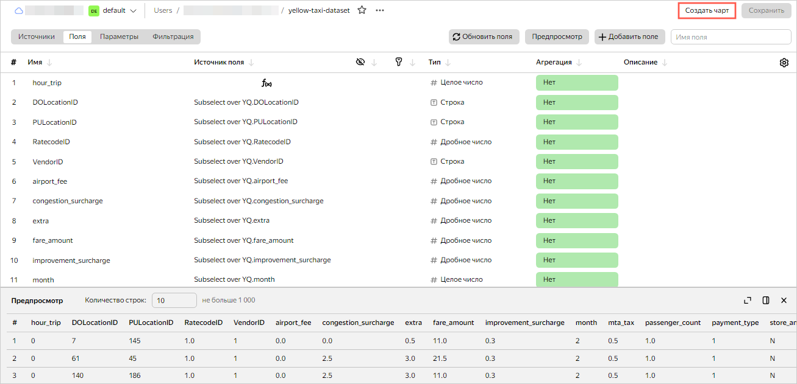

## Настройте визуализацию {#create_comdo_chart}

Для визуализации и исследования используйте [чарт](../../datalens/concepts/chart/index.md) типа [комбинированная диаграмма](../../datalens/visualization-ref/combined-chart.md).

1. Выберите тип визуализации **Комбинированная диаграмма**.

   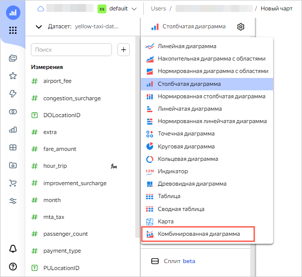

1. Перетащите измерение `hour_trip` в секцию **X**. Измерение в секции **X** будет общим для всех слоев.
1. Для первого слоя выберите тип **Столбчатая диаграмма**.

   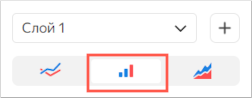

1. Перетащите показатель `total_amount` в секцию **Y**. В области визуализации отобразится столбчатая диаграмма.
1. Добавьте слой. Для этого нажмите значок  справа от названия первого слоя.
1. Для второго слоя выберите тип **Линейная диаграмма**.

   

1. Добавьте в чарт поле:

   1. Вверху слева нажмите  и выберите **Поле**.

      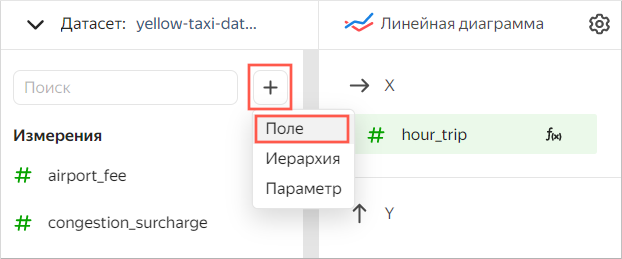

   1. В открывшемся окне введите:

      * В поле **Название поля** — `count_trip`.
      * В строке формул — `COUNT()`.

        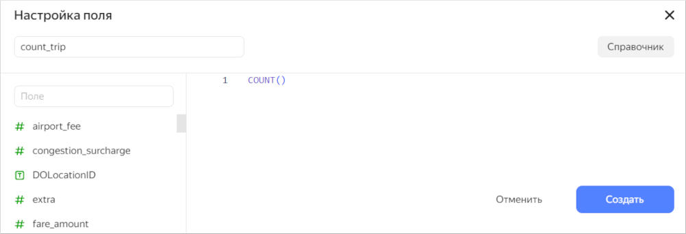

   1. Нажмите кнопку **Создать**.

1. Перетащите новый показатель `count_trip` в секцию **Y2**. В области визуализации поверх первой диаграммы отобразится линейная диаграмма.
1. В правом верхнем углу нажмите кнопку **Сохранить**. Введите имя чарта `yellow-taxi-combo-chart` и нажмите **Сохранить**.

В созданном чарте прослеживается зависимость количества поездок (линейная диаграмма) и средней стоимости поездок (столбчатая диаграмма) от времени суток.

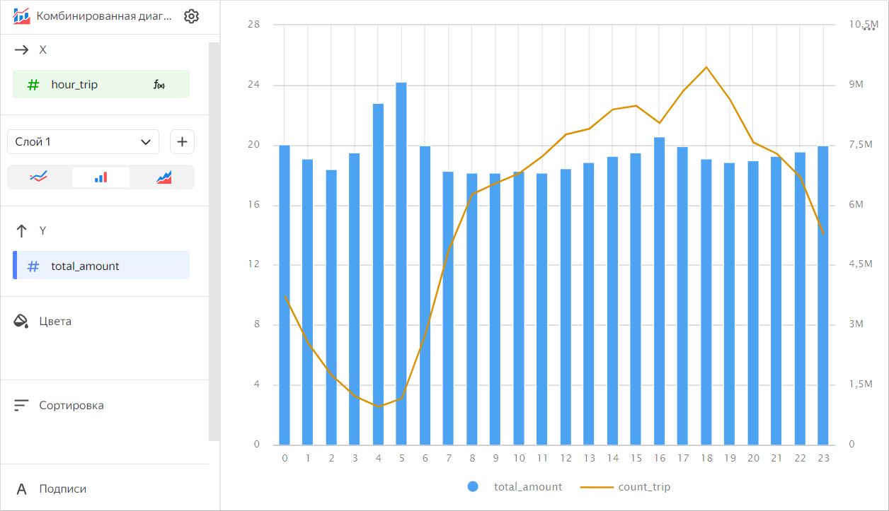

Аналогичным образом вы можете построить дополнительные [чарты](../../datalens/operations/chart/create-chart.md) и [дашборды](../../datalens/operations/dashboard/create.md) и [поделиться результатом](../../datalens/concepts/datalens-public.md) с коллегами.
