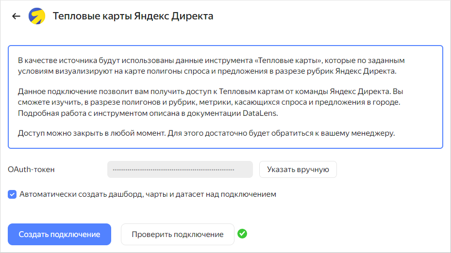
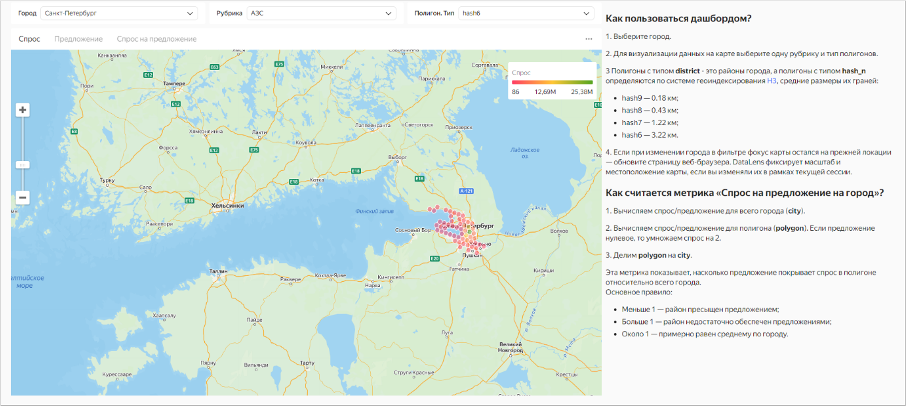

# Визуализация данных с использованием инструмента "Тепловые карты"

В качестве источника будут использованы данные инструмента **Тепловые карты**, который по заданным условиям визуализирует на карте полигоны спроса и предложения в разрезе рубрик Яндекс Директа.

Инструмент **Тепловые карты** — статистика, которая показывает спрос и предложение на компании и их услуги:

* **Спрос** — показывает, где пользователи Яндекса ищут компании в радиусе 3 км от вас.
* **Предложение** — показывает количество существующих организаций в Картах.
* **География предложения** — показывает, как компании располагаются в Картах.
 
**Тепловые карты** нужны, чтобы:

* Выбрать удачное место, где можно открыть офлайн-точку.
* Запустить рекламу в Рекламной сети Яндекса там, где есть ваши потенциальные покупатели.
* Анализировать ваших конкурентов.



Пользователь получает доступ к данным на дашборде **Тепловые карты**, если:

* У пользователя есть аккаунт в Директе.
* Пользователю выданы права на дашборд **Тепловые карты**.

Предоставлением доступа к дашборду **Тепловые карты** занимается менеджер через внутреннюю заявку на подключение.



Для визуализации и исследования данных выполните следующие шаги:

1. [Настройте подключение](#configure-connection).
    1. [Подготовьте {{ datalens-short-name }} к работе](#before-you-begin).
    1. [Создайте подключение](#create-connection). 
1. [Изучите работу с инструментом Тепловые карты](#view-dashboard).
    1. [Ознакомьтесь с содержимым каталога](#view-catalog).
    1. [Настройте дашборд](#dashboard-settings).
1. [Поделитесь статистикой по спросу и предложению с другими пользователями](#share-statistics).
1. [Сделайте публичным дашборд или чарт](#publish-dashboard-chart).
1. [Добавьте чарт или дашборд на свой сайт](#add-dashboard-chart).

Рекомендуем ознакомиться с разделом [Вопросы и ответы](#qa), который поможет ответить на основные вопросы, возникающие у пользователей статистики спроса и предложения.

## 1. Настройте подключение {#configure-connection}

### 1.1 Подготовьте {{ datalens-short-name }} к работе {#before-you-begin}

{{ datalens-full-name }} разворачивается в облачной платформе {{ yandex-cloud }}. 

Подготовьтесь к работе с {{ datalens-short-name }}, исходя из своего опыта:

* Вы новый пользователь (хотите использовать {{ datalens-full-name }} только для исследования подкастов).
* Вы уже используете {{ datalens-full-name }} (в других целях).



### 1.2. Создайте подключение {#create-connection}

Для подключения к дашборду **Тепловые карты**:

1. Перейдите по [ссылке]({{ link-datalens-main }}/connections/new/smb_heatmaps) и нажмите кнопку **Получить токен**. 

   

1. После успешной авторизации токена проверьте подключение. Для этого нажмите кнопку **Проверить подключение**.
1. Оставьте опцию **Автоматически создать дашборд, чарты и датасет над подключением** включенной.
1. Нажмите кнопку **Создать подключение**. Введите имя подключения **Heatmaps Connection** (название может быть произвольным) и нажмите кнопку **Создать**.

## 2. Изучите работу с инструментом Тепловые карты {#view-dashboard}

### 2.1. Ознакомьтесь с содержимым каталога {#view-catalog}

1. После создания подключения откроется папка с набором стандартных объектов, на основе которых построена ваша статистика:

   *  Дашборд **Спрос и предложение** — основная страница для просмотра статистики, с набором всех виджетов (графиков, таблиц, фильтров). Чтобы иметь быстрый доступ к дашборду, сохраните ссылку на страницу в удобном месте.    
   *  Датасет **smb_geo_heat_maps_dataset** — датасет с набором измерений и показателей, на основе которых строятся чарты.
   *  Чарты  — набор отдельных визуализаций в виде диаграмм и таблиц, используемых на дашборде.
 
1. Откройте дашборд **Спрос и предложение**.

   Дашборд содержит три вкладки: **Спрос**, **Предложение**, **Спрос на предложение**. Каждая вкладка содержит:

      * Текстовые виджеты — заголовки, комментарии и подсказки.
      * Селекторы — фильтры по различным измерениям, которыми можно фильтровать содержимое дашбордов.
      * Чарты — графики, таблицы и другие визуализации.    
    
   
    
1. Добавьте дашборд в **Избранное**. Для этого в верхней части экрана справа от названия дашборда нажмите значок . Для доступа к папке **Избранное** на панели слева нажмите значок .

Вы можете вносить правки и дополнять стандартные объекты по своему усмотрению.

### 2.2. Настройте дашборд {#dashboard-settings}

1. Выберите город.
1. Для визуализации данных на карте выберите одну рубрику и тип полигонов.

Полигоны с типом `district` — это районы города, а полигоны с типом `hash_n` определяются по системе геоиндексирования `H3`, средние размеры их граней:

   * `hash9` — 0,18 км
   * `hash8` — 0,43 км
   * `hash7` — 1,22 км
   * `hash6` — 3,22 км

Если вы поменяли город и фокус карты не изменился — обновите страницу. {{ datalens-short-name }} сохраняет данные автоматически — вы всегда сможете продолжить с того места, где остановились.

Показатель **Спроса на предложение на город** отображает, насколько товары и услуги востребованы в конкретном городе или районе города. Он вычисляется так:

1. Вычисляется отношение спроса к предложению для всего города (`city`).
1. Вычисляется отношение спроса к предложению для полигона (`polygon`). Если предложение нулевое, то спрос умножается на 2.
1. Вычисляется отношение `polygon` к `сity`.



Основное правило:

* Меньше 1 — район пресыщен предложением.
* Больше 1 — район недостаточно обеспечен предложениями.
* Около 1 — примерно равен среднему по городу.



Обратите внимание на шкалу спроса и предложения в правом верхнем углу. Чем зеленее участок, тем выше спрос в районе, или гексагоне вашего города. Чем цвет холоднее: например, синий или красный — тем ниже предложение.

## 3. Поделитесь статистикой по спросу и предложению с другими пользователями {#share-statistics}

Чтобы другой пользователь мог открыть ваш дашборд, настройте доступ к {{ datalens-full-name }}:

1. [Пригласите пользователя](../../organization/operations/add-account.md#send-invitation) с аккаунтом на Яндексе или [добавьте федеративного пользователя](../../organization/operations/add-account.md#add-user-sso).
1. Убедитесь, что у пользователя есть права доступа к дашборду:

   1. Откройте дашборд.
   1. В поле **Добавить участника** введите Все или имя пользователя, которому нужны расширенные доступы.
   1. Перейдите к блоку **Текущий объект** и установите права доступа для дашборда:

      * просмотр — доступен только просмотр;
      * редактирование — доступны просмотр и редактирование;
      * администрирование — доступны просмотр, редактирование и управление.

   1. Включите опцию **Связанные объекты**, чтобы предоставить права на другие связанные с дашбордом объекты (подключение, датасеты и чарты).

Пользователь получит доступ к вашему {{ datalens-short-name }} и объектам с правами доступа **Все**. Вы сможете назначить этому пользователю отдельные права на объекты.

Ссылку на дашборд при этом можно будет отправлять из браузера. Подробнее про права доступа к объектам {{ datalens-short-name }} см. в [документации](../../datalens/security/index.md#permissions).

## 4. Сделайте публичным дашборд или чарт {#publish-dashboard-chart}

Данные в {{ datalens-short-name }} доступны только пользователям конкретного экземпляра. Если требуется предоставить публичный неограниченный доступ к статистике спроса и предложения, опубликуйте дашборд или отдельный чарт в [{{ datalens-short-name }} Public](../../datalens/concepts/datalens-public.md).



- Публикация дашборда {#dashboard}
    
  1. Откройте дашборд **Спрос и предложение**.
  1. В верхней части интерфейса дашборда нажмите значок .
  1. В открывшемся окне настройки публичного доступа включите **Доступ по ссылке**.
  1. Подтвердите публикацию, нажмите **Продолжить**.
  1. Выберите чарты, которые вы хотите опубликовать вместе с дашбордом.
  1. Скопируйте ссылку публичного доступа и нажмите **Применить**.
 
- Публикация чарта {#chart}

  1. На странице навигации найдите чарт, например **Карта спрос на предложение**, и откройте его.
  1. В верхней части интерфейса чарта нажмите значок .
  1. В открывшемся окне настройки публичного доступа включите **Доступ по ссылке**.
  1. Подтвердите публикацию, нажмите **Продолжить**.        
  1. Скопируйте ссылку публичного доступа и нажмите **Применить**.



## 5. Добавьте чарт или дашборд на свой сайт {#add-dashboard-chart}

Вы можете встроить опубликованные чарты на сайт или в приложение с помощью элемента `iframe`. Для этого:

1. Перейдите по публичной ссылке на чарт.
1. Нажмите в правом верхнем углу чарта значок  и выберите **Код для вставки**.
1. Скопируте код вставки `iframe` в светлой или темной теме.
1. Вставте код на свой сайт.



Встроить можно только отдельные чарты. Встраивание дашборда целиком не поддерживается.



## Вопросы и ответы {#qa}
      


   Использование аккаунта на Яндексе в {{ datalens-short-name }} обеспечивает высокие меры безопасности данных.



   
  
   Да, вы можете изменять дашборд и связанные с ним объекты.
   
  

    
   
   Пересоздайте подключение, дашборд развернется еще раз.
   
  

      
   
   {{ datalens-short-name }} — полноценный инструмент анализа и визуализации данных. Обширный набор настроек открывает возможность построения различных видов визуализаций, отвечающих тем или иным требованиям пользователей.

     
   


   Вы не ограничены в использовании {{ datalens-short-name }}. Можно подключаться к своим источникам данных, строить чарты и дашборды, делиться ими с коллегами.
   
     
