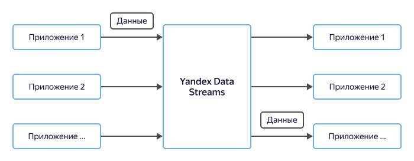

# Передача данных в микросервисных архитектурах

Современные приложения переходят от монолитной архитектуры к микросервисной. Появляется большое число взаимодействующих между собой компонентов, которые написаны на разных языках программирования и выполняются на различных устройствах.

Использование шин потоков данных для обмена информацией между компонентами упрощает разработку микросервисной архитектуры, позволяет увеличить надежность и улучшить масштабирование.

## Преимущества {#advantages}

### Надежность {#reliability}

Микросервисные архитектуры, как правило, являются распределенными. В распределенных архитектурах надежность является очень важным фактором. Поддержка в каждом приложении полной модели отказов — сложная задача, поэтому отказоустойчивыми делают инфраструктурные компоненты, а остальные приложения на них опираются и становятся отказоустойчивыми вслед за ними.

### Разное время жизни {#ttl}

В монолитной архитектуре все компоненты постоянно доступны для обмена данными. Компоненты микросервисной архитектуры компоненты имеют разное время жизни ине могут полагаться на прямой обмен данными между ними. Данные нужно или буферизировать, или пересылать через шину потоков данных.

### Масштабирование {#scaling}

Приложения растут и по мере роста они должны продолжать оставаться такими же эффективными. Шины потоков данных предлагают такой сценарий взаимодействия, что просто следуя ему, приложения становятся масштабируемыми.

## Сравнение с {{ KF }} {#comparison}

В таблице ниже приведено сравнение {{ yds-short-name }} с популярной шиной потоков данных {{ KF }}.

Параметр | {{ yds-full-name }} | {{ KF }}
----|-----|-----
Поддерживаемый протокол | Amazon Kinesis Data Streams API | {{ KF }}
Поддерживаемые SDK | HTTP, Java, C++, Go и другие | HTTP, Java, C++, Go и другие
Стоимость | Оплата за использование ресурсов: скорость, время хранения | Оплата за резервирование ресурсов: виртуальные машины
Сложность эксплуатации | Администрирование пользователем не требуется | Система администрируется пользователем, Облако отвечает только за инфраструктуру
Масштабирование | Без прерывания обслуживания (в данный момент доступно только масштабирование вверх) | С прерыванием обслуживания на время перезапуска кластера
Интеграция в Облако | Высокая: триггеры {{ sf-name }}, {{ api-gw-name }} и пр. |Базовая
Безопасность | Авторизация с помощью IAM-токена или ключа доступа | Авторизация с помощью логина и пароля
Надежность | Высокая, данные хранятся в трех зонах доступности | Высокая, настраивается пользователем
Время доставки сообщений | Менее секунды | Менее секунды
Время хранения данных | Задается при создании, 1-24 часа | Ограничено емкостью дисков виртуальных машин
Настраиваемость | Основные параметры | Высокая, если настройки поддержаны в Облаке

## Настройка {#setup}

Чтобы настроить передачу данных между компонентами:

1. [Создайте поток данных](../../data-streams/quickstart/create-stream.md) {{ yds-short-name }}.
1. [Настройте](../../data-streams/quickstart/index.md) AWS SDK.
1. Используйте SDK:
    * [Go](https://docs.aws.amazon.com/sdk-for-go/api/service/kinesis/).
    * [C++](https://sdk.amazonaws.com/cpp/api/LATEST/class_aws_1_1_kinesis_1_1_kinesis_client.html).
    * [Java](https://docs.aws.amazon.com/AWSJavaSDK/latest/javadoc/com/amazonaws/services/kinesis/AmazonKinesisClient.html).
    * [JavaScript](https://docs.aws.amazon.com/AWSJavaScriptSDK/v3/latest/clients/client-kinesis/index.html).
    * [Python](https://boto3.amazonaws.com/v1/documentation/api/latest/reference/services/kinesis.html).
    * [HTTP Kinesis Data Streams API](../../data-streams/kinesisapi/api-ref.md).
