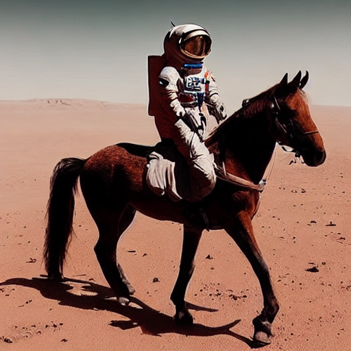

# Генерация изображения с помощью модели Stable Diffusion

В {{ ml-platform-name }} вы можете развернуть нейросеть на основе модели Stable Diffusion и генерировать изображения по их текстовому описанию.

[Stable Diffusion](https://github.com/CompVis/stable-diffusion/blob/main/README.md) — это модель преобразования текста в изображение с открытым исходным кодом, разработанная [stability.ai](https://stability.ai/).

В этом руководстве вы сгенерируете изображение по текстовому описанию с помощью реализации модели Stable Diffusion в библиотеке [KerasCV](https://keras.io/keras_cv/). По сравнению с другими реализациями модели Stable Diffusion у KerasCV есть несколько преимуществ, которые обеспечивают высокую скорость генерации. К ним относятся [компиляция XLA](https://www.tensorflow.org/xla) и поддержка [смешанной точности](https://www.tensorflow.org/guide/mixed_precision).

Чтобы сгенерировать изображение с помощью модели Stable Diffusion:

1. [Подготовьте инфраструктуру](#infra).
1. [Создайте модель и сгенерируйте изображение](#generate).

Если созданные ресурсы вам больше не нужны, [удалите их](#clear-out).

## Перед началом работы {#before-you-begin}





### Необходимые платные ресурсы {#paid-resources}

В стоимость использования модели входит плата за запуск ячеек с кодом (см. [тарифы {{ ml-platform-name }}](../../datasphere/pricing.md)).

## Подготовьте инфраструктуру {#infra}

### Создайте проект {#create-project}

1. Откройте [главную страницу]({{ link-datasphere-main }}) {{ ml-platform-name }}.
1. На панели слева выберите  **{{ ui-key.yc-ui-datasphere.common.spaces }}**.
1. Выберите сообщество, в котором вы хотите создать проект.
1. На странице сообщества нажмите кнопку  **{{ ui-key.yc-ui-datasphere.projects.create-project }}**.
1. В открывшемся окне укажите имя `Stable Diffusion` и (опционально) описание проекта.
1. Нажмите кнопку **{{ ui-key.yc-ui-datasphere.common.create }}**.

### Создайте ноутбук и установите библиотеки {#install-libraries}



В этом практическом руководстве все вычисления выполняются на конфигурации g1.1, однако модель может быть запущена и на других конфигурациях. 



1. В интерфейсе {{ ml-platform-name }} откройте созданный проект.
1. Создайте новый ноутбук:

   1. На верхней панели в окне проекта нажмите **File** → **New** → **Notebook**.
   1. В открывшемся окне выберите ядро **{{ ml-platform-name }} Kernel**.

1. Обновите библиотеку [TensorFlow](https://www.tensorflow.org/). Вставьте в ячейку указанный ниже код и нажмите значок .

   ```python
   %pip install tensorflow==2.11.0
   ```

1. Установите библиотеку KerasCV:

   ```python
   %pip install keras_cv==0.4.2
   ```

1. Установите библиотеку [NumPy](https://numpy.org/) версии 1.21:

   ```python
   %pip install numpy==1.21
   ```

1. Установите библиотеку Protocol Buffers версии 3.20:

   ```python
   %pip install protobuf==3.20
   ```

1. Перезагрузите ядро: на верхней панели в окне проекта нажмите **Kernel** → **Restart kernel**.

## Создайте модель и сгенерируйте изображение {#generate}

1. Импортируйте в проект библиотеки:

   ```python
   #!g1.1
   import time
   import keras_cv
   from tensorflow import keras
   import matplotlib.pyplot as plt
   ```

1. Создайте модель:

   ```python
   #!g1.1
   model = keras_cv.models.StableDiffusion(img_width=512, img_height=512)
   ```

1. Сгенерируйте изображение по его описанию:

   ```python
   #!g1.1
   images = model.text_to_image("photograph of an astronaut riding a banana with old dragon", batch_size=3)
   ```

1. Создайте функцию отрисовки изображения:

   ```python
   #!g1.1
   def plot_images(images):
       plt.figure(figsize=(20, 20))
       for i in range(len(images)):
           ax = plt.subplot(1, len(images), i + 1)
           plt.imshow(images[i])
           plt.axis("off")
   ```

1. Выведите полученное изображение на экран:

   ```python
   #!g1.1
   plot_images(images)
   ```

   Результат:

   

## Как удалить созданные ресурсы {#clear-out}

Если вы больше не планируете работать с проектом `Stable Diffusion`, [удалите его](../../datasphere/operations/projects/delete.md#delete-project).
