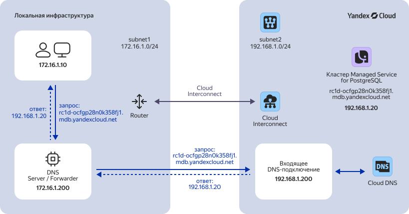

Если у вас есть собственные корпоративные сети, связанные с [облачными сетями](../../vpc/concepts/network.md#network) {{ yandex-cloud }} (например, с помощью сервиса [{{ interconnect-full-name }}](../../interconnect/index.yaml)), то вы можете интегрировать корпоративный DNS с внутренними DNS-зонами в {{ yandex-cloud }} и реализовать разрешение DNS-имен облачных ресурсов в ваших корпоративных сетях. Это позволит по имени обращаться к облачным ресурсам и сервисам {{ yandex-cloud }} из корпоративных сетей.

Чтобы настроить разрешение внутренних облачных DNS-имен клиентами в вашей корпоративной сети, вы создадите на стороне {{ yandex-cloud }} [входящее DNS-подключение](../../dns/concepts/dns-connection.md#dns-inbound), которое будет перенаправлять DNS-запросы из корпоративной сети на [DNS-резолверы](../../dns/concepts/dns-resolver.md) в подсетях {{ vpc-name }}. На стороне корпоративной сети вы настроите DNS-сервер так, чтобы все DNS-запросы к облачным ресурсам направлялись на IP-адрес созданного входящего DNS-подключения.

В данном сценарии пользователь, подключенный к корпоративной сети в `subnet1`, разрешает DNS-имя хоста в [кластере](../../managed-postgresql/concepts/index.md) {{ mpg-full-name }}, отправляя DNS-запросы через локальный [DNS-форвардер](*dns_forwarder).

Схема решения:



1. Корпоративная сеть:

    * Состоит из подсети `subnet1` с диапазоном адресов `172.16.1.0/24`.
    * В подсети `subnet1` размещен DNS-сервер (DNS-форвардер) с IP-адресом `172.16.1.200`.

        Этот сервер обслуживает DNS-зону в подсети `subnet1` и перенаправляет DNS-запросы компьютера пользователя с IP-адресом `172.16.1.10` в облачную сеть на IP-адрес [входящего DNS-подключения](../../dns/concepts/dns-connection.md#dns-inbound), созданного на стороне {{ yandex-cloud}}.
1. Облачная сеть {{ yandex-cloud }}:

    * Состоит из [подсети](../../vpc/concepts/network.md#subnet) `subnet2` с диапазоном адресов `192.168.1.0/24`.
    * В подсети `subnet2` расположен кластер {{ mpg-full-name }}.
    
        В этом руководстве вы настроите интеграцию таким образом, чтобы DNS-имя ([FQDN](../../glossary/fqdn.md)) хоста этого кластера успешно разрешалось изнутри корпоративной сети.
    * В облачной сети создано [входящее DNS-подключение](../../dns/concepts/dns-connection.md#dns-inbound), позволяющее клиентам из корпоративной сети разрешать DNS-имена во [внутренних DNS-зонах](../../dns/concepts/dns-zone.md#private-zones) {{ yandex-cloud }}.

        Входящему DNS-подключению присвоен IP-адрес `192.168.1.200`, относящийся к подсети `subnet2` и зарезервированный в сервисе {{ vpc-full-name }}.
1. С помощью сервиса {{ interconnect-full-name }} корпоративная и облачная сети связаны между собой так, что все IP-адреса подсети в одной сети доступны из подсети в другой сети и наоборот.

Чтобы настроить разрешение DNS-имен облачных ресурсов и сервисов {{ yandex-cloud }} в корпоративных сетях:

1. [Подготовьте облако к работе](#before-you-begin).
1. [Настройте облачную инфраструктуру](#setup-cloud-dns).
1. [Настройте корпоративную сеть](#setup-on-prem-dns).
1. [Проверьте работу интеграции](#check-dns-service).

Если созданные ресурсы вам больше не нужны, [удалите их](#clear-out).

## Перед началом работы {#before-you-begin}



### Необходимые платные ресурсы {#paid-resources}

В стоимость поддержки создаваемой инфраструктуры входят:

* Плата за ресурсы кластера {{ mpg-name }}: выделенные хостам вычислительные ресурсы, объем хранилища и резервных копий ([тарифы {{ mpg-name }}](../../managed-postgresql/pricing.md)).
* Плата за использование сервиса {{ interconnect-full-name }} ([тарифы {{ interconnect-name }}](../../interconnect/pricing.md)).

## Настройте облачную инфраструктуру {#setup-cloud-dns}

На стороне {{ yandex-cloud }} вы создадите облачную сеть с одной подсетью, кластер {{ mpg-name }} с одним хостом и входящее DNS-подключение.

### Создайте облачную сеть {#create-network}



- Консоль управления {#console}

  1. В [консоли управления]({{ link-console-main }}) выберите [каталог](../../resource-manager/concepts/resources-hierarchy.md#folder), в котором вы будете создавать облачную инфраструктуру.
  1. [Перейдите]({{ link-console-main }}/link/vpc) в сервис **{{ ui-key.yacloud.iam.folder.dashboard.label_vpc }}** и нажмите кнопку **{{ ui-key.yacloud.vpc.networks.button_create }}**.
  1. В поле **{{ ui-key.yacloud.vpc.networks.create.field_name }}** задайте [имя](*name) облачной сети `my-vpc-network`.
  1. Отключите опцию **{{ ui-key.yacloud.vpc.networks.create.field_is-default }}**.
  1. Нажмите **{{ ui-key.yacloud.vpc.networks.button_create }}**.



### Создайте подсеть {#create-subnet}



- Консоль управления {#console}

  1. В [консоли управления]({{ link-console-main }}) выберите каталог, в котором вы создаете инфраструктуру.
  1. [Перейдите]({{ link-console-main }}/link/vpc) в сервис **{{ ui-key.yacloud.iam.folder.dashboard.label_vpc }}**.
  1. На панели слева выберите  **{{ ui-key.yacloud.vpc.switch_networks }}** и нажмите кнопку **{{ ui-key.yacloud.vpc.subnetworks.button_action-create }}**.
  1. В поле **{{ ui-key.yacloud.vpc.subnetworks.create.field_name }}** задайте [имя](*name) подсети `subnet2`.
  1. В поле **{{ ui-key.yacloud.vpc.subnetworks.create.field_zone }}** выберите [зону доступности](../../overview/concepts/geo-scope.md) `{{ region-id }}-b`.
  1. В поле **{{ ui-key.yacloud.vpc.subnetworks.create.field_network }}** выберите облачную сеть `my-vpc-network`, созданную ранее.
  1. В поле **{{ ui-key.yacloud.vpc.subnetworks.create.field_ip }}** задайте CIDR подсети `192.168.1.0/24`.
  1. Нажмите **{{ ui-key.yacloud.vpc.subnetworks.create.button_create }}**.



### Создайте кластер {{ mpg-full-name }} {#create-cluster}



- Консоль управления {#console}

  1. В [консоли управления]({{ link-console-main }}) выберите каталог, в котором вы создаете инфраструктуру.
  1. [Перейдите]({{ link-console-main }}/link/managed-postgresql) в сервис **{{ ui-key.yacloud.iam.folder.dashboard.label_managed-postgresql }}** и нажмите кнопку **{{ ui-key.yacloud.mdb.clusters.button_create }}**.
  1. В поле **{{ ui-key.yacloud.mdb.forms.base_field_name }}** задайте [имя](*name) кластера `my-postgresql-cluster`.
  1. В блоке **{{ ui-key.yacloud.mdb.forms.section_database }}** в поле **{{ ui-key.yacloud.mdb.forms.database_field_user-password }}** выберите `{{ ui-key.yacloud.component.password-input.label_button-generate }}`.
  1. В блоке **{{ ui-key.yacloud.mdb.forms.section_network }}** выберите созданную ранее облачную сеть `my-vpc-network`.
  1. В блоке **{{ ui-key.yacloud.mdb.forms.section_host }}** оставьте один хост в зоне доступности `{{ region-id }}-b`.

      Чтобы удалить лишние хосты, в строке с соответствующим хостом нажмите значок  и выберите  **{{ ui-key.yacloud.common.delete }}**.
  
      

      Одного хоста достаточно, чтобы проверить работу рассматриваемого решения.
      
      В рабочих сценариях не рекомендуется создавать кластер из одного хоста. Такой кластер обходится дешевле, но не обеспечивает [высокую доступность](../../managed-postgresql/concepts/high-availability.md#host-configuration).

      

  1. Значения остальных параметров оставьте без изменений и нажмите кнопку **{{ ui-key.yacloud.mdb.forms.button_create }}**.



### Создайте входящее DNS-подключение {#create-inbound-endpoint}

Создайте [входящее DNS-подключение](../../dns/concepts/dns-connection.md#dns-inbound), через которое клиенты из корпоративной сети смогут разрешать DNS-имена во внутренних DNS-зонах {{ yandex-cloud }}:



- Консоль управления {#console}

  1. В [консоли управления]({{ link-console-main }}) выберите каталог, в котором вы создаете инфраструктуру.
  1. [Перейдите]({{ link-console-main }}/link/dns) в сервис **{{ ui-key.yacloud.iam.folder.dashboard.label_dns }}**.
  1. На панели слева выберите  **{{ ui-key.yacloud.dns.label_inbound-endpoints }}** и нажмите кнопку **{{ ui-key.yacloud.dns.DnsInboundEndpointsListScreen.create_button }}**. В открывшемся окне:

      1. В поле **{{ ui-key.yacloud.common.name }}** задайте [имя](*name) `corp-example-net-inbound`.
      1. В блоке **{{ ui-key.yacloud.dns.DnsInboundEndpointForm.network_settings_title }}** в поле **{{ ui-key.yacloud.vpc.label_network }}** выберите облачную сеть `my-vpc-network`.
      1. В поле **{{ ui-key.yacloud.entity.ipAddress }}** нажмите кнопку **{{ ui-key.yacloud.component.internal-v4-address-field.button_internal-address-reserve }}**, чтобы зарезервировать статический внутренний IP-адрес для создаваемого DNS-подключения. В открывшемся окне:

          1. В поле **{{ ui-key.yacloud.common.name }}** задайте [имя](*name) резервируемого адреса `corp-example-net-inbound-address`.
          1. В поле **{{ ui-key.yacloud.common.label_subnet }}** выберите подсеть `subnet2`, в которой будет зарезервирован IP-адрес.

              

              IP-адрес входящего DNS-подключения может относиться к любой из подсетей в выбранной облачной сети. При этом указывать IP-адреса, уже используемые ресурсами {{ yandex-cloud }}, нельзя.

              

          1. В поле **{{ ui-key.yacloud.vpc.addresses.popup-create_field_internal-v4-address }}** задайте IP-адрес `192.168.1.200` (относится к диапазону адресов подсети `subnet2`).
          1. Нажмите кнопку **{{ ui-key.yacloud.common.create }}**, чтобы зарезервировать адрес.
    1. Нажмите кнопку **{{ ui-key.yacloud.common.create }}**, чтобы создать входящее DNS-подключение.



## Настройте корпоративную сеть {#setup-on-prem-dns}

Настройте корпоративную сеть так, чтобы DNS-запросы к [внутренним зонам {{ yandex-cloud }}](../../dns/concepts/dns-zone.md#private-zones) направлялись на зарезервированный внутренний IP-адрес `192.168.1.200`, который [был назначен](#create-inbound-endpoint) входящему DNS-подключению.

Например, в корпоративной подсети вы можете создать [DNS-форвардер](*dns_forwarder) и задать его IP-адрес в качестве адреса основного DNS-сервера на сетевых интерфейсах клиентов в корпоративной подсети `subnet1`. Для создания DNS-форвардеров рекомендуем использовать утилиты [CoreDNS](https://coredns.io/) или [Unbound](https://www.nlnetlabs.nl/projects/unbound/).





- Настройка DNS-переадресации с помощью CoreDNS

  1. Подключитесь к хосту, на котором будет настроен DNS-форвардер.
  1. Скачайте актуальную версию `CoreDNS` со [страницы производителя](https://github.com/coredns/coredns/releases/latest) и установите ее:

      ```bash
      cd /var/tmp && wget <URL_пакета> -O - | tar -xz
      sudo mv coredns /usr/local/sbin
      ```
  1. Создайте файл конфигурации `CoreDNS`: 

      ```bash
      sudo mkdir /etc/coredns
      sudo tee >> /etc/coredns/Corefile <<EOF
      {{ dns-zone }} {
        forward . 192.168.1.200
      }
      . {
        forward . <IP-адрес_основного_DNS-сервера_в_корпоративной_подсети>
      }
      EOF
      ```
  1. Настройте автоматический запуск `CoreDNS`:

      ```bash
      sudo tee >> /etc/systemd/system/coredns.service <<EOF
      [Unit]
      Description=CoreDNS
      After=network.target

      [Service]
      User=root
      ExecStart=/usr/local/sbin/coredns -conf /etc/coredns/Corefile
      StandardOutput=append:/var/log/coredns.log
      StandardError=append:/var/log/coredns.log
      RestartSec=5
      Restart=always

      [Install]
      WantedBy=multi-user.target
      EOF
      sudo systemctl enable --now coredns
      ```
  1. Отключите системную службу распознавания имен DNS, чтобы ее функции выполнял локальный DNS-форвардер. Например, в ОС Linux Ubuntu 20.04 это можно сделать с помощью команд:

      ```bash
      sudo systemctl disable --now systemd-resolved
      rm /etc/resolv.conf
      echo "nameserver 127.0.0.1" | sudo tee /etc/resolv.conf
      ```

- Настройка DNS-переадресации с помощью Unbound

  1. Подключитесь к хосту, на котором будет настроен DNS-форвардер.
  1. Установите пакет `unbound` (приведен пример для ОС Linux Ubuntu):

      ```bash
      sudo apt update && sudo apt install --yes unbound
      ```
  1. Создайте файл конфигурации `unbound`:
   
      ```bash
      sudo tee -a /etc/unbound/unbound.conf <<EOF
      server:
        module-config: "iterator"
        interface: 0.0.0.0
        access-control: 127.0.0.0/8   allow
        access-control: 192.168.0.0/21 allow

      forward-zone:
        name: "{{ dns-zone }}"
        forward-addr: 192.168.1.200

      forward-zone:
        name: "."
        forward-addr: <IP-адрес_основного_DNS-сервера_в_корпоративной_подсети>
      EOF
      ``` 
  1. Перезапустите Unbound:

      ```bash
      sudo systemctl restart unbound
      ```

  1. Отключите системную службу распознавания имен DNS, чтобы ее функции выполнял локальный DNS-форвардер. Например, в ОС Linux Ubuntu 20.04 это можно сделать с помощью команд:

      ```bash
      sudo systemctl disable --now systemd-resolved
      rm /etc/resolv.conf
      echo "nameserver 127.0.0.1" | sudo tee /etc/resolv.conf
      ```






## Проверьте работу интеграции {#check-dns-service}

1. Получите FQDN хоста созданного ранее кластера `my-postgresql-cluster`.

    О том, как узнать FQDN хоста, читайте в разделе [{#T}](../../managed-postgresql/operations/connect/fqdn.md).
1. Убедитесь, что с компьютера в корпоративной сети выполняется разрешение имен во внутренней DNS-зоне {{ yandex-cloud }} `{{ dns-zone }}`. Для этого выполните команду, указав в ней FQDN хоста кластера.

    Например:

    ```bash
    host rc1d-oсfgp28n0k358fj1.{{ dns-zone }}
    ```

    Результат:

    ```text
    rc1d-oсfgp28n0k358fj1.{{ dns-zone }} has address 192.168.1.20
    ```
1. Убедитесь, что на компьютере в корпоративной сети выполняется разрешение имен в публичных зонах, например:

    ```bash
    host cisco.com
    ```

    Результат:

    ```text
    cisco.com has address 72.163.4.185
    ...
    ```

## Как удалить созданные ресурсы {#clear-out}

Чтобы перестать платить за ресурсы:

* [удалите кластер {{ mpg-name }}](../../managed-postgresql/operations/cluster-delete.md);
* [удалите входящее DNS-подключение](../../dns/operations/connection-inbound-delete.md);
* [удалите зарезервированный внутренний IP-адрес](../../vpc/operations/private-ip-delete.md);
* [удалите подсеть](../../vpc/operations/subnet-delete.md);
* [удалите облачную сеть](../../vpc/operations/network-delete.md).

[*name]: 

[*dns_forwarder]: DNS-форвардер — это специальный DNS-сервер, который по-разному перенаправляет DNS-запросы в зависимости от доменного имени, указанного в запросе.
