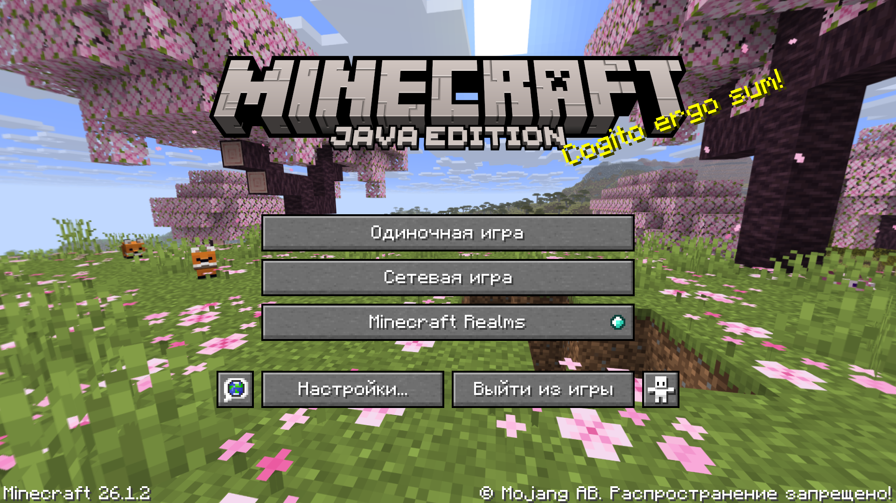
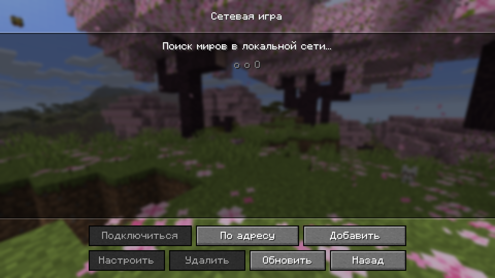
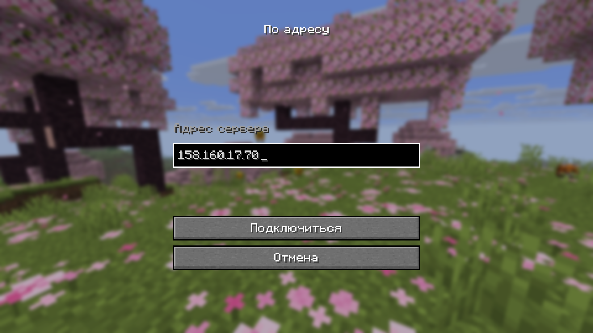
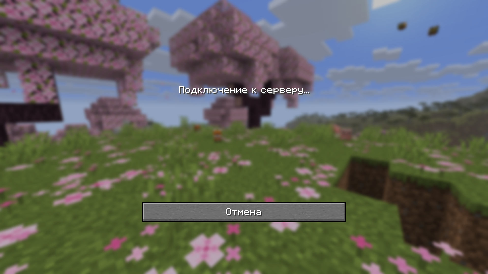
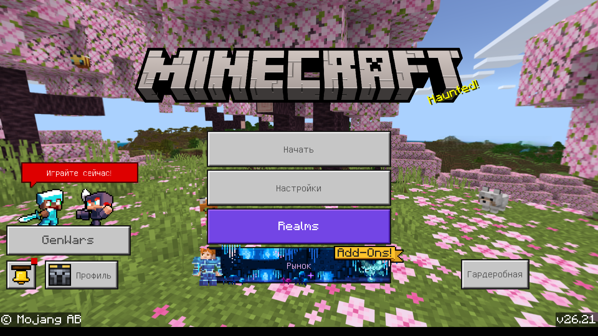
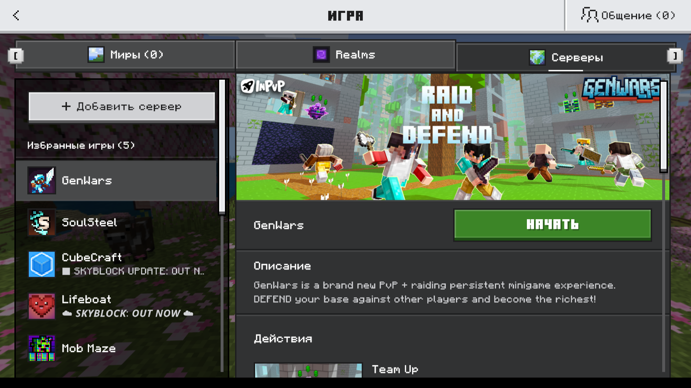
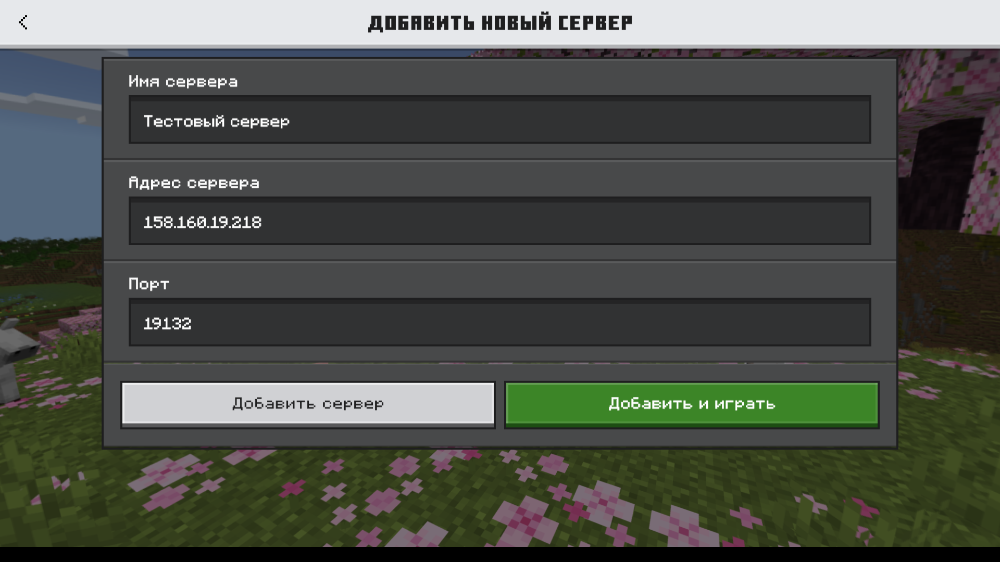
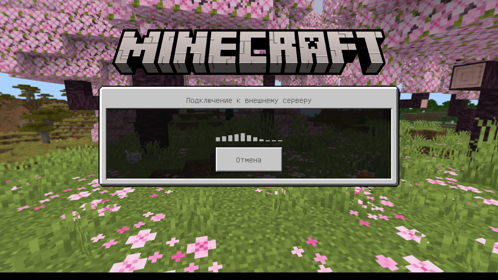

# Развертывание сервера Minecraft в {{ yandex-cloud }}

С помощью руководства вы развернете сервер [Minecraft](https://www.minecraft.net/) [Java Edition](https://www.minecraft.net/en-us/download/server) или [Bedrock Edition](https://www.minecraft.net/en-us/download/server/bedrock) актуальной версии в {{ yandex-cloud }} на [виртуальной машине](../../compute/concepts/vm.md) с Ubuntu 24.04.

Чтобы развернуть сервер Minecraft в {{ yandex-cloud }}:

1. [Подготовьте облако к работе](#prepare-cloud).
1. [Создайте группу безопасности](#create-sg).
1. [Создайте ВМ для сервера Minecraft](#vm-minecraft).
1. [Установите утилиты и запустите сервер](#install-and-launch-server).
1. [Проверьте работу сервера](#test-functionality).

Если созданные ресурсы вам больше не нужны, [удалите их](#clear-out).


## Подготовьте облако к работе {#prepare-cloud}



### Необходимые платные ресурсы {#paid-resources}

В стоимость поддержки инфраструктуры входит:
* плата за постоянно запущенную [ВМ](../../compute/concepts/vm.md) (смотрите [тарифы {{ compute-full-name }}](../../compute/pricing.md));
* плата за использование публичного IP-адреса и исходящий трафик (смотрите [тарифы {{ vpc-full-name }}](../../vpc/pricing.md)).

## Создайте группу безопасности {#create-sg}

Создайте [группу безопасности](../../vpc/concepts/security-groups.md) с правилом, разрешающим входящий трафик к порту `25565` для Java Edition или `19132` для Bedrock Edition. Эти порты для доступа клиентов заданы по умолчанию в файле конфигурации сервера Minecraft. Также в группу безопасности будут добавлены правила, разрешающие доступ на ВМ по SSH для настройки сервера и доступ ВМ в интернет для скачивания ПО.



- Консоль управления {#console}

   1. В [консоли управления]({{ link-console-main }}) выберите ваш каталог.
   1. Перейдите в сервис **{{ ui-key.yacloud.iam.folder.dashboard.label_vpc }}**.
   1. На панели слева выберите  **{{ ui-key.yacloud.vpc.label_security-groups }}**.
   1. Нажмите кнопку **{{ ui-key.yacloud.vpc.network.security-groups.button_create }}**.
   1. В поле **{{ ui-key.yacloud.vpc.network.security-groups.forms.field_sg-name }}** укажите имя `minecraft-sg`.
   1. В поле **{{ ui-key.yacloud.vpc.network.security-groups.forms.field_sg-network }}** выберите сеть `default`.
   1. В блоке **{{ ui-key.yacloud.vpc.network.security-groups.forms.label_section-rules }}** [создайте](../../vpc/operations/security-group-add-rule.md) следующие правила для управления трафиком:

      #|
      || **Направление**
      **трафика**
      | **{{ ui-key.yacloud.vpc.network.security-groups.forms.field_sg-rule-description }}**
      | **{{ ui-key.yacloud.vpc.network.security-groups.forms.field_sg-rule-port-range }}**
      | **{{ ui-key.yacloud.vpc.network.security-groups.forms.field_sg-rule-protocol }}**
      | **{{ ui-key.yacloud.vpc.network.security-groups.forms.field_sg-rule-source }}** /
      **{{ ui-key.yacloud.vpc.network.security-groups.forms.field_sg-rule-destination }}**
      | **{{ ui-key.yacloud.vpc.network.security-groups.forms.field_sg-rule-cidr-blocks }}** ||
      || Входящий
      | `Доступ клиента к серверу Minecraft`
      | `25565`/`19132`
      | `{{ ui-key.yacloud.vpc.network.security-groups.forms.value_any }}`
      | `{{ ui-key.yacloud.vpc.network.security-groups.forms.value_sg-rule-destination-cidr }}`
      | `0.0.0.0/0` ||
      || Входящий
      | `Доступ на ВМ по SSH`
      | `22`
      | `{{ ui-key.yacloud.vpc.network.security-groups.forms.value_any }}`
      | `{{ ui-key.yacloud.vpc.network.security-groups.forms.value_sg-rule-destination-cidr }}`
      | `0.0.0.0/0` ||
      || Исходящий
      | `Доступ ВМ в интернет`
      | `0-65535`
      | `{{ ui-key.yacloud.vpc.network.security-groups.forms.value_any }}`
      | `{{ ui-key.yacloud.vpc.network.security-groups.forms.value_sg-rule-destination-cidr }}`
      | `0.0.0.0/0` ||
      |#

   1. Нажмите кнопку **{{ ui-key.yacloud.common.save }}**.




## Создайте ВМ для сервера Minecraft {#vm-minecraft}

1. [Создайте](../../compute/operations/vm-connect/ssh.md#creating-ssh-keys) пару ключей [SSH](../../glossary/ssh-keygen.md):
   ```bash
   ssh-keygen -t ed25519
   ```
   Рекомендуем оставить имя файла ключа без изменения.

1. Создайте ВМ с публичным IP-адресом:

   

   - Консоль управления {#console}

      1. В [консоли управления]({{ link-console-main }}) выберите [каталог](../../resource-manager/concepts/resources-hierarchy.md#folder), в котором будет создана ВМ.
      1. Перейдите в сервис **{{ ui-key.yacloud.iam.folder.dashboard.label_compute }}**.
      1. На панели слева выберите  **{{ ui-key.yacloud.compute.instances_jsoza }}**.
      1. Нажмите кнопку **{{ ui-key.yacloud.compute.instances.button_create }}**.
      1. В блоке **{{ ui-key.yacloud.compute.instances.create.section_image }}** выберите образ [Ubuntu 24.04 LTS](/marketplace/products/yc/ubuntu-24-04-lts).
      1. В блоке **{{ ui-key.yacloud.k8s.node-groups.create.section_allocation-policy }}** выберите [зону доступности](../../overview/concepts/geo-scope.md), в которой будет находиться ВМ.
      1. В блоке **{{ ui-key.yacloud.compute.instances.create.section_storages }}** настройте загрузочный [диск](../../compute/concepts/disk.md):

          * **{{ ui-key.yacloud.compute.disk-form.field_type }}** — `{{ ui-key.yacloud.compute.value_disk-type-network-hdd_cw9XD }}`.
          * **{{ ui-key.yacloud.compute.disk-form.field_size }}** — `18 {{ ui-key.yacloud.common.units.label_gigabyte }}`.

      1. В блоке **{{ ui-key.yacloud.compute.instances.create.section_platform }}** перейдите на вкладку **{{ ui-key.yacloud.component.compute.resources.label_tab-custom }}** и укажите рекомендуемые параметры для сервера Minecraft:

          * **{{ ui-key.yacloud.component.compute.resources.field_platform }}** — `Intel Ice Lake`.
          * **{{ ui-key.yacloud.component.compute.resources.field_cores }}** — `2`.
          * **{{ ui-key.yacloud.component.compute.resources.field_core-fraction }}** — `100%`.
          * **{{ ui-key.yacloud.component.compute.resources.field_memory }}** — `2 {{ ui-key.yacloud.common.units.label_gigabyte }}` для Java Edition или `4 {{ ui-key.yacloud.common.units.label_gigabyte }}` для Bedrock Edition.

      1. В блоке **{{ ui-key.yacloud.compute.instances.create.section_network }}**:

          * В поле **{{ ui-key.yacloud.component.compute.network-select.field_subnetwork }}** укажите идентификатор подсети в зоне доступности создаваемой ВМ или выберите [облачную сеть](../../vpc/concepts/network.md#network) из списка.

              * У каждой сети должна быть как минимум одна [подсеть](../../vpc/concepts/network.md#subnet). Если подсети нет, создайте ее, выбрав **{{ ui-key.yacloud.component.vpc.network-select.button_create-subnetwork }}**.
              * Если сети нет, нажмите **{{ ui-key.yacloud.component.vpc.network-select.button_create-network }}** и создайте ее:

                  * В открывшемся окне укажите имя сети и выберите каталог, в котором она будет создана.
                  * (Опционально) Выберите опцию **{{ ui-key.yacloud.vpc.networks.create.field_is-default }}**, чтобы автоматически создать подсети во всех зонах доступности.
                  * Нажмите **{{ ui-key.yacloud.vpc.networks.create.button_create }}**.

          * В поле **{{ ui-key.yacloud.component.compute.network-select.field_external }}** выберите `{{ ui-key.yacloud.component.compute.network-select.switch_auto }}`, чтобы назначить виртуальной машине случайный внешний IP-адрес из пула {{ yandex-cloud }}, или выберите статический адрес из списка, если вы зарезервировали его заранее.
          * В поле **{{ ui-key.yacloud.component.compute.network-select.field_security-groups }}** выберите созданную ранее группу безопасности `minecraft-sg`.

      1. В блоке **{{ ui-key.yacloud.compute.instances.create.section_access }}** выберите **{{ ui-key.yacloud.compute.instance.access-method.label_oslogin-control-ssh-option-title }}** и укажите данные для доступа к ВМ:

          * В поле **{{ ui-key.yacloud.compute.instances.create.field_user }}** введите имя пользователя, который будет создан на виртуальной машине, например `ubuntu`.

            

            Не используйте логин `root` или другие имена, зарезервированные операционной системой. Для выполнения операций, требующих прав суперпользователя, используйте команду `sudo`.

            

          * 

      1. В блоке **{{ ui-key.yacloud.compute.instances.create.section_base }}** задайте имя ВМ: `minecraft-server`.
      1. Нажмите **{{ ui-key.yacloud.compute.instances.create.button_create }}**.

   

   Рекомендуемая конфигурация виртуальной машины для Java Edition:

   | Конфигурация     |   Количество игроков  |   vCPU  |   RAM  |   Объем диска        |
   |------------------|-----------------------|---------|--------|----------------------|
   |   Минимальная    |   1-4                 |   2     |   1GB  |   минимум 150MB HDD  |
   |   Рекомендуемая  |   5-10                |   2     |   2GB  |   минимум 200MB HDD  |
   |   Лучшая         |   10+                 |   4     |   4GB  |   минимум 200MB SSD  |

   

   Обратите внимание, что эта таблица с конфигурацией отражает настройки по умолчанию, определяемые в `server.properties`. Чем больше становится мир, тем выше требования — особенно к оперативной памяти. Чем больше будут области прорисовки игрового мира, деревень и других динамических объектов, тем выше будут требования к виртуальному серверу.

   


## Установите утилиты и запустите сервер {#install-and-launch-server}



- Java Edition {#java}

   1. [Подключитесь по протоколу SSH](../../compute/operations/vm-connect/ssh.md#vm-connect) к созданной ВМ.

   1. Установите необходимые пакеты Java из репозитория и утилиту `screen` для запуска терминальной сессии в фоновом режиме:

      

      Команда ниже устанавливает версию `25` среды JRE. Для запуска актуальной версии сервера Minecraft может потребоваться более новая версия JRE, поэтому, прежде чем устанавливать этот пакет, уточните подходящую версию на [Minecraft Wiki](https://minecraft.wiki/w/Tutorial:Setting_up_a_Java_Edition_server#Version_requirements).

      

      ```bash
      sudo apt update -y \
         && sudo apt install -y openjdk-25-jre-headless screen
      ```

   1. Создайте отдельного системного пользователя `minecraft` для запуска сервера:

      ```bash
      sudo useradd -r -m -d /opt/minecraft-server -s /bin/bash minecraft
      ```

      Где:
      * `-r` — создать системного пользователя.
      * `-m -d /opt/minecraft-server` — создать домашнюю директорию пользователя по пути `/opt/minecraft-server`. В ней будут размещаться файлы сервера.
      * `-s /bin/bash` — назначить пользователю командную оболочку `bash`.

   1. Перейдите по [ссылке](https://www.minecraft.net/en-us/download/server/) и скопируйте URL для скачивания дистрибутива актуальной версии сервера.

   1. Скачайте актуальный дистрибутив в директорию сервера с помощью `wget`:

      ```bash
      sudo wget -O /opt/minecraft-server/minecraft_server.jar <ссылка_на_скачивание>
      ```

      Где `<ссылка_на_скачивание>` — полученная на предыдущем шаге ссылка для скачивания дистрибутива. Например: `https://piston-data.mojang.com/v1/objects/97ccd4c0ed3f81bbb7bfacddd1090b0c56f9bc51/server.jar`

   1. Создайте файл `eula.txt` для автоматического согласия с условиями лицензионного соглашения [EULA](https://aka.ms/MinecraftEULA):

      ```bash
      echo "eula=true" | sudo tee /opt/minecraft-server/eula.txt
      ```

   1. Передайте пользователю `minecraft` права на директорию сервера и все ее содержимое:

      ```bash
      sudo chown -R minecraft:minecraft /opt/minecraft-server
      ```

   1. Запустите в директории сервера фоновую сессию `screen` от имени пользователя `minecraft`:

      ```bash
      sudo -u minecraft bash -c 'cd /opt/minecraft-server && screen -S minecraft'
      ```

   1. В фоновой сессии запустите сервер:

      ```bash
      java -Xms1024M -Xmx1024M -jar minecraft_server.jar nogui
      ```

      Дождитесь успешного завершения создания игрового мира.

      ```text
      [14:16:47] [Server thread/INFO]: Preparing level "world"
      [14:16:48] [Server thread/INFO]: Selecting global world spawn...
      [14:17:05] [Server thread/INFO]: Loading 0 persistent chunks...
      ...
      [14:17:05] [Server thread/INFO]: Preparing spawn area: 100%
      [14:17:05] [Server thread/INFO]: Time elapsed: 17317 ms
      [14:17:05] [Server thread/INFO]: Done (17.788s)! For help, type "help"
      ```

   1. (Опционально) Можно оставить сессию `screen` работать в фоне, используя горячие клавиши **Ctrl + A + D**, и вернуться в основной терминал виртуальной машины.

      Чтобы вернуться к фоновой сессии с запущенным сервером, если такая фоновая сессия только одна, выполните команду:

      ```bash
      sudo -u minecraft screen -r
      ```

      Если фоновых сессий несколько, получите их список, выполнив команду:

      ```bash
      sudo -u minecraft screen -list
      ```

      Результат выполнения:

      ```text
      There is a screen on:
         35154.minecraft (06/12/26 14:15:56)     (Detached)
      1 Socket in /run/screen/S-minecraft.
      ```

      Затем перейдите в сессию по нужному номеру ID из списка:

      ```bash
      sudo -u minecraft screen -r 35154
      ```

      

      У пользователя `minecraft` нет пароля и SSH-ключа, поэтому подключиться к ВМ напрямую под ним нельзя. Чтобы в дальнейшем выполнять операции от его имени, подключитесь к ВМ по SSH под своим пользователем и переключитесь на `minecraft` командой:

      ```bash
      sudo -iu minecraft
      ```

      Будет запущена сессия входа, а текущей директорией сразу станет `/opt/minecraft-server`. Чтобы выйти обратно в свою сессию, выполните команду `exit` или нажмите **Ctrl + D**.

      

   1. После запуска сервера в директории будут созданы новые директории и необходимые файлы для работы и конфигурации сервера, в том числе логи:

      ```text
          4096 Jun 12 14:16 .
          4096 Jun 12 14:07 ..
           220 Mar 31  2024 .bash_logout
          3771 Mar 31  2024 .bashrc
          4096 Jun 12 14:16 .cache
           807 Mar 31  2024 .profile
             2 Jun 12 14:16 banned-ips.json
             2 Jun 12 14:16 banned-players.json
            10 Jun 12 14:10 eula.txt
          4096 Jun 12 14:16 libraries
          4096 Jun 12 14:16 logs
      60417480 Apr  9 10:20 minecraft_server.jar
             2 Jun 12 14:16 ops.json
          1676 Jun 12 14:16 server.properties
             2 Jun 12 14:16 usercache.json
          4096 Jun 12 14:16 versions
             2 Jun 12 14:16 whitelist.json
          4096 Jun 12 14:18 world
      ```

- Bedrock Edition {#bedrock}

   1. [Подключитесь по протоколу SSH](../../compute/operations/vm-connect/ssh.md#vm-connect) к созданной ВМ.

   1. Установите утилиту `screen` для запуска терминальной сессии в фоновом режиме, а также утилиту `unzip` для распаковки дистрибутива:

      ```bash
      sudo apt update -y \
         && sudo apt install -y screen unzip
      ```

   1. Создайте отдельного системного пользователя `minecraft` для запуска сервера:

      ```bash
      sudo useradd -r -m -d /opt/minecraft-server -s /bin/bash minecraft
      ```

      Где:
      * `-r` — создать системного пользователя.
      * `-m -d /opt/minecraft-server` — создать домашнюю директорию пользователя по пути `/opt/minecraft-server`. В ней будут размещаться файлы сервера.
      * `-s /bin/bash` — назначить пользователю командную оболочку `bash`.

   1. Перейдите по [ссылке](https://www.minecraft.net/en-us/download/server/bedrock) и скопируйте URL для скачивания дистрибутива актуальной версии сервера.

   1. Скачайте актуальный дистрибутив в директорию сервера с помощью `wget`:

      ```bash
      sudo wget -O /opt/minecraft-server/bedrock-server.zip <ссылка_на_скачивание>
      ```

      Где `<ссылка_на_скачивание>` — полученная на предыдущем шаге ссылка для скачивания дистрибутива. Например: `https://www.minecraft.net/bedrockdedicatedserver/bin-linux/bedrock-server-1.26.23.1.zip`

   1. Распакуйте архив с дистрибутивом в директорию сервера, а затем удалите его:

      ```bash
      sudo unzip /opt/minecraft-server/bedrock-server.zip -d /opt/minecraft-server \
         && sudo rm /opt/minecraft-server/bedrock-server.zip
      ```

   1. Передайте пользователю `minecraft` права на распакованные файлы:

      ```bash
      sudo chown -R minecraft:minecraft /opt/minecraft-server
      ```

   1. Запустите в директории сервера фоновую сессию `screen` от имени пользователя `minecraft`:

      ```bash
      sudo -u minecraft bash -c 'cd /opt/minecraft-server && screen -S minecraft'
      ```

   1. В фоновой сессии запустите сервер. Серверу Bedrock Edition требуются библиотеки из директории сервера, поэтому укажите ее в переменной `LD_LIBRARY_PATH`:

      ```bash
      LD_LIBRARY_PATH=. ./bedrock_server
      ```

      Дождитесь сообщения о готовности сервера:

      ```text
      [2026-06-14 13:36:44:060 INFO] Starting Server
      [2026-06-14 13:36:44:060 INFO] Version: 1.26.23.1
      [2026-06-14 13:36:44:060 INFO] Session ID: 4a018b28-5121-4abe-a814-e4ee70455c37
      [2026-06-14 13:36:44:060 INFO] Build ID: 45295249
      [2026-06-14 13:36:44:060 INFO] Branch: r/26_u2
      [2026-06-14 13:36:44:060 INFO] Commit ID: 49b09b8167bf5f877690429d12747f30342d1db6
      [2026-06-14 13:36:44:060 INFO] Configuration: Publish
      [2026-06-14 13:36:44:060 INFO] Level Name: Bedrock level
      [2026-06-14 13:36:44:061 INFO] No CDN config file found at: cdn_config.json for dedicated server
      [2026-06-14 13:36:44:061 INFO] Game mode: 0 Survival
      [2026-06-14 13:36:44:061 INFO] Difficulty: 1 EASY
      [2026-06-14 13:36:44:063 WARN] Content logging to console is disabled.  Enable it with content-log-console-output-enabled=true in server.properties
      [2026-06-14 13:36:44:608 INFO] Opening level 'worlds/Bedrock level/db'
      [2026-06-14 13:36:44:626 INFO] Pack Stack - None
      [2026-06-14 13:36:45:565 INFO] IPv4 supported, port: 19132: Used for gameplay and LAN discovery
      [2026-06-14 13:36:45:565 INFO] IPv6 supported, port: 19133: Used for gameplay
      [2026-06-14 13:36:45:605 INFO] Waiting for Minecraft services...
      [2026-06-14 13:36:45:806 INFO] Server started.
      ```

   1. (Опционально) Можно оставить сессию `screen` работать в фоне, используя горячие клавиши **Ctrl + A + D**, и вернуться в основной терминал виртуальной машины.

      Чтобы вернуться к фоновой сессии с запущенным сервером, если такая фоновая сессия только одна, выполните команду:

      ```bash
      sudo -u minecraft screen -r
      ```

      Если фоновых сессий несколько, получите их список, выполнив команду:

      ```bash
      sudo -u minecraft screen -list
      ```

      Результат выполнения:

      ```text
      There is a screen on:
         30989.minecraft (06/17/26 12:23:18)     (Detached)
      1 Socket in /run/screen/S-minecraft.
      ```

      Затем перейдите в сессию по нужному номеру ID из списка:

      ```bash
      sudo -u minecraft screen -r 30989
      ```

      

      У пользователя `minecraft` нет пароля и SSH-ключа, поэтому подключиться к ВМ напрямую под ним нельзя. Чтобы в дальнейшем выполнять операции от его имени, подключитесь к ВМ по SSH под своим пользователем и переключитесь на `minecraft` командой:

      ```bash
      sudo -iu minecraft
      ```

      Будет запущена сессия входа, а текущей директорией сразу станет `/opt/minecraft-server`. Чтобы выйти обратно в свою сессию, выполните команду `exit` или нажмите **Ctrl + D**.

      

   1. После запуска сервера в директории будут созданы новые директории и необходимые файлы для работы и конфигурации сервера:

      ```text
           4096 Jun 14 13:49 .
           4096 Jun 14 12:43 ..
             36 Jun 14 13:49 .bash_history
            220 Mar 31  2024 .bash_logout
           3771 Mar 31  2024 .bashrc
            807 Mar 31  2024 .profile
              0 Jun 15 12:56 Dedicated_Server.txt
              3 May 20 23:35 allowlist.json
      222788240 May 20 23:36 bedrock_server
          31241 May 20 23:35 bedrock_server_how_to.html
           4096 May 20 23:36 behavior_packs
           4096 May 20 23:36 config
           4096 May 20 23:36 data
           4096 May 20 23:36 definitions
           4096 Jun 14 13:36 development_behavior_packs
           4096 Jun 14 13:36 development_resource_packs
           4096 Jun 14 13:36 development_skin_packs
           4096 Jun 14 13:36 minecraftpe
            484 May 20 23:35 packetlimitconfig.json
              3 May 20 23:35 permissions.json
           4096 Jun 14 13:36 premium_cache
           8548 May 20 23:17 profanity_filter.wlist
            398 May 20 23:35 release-notes.txt
           4096 May 20 23:36 resource_packs
          11650 May 20 23:35 server.properties
           4096 Jun 14 13:36 treatments
           4096 Jun 14 13:36 world_templates
           4096 Jun 14 13:36 worlds
      ```



## Проверьте работу сервера {#test-functionality}



- Java Edition {#java}

   1. Скачайте и установите [клиент Minecraft](https://www.minecraft.net/en-us/download).

   1. Запустите Minecraft Java Edition.

   1. Нажмите кнопку **Сетевая игра**.

      {width=750}

   1. Выберите **По адресу**.

      {width=750}

   1. В поле **Адрес сервера** укажите [публичный IP-адрес](../../vpc/concepts/address.md#public-addresses) виртуальной машины `minecraft-server` и нажмите **Подключиться**.

      {width=750}

      {width=750}

- Bedrock Edition {#bedrock}

   1. Скачайте и установите [клиент Minecraft](https://www.minecraft.net/en-us/download).

   1. Запустите Minecraft Bedrock Edition.

   1. Нажмите кнопку **Начать**.

      {width=750}

   1. Выберите **Серверы**, затем нажмите **+ Добавить сервер**.

      {width=750}

   1. Название сервера задайте произвольно, в поле **Адрес сервера** укажите [публичный IP-адрес](../../vpc/concepts/address.md#public-addresses) виртуальной машины `minecraft-server`, порт оставьте по умолчанию. Нажмите кнопку **Добавить и играть**.

      {width=750}

      {width=750}



## Как удалить созданные ресурсы {#clear-out}

Чтобы перестать платить за созданные ресурсы:
1. [Удалите](../../compute/operations/vm-control/vm-delete.md) виртуальную машину `minecraft-server`.
1. [Удалите](../../vpc/operations/security-group-delete.md) группу безопасности `minecraft-sg`.
