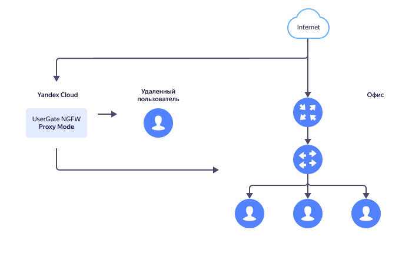

# Создание и настройка шлюза UserGate в режиме прокси-сервера


[UserGate](https://www.usergate.com/ru/products/enterprise-firewall) — это межсетевой экран нового поколения от одноименной российской компании.

Вы создадите виртуальную машину UserGate в {{ yandex-cloud }} и настроите шлюз в режиме прокси-сервера. Это позволит организовать безопасный доступ в интернет для сотрудников вашей компании из любой точки мира (офис, дом, кафе и прочие публичные места). Для более расширенного изучения возможностей UserGate пройдите бесплатный курс [UserGate Getting Started](https://university.tssolution.ru/usergate-getting-started-v6).

Типовая схема использования UserGate в режиме прокси-сервера в {{ yandex-cloud }} представлена на рисунке ниже.



Чтобы развернуть шлюз UserGate:

1. [Подготовьте облако к работе](#before-you-begin).
1. [Создайте облачную сеть и подсеть](#create-network).
1. [Зарезервируйте статический публичный IP-адрес](#get-static-ip).
1. [Создайте виртуальную машину UserGate](#create-vm).
1. [Настройте UserGate NGFW через веб-консоль администратора](#admin-console).

Если созданные ресурсы вам больше не нужны, [удалите их](#clear-out).

## Перед началом работы {#before-you-begin}



### Необходимые платные ресурсы {#paid-resources}

В стоимость поддержки шлюза UserGate входит:

* плата за постоянно запущенную виртуальную машину (см. [тарифы {{ compute-full-name }}](../../compute/pricing.md));
* плата за использование [UserGate NGFW](/marketplace/products/usergate/ngfw);
* плата за использование публичного статического IP-адреса (см. [тарифы {{ vpc-full-name }}](../../vpc/pricing.md)).

## Создайте облачную сеть и подсеть {#create-network}

Создайте облачную [сеть](../../vpc/concepts/network.md#network) с [подсетями](../../vpc/concepts/network.md#subnet) в тех [зонах доступности](../../overview/concepts/geo-scope.md), где будет находиться виртуальная машина.



- Консоль управления {#console}

  1. На странице каталога в [консоли управления]({{ link-console-main }}) в правом верхнем углу нажмите кнопку **{{ ui-key.yacloud.iam.folder.dashboard.button_add }}** и выберите пункт **{{ ui-key.yacloud.iam.folder.dashboard.value_vpc }}**.
  1. Задайте имя сети: `usergate-network`.
  1. В поле **{{ ui-key.yacloud.vpc.networks.create.field_advanced }}** включите опцию **{{ ui-key.yacloud.vpc.networks.create.field_is-default }}**.
  1. Нажмите кнопку **{{ ui-key.yacloud.vpc.networks.create.button_create }}**.

- CLI {#cli}

  

  

  1. Создайте сеть `usergate-network`:
  
     ```bash
     yc vpc network create usergate-network
     ```

     Результат:
       
     ```text
     id: enptrcle5q3d********
     folder_id: b1g9hv2loamq********
     created_at: "2022-06-08T09:25:03Z"
     name: usergate-network
     default_security_group_id: enpbsnnop4ak********
     ```

     Подробнее о команде `yc vpc network create` см. в [справочнике CLI](../../cli/cli-ref/vpc/cli-ref/network/create.md).
     
  1. Создайте подсеть `usergate-subnet-{{ region-id }}-d` в зоне доступности `{{ region-id }}-d`:
  
     ```bash
     yc vpc subnet create usergate-subnet-{{ region-id }}-d \
       --zone {{ region-id }}-d \
       --network-name usergate-network \
       --range 10.1.0.0/16
     ```

     Результат:
    
     ```text
     id: e9bnnssj8sc8********
     folder_id: b1g9hv2loamq********
     created_at: "2022-06-08T09:27:00Z"
     name: usergate-subnet-{{ region-id }}-d
     network_id: enptrcle5q3d********
     zone_id: {{ region-id }}-d
     v4_cidr_blocks:
     - 10.1.0.0/16
     ```

     Подробнее о команде `yc vpc subnet create` см. в [справочнике CLI](../../cli/cli-ref/vpc/cli-ref/subnet/create.md).

- {{ TF }} {#tf}

  1. Опишите в конфигурационном файле параметры сети `usergate-network` и ее подсети `usergate-subnet-{{ region-id }}-d`:

     ```hcl
     resource "yandex_vpc_network" "usergate-network" {
       name = "usergate-network"
     }

     resource "yandex_vpc_subnet" "usergate-subnet" {
       name           = "usergate-subnet-{{ region-id }}-d"
       zone           = "{{ region-id }}-d"
       network_id     = "${yandex_vpc_network.usergate-network.id}"
       v4_cidr_blocks = ["10.1.0.0/16"]
     }
     ```

     Подробнее см. в описаниях ресурсов [yandex_vpc_network]({{ tf-provider-resources-link }}/vpc_network) и [yandex_vpc_subnet]({{ tf-provider-resources-link }}/vpc_subnet) в документации провайдера {{ TF }}.
     
  1. Проверьте корректность конфигурационных файлов.

     1. В командной строке перейдите в папку, где вы создали конфигурационный файл.
     1. Выполните проверку с помощью команды:

        ```bash
        terraform plan
        ```

     Если конфигурация описана верно, в терминале отобразится список создаваемых ресурсов и их параметров. Если в конфигурации есть ошибки, {{ TF }} на них укажет. 

  1. Разверните облачные ресурсы.
  
     1. Если в конфигурации нет ошибок, выполните команду:

        ```bash
        terraform apply
        ```

     1. Подтвердите создание ресурсов: введите в терминал слово `yes` и нажмите **Enter**.

- API {#api}

  1. Создайте сеть `usergate-network` с помощью вызова gRPC API [NetworkService/Create](../../vpc/api-ref/grpc/Network/create.md) или метода REST API [create](../../vpc/api-ref/Network/create.md) для ресурса Network.
  1. Создайте подсеть `usergate-subnet-{{ region-id }}-d` с помощью вызова gRPC API [SubnetService/Create](../../vpc/api-ref/grpc/Subnet/create.md) или метода REST API [create](../../vpc/api-ref/Subnet/create.md) для ресурса Subnet.



## Создайте группу безопасности {#create-security-group}



- Консоль управления {#console}

  1. В [консоли управления]({{ link-console-main }}) перейдите на страницу каталога, в котором нужно создать группу.
  1. В списке сервисов выберите **{{ ui-key.yacloud.iam.folder.dashboard.label_vpc }}**.
  1. На панели слева выберите  **{{ ui-key.yacloud.vpc.label_security-groups }}**.
  1. Нажмите кнопку **{{ ui-key.yacloud.vpc.network.security-groups.button_create }}**.
  1. Введите имя группы безопасности — `usergate-sg`.
  1. В поле **{{ ui-key.yacloud.vpc.network.security-groups.forms.field_sg-network }}** выберите сеть `usergate-network`.
  1. В блоке **{{ ui-key.yacloud.vpc.network.security-groups.forms.label_section-rules }}** создайте правила по инструкции под таблицей:
   
     | Направление<br/>трафика | {{ ui-key.yacloud.vpc.network.security-groups.forms.field_sg-rule-description }} | {{ ui-key.yacloud.vpc.network.security-groups.forms.field_sg-rule-port-range }} | {{ ui-key.yacloud.vpc.network.security-groups.forms.field_sg-rule-protocol }} | {{ ui-key.yacloud.vpc.network.security-groups.forms.field_sg-rule-destination }} /<br/>{{ ui-key.yacloud.vpc.network.security-groups.forms.field_sg-rule-source }} | {{ ui-key.yacloud.vpc.network.security-groups.forms.field_sg-rule-cidr-blocks }} |
     | --- | --- | --- | --- | --- | --- |
     | Исходящий | `any` | `Весь` | `{{ ui-key.yacloud.vpc.network.security-groups.forms.value_any }}` | `{{ ui-key.yacloud.vpc.network.security-groups.forms.value_sg-rule-destination-cidr }}` | `0.0.0.0/0` |
     | Входящий | `icmp` | `Весь` | `{{ ui-key.yacloud.vpc.network.security-groups.forms.value_ipv6-icmp }}` | `{{ ui-key.yacloud.vpc.network.security-groups.forms.value_sg-rule-destination-cidr }}` | `0.0.0.0/0` |
     | Входящий | `rdp` | `3389` | `{{ ui-key.yacloud.common.label_tcp }}` | `{{ ui-key.yacloud.vpc.network.security-groups.forms.value_sg-rule-destination-cidr }}` | `0.0.0.0/0` |
     | Входящий | `ssh` | `22` | `{{ ui-key.yacloud.common.label_tcp }}` | `{{ ui-key.yacloud.vpc.network.security-groups.forms.value_sg-rule-destination-cidr }}` | `0.0.0.0/0` |
     | Входящий | `usergate 8001` | `8001` | `{{ ui-key.yacloud.common.label_tcp }}` | `{{ ui-key.yacloud.vpc.network.security-groups.forms.value_sg-rule-destination-cidr }}` | `0.0.0.0/0` |
     | Входящий | `usergate 8090` | `8090` | `{{ ui-key.yacloud.common.label_tcp }}` | `{{ ui-key.yacloud.vpc.network.security-groups.forms.value_sg-rule-destination-cidr }}` | `0.0.0.0/0` |
      
     1. Перейдите на вкладку **{{ ui-key.yacloud.vpc.network.security-groups.label_egress }}** или **{{ ui-key.yacloud.vpc.network.security-groups.label_ingress }}**.
     1. Нажмите кнопку **{{ ui-key.yacloud.vpc.network.security-groups.button_add-rule }}**. В открывшемся окне:
        1. В поле **{{ ui-key.yacloud.vpc.network.security-groups.forms.field_sg-rule-port-range }}** укажите один порт или диапазон портов, куда или откуда будет поступать трафик.
        1. В поле **{{ ui-key.yacloud.vpc.network.security-groups.forms.field_sg-rule-protocol }}** укажите нужный протокол или оставьте **{{ ui-key.yacloud.vpc.network.security-groups.forms.value_any }}**, чтобы разрешить передачу трафика по всем протоколам.
        1. В поле **{{ ui-key.yacloud.vpc.network.security-groups.forms.field_sg-rule-destination }}** или **{{ ui-key.yacloud.vpc.network.security-groups.forms.field_sg-rule-source }}** выберите назначение правила:
            * **{{ ui-key.yacloud.vpc.network.security-groups.forms.value_sg-rule-destination-cidr }}** — правило будет применено к диапазону IP-адресов. В поле **{{ ui-key.yacloud.vpc.network.security-groups.forms.field_sg-rule-cidr-blocks }}** укажите CIDR и маски подсетей, в которые или из которых будет поступать трафик. Чтобы добавить несколько CIDR, нажимайте кнопку **{{ ui-key.yacloud.vpc.subnetworks.create.button_add-cidr }}**.
            * **{{ ui-key.yacloud.vpc.network.security-groups.forms.value_sg-rule-destination-sg }}** — правило будет применено к ВМ из текущей группы или из выбранной группы безопасности.
         
        1. Нажмите кнопку **{{ ui-key.yacloud.common.save }}**.
   
  1. Нажмите кнопку **{{ ui-key.yacloud.common.save }}**.

- CLI {#cli}

  Выполните следующую команду:

  ```bash
  yc vpc security-group create usergate-sg \
    --network-name usergate-network \
    --rule direction=egress,port=any,protocol=any,v4-cidrs=[0.0.0.0/0] \
    --rule direction=ingress,protocol=icmp,v4-cidrs=[0.0.0.0/0] \
    --rule direction=ingress,port=3389,protocol=tcp,v4-cidrs=[0.0.0.0/0] \
    --rule direction=ingress,port=22,protocol=tcp,v4-cidrs=[0.0.0.0/0] \
    --rule direction=ingress,port=8001,protocol=tcp,v4-cidrs=[0.0.0.0/0] \
    --rule direction=ingress,port=8090,protocol=tcp,v4-cidrs=[0.0.0.0/0]
  ```

  Результат:
  
  ```text
  id: enpu0e0nrqdn********
  folder_id: b1g86q4m5vej********
  created_at: "2022-06-29T09:38:40Z"
  name: usergate-sg
  network_id: enp3srbi9u49********
  status: ACTIVE
  rules:
  - id: enpdp9d0ping********
    direction: EGRESS
    protocol_name: ANY
    protocol_number: "-1"
    cidr_blocks:
      v4_cidr_blocks:
      - 0.0.0.0/0
  - id: enps2r5ru3s1********
    direction: INGRESS
    protocol_name: ICMP
    protocol_number: "1"
    cidr_blocks:
      v4_cidr_blocks:
      - 0.0.0.0/0
  - id: enpgonbui61a********
    direction: INGRESS
    ports:
      from_port: "3389"
      to_port: "3389"
    protocol_name: TCP
    protocol_number: "6"
    cidr_blocks:
      v4_cidr_blocks:
      - 0.0.0.0/0
  - id: enpbg1jh11hv********
    direction: INGRESS
    ports:
      from_port: "22"
      to_port: "22"
    protocol_name: TCP
    protocol_number: "6"
    cidr_blocks:
      v4_cidr_blocks:
      - 0.0.0.0/0
  - id: enpgdavevku7********
    direction: INGRESS
    ports:
      from_port: "8001"
      to_port: "8001"
    protocol_name: TCP
    protocol_number: "6"
    cidr_blocks:
      v4_cidr_blocks:
      - 0.0.0.0/0
  - id: enp335ibig9k********
    direction: INGRESS
    ports:
      from_port: "8090"
      to_port: "8090"
    protocol_name: TCP
    protocol_number: "6"
    cidr_blocks:
      v4_cidr_blocks:
      - 0.0.0.0/0
  ```

  Подробнее о команде `yc vpc security-group create` см. в [справочнике CLI](../../cli/cli-ref/vpc/cli-ref/security-group/create.md).

- {{ TF }} {#tf}

  1. Добавьте в конфигурационный файл параметры группы безопасности `usergate-sg`:
  
     ```hcl
     resource "yandex_vpc_security_group" "usergate-sg" {
       name       = "usergate-sg"
       network_id = "${yandex_vpc_network.usergate-network.id}"
     
       egress {
         protocol       = "ANY"
         port           = "ANY"
         v4_cidr_blocks = ["0.0.0.0/0"]
       }
     
       ingress {
         protocol       = "ICMP"
         port           = "ANY"
         v4_cidr_blocks = ["0.0.0.0/0"]
       }

       ingress {
         protocol       = "TCP"
         port           = 3389
         v4_cidr_blocks = ["0.0.0.0/0"]
       }
     
       ingress {
         protocol       = "TCP"
         port           = 22
         v4_cidr_blocks = ["0.0.0.0/0"]
       }

       ingress {
         protocol       = "TCP"
         port           = 8001
         v4_cidr_blocks = ["0.0.0.0/0"]
       }

       ingress {
         protocol       = "TCP"
         port           = 8090
         v4_cidr_blocks = ["0.0.0.0/0"]
       }
     }
     ```

     Подробнее о ресурсе `yandex_vpc_security_group` см. в [документации]({{ tf-provider-resources-link }}/vpc_security_group) провайдера {{ TF }}.
     
  1. Проверьте корректность конфигурационных файлов.

     1. В командной строке перейдите в папку, где вы создали конфигурационный файл.
     1. Выполните проверку с помощью команды:

        ```bash
        terraform plan
        ```

     Если конфигурация описана верно, в терминале отобразится список создаваемых ресурсов и их параметров. Если в конфигурации есть ошибки, {{ TF }} на них укажет.

  1. Разверните облачные ресурсы.
  
     1. Если в конфигурации нет ошибок, выполните команду:

        ```bash
        terraform apply
        ```

     1. Подтвердите создание ресурсов: введите в терминал слово `yes` и нажмите **Enter**.

- API {#api}

  Используйте вызов gRPC API [SecurityGroupService/Create](../../vpc/api-ref/grpc/SecurityGroup/create.md) или метод REST API [create](../../vpc/api-ref/SecurityGroup/create.md).
     


## Зарезервируйте статический публичный IP-адрес {#get-static-ip}

Для работы шлюзу потребуется статический [публичный IP-адрес](../../vpc/concepts/address.md#public-addresses).



- Консоль управления {#console}
  
  1. В [консоли управления]({{ link-console-main }}) перейдите на страницу каталога, в котором нужно зарезервировать адрес.
  1. В списке сервисов выберите **{{ ui-key.yacloud.iam.folder.dashboard.label_vpc }}**.
  1. На панели слева выберите  **{{ ui-key.yacloud.vpc.switch_addresses }}**.
  1. Нажмите кнопку **{{ ui-key.yacloud.vpc.addresses.button_create }}**.
  1. В открывшемся окне в поле **{{ ui-key.yacloud.vpc.addresses.popup-create_field_zone }}** выберите [зону доступности](../../overview/concepts/geo-scope.md) `{{ region-id }}-d`.
  1. Нажмите кнопку **{{ ui-key.yacloud.vpc.addresses.popup-create_button_create }}**.
  
- CLI {#cli}

  Выполните команду:

  ```bash
  yc vpc address create --external-ipv4 zone={{ region-id }}-d
  ```

  Результат:

  ```text
  id: e9b6un9gkso6********
  folder_id: b1g7gvsi89m3********
  created_at: "2022-06-08T17:52:42Z"
  external_ipv4_address:
    address: 178.154.253.52
    zone_id: {{ region-id }}-d
    requirements: {}
  reserved: true
  ```

  Подробнее о команде `yc vpc address create` см. в [справочнике CLI](../../cli/cli-ref/vpc/cli-ref/address/create.md).



## Создайте виртуальную машину UserGate {#create-vm}



- Консоль управления {#console}

  1. На странице [каталога](../../resource-manager/concepts/resources-hierarchy.md#folder) в [консоли управления]({{ link-console-main }}) нажмите кнопку **{{ ui-key.yacloud.iam.folder.dashboard.button_add }}** и выберите `{{ ui-key.yacloud.iam.folder.dashboard.value_compute }}`.
  1. В блоке **{{ ui-key.yacloud.compute.instances.create.section_image }}** в поле **{{ ui-key.yacloud.compute.instances.create.placeholder_search_marketplace-product }}** введите `UserGate NGFW` и выберите публичный образ [UserGate NGFW](/marketplace/products/usergate/ngfw).
  1. В блоке **{{ ui-key.yacloud.k8s.node-groups.create.section_allocation-policy }}** выберите [зону доступности](../../overview/concepts/geo-scope.md) `{{ region-id }}-d`.
  1. В блоке **{{ ui-key.yacloud.compute.instances.create.section_platform }}** перейдите на вкладку `{{ ui-key.yacloud.component.compute.resources.label_tab-custom }}` и укажите необходимую [платформу](../../compute/concepts/vm-platforms.md), количество vCPU и объем RAM:

      * **{{ ui-key.yacloud.component.compute.resources.field_platform }}** — `Intel Ice Lake`.
      * **{{ ui-key.yacloud.component.compute.resources.field_cores }}** — `4`.
      * **{{ ui-key.yacloud.component.compute.resources.field_core-fraction }}** — `100%`.
      * **{{ ui-key.yacloud.component.compute.resources.field_memory }}** — `8 {{ ui-key.yacloud.common.units.label_gigabyte }}`.

      

      Указанные параметры подойдут для функционального тестирования шлюза. Чтобы рассчитать параметры для более серьезной нагрузки, ознакомьтесь с [официальными рекомендациями](https://www.usergate.com/ru/products/usergate-vm) UserGate.

      

  1. В блоке **{{ ui-key.yacloud.compute.instances.create.section_network }}**:

      * В поле **{{ ui-key.yacloud.component.compute.network-select.field_subnetwork }}** выберите сеть `usergate-network` и подсеть `usergate-subnet-{{ region-id }}-d`.
      * В поле **{{ ui-key.yacloud.component.compute.network-select.field_external }}** выберите `{{ ui-key.yacloud.component.compute.network-select.switch_list }}` и в появившемся списке выберите зарезервированный ранее IP-адрес.
      * В поле **{{ ui-key.yacloud.component.compute.network-select.field_security-groups }}** выберите из списка группу `usergate-sg`.

  1. В блоке **{{ ui-key.yacloud.compute.instances.create.section_access }}** выберите вариант **{{ ui-key.yacloud.compute.instance.access-method.label_oslogin-control-ssh-option-title }}** и укажите данные для доступа на ВМ:

      * В поле **{{ ui-key.yacloud.compute.instances.create.field_user }}** введите имя пользователя. Не используйте имя `root` или другие имена, зарезервированные ОС. Для выполнения операций, требующих прав суперпользователя, используйте команду `sudo`.
      * 

  1. В блоке **{{ ui-key.yacloud.compute.instances.create.section_base }}** задайте имя ВМ: `usergate-proxy`.
  1. Нажмите кнопку **{{ ui-key.yacloud.compute.instances.create.button_create }}**.

- CLI {#cli}
  
  1. [Создайте](../../compute/operations/vm-connect/ssh.md#creating-ssh-keys) пару ключей SSH.
  1. Получите идентификатор группы безопасности `usergate-sg`:

     ```bash
     yc vpc security-group get usergate-sg | grep "^id"
     ```

     Подробнее о команде `yc vpc security-group get` см. в [справочнике CLI](../../cli/cli-ref/vpc/cli-ref/security-group/get.md).

  1. Выполните команду:

     ```bash
     yc compute instance create \
       --name usergate-proxy \
       --memory 8 \
       --cores 4 \
       --zone {{ region-id }}-d \
       --network-interface subnet-name=usergate-subnet-{{ region-id }}-d,nat-ip-version=ipv4,security-group-ids=<идентификатор_группы_безопасности_usergate-sg> \
       --create-boot-disk image-folder-id=standard-images,image-family=usergate-ngfw \
       --ssh-key <путь_к_открытой_части_SSH-ключа> \
     ```

     Результат:

     ```text
     id: fhm2na1siftp********
     folder_id: b1g86q4m5vej********
     created_at: "2022-06-09T11:15:52Z"
     name: usergate-proxy
     zone_id: {{ region-id }}-d
     platform_id: standard-v2
     resources:
       memory: "8589934592"
       cores: "4"
       core_fraction: "100"
     status: RUNNING
     boot_disk:
       mode: READ_WRITE
       device_name: fhmiq60rni2t********
       auto_delete: true
       disk_id: fhmiq60rni2t********
     network_interfaces:
     - index: "0"
       mac_address: d0:0d:2b:a8:3c:93
       subnet_id: e9bqlr188as7********
       primary_v4_address:
         address: 10.1.0.27
         one_to_one_nat:
           address: 51.250.72.1
           ip_version: IPV4
     fqdn: fhm2na1siftp********.auto.internal
     scheduling_policy: {}
     network_settings:
       type: STANDARD
     placement_policy: {}
     ```

     Подробнее о команде `yc compute instance create` см. в [справочнике CLI](../../cli/cli-ref/compute/cli-ref/instance/create.md).

- {{ TF }} {#tf}

  1. [Получите](../../compute/operations/images-with-pre-installed-software/get-list.md) идентификатор последней версии образа UserGate NGFW из списка публичных образов.
  1. Опишите в конфигурационном файле параметры ВМ `usergate-proxy`:

     ```hcl
     resource "yandex_compute_disk" "boot-disk" {
       name     = "boot-disk"
       type     = "network-hdd"
       zone     = "{{ region-id }}-d"
       size     = "110"
       image_id = "<идентификатор_образа_UserGate_NGFW>"
     }

     resource "yandex_compute_instance" "usergate-proxy" {
       name        = "usergate-proxy"
       platform_id = "standard-v3"
       zone        = "{{ region-id }}-d"
       hostname    = "usergate"
       resources {
         cores         = 4
         core_fraction = 100
         memory        = 8
       }

       boot_disk {
         disk_id = yandex_compute_disk.boot-disk.id
       }

       network_interface {
         subnet_id          = "${yandex_vpc_subnet.usergate-subnet.id}"
         nat                = true
         security_group_ids = <идентификатор_группы_безопасности_usergate-sg>
       }
     }
     ```

     Подробнее см. в описании ресурса [yandex_compute_instance]({{ tf-provider-resources-link }}/compute_instance) в документации провайдера {{ TF }}.
     
  1. Проверьте корректность конфигурационных файлов.

     1. В командной строке перейдите в папку, где вы создали конфигурационный файл.
     1. Выполните проверку с помощью команды:

        ```bash
        terraform plan
        ```

     Если конфигурация описана верно, в терминале отобразится список создаваемых ресурсов и их параметров. Если в конфигурации есть ошибки, {{ TF }} на них укажет. 

  1. Разверните облачные ресурсы.
  
     1. Если в конфигурации нет ошибок, выполните команду:

        ```bash
        terraform apply
        ```

     1. Подтвердите создание ресурсов: введите в терминал слово `yes` и нажмите **Enter**.

- API {#api}

  Создайте ВМ `usergate-proxy` с помощью метода REST API [create](../../compute/api-ref/Instance/create.md) для ресурса Instance.



## Настройте UserGate NGFW через веб-консоль администратора {#admin-console}

Для настройки шлюза перейдите в веб-консоль администратора UserGate NGFW по адресу `https://<публичный_IP-адрес_ВМ>:8001` и авторизуйтесь с данными по умолчанию: логин — `Admin`, пароль — `utm`.

После авторизации вам будет предложено изменить пароль по умолчанию и провести обновление ОС.

### Настройте шлюз для работы в режиме прокси-сервера {#proxy-setup}

Сконфигурируйте UserGate NGFW для работы в режиме прокси-сервера:

1. В верхнем меню выберите **Настройки**.
1. В меню слева перейдите в раздел **Сеть** ⟶ **Зоны**.
1. Нажмите на имя зоны `Trusted`.
1. Перейдите на вкладку **Контроль доступа** и включите опцию **Консоль администрирования**. Нажмите кнопку **Сохранить**.
1. В меню слева перейдите в раздел **Сеть** ⟶ **Интерфейсы**.
1. Нажмите на имя сетевого интерфейса `port0`.
1. На вкладке **Общие** в поле **Зона** выберите из списка зону `Trusted`. Нажмите кнопку **Сохранить**.
1. В меню слева перейдите в раздел **Политики сети** ⟶ **Межсетевой экран**.
1. Нажмите на имя предустановленного правила `Allow trusted to untrusted`.
1. Перейдите на вкладку **Назначение** и отключите зону `Untrusted`. Нажмите кнопку **Сохранить**.
1. Включите правило `Allow trusted to untrusted`. Для этого выделите строку с правилом и в верхней части экрана нажмите кнопку **Включить**.
1. В меню слева перейдите в раздел **Политики сети** ⟶ **NAT и маршрутизация**.
1. Нажмите на имя предустановленного правила `NAT from Trusted to Untrusted`.
1. Перейдите на вкладку **Назначение** и измените зону назначения с `Untrusted` на `Trusted`. Нажмите кнопку **Сохранить**.
1. Включите правило `NAT from Trusted to Untrusted`. Для этого выделите строку с правилом и в верхней части экрана нажмите кнопку **Включить**.
 
На этом первоначальная настройка шлюза закончена. Теперь можно использовать UserGate в качестве прокси-сервера, указав в настройках браузера публичный IP-адрес и порт `8090`.

### Настройте правила фильтрации трафика {#traffic-rules}

Из политик, предустановленных по умолчанию, рекомендуется использовать `Block to botnets`, `Block from botnets` и `Example block RU RKN by IP list`. Предварительно измените в них значения нескольких параметров:

1. Перейдите в раздел **Политики сети** ⟶ **Межсетевой экран**.
1. Нажмите на имя предустановленного правила.
1. Перейдите на вкладку **Источник** и измените исходную зону с `Untrusted` на `Trusted`. 
1. Перейдите на вкладку **Назначение** и отключите зону `Untrusted`.
1. Нажмите кнопку **Сохранить**.
1. Включите выбранное правило. Для этого выделите строку с правилом и в верхней части экрана нажмите кнопку **Включить**.

Для обеспечения большей безопасности настройте дополнительные правила для фильтрации трафика:

1. Перейдите в раздел **Политики сети** ⟶ **Межсетевой экран**.
1. Добавьте первое правило для блокировки:
   
   1. В верхней части экрана нажмите кнопку **Добавить**.
   1. Укажите параметры правила:
      
      * **Название** — `Блокировка протокола QUIC`.
      * **Действие** — Запретить.

   1. Перейдите на вкладку **Источник** и выберите `Trusted`.
   1. Перейдите на вкладку **Сервис**.
   1. Нажмите кнопку **Добавить**.
   1. Выберите сервис `Quick UDP Internet Connections` и нажмите кнопку **Добавить**. Затем нажмите кнопку **Закрыть**.
   1. Нажмите кнопку **Сохранить**.

1. Добавьте второе правило для блокировки:
   
   1. В верхней части экрана нажмите кнопку **Добавить**.
   1. Укажите параметры правила:

      * **Название** — `Блокировка обновлений Windows`.
      * **Действие** — Запретить.
   
   1. Перейдите на вкладку **Источник** и выберите `Trusted`.
   1. Перейдите на вкладку **Приложения**.
   1. Нажмите **Добавить** ⟶ **Добавить приложения**.
   1. Выберите приложение `Microsoft Update` и нажмите кнопку **Добавить**.
   1. Выберите приложение `WinUpdate` и нажмите кнопку **Добавить**. Затем нажмите кнопку **Закрыть**.
   1. Нажмите кнопку **Сохранить**.

Вы можете добавить и другие правила для фильтрации трафика. Не рекомендуется совмещать сервисы и приложения в одном правиле. В этом случае правило может не сработать.

### Настройте правила фильтрации контента {#content-rules}

Из политик, предустановленных по умолчанию, рекомендуется включить `Example black list`, `Example threats sites` и `Example AV check`:

1. Перейдите в раздел **Политики безопасности** ⟶ **Фильтрация контента**.
1. Выделите строку с выбранным правилом и в верхней части экрана нажмите кнопку **Включить**.

Для обеспечения большей безопасности настройте дополнительные правила для фильтрации контента:

1. Перейдите в раздел **Политики безопасности** ⟶ **Фильтрация контента**.
1. Добавьте правило для фильтрации:

   1. В верхней части экрана нажмите кнопку **Добавить**.
   1. Укажите параметры правила:
      
      * **Название** — `Блокировка социальных сетей`.
      * **Действия** — Запретить.

   1. Перейдите на вкладку **Источник** и выберите `Trusted`.
   1. Перейдите на вкладку **Категории**.
   1. Нажмите кнопку **Добавить**.
   1. В поисковой строке найдите категорию `Социальные сети` и нажмите кнопку **Добавить**. Затем нажмите кнопку **Закрыть**.
   1. Нажмите кнопку **Сохранить**.

Вы можете добавить и другие правила для фильтрации контента. Не рекомендуется совмещать несколько параметров в одном правиле. В этом случае правило может не сработать.

### Настройте SSL-инспектирование {#ssl}

По умолчанию UserGate использует для расшифровки трафика свой сертификат `CA (Default)`. Но вы также можете добавить свой собственный сертификат.

Чтобы добавить сертификат:

1. Перейдите в раздел **UserGate** ⟶ **Сертификаты**.
1. В верхней части экрана нажмите кнопку **Импорт**.
1. Заполните параметры сертификата:

   * **Название** — введите произвольное название.
   * **Файл сертификата** — выберите файл сертификата в форматах DER, PEM или PKCS12.
   * (Опционально) **Приватный ключ** — выберите приватный ключ сертификата.
   * (Опционально) **Пароль** — пароль для приватного ключа или контейнера PKCS12.
   * (Опционально) **Цепочка сертификатов** — выберите файл, если необходимо возвращать клиентам полную цепочку сертификатов.

1. Нажмите кнопку **Сохранить**.
1. Нажмите на имя добавленного сертификата.
1. В поле **Используется** выберите **SSL инспектирование**.
1. Нажмите кнопку **Сохранить**.
1. Добавьте правило для SSL-инспектирования:

   1. Перейдите в раздел **Политики безопасности** ⟶ **Инспектирование SSL**.
   1. В верхней части экрана нажмите кнопку **Добавить**.
   1. Заполните параметры правила и нажмите кнопку **Сохранить**.

      Для реализации SSL-инспектирования вы также можете использовать правило по умолчанию `Decrypt all for unknown users`.

## Как удалить созданные ресурсы {#clear-out}

Чтобы перестать платить за созданные ресурсы:

1. [Удалите ВМ](../../compute/operations/vm-control/vm-delete.md) `usergate-proxy`.
1. [Удалите статический публичный IP-адрес](../../vpc/operations/address-delete.md).
