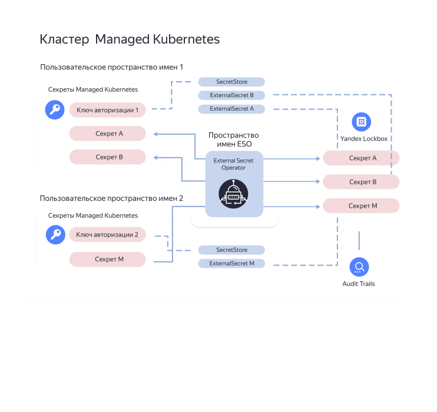

[External Secrets Operator](https://external-secrets.io/latest/provider-yandex-lockbox/) позволяет настроить синхронизацию секретов [{{ lockbox-name }}](../lockbox/) с секретами кластера {{ managed-k8s-name }}.

Существует [несколько схем интеграции](https://external-secrets.io/latest/guides-multi-tenancy/) {{ lockbox-name }} с сервисом {{ managed-k8s-name }}. Далее для примера рассматривается схема [ESO as a Service](https://external-secrets.io/latest/guides-multi-tenancy/#eso-as-a-service):



Чтобы настроить синхронизацию секретов:
1. [Установите External Secrets Operator](#install-eso).
1. [Настройте {{ lockbox-name }}](#configure-lockbox).
1. [Настройте кластер {{ k8s }}](#configure-k8s).
1. [Создайте External Secret](#create-es).

## Перед началом работы {#before-you-begin}

1. 

   

1. [Установите менеджер пакетов Helm](https://helm.sh/ru/docs/intro/install/).
1. Установите утилиту `jq`:

   ```bash
   sudo apt update && \
   sudo apt install jq
   ```

1. [Создайте сервисный аккаунт](../iam/operations/sa/create.md) с именем `eso-service-account`, необходимый для работы External Secrets Operator.
1. Создайте [авторизованный ключ](../iam/concepts/authorization/access-key.md) для сервисного аккаунта и сохраните его в файл `authorized-key.json`:

   ```bash
   yc iam key create \
     --service-account-name eso-service-account \
     --output authorized-key.json
   ```

1. [Создайте кластер {{ managed-k8s-name }} ](../managed-kubernetes/operations/kubernetes-cluster/kubernetes-cluster-create.md) и [группу узлов](../managed-kubernetes/operations/node-group/node-group-create.md) любой подходящей конфигурации.

1. 

## Установите External Secrets Operator {#install-eso}

1. Добавьте Helm-репозиторий `external-secrets`:

   ```bash
   helm repo add external-secrets https://charts.external-secrets.io
   ```

1. Установите External Secrets Operator в кластер {{ k8s }}:

   ```bash
   helm install external-secrets \
     external-secrets/external-secrets \
     --namespace external-secrets \
     --create-namespace
   ```

   

   Эта команда создаст новое пространство имен `external-secrets`, необходимое для работы External Secrets Operator.

   

   Результат:

   ```text
   NAME: external-secrets
   LAST DEPLOYED: Sun Sep 19 11:20:58 2021
   NAMESPACE: external-secrets
   STATUS: deployed
   REVISION: 1
   TEST SUITE: None
   NOTES:
   external-secrets has been deployed successfully!
   ...
   ```

## Настройте {{ lockbox-name }} {#configure-lockbox}

1. Создайте секрет с именем `lockbox-secret`:

   ```bash
   yc lockbox secret create \
     --name lockbox-secret \
     --payload '[{"key": "password","textValue": "p@$$w0rd"}]'
   ```

1. Получите идентификатор секрета:

   ```bash
   yc lockbox secret list
   ```

   Результат:

   ```text
   +----------------------------------------+----------------+------------+---------------------+----------------------+--------+
   |                   ID                   |      NAME      | KMS KEY ID |     CREATED AT      |  CURRENT VERSION ID  | STATUS |
   +----------------------------------------+----------------+------------+---------------------+----------------------+--------+
   | <идентификатор {{ lockbox-name }}-секрета> | lockbox-secret |            | 2021-09-19 04:33:44 | e6qlkguf0hs4q3i6jpen | ACTIVE |
   +----------------------------------------+----------------+------------+---------------------+----------------------+--------+
   ```

1. Чтобы сервисный аккаунт `eso-service-account` имел доступ к секрету, присвойте этому аккаунту роль `lockbox.payloadViewer`:

   ```bash
   yc lockbox secret add-access-binding \
     --name lockbox-secret \
     --service-account-name eso-service-account \
     --role lockbox.payloadViewer
   ```

## Настройте кластер {{ k8s }} {#configure-k8s}

1. Создайте [пространство имен](../managed-kubernetes/concepts/index.md#namespace) `ns`, в котором будут размещены объекты External Secrets Operator:

   ```bash
   kubectl create namespace ns
   ```

1. Создайте секрет `yc-auth`, содержащий в себе ключ сервисного аккаунта `eso-service-account`:

   ```bash
   kubectl --namespace ns create secret generic yc-auth \
     --from-file=authorized-key=authorized-key.json
   ```

1. Создайте хранилище секретов [SecretStore](https://external-secrets.io/latest/api-secretstore/), содержащее секрет `yc-auth`:

   ```bash
   kubectl --namespace ns apply -f - <<< '
   apiVersion: external-secrets.io/v1alpha1
   kind: SecretStore
   metadata:
     name: secret-store
   spec:
     provider:
       yandexlockbox:
         auth:
           authorizedKeySecretRef:
             name: yc-auth
             key: authorized-key'
   ```

## Создайте External Secret {#create-es}

1. Создайте объект [ExternalSecret](https://external-secrets.io/latest/api-externalsecret/), указывающий на секрет `lockbox-secret` в хранилище `secret-store`:

   ```bash
   kubectl --namespace ns apply -f - <<< '
   apiVersion: external-secrets.io/v1alpha1
   kind: ExternalSecret
   metadata:
     name: external-secret
   spec:
     refreshInterval: 1h
     secretStoreRef:
       name: secret-store
       kind: SecretStore
     target:
       name: k8s-secret
     data:
     - secretKey: password
       remoteRef:
         key: <идентификатор {{ lockbox-name }}-секрета>
         property: password'
   ```

   В параметре `spec.target.name` указано имя нового ключа: `k8s-secret`. External Secret Operator создаст этот ключ и поместит в него параметры секрета `lockbox-secret`.

1. Убедитесь, что новый ключ `k8s-secret` содержит значение секрета `lockbox-secret`:

   ```bash
   kubectl --namespace ns get secret k8s-secret \
     --output=json | \
     jq --raw-output ."data"."password" | \
     base64 --decode
   ```

   В выводе команды будет содержаться значение ключа `password` секрета `lockbox-secret`:

   ```text
   p@$$w0rd
   ```