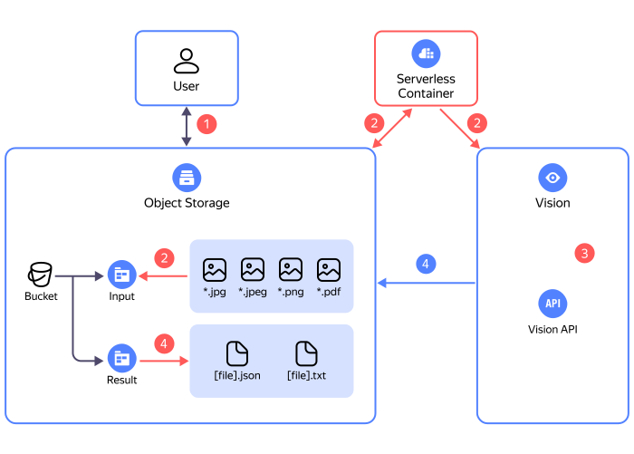

# Регулярное распознавание изображений и PDF-документов из бакета {{ objstorage-short-name }}

В этом руководстве вы с помощью [{{ vision-full-name }}](../../vision/) настроите автоматическое распознавание изображений в [поддерживаемых форматах](../../vision/concepts/ocr/index.md#image-requirements) и PDF-документов, регулярно загружаемых в [бакет](../../storage/concepts/bucket.md) [{{ objstorage-full-name }}](../../storage/).


## Процесс распознавания {#ocr}



1. Пользователь загружает изображения или документы в бакет {{ objstorage-full-name }}, в директорию ([префикс](../../storage/concepts/object.md#folder)) `input`.
1. [Триггер](../../functions/concepts/trigger/index.md) [{{ sf-full-name }}](../../functions/) запускается по таймеру и проверяет наличие файлов в папке `input`. После этого файлы отправляются на распознавание в [контейнер](../../serverless-containers/concepts/container.md) [{{ serverless-containers-full-name }}](../../serverless-containers/).
1. Идет процесс распознавания файлов, идентификатор операции сохраняется в папке `process` в исходном бакете.
1. После успешного завершения операции, результаты распознавания сохраняются в папке `result` в виде JSON и TXT файлов. Идентификатор успешно выполненной операции удаляется из папки `process`.

Для создания инфраструктуры используется [{{ TF }}-провайдер {{ yandex-cloud }}]({{ tf-provider-link }}). Исходный код руководства доступен на [GitHub](https://github.com/yandex-cloud-examples/yc-vision-ocr-recognizer).

Чтобы настроить автоматическое распознавание изображения с помощью {{ vision-name }}:
1. [Подготовьте облако к работе](#before-you-begin).
1. [Создайте инфраструктуру](#deploy).
1. [Загрузите файлы для распознавания и проверьте работу сервиса](#test).

Если созданные ресурсы вам больше не нужны, [удалите их](#clear-out).


## Подготовьте облако к работе {#before-begin}




### Необходимые платные ресурсы {#paid-resources}

В стоимость поддержки инфраструктуры для регулярного распознавания изображений и документов входят:
* плата за хранение данных в [бакете](../../storage/concepts/bucket.md) и [операции](../../storage/operations/index.md) с ними (см. [тарифы {{ objstorage-name }}](../../storage/pricing.md));
* плата за использование {{ vision-name }} (см. [тарифы для {{ vision-name }}](../../vision/pricing.md));
* плата за количество вызовов [контейнера](../../serverless-containers/concepts/container.md), вычислительные ресурсы, выделенные для выполнения приложения, и исходящий трафик (см. [тарифы {{ serverless-containers-name }}](../../serverless-containers/pricing.md));
* плата за хранение и операции с [секретом](../../lockbox/concepts/secret.md) (см. [тарифы {{ lockbox-name }}](../../lockbox/pricing.md)).


## Создайте инфраструктуру {#deploy}



Для создания инфраструктуры с помощью {{ TF }}:
1. [Установите {{ TF }}](../../tutorials/infrastructure-management/terraform-quickstart.md#install-terraform), [получите данные для аутентификации](../../tutorials/infrastructure-management/terraform-quickstart.md#get-credentials) и укажите источник для установки провайдера {{ yandex-cloud }} (раздел [{#T}](../../tutorials/infrastructure-management/terraform-quickstart.md#configure-provider), шаг 1).

1. Подготовьте файлы с описанием инфраструктуры:

    1. Клонируйте репозиторий с конфигурационными файлами.

        ```bash
        git clone https://github.com/yandex-cloud-examples/yc-vision-ocr-recognizer.git
        ```

    1. Перейдите в директорию `terraform` внутри репозитория.

    1. В файле `variables.auto.tfvars` задайте пользовательские параметры:
        * `cloud_id` — идентификатор облака.
        * `folder_id` — [идентификатор каталога](../../resource-manager/operations/folder/get-id.md).
        * `zone` — зона доступности.

1. Создайте ресурсы:

   

Будет создан бакет с именем в формате `ocr-recognition-...`.


## Загрузите файлы для распознавания и проверьте работу сервиса {#test}

1. [Загрузите](../../storage/operations/objects/upload.md) файлы для распознавания в папку `input` внутри бакета, созданного ранее.
1. Откройте в бакете папку `result` — там должны отобразиться результаты распознавания в виде файлов с расширением .txt и .json.


## Как удалить созданные ресурсы {#clear-out}

Чтобы перестать платить за созданные ресурсы:

1. Удалите файлы из бакета.
1. Откройте конфигурационный файл `main.tf` и удалите описание создаваемой инфраструктуры из файла.
1. Примените изменения:

    
