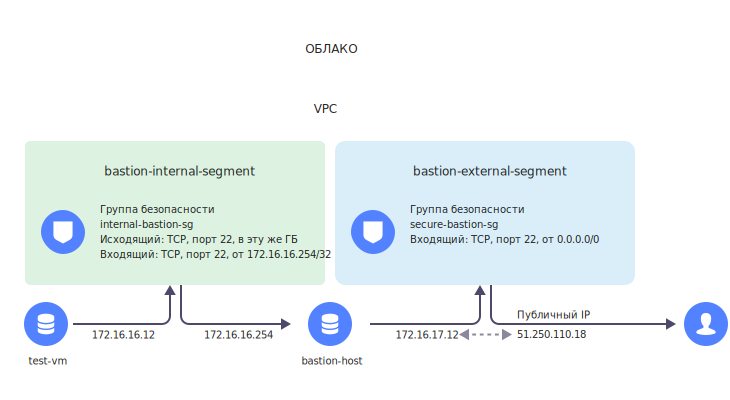

# Создание бастионного хоста

## Общее описание {#overview}

Если вы когда-нибудь интересовались строительством древних фортификационных сооружений, то слово «бастион» должно быть вам знакомо. Бастионом назывался элемент внешней стены крепости, выступающий за ее основной контур. Как и средневековые крепости, компьютерные сети нуждаются в многоуровневой защите от внешнего вторжения. Роль бастионов в сетях выполняют так называемые бастионные хосты, образующие часть сетевого периметра.



Данный сценарий включает использование платных ресурсов. На [странице тарифов](/prices) вы можете рассчитать предполагаемые затраты, исходя из планируемого объема ресурсов.



В этом сценарии вы узнаете о том, как можно развернуть бастионный хост и защитить доступ к удаленным виртуальным машинам, расположенным внутри вашего виртуального частного облака. Бастионный хост — это виртуальная машина, которой присваивается публичный IP-адрес для осуществления доступа по протоколу SSH. Настроив бастионный хост, вы получаете своего рода джамп-сервер, который позволяет установить защищенное соединение с виртуальными машинами, не имеющими публичных IP-адресов.

Таким образом, создание бастионного хоста позволит вам снизить уязвимость серверов в своем виртуальном частном облаке. При этом административные задачи на конкретных серверах будут выполняться в рамках прокси-соединения через бастионный хост по [SSH](../../glossary/ssh-keygen.md).

Задачи прохождения сценария:
* Узнать, как можно использовать правила для настройки бастионного хоста и групп безопасности.
* Научиться безопасно управлять серверами при помощи бастионного хоста.

Перед началом работы:
* Для подключения к виртуальным серверам нужно сгенерировать SSH-ключ. Если у вас нет SSH-ключа, сформируйте его по [инструкции](../../compute/operations/vm-connect/ssh.md#creating-ssh-keys).
* В сценарии предполагается, что вы будете создавать бастионный хост в рамках существующего виртуального частного облака. Если вы еще не создали облако на своем аккаунте, создайте его, прежде чем переходить к следующим шагам.



* Выберите нужное облако и каталог в главном меню.
* Разместите все ресурсы (сети, подсети, группы безопасности, виртуальные машины) в одной и той же зоне доступности.



## Создайте бастионный хост {#create-bastion-host}

В данном разделе вы научитесь создавать и конфигурировать бастионный хост, предварительно настроив все необходимые сети, сегменты и группы безопасности.





### Создайте внешнюю сеть и подсеть {#create-external-network} 

1. В [главном]({{ link-console-main }}) меню выберите **{{ vpc-name }}**.
1. На панели слева выберите **Облачные сети**, затем нажмите **Создать сеть**.
   * Задайте имя сети: `external-bastion-network`.
   * Опцию **Создать подсети** выбирать не нужно.
1. Нажмите на название созданной сети — откроется страница сетевых настроек.
1. В блоке **Подсети** нажмите кнопку **Создать** для создания новой подсети.
   * Имя — `bastion-external-segment`.
   * CIDR — `172.16.17.0/28`.

### Создайте внутреннюю сеть и подсеть {#create-internal-network}

1. В главном меню выберите {{ vpc-name }}.
1. На панели слева выберите **Облачные сети**, затем нажмите **Создать сеть**.
   * Задайте имя сети — `internal-bastion-network`.
1. Нажмите на название созданной сети — откроется страница сетевых настроек.
1. В блоке **Подсети** нажмите кнопку **Создать** для создания новой подсети.
   * Имя —`bastion-internal-segment`.
   * CIDR — `172.16.16.0/24`.

### Создайте и настройте группу безопасности бастионного хоста {#create-internet-sg}

Создайте группу безопасности и настройте правила для входящего трафика на бастионном хосте, чтобы обеспечить к нему доступ из интернета:

1. В блоке **Сеть**: `bastion-external-network`, выберите **Группы безопасности**, затем нажмите кнопку **Создать группу**.
1. Задайте имя группы безопасности: `secure-bastion-sg`.
1. Перейдите в раздел правил для входящего трафика и добавляйте указанные ниже правила, нажимая кнопку **Добавить правило**. Такое правило разрешит доступ к бастионному хосту из интернета:
   * Имя: `secure-bastion-sg`.
   * **Входящий трафик**:
      * протокол — `TCP`;
      * диапазон портов: `22`;
      * тип источника — `CIDR`;
      * источник — `0.0.0.0/0`.
1. Нажмите кнопку **Сохранить** — правило создано.

### Создайте и настройте группу безопасности бастионного хоста для обеспечения доступа к внутренним хостам {#create-internal-hosts-sg}

Создайте группу безопасности и настройте правила для входящего трафика, идущего с бастионного хоста на внутренние хосты:

1. В блоке **Сеть**: `bastion-internal-network`, выберите **Группы безопасности**, затем нажмите кнопку **Создать группу**.
1. Задайте имя группы безопасности: `internal-bastion-sg`.
1. **Входящий трафик** — Перейдите в раздел правил для входящего трафика и добавляйте указанные ниже правила, нажимая кнопку **Добавить правило**:
   * диапазон портов: `22`;
   * протокол — `TCP`;
   * источник — `CIDR`;
   * CIDR блоки: `172.16.16.254/32` (внутренний статический IP-адрес бастионного хоста).
1. **Исходящий трафик** — Перейдите в раздел правил для исходящего трафика и добавьте следующее правило, нажав кнопку **Добавить правило**:
   * диапазон портов: `22`;
   * протокол — `TCP`;
   * источник — `Группа безопасности`;
   * `Текущая`.
   Это правило разрешает SSH-доступ с IP адресов внутреннего интерфейса бастионного хоста к внутренним хостам.
1. Нажмите кнопку **Сохранить** — правило создано.

### Создайте виртуальную машину для бастионного хоста {#create-bastion-instance}

После того как вы создали подсеть и группу безопасности, перейдите к созданию виртуального сервера для бастионного хоста:

1. В главном меню выберите **{{ compute-name }}**.
1. Нажмите кнопку **Создать ВМ** и задайте имя хоста и операционную систему.
1. Для большинства параметров сохранятся значения по умолчанию.
1. В блоке **Сетевые настройки**, настройте первый сетевой интерфейс (**external**):
   * Выберите **Подсеть**: `bastion-external-subnet`.
   * Публичный адрес: `Автоматически`.
   * Внутренний IP-адрес: `Автоматически`.
   * Выберите ранее созданную **Группу безопасности** — `secure-bastion-sg`.
1. Нажмите **Добавить сеть** для добавления второго интерфейса (**internal**):
   * Выберите **Подсеть** — `bastion-internal-subnet`.
   * Публичный адрес — `Без адреса`.
   * Внутренний IP-адрес — `Вручную`.
   * Поле адреса — `172.16.16.254`.
   * Выберите **Группу безопасности** — `internal-bastion-sg`.

   

   Проверьте, что первый интерфейс на новой виртуальной машине принадлежит к внешнему сегменту, поскольку шлюз по умолчанию будет автоматически задан именно на этом интерфейсе.

   

   Мы задаем внешний IP-адрес на внешнем сегменте. При этом мы выбираем статический IP-адрес для использования на внутреннем сегменте.
1. В разделе **Доступ**, в поле **Логин**, введите имя пользователя Linux — например, **bastion** (не используйте стандартные для Linux имена пользователей, такие как root и т.д.).
1. Скопируйте ваш публичный SSH-ключ в поле **SSH-ключ**.
1. Нажмите **Создать ВМ**.
1. Когда серверная ВМ запустится и перейдет в статус **Running**, вы сможете увидеть назначенный ей публичный IP-адрес в поле **Public IPv4** (в таблице с информацией о серверной ВМ).

### Протестируйте свой бастионный хост {#test-bastion}

После запуска бастионного хоста попробуйте подключиться к нему через SSH-клиент:

```
ssh -i ~/.ssh/<приватный_ключ>bastion@<публичный_адрес_IPv4>
```

## Добавьте ваш виртуальный сервер во внутренний сегмент бастионного хоста {#add-virtual-server}

Для администрирования ваших серверов добавьте сетевой интерфейс во внутренний сетевой сегмент бастионного хоста (в нашем случае это — **bastion-internal-segment**).

Если у вас уже заведена виртуальная машина, добавьте к ней новый сетевой интерфейс или создайте новую машину для тестирования конфигурации бастионного хоста.
1. В главном меню выберите **{{ compute-name }}**.
1. Нажмите кнопку **Создать ВМ** и задайте имя хоста и операционную систему.
1. Для большинства параметров сохранятся значения по умолчанию.
1. Настройте еще один сетевой интерфейс в блоке **Сетевые настройки**:
   * Выберите **Подсеть** — `bastion-internal-subnet`.
   * Публичный адрес — `Без адреса`.
   * Внутренний IP-адрес: `Автоматически`.
   * Выберите **Группу безопасности** — `secure-bastion-sg`.
1. В разделе **Доступ**, в поле **Логин**, введите имя пользователя Linux, например `test` (не используйте стандартные для Linux имена пользователей, такие как `root` и т.д.).
1. Скопируйте ваш публичный SSH-ключ в поле **SSH-ключ**.
1. Нажмите **Создать ВМ**.

### Подключитесь к созданной ВМ {#connect-to-instance}

Подключаясь к ВМ по протоколу SSH через приватный IP-адрес, вы будете использовать бастионный хост в роли _джамп-хоста_.

Получите приватный IP-адрес виртуального сервера в таблице **{{ compute-name }} > Виртуальные машины**.

Для упрощения SSH-доступа и его настройки добавьте параметр `-J` (ProxyJump) в команду SSH. Пример использования ProxyJump: 

```
ssh -i ~/.ssh/id_rsa -J bastion@<публичный_IP_адрес_бастионного_хоста>test@<приватный_IP_адрес>
```

В итоге SSH-клиент автоматически подключится к внутреннему серверу.

Флаг `-J` поддерживается в OpenSSH начиная с версии 7.3+. В более ранних версиях `-J` недоступен. В таком случае самый безопасный и простой способ — это использовать перенаправление стандартного ввода-вывода (флаг `-W`) для «проброса» соединения через бастионный хост. Например:

```
ssh -i ~/.ssh/id_rsa -o ProxyCommand="ssh -W %h:%p bastion@<публичный_IP_адрес_бастионного_хоста>" test@<приватный_IP_адрес>
```

## Дополнительные опции подключения {#more-options}

### Сделайте внешний IP-адрес статическим {#static-ip-address}

Имеет смысл сделать внешний IP-адрес [статическим](../../vpc/operations/set-static-ip.md) — это избавит вас от проблем, связанных с изменением внешнего IP-адреса при каждой перезагрузке бастионного хоста.

### Использование SSH-агента для подключения через бастионный хост {#using-ssh-agent}

По умолчанию доступ к серверу настраивается только для аутентификации с помощью публичного SSH-ключа. Мы не рекомендуем хранить ключи на самих бастионных хостах (в особенности без кодовой фразы). Поэтому лучше использовать **ssh-агент**.  В таком случае приватные SSH-ключи будут храниться только на вашем компьютере, и их можно будет безопасно использовать для аутентификации на следующем сервере.

Добавить ключ в аутентификационный агент можно с помощью команды **ssh-add**. Если ключ хранится в файле **~/.ssh/id_rsa**, он будет добавлен автоматически. Вы также можете указать, какой конкретно ключ нужно использовать, при помощи следующей команды:

```
ssh-add [путь_к_файлу_ключа]
```

Пользователи Mac OS X могут настроить у себя файл **~/.ssh/config**. Тогда ключи можно будет загрузить в агент при помощи следующей команды:

```
AddKeysToAgent yes
```

Эта команда подключения к бастионному хосту позволяет пробросить агент и войти на следующий сервер, передавая учетные данные с локальной машины:

```
SSH -A bastion@bastion_host
```

Пользователи Windows могут использовать приложение Pageant и загрузить в него свой файл приватного ключа. Затем, чтобы обеспечить проброс агента, нужно в окне настроек PuTTY выбрать **Соединение**, затем **SSH**, а затем — **Аутентификация**.

### Доступ к сервисам через SSH-туннели {#ssh-tunneling}

Порой одного SSH-доступа недостаточно для выполнения поставленной задачи. В таких ситуациях, SSH-туннели дают возможность с легкостью подключаться к веб-приложениям и другим сервисам, обрабатывающим входящие подключения.

Основные типы SSH-туннелей — локальные, удаленные и динамические: 
* **Локальный** туннель предоставляет открытый порт на локальном интерфейсе обратной связи, который подключается к адресу **IP:порт** на вашем SSH-сервере.
   Например, можно подключить локальный порт 8080 к адресу **ip_веб_сервера:80**, который доступен с вашего бастионного хоста, а затем в браузере открыть **http://localhost:8080**:

   ```
   SSH bastion@bastion_public_ip -L 8080:web_server_ip:80
   ```

* Обсуждение **удаленного** туннеля выходит за рамки этого руководства. Скажем только, что он работает в обратном, по отношению к локальному туннелю, направлении, открывая локальный порт для подключения к удаленному серверу.
* **Динамический** туннель предоставляет SOCKS-прокси на локальном порту, при этом подключения устанавливаются с удаленного хоста. Например, можно настроить динамический туннель на порту 1080, а затем в браузере указать его как SOCKS-прокси. В итоге вы сможете подключаться ко всем ресурсам, которые доступны с вашего бастионного хоста и находятся в приватной подсети.

   ```
   SSH bastion@bastion_host -D 1080
   ```

Данные методики основаны на простой замене, при которой зачастую требуется VPN-подключение, а также сочетание с подключениями ProxyJump или ProxyCommand.

Пользователи Windows могут настроить туннели через PuTTY, выбрав **Подключение**, **SSH**, — а затем **Туннели**.

Для простого установления подключений к сервисам удаленного рабочего стола (Remote Desktop Services, RDS) — т.е. работающим хостам Windows в облаке — можно использовать переадресацию портов (в особенности, локальную) — путем установления туннельного подключения на порт 3389 и последующего подключения к localhost через RDS-клиент. Если RDS уже ожидает подключения на локальной машине, вы можете выбрать другой порт, как показано в примере:

```
SSH bastion@bastion_host -L 3390:windows_host:3389
```

### Передача файлов {#file-transfers}

Для клиентов и серверов Linux можно настроить SCP-протокол для безопасной передачи файлов через бастионный хост на внутренние хосты и обратно. Для этого используются те же опции ProxyCommand и ProxyJump, указываемые в командной строке SSH. Например:

```
scp -o "ProxyJump bastion@bastion_host" filename bastion@private_host:/path/to/file
```

Если вы используете Windows-клиент, то одно из наиболее популярных SCP-приложений на Windows — это WinSCP. Чтобы передать файлы через бастионный хост на удаленную машину Linux, выполните следующие действия:

1. Создайте сеанс подключения к IP-адресу приватного хоста, причем без пароля. Настройте SSH-ключ на машине Linux.
1. В меню навигации слева нажмите **Дополнительно** и выберите **Туннель**.
1. Введите IP-адрес и имя пользователя для вашего бастионного хоста. В поле **Файл закрытого ключа** выберите и установите файл закрытого ключа, который вы будете использовать для аутентификации на бастионном хосте.
1. В меню навигации слева в блоке **SSH** выберите **Аутентификация**.
1. Проверьте, что установлена опция **Разрешить пересылку агента**.
1. Выберите закрытый ключ для аутентификации на приватном хосте.

Такая настройка позволяет осуществлять непосредственную передачу файлов между машиной Windows и приватным хостом Linux. При этом соединение будет защищено бастионным хостом.

В случае хостов Windows, расположенных за бастионом Linux, передачу файлов можно осуществлять при помощи протокола RDP (Remote Desktop Protocol), через туннель. Этот метод обеспечивает эффективную и безопасную передачу файлов.
