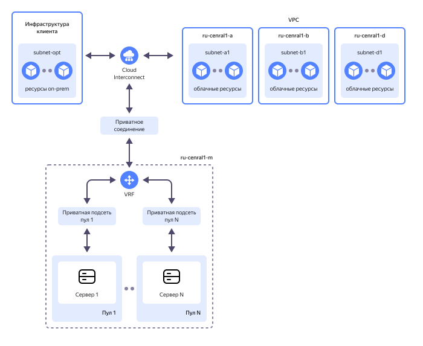

# Настройка сетевой связности между подсетями {{ baremetal-full-name }} и {{ vpc-full-name }} с помощью {{ interconnect-full-name }}

Сетевая связность с использованием [{{ interconnect-full-name }}](../../interconnect/index.yaml) в {{ baremetal-full-name }} позволяет организовать доступ к [CIDR](https://ru.wikipedia.org/wiki/Бесклассовая_адресация) приватных подсетей {{ vpc-name }} в облачной инфраструктуре и/или CIDR приватных подсетей в on-prem инфраструктуре.

В этом руководстве вы установите сетевую связность между [сервером](../../baremetal/concepts/servers.md) {{ baremetal-name }}, расположенным в [приватной подсети](../../baremetal/concepts/network.md#private-network) {{ baremetal-full-name }}, и [виртуальной машиной](../../compute/concepts/vm.md) {{ compute-full-name }}, расположенной в подсети [облачной сети](../../vpc/concepts/network.md#network) {{ vpc-full-name }}.

Аналогичным образом сетевую связность можно установить и с вашими on-prem ресурсами, расположенными в приватных подсетях в вашей собственной сетевой инфраструктуре.

Использование сервиса {{ interconnect-full-name }} в рамках интеграции с {{ baremetal-full-name }} не тарифицируется.

Схема решения:



Чтобы настроить сетевую связность между приватными подсетями {{ baremetal-name }} и {{ vpc-name }} с помощью {{ interconnect-name }}:

1. [Подготовьте облако к работе](#before-you-begin).
1. [Создайте облачную инфраструктуру](#setup-infrastructure).
1. [Закажите Routing Instance](#request-routing-instance).
1. [Создайте приватное соединение](#create-private-connection).
1. [Проверьте сетевую связность](#check-connectivity).

Если созданные ресурсы вам больше не нужны, [удалите их](#clear-out).

## Перед началом работы {#before-you-begin}




### Необходимые платные ресурсы {#paid-resources}

В стоимость поддержки инфраструктуры для организации сетевой связности между подсетями {{ baremetal-name }} и {{ vpc-short-name }} входят:

* плата за использование [публичного IP-адреса](../../vpc/concepts/address.md#public-addresses) виртуальной машины (см. [тарифы {{ vpc-full-name }}](../../vpc/pricing.md));
* плата за вычислительные ресурсы и диски [ВМ](../../compute/concepts/vm.md) (см. [тарифы {{ compute-full-name }}](../../compute/pricing.md));
* плата за аренду сервера {{ baremetal-name }} (см. [тарифы {{ baremetal-full-name }}](../../baremetal/pricing.md)).


## Создайте облачную инфраструктуру {#setup-infrastructure}

Создайте необходимую инфраструктуру {{ yandex-cloud }}, в которой вы будете настраивать сетевую связность.

Для настройки {{ interconnect-name }} в сервисе {{ baremetal-name }} понадобятся приватная маршрутизируемая [подсеть](../../baremetal/concepts/network.md#private-subnet) и [VRF](../../baremetal/concepts/network.md#vrf-segment) в {{ baremetal-name }}, [облачная сеть](../../vpc/concepts/network.md#network) с одной или более [подсетями](../../vpc/concepts/network.md#subnet) {{ vpc-name }}, а также Routing Instance, в составе которого будут [анонсированы](../../interconnect/concepts/priv-con.md#prc-announce) один или несколько префиксов приватных подсетей {{ vpc-short-name }}.

Для проверки сетевой связности понадобятся сервер {{ baremetal-name }} и виртуальная машина {{ compute-name }}.

### Создайте VRF и приватную подсеть {{ baremetal-name }} {#setup-vrf}

Создайте виртуальный сегмент сети (VRF) и приватную подсеть в [пуле серверов](../../baremetal/concepts/servers.md#server-pools) `{{ region-id }}-m3`:



- Консоль управления {#console}

  1. В [консоли управления]({{ link-console-main }}) выберите каталог, в котором вы будете создавать инфраструктуру.
  1. В списке сервисов выберите **{{ ui-key.yacloud.iam.folder.dashboard.label_baremetal }}**.
  1. Создайте виртуальный сегмент сети:
        1. На панели слева выберите  **{{ ui-key.yacloud.baremetal.label_networks }}** и нажмите кнопку **{{ ui-key.yacloud.baremetal.label_create-network }}**.
        1. В поле **{{ ui-key.yacloud.baremetal.field_name }}** задайте имя VRF: `my-vrf`.
        1. Нажмите кнопку **{{ ui-key.yacloud.baremetal.label_create-network }}**.
  1. Создайте приватную подсеть:
        1. На панели слева выберите  **{{ ui-key.yacloud.baremetal.label_subnetworks }}** и нажмите кнопку **{{ ui-key.yacloud.baremetal.label_create-subnetwork }}**.
        1. В поле **{{ ui-key.yacloud.baremetal.field_server-pool }}** выберите пул серверов `{{ region-id }}-m3`.
        1. В поле **{{ ui-key.yacloud.baremetal.field_name }}** задайте имя подсети: `subnet-m3`.
        1. Включите опцию **{{ ui-key.yacloud.baremetal.title_routing-settings }}**.
        1. В поле **{{ ui-key.yacloud.baremetal.field_network-id }}** выберите созданный ранее сегмент `my-vrf`.
        1. В поле **{{ ui-key.yacloud.baremetal.field_CIDR }}** укажите `192.168.1.0/24`.
        1. В поле **{{ ui-key.yacloud.baremetal.field_gateway }}** оставьте значение по умолчанию `192.168.1.1`.
        1. Включите опцию **{{ ui-key.yacloud.baremetal.field_dhcp-settings }}** и в появившемся поле **{{ ui-key.yacloud.baremetal.field_dhcp-ip-range }}** оставьте значения по умолчанию: `192.168.1.1` — `192.168.1.254`.
        1. Нажмите кнопку **{{ ui-key.yacloud.baremetal.label_create-subnetwork }}**.




### Арендуйте сервер {{ baremetal-name }} {#rent-bms}



- Консоль управления {#console}

  1. В [консоли управления]({{ link-console-main }}) выберите каталог, в котором вы создаете инфраструктуру.
  1. 
  1. В поле **{{ ui-key.yacloud.baremetal.field_server-pool }}** выберите пул серверов `{{ region-id }}-m3`.
  1. 
  1. 
  1. В блоке **{{ ui-key.yacloud.baremetal.title_section-server-product }}** выберите образ. Например: `Ubuntu 24.04`.
  1. 
  1. В блоке **{{ ui-key.yacloud.baremetal.title_section-server-network-settings }}**:

     1. В поле **{{ ui-key.yacloud.baremetal.field_subnet-id }}** выберите созданную ранее подсеть `subnet-m3`.
     1. В поле **{{ ui-key.yacloud.baremetal.field_needed-public-ip }}** выберите `{{ ui-key.yacloud.baremetal.label_public-ip-no }}`.

  1. В блоке **{{ ui-key.yacloud.baremetal.title_server-access }}**:

      

  1. В блоке **{{ ui-key.yacloud.baremetal.title_section-server-info }}** в поле **{{ ui-key.yacloud.baremetal.field_name }}** задайте имя сервера: `server-m3`.
  1. 





Подготовка сервера и установка на него операционной системы может занять до 45 минут — в это время сервер будет находиться в статусе `Provisioning`. После завершения установки ОС сервер перейдет в статус `Ready`.




### Создайте облачную сеть и подсеть {#setup-vpc}

Создайте облачную сеть и подсеть, к которым будет подключена виртуальная машина {{ compute-name }}.



- Консоль управления {#console} 

  1. В [консоли управления]({{ link-console-main }}) выберите каталог, в котором вы создаете инфраструктуру.
  1. В списке сервисов выберите **{{ ui-key.yacloud.iam.folder.dashboard.label_vpc }}**.
  1. Создайте облачную сеть:

      1. Справа сверху нажмите **{{ ui-key.yacloud.vpc.networks.button_create }}**.

      1. В поле **{{ ui-key.yacloud.vpc.networks.create.field_name }}** укажите `sample-network`.

      1. В поле **{{ ui-key.yacloud.vpc.networks.create.field_advanced }}** отключите опцию **{{ ui-key.yacloud.vpc.networks.create.field_is-default }}**.

      1. Нажмите **{{ ui-key.yacloud.vpc.networks.button_create }}**.
  1. Создайте подсеть:

      1. На панели слева выберите  **{{ ui-key.yacloud.vpc.switch_networks }}**.
      1. Справа сверху нажмите **{{ ui-key.yacloud.vpc.subnetworks.button_action-create }}**.
      1. В поле **{{ ui-key.yacloud.vpc.subnetworks.create.field_name }}** укажите `subnet-{{ region-id }}-b`.
      1. В поле **{{ ui-key.yacloud.vpc.subnetworks.create.field_zone }}** выберите зону доступности `{{ region-id }}-b`.
      1. В поле **{{ ui-key.yacloud.vpc.subnetworks.create.field_network }}** выберите облачную сеть `sample-network`.
      1. В поле **{{ ui-key.yacloud.vpc.subnetworks.create.field_ip }}** укажите `192.168.11.0/24`.
      
          

      1. Нажмите **{{ ui-key.yacloud.vpc.subnetworks.create.button_create }}**.




### Создайте виртуальную машину {#create-vm}



- Консоль управления {#console}

  1. В [консоли управления]({{ link-console-main }}) выберите каталог, в котором вы создаете инфраструктуру.
  1. В списке сервисов выберите **{{ ui-key.yacloud.iam.folder.dashboard.label_compute }}**.
  1. На панели слева выберите  **{{ ui-key.yacloud.compute.switch_instances }}** и нажмите кнопку **{{ ui-key.yacloud.compute.instances.button_create }}**.
  1. В блоке **{{ ui-key.yacloud.compute.instances.create.section_image }}** выберите подходящий образ ВМ. Например: [Ubuntu 24.04](/marketplace/products/yc/ubuntu-2404-lts-oslogin).
  1. В блоке **{{ ui-key.yacloud.k8s.node-groups.create.section_allocation-policy }}** выберите [зону доступности](../../overview/concepts/geo-scope.md) `{{ region-id }}-b`.
  1. В блоке **{{ ui-key.yacloud.compute.instances.create.section_network }}**:

      * В поле **{{ ui-key.yacloud.component.compute.network-select.field_subnetwork }}** выберите созданную ранее подсеть `subnet-{{ region-id }}-b`.
      * В поле **{{ ui-key.yacloud.component.compute.network-select.field_external }}** выберите `{{ ui-key.yacloud.component.compute.network-select.switch_auto }}`.

  1. В блоке **{{ ui-key.yacloud.compute.instances.create.section_access }}** выберите вариант **{{ ui-key.yacloud.compute.instance.access-method.label_oslogin-control-ssh-option-title }}** и укажите данные для доступа на ВМ:

      * В поле **{{ ui-key.yacloud.compute.instances.create.field_user }}** введите имя пользователя: `yc-user`.
      * 

  1. В блоке **{{ ui-key.yacloud.compute.instances.create.section_base }}** задайте имя ВМ: `sample-vm`.
  1. Нажмите кнопку **{{ ui-key.yacloud.compute.instances.create.button_create }}**.



## Закажите Routing Instance {#request-routing-instance}

Для настройки сетевой связности между подсетями {{ baremetal-name }}, подсетями {{ vpc-name }} и/или подсетями on-prem необходим Routing Instance. Routing Instance можно создать через [обращение]({{ link-console-support }}/tickets/create) в службу технической поддержки.

Если в вашем каталоге уже есть настроенная сетевая связность с использованием [{{ interconnect-name }}](../../interconnect/index.yaml) (VPC-to-On-Prem), то вы можете как использовать имеющийся Routing Instance, так и запросить создание нового, дополнительного Routing Instance для построения обособленной сетевой связности.

### Проверьте наличие Routing Instance в вашем каталоге {#check-for-ri}

1. 

    

1. Проверьте наличие Routing Instance в каталоге по умолчанию:

    

    - CLI {#cli}

        Выполните команду:

        ```bash
        yc cloudrouter routing-instance list
        ```

        Если в вашем каталоге уже есть Routing Instance, команда выведет такой результат:

        ```text
        +----------------------+------------------+--------+-----------------------+
        |          ID          |       NAME       | STATUS | PRIVATE CONNECTION ID |
        +----------------------+------------------+--------+-----------------------+
        | cf35oot8f0eu******** | routing-instance | ACTIVE | cf395uf8dg7h********  |
        +----------------------+------------------+--------+-----------------------+
        ```

    

1. Если у вас уже есть Routing Instance, вы можете пропустить следующий шаг и [переходить](#create-private-connection) к созданию приватного соединения.

    Если у вас нет Routing Instance или вы хотите построить дополнительную, обособленную сетевую связность, запросите создание нового Routing Instance.

### Запросите создание Routing Instance {#request-ri}

[Обратитесь]({{ link-console-support }}/tickets/create) в службу технической поддержки для создания Routing Instance в вашем каталоге.

Оформите ваше обращение следующим образом:

```text
Тема: [CIC для BareMetal] Добавить Routing Instance.

Текст обращения:
Прошу добавить Routing Instance.

Параметры соединения:
folder_id: <идентификатор_каталога>
region_id: {{ region-id }}

vpc:
  vpc_net_id: <идентификатор_сети>
    vpc_subnets: 
      {{ region-id }}-a: [CIDR_a1, CIDR_a2, ..., CIDR_an]
      {{ region-id }}-b: [CIDR_b1, CIDR_b2, ..., CIDR_bn]
      {{ region-id }}-d: [CIDR_d1, CIDR_d2, ..., CIDR_dn]
```

Где:
* `folder_id` — [идентификатор](../../resource-manager/operations/folder/get-id.md) каталога.
* `region_id` — идентификатор [региона](../../overview/concepts/region.md).
* `vpc_net_id` — [идентификатор](../../vpc/operations/network-get-info.md) облачной сети.
* `vpc_subnets` — список [анонсируемых](../../interconnect/concepts/priv-con.md#prc-announce) адресных префиксов для каждой из [зон доступности](../../overview/concepts/geo-scope.md). Например, для созданной ранее подсети {{ vpc-short-name }} вы укажете `{{ region-id }}-b: [192.168.11.0/24]`.

    Допускается анонсирование адресных префиксов с [агрегированием](../../interconnect/concepts/priv-con.md#agg-subnets).



Создание Routing Instance службой технической поддержки может занять до 24 часов. В результате вы сможете получить идентификатор созданного Routing Instance, выполнив команду [{{ yandex-cloud }} CLI](../../cli/index.yaml) `yc cloudrouter routing-instance list`.



## Создайте приватное соединение {#create-private-connection}

После того как в вашем каталоге будет создан необходимый Routing Instance, создайте [приватное соединение](../../baremetal/concepts/network.md#private-connection-to-vpc) {{ interconnect-name }} в сервисе {{ baremetal-name }}:



## Проверьте сетевую связность {#check-connectivity}

После того как статус созданного приватного соединения изменится на `Ready`, сетевая связность между подсетями {{ baremetal-name }} и {{ vpc-short-name }} будет установлена и вы сможете приступить к ее проверке.

Проверка сетевой связности предполагает, что:
* процесс настройки приватного соединения с облачными подсетями успешно завершен (статус соединения отображается как `Ready`);
* локальный сервис Firewall на сервере {{ baremetal-name }} разрешает прохождение трафика [ICMP](https://ru.wikipedia.org/wiki/ICMP);
* маршрутная таблица в операционной системе сервера {{ baremetal-name }} содержит маршрут до CIDR подсети с виртуальной машиной;
* [группа безопасности](../../vpc/concepts/security-groups.md), которая назначена [сетевому интерфейсу](../../compute/concepts/network.md) виртуальной машины, разрешает прохождение ICMP-трафика.

### Проверьте сетевую связность из приватной подсети {{ baremetal-name }} в приватную подсеть {{ vpc-short-name }} {#check-bms-to-vm}



- Консоль управления {#console}

  1. В [консоли управления]({{ link-console-main }}) выберите каталог, в котором вы создали инфраструктуру.
  1. В списке сервисов выберите **{{ ui-key.yacloud.iam.folder.dashboard.label_baremetal }}**.
  1. В строке с сервером `server-m3` нажмите значок  и выберите **{{ ui-key.yacloud.baremetal.label_kvm-console }}**.
  
      Откроется окно с терминалом KVM-консоли, в котором вы увидите строку аутентификации:
      
      ```
      server-m3 login:
      ```

      Если вы не видите этой строки, попробуйте [перезапустить](../../baremetal/operations/servers/server-stop-and-start.md#restart) сервер.

  1. В терминале KVM-консоли введите имя пользователя `root` и нажмите **ENTER**.
  1. В строке для ввода пароля вставьте сгенерированный при аренде сервера пароль и нажмите **ENTER**. Обратите внимание, что при наборе или вставке пароля в ОС Linux введенные символы не отображаются на экране.

      

      Результат:

      ```text
      Welcome to Ubuntu 24.04.2 LTS (GNU/Linux 6.8.0-53-generic x86_64)
      ...
      root@server-m3:~# _
      ```

      Если вы не сохранили пароль администратора к серверу, вы можете создать новый пароль по [инструкции](../../baremetal/operations/servers/reset-password.md) или [переустановить](../../baremetal/operations/servers/reinstall-os-from-marketplace.md) на сервере операционную систему.
  1. В терминале KVM-консоли выполните команду `ping`, чтобы убедиться в доступности виртуальной машины `sample-vm` по ее [внутреннему](../../compute/concepts/network.md#internal-ip) IP-адресу:

      ```bash
      ping <внутренний_IP-адрес_ВМ> -c 5
      ```

      Узнать внутренний IP-адрес ВМ вы можете в [консоли управления]({{ link-console-main }}) в блоке **{{ ui-key.yacloud.compute.instance.overview.label_network-interface }}** на странице с информацией о ВМ.

      Результат:

      ```text
      PING 192.168.11.2 (192.168.11.2) 56(84) bytes of data.
      64 bytes from 192.168.11.2: icmp_seq=1 ttl=64 time=3.90 ms
      64 bytes from 192.168.11.2: icmp_seq=2 ttl=64 time=0.235 ms
      64 bytes from 192.168.11.2: icmp_seq=3 ttl=64 time=0.222 ms
      64 bytes from 192.168.11.2: icmp_seq=4 ttl=64 time=0.231 ms
      64 bytes from 192.168.11.2: icmp_seq=5 ttl=64 time=0.235 ms

      --- 192.168.11.2 ping statistics ---
      5 packets transmitted, 5 received, 0% packet loss, time 4086ms
      rtt min/avg/max/mdev = 0.222/0.964/3.899/1.467 ms
      ```

      Сетевая связность между сервером {{ baremetal-name }} и виртуальной машиной установлена, пакеты проходят без потерь.



### Проверьте сетевую связность из приватной подсети {{ vpc-short-name }} в приватную подсеть {{ baremetal-name }} {#check-vm-to-bms}

1. [Подключитесь](../../compute/operations/vm-connect/ssh.md) к виртуальной машине по SSH.
1. В терминале выполните команду `ping`, чтобы убедиться в доступности сервера `server-m3` по его приватному IP-адресу:

      ```bash
      ping <приватный_IP-адрес_сервера> -c 5
      ```

      Узнать приватный IP-адрес сервера {{ baremetal-name }} вы можете в [консоли управления]({{ link-console-main }}) в блоке **{{ ui-key.yacloud.baremetal.title_section-server-network-settings }}** на странице с информацией о сервере.

      Результат:

      ```text
      PING 192.168.1.3 (192.168.1.3) 56(84) bytes of data.
      64 bytes from 192.168.1.3: icmp_seq=1 ttl=64 time=0.271 ms
      64 bytes from 192.168.1.3: icmp_seq=2 ttl=64 time=0.215 ms
      64 bytes from 192.168.1.3: icmp_seq=3 ttl=64 time=0.262 ms
      64 bytes from 192.168.1.3: icmp_seq=4 ttl=64 time=0.223 ms
      64 bytes from 192.168.1.3: icmp_seq=5 ttl=64 time=0.208 ms

      --- 192.168.1.3 ping statistics ---
      5 packets transmitted, 5 received, 0% packet loss, time 4106ms
      rtt min/avg/max/mdev = 0.208/0.235/0.271/0.025 ms
      ```

      Сетевая связность между виртуальной машиной и сервером {{ baremetal-name }} установлена, пакеты проходят без потерь.

## Как удалить созданные ресурсы {#clear-out}

Чтобы перестать платить за созданные ресурсы:

1. [Удалите](../../compute/operations/vm-control/vm-delete.md) виртуальную машину.
1. Удалить сервер {{ baremetal-name }} нельзя. Вместо этого [откажитесь](../../baremetal/operations/servers/server-lease-cancel.md) от продления аренды сервера.
1. При необходимости удалите приватное соединение:

    

    - Консоль управления {#console} 
    
      1. В [консоли управления]({{ link-console-main }}) выберите каталог, в котором вы создали инфраструктуру.
      1. В списке сервисов выберите **{{ ui-key.yacloud.iam.folder.dashboard.label_baremetal }}**.
      1. На панели слева выберите  **{{ ui-key.yacloud.baremetal.label_networks }}** и выберите виртуальный сегмент сети `my-vrf`.
      1. В блоке **Приватное соединение с облачными сетями** нажмите  и выберите  **Отключить соединение**.
      1. В открывшемся окне подтвердите удаление.

      В результате статус соединения сменится на `Deleting`. После того как все связи будут удалены, соединение пропадет из списка.

    