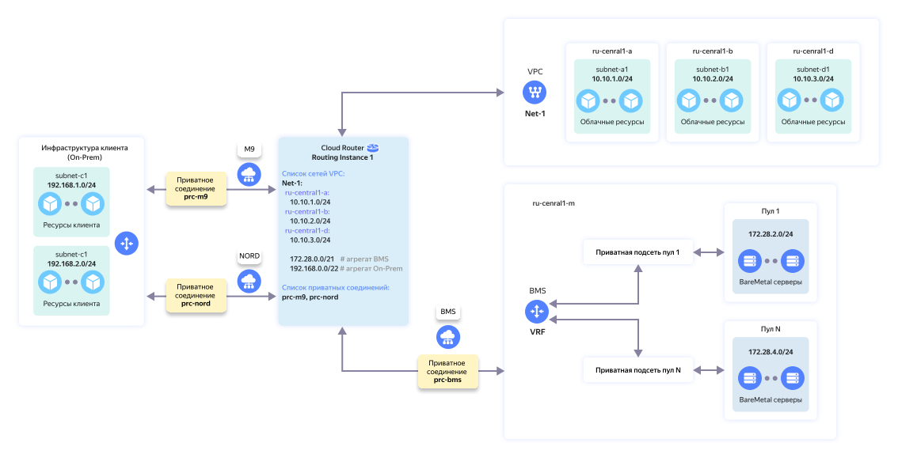

# Организация сетевой связности между подсетями {{ baremetal-full-name }} и on-premises с помощью {{ interconnect-name }}


В данном руководстве вы установите сетевую связность между [сервером](../../baremetal/concepts/servers.md) {{ baremetal-name }}, расположенным в [приватной подсети](../../baremetal/concepts/private-network.md) {{ baremetal-full-name }}, и ресурсами, которые развернуты on-premises. Сетевая связность будет организована с помощью сервисов [{{ interconnect-name }}](../../interconnect/index.yaml) и [{{ cr-name }}](../../cloud-router/index.yaml).

Схема решения:



На схеме выше показана организация сетевого взаимодействия между ресурсами в сегменте {{ baremetal-full-name }} и удаленными ресурсами на площадке клиента, которая подключена к {{ yandex-cloud }} с помощью сервиса {{ interconnect-name }}.

Для организации сетевого взаимодействия между такими ресурсами и виртуальной сетью нужно добавить соответствующие IP-префиксы подсетей {{ vpc-name }} в виртуальный маршрутизатор. Подробнее с организацией такого вида сетевого взаимодействия можно ознакомиться [в документации](../../cloud-router/tutorials/bm-vrf-and-vpc-interconnect.md). 



Предполагается, что подключение on-premises к {{ yandex-cloud }} с помощью сервиса {{ interconnect-name }} уже организовано и работает. У вас должны быть действующие транковое и приватное соединения.



Чтобы настроить сетевую связность между приватными подсетями {{ baremetal-name }} и ресурсами в on-premises с помощью {{ interconnect-name }}, необходимо:

1. [Подготовьте облако к работе](#before-you-begin).
1. [Создайте облачную инфраструктуру](#setup-infrastructure).
1. [Подготовьте виртуальный маршрутизатор](#create-routing-instance).
1. [Создайте приватное соединение](#create-private-connection).
1. [Проверьте сетевую связность](#check-connectivity).

Если созданные ресурсы вам больше не нужны, [удалите их](#clear-out).

## Перед началом работы {#before-you-begin}



### Необходимые платные ресурсы {#paid-resources}

В стоимость инфраструктуры для организации сетевой связности входят:

* плата за аренду сервера {{ baremetal-name }} ([тарифы {{ baremetal-full-name }}](../../baremetal/pricing.md));
* плата за использование {{ interconnect-name }} ([тарифы {{ interconnect-name }}](../../interconnect/pricing.md)).

## Создайте облачную инфраструктуру {#setup-infrastructure}

Создайте необходимую инфраструктуру {{ yandex-cloud }}, в которой вы будете настраивать сетевую связность.

Для настройки понадобятся приватная маршрутизируемая [подсеть](../../baremetal/concepts/private-network.md#private-subnet) и [VRF](../../baremetal/concepts/private-network.md#vrf-segment) в {{ baremetal-name }}, сервер {{ baremetal-name }}, действующее приватное соединение {{ interconnect-name }} и виртуальный маршрутизатор {{ cr-name }}.

### Создайте VRF и приватную подсеть {{ baremetal-name }} {#setup-vrf}

Создайте виртуальный сегмент сети (VRF) и приватную подсеть в [пуле серверов](../../baremetal/concepts/servers.md#server-pools) `{{ region-id }}-m3`:



- Консоль управления {#console}

  1. В [консоли управления]({{ link-console-main }}) выберите каталог, в котором вы будете создавать инфраструктуру.
  1. В списке сервисов выберите **{{ ui-key.yacloud.iam.folder.dashboard.label_baremetal }}**.
  1. Создайте виртуальный сегмент сети:

        1. На панели слева выберите  **{{ ui-key.yacloud.baremetal.label_networks_kHgng }}** и нажмите кнопку **{{ ui-key.yacloud.baremetal.label_create-network }}**.
        1. В поле **{{ ui-key.yacloud.baremetal.field_name }}** задайте имя VRF: `my-vrf`.
        1. Нажмите кнопку **{{ ui-key.yacloud.baremetal.label_create-network }}**.

  1. Создайте приватную подсеть:

        1. На панели слева выберите  **{{ ui-key.yacloud.baremetal.label_subnetworks_uU4LH }}** и нажмите кнопку **{{ ui-key.yacloud.baremetal.label_create-subnetwork }}**.
        1. В поле **{{ ui-key.yacloud.baremetal.field_hardware-pool-id }}** выберите пул серверов `{{ region-id }}-m3`.
        1. В поле **{{ ui-key.yacloud.baremetal.field_name }}** задайте имя подсети: `subnet-m3`.
        1. Включите опцию **{{ ui-key.yacloud.baremetal.title_routing-settings }}**.
        1. В поле **{{ ui-key.yacloud.baremetal.field_network-id }}** выберите созданный ранее сегмент `my-vrf`.
        1. В поле **{{ ui-key.yacloud.baremetal.field_CIDR_rwYMi }}** укажите `192.168.1.0/24`.
        1. В поле **{{ ui-key.yacloud.baremetal.field_gateway_t7LLk }}** оставьте значение по умолчанию `192.168.1.1`.
        1. Включите опцию **{{ ui-key.yacloud.baremetal.field_dhcp-settings }}** и в появившемся поле **{{ ui-key.yacloud.baremetal.field_dhcp-ip-range }}** оставьте значения по умолчанию: `192.168.1.1` — `192.168.1.254`.
        1. Нажмите кнопку **{{ ui-key.yacloud.baremetal.label_create-subnetwork }}**.




### Арендуйте сервер {{ baremetal-name }} {#rent-bms}



- Консоль управления {#console}

  1. В [консоли управления]({{ link-console-main }}) выберите каталог, в котором вы создаете инфраструктуру.
  1. 
  1. Нажмите кнопку **{{ ui-key.yacloud.baremetal.label_create-server }}** и в открывшемся окне выберите вариант `{{ ui-key.yacloud_components.baremetal.StockConfigurations }}` и подходящую [конфигурацию](../../baremetal/concepts/server-configurations.md) сервера {{ baremetal-name }} в пуле серверов `{{ region-id }}-m3`.

      Для этого в фильтре в правой части окна в блоке **{{ ui-key.yacloud_components.baremetal.poolFilter }}** выберите пул серверов `{{ region-id }}-m3`.

      Чтобы выбрать подходящую вам конфигурацию сервера, нажмите на блок с именем этой конфигурации в центральной части экрана.

      

  1. В открывшемся окне с настройками конфигурации сервера:

      1. 
      1. В блоке **{{ ui-key.yacloud.baremetal.title_section-server-product }}** выберите образ. Например: `Ubuntu 24.04`.
      1. 
      1. В блоке **{{ ui-key.yacloud.baremetal.title_section-network-interfaces }}**:

          1. В поле **{{ ui-key.yacloud.baremetal.field_subnet-id }}** выберите созданную ранее подсеть `subnet-m3`.
          1. В поле **{{ ui-key.yacloud.baremetal.field_needed-public-ip }}** выберите `{{ ui-key.yacloud.baremetal.label_public-ip-no }}`.

      1. В блоке **{{ ui-key.yacloud.baremetal.title_server-access }}**:

          

      1. В блоке **{{ ui-key.yacloud.baremetal.title_section-server-info }}** в поле **{{ ui-key.yacloud.baremetal.field_name }}** задайте имя сервера: `server-m3`.
      1. 





Подготовка сервера и установка на него операционной системы может занять до 45 минут — в это время сервер будет находиться в статусе `Provisioning`. После завершения установки ОС сервер перейдет в статус `Ready`.



## Подготовьте виртуальный маршрутизатор {#create-routing-instance}

1. [Проверьте](../../cloud-router/operations/ri-get-info.md), есть ли виртуальный маршрутизатор, через который on-premises подключена к {{ yandex-cloud }}.
1. Если виртуального маршрутизатора нет, [создайте его](../../cloud-router/operations/ri-create.md).
1. Убедитесь, что действующее приватное соединение {{ interconnect-name }} добавлено в выбранный виртуальный маршрутизатор. При необходимости [добавьте его](../../cloud-router/operations/ri-priv-con-add.md).
1. Убедитесь, что ваше сетевое оборудование анонсирует в приватное соединение IP-префиксы on-premises по BGP.

IP-префиксы on-premises поступают в виртуальный маршрутизатор по BGP. Добавлять их как префиксы облачной сети не требуется.

## Создайте приватное соединение {#create-private-connection}

После того как виртуальный маршрутизатор будет подготовлен, создайте [приватное соединение](../../baremetal/concepts/private-network.md#private-connection-to-vpc) {{ interconnect-name }} в сервисе {{ baremetal-name }}:



## Проверьте сетевую связность {#check-connectivity}

После того как статус созданного приватного соединения изменится на `Ready`, сетевая связность между подсетью {{ baremetal-name }} и on-premises будет установлена и вы сможете приступить к ее проверке.

Проверка сетевой связности предполагает, что:

* настройка приватного соединения успешно завершена, а его статус изменился на `Ready`;
* локальный файрвол на сервере {{ baremetal-name }} разрешает прохождение трафика [ICMP](https://ru.wikipedia.org/wiki/ICMP);
* маршрутная таблица в операционной системе сервера {{ baremetal-name }} содержит маршрут до IP-префикса on-premises;
* файрвол на on-premises-ресурсе разрешает прохождение ICMP-трафика из подсети {{ baremetal-name }}.

### Проверьте сетевую связность из приватной подсети {{ baremetal-name }} к ресурсам в on-premises {#check-bms-to-onprem}



- Консоль управления {#console}

  1. В [консоли управления]({{ link-console-main }}) выберите каталог, в котором вы создали инфраструктуру.
  1. В списке сервисов выберите **{{ ui-key.yacloud.iam.folder.dashboard.label_baremetal }}**.
  1. В строке с сервером `server-m3` нажмите значок  и выберите **{{ ui-key.yacloud.baremetal.label_kvm-console_37Kma }}**.
  
      Откроется окно с терминалом KVM-консоли, в котором вы увидите строку аутентификации:
      
      ```
      server-m3 login:
      ```

      Если вы не видите этой строки, попробуйте [перезапустить](../../baremetal/operations/servers/server-stop-and-start.md#restart) сервер.

  1. В терминале KVM-консоли введите имя пользователя `root` и нажмите **ENTER**.
  1. В строке для ввода пароля вставьте сгенерированный при аренде сервера пароль и нажмите **ENTER**. Обратите внимание, что при наборе или вставке пароля в ОС Linux введенные символы не отображаются на экране.

      

      Результат:

      ```text
      Welcome to Ubuntu 24.04.2 LTS (GNU/Linux 6.8.0-53-generic x86_64)
      ...
      root@server-m3:~# _
      ```

      Если вы не сохранили пароль администратора к серверу, вы можете создать новый пароль по [инструкции](../../baremetal/operations/servers/reset-password.md) или [переустановить](../../baremetal/operations/servers/reinstall-os-from-marketplace.md) на сервере операционную систему.
  1. В терминале KVM-консоли выполните команду `ping`, чтобы убедиться в доступности ресурса в on-premises:

      ```bash
      ping <IP-адрес_on-premises-ресурса> -c 5
      ```

      Если пакеты передаются без потерь, сетевая связность от сервера {{ baremetal-name }} к on-premises работает.



### Проверьте сетевую связность от ресурса в on-premises к приватной подсети {{ baremetal-name }} {#check-onprem-to-bms}

На ресурсе в on-premises выполните команду `ping`, чтобы убедиться в доступности сервера `server-m3` по его приватному IP-адресу:

```bash
ping <приватный_IP-адрес_сервера> -c 5
```

Узнать приватный IP-адрес сервера {{ baremetal-name }} можно в консоли управления в блоке **Сетевые настройки** на странице с информацией о сервере.

Если пакеты передаются без потерь, сетевая связность от on-premises к серверу {{ baremetal-name }} работает.

## Как удалить созданные ресурсы {#clear-out}

Чтобы перестать платить за созданные ресурсы:

1. Удалить сервер {{ baremetal-name }} нельзя. Вместо этого [откажитесь](../../baremetal/operations/servers/server-lease-cancel.md) от продления аренды сервера.
1. При необходимости удалите приватное соединение:

    

    - Консоль управления {#console} 
    
      1. В [консоли управления]({{ link-console-main }}) выберите каталог, в котором вы создали инфраструктуру.
      1. В списке сервисов выберите **{{ ui-key.yacloud.iam.folder.dashboard.label_baremetal }}**.
      1. На панели слева выберите  **{{ ui-key.yacloud.baremetal.label_networks_kHgng }}** и выберите виртуальный сегмент сети `my-vrf`.
      1. В блоке **{{ ui-key.yacloud.baremetal.title_vrf-interconnect-section }}** нажмите  и выберите  **{{ ui-key.yacloud.baremetal.action_delete-external-connection }}**.
      1. В открывшемся окне подтвердите удаление.

      В результате статус соединения сменится на `Deleting`. После того как все связи будут удалены, соединение пропадет из списка.

    

1. Если вы создавали виртуальный маршрутизатор специально для этого руководства, [удалите из него приватное соединение](../../cloud-router/operations/ri-priv-con-del.md), а затем [удалите маршрутизатор](../../cloud-router/operations/ri-delete.md).
