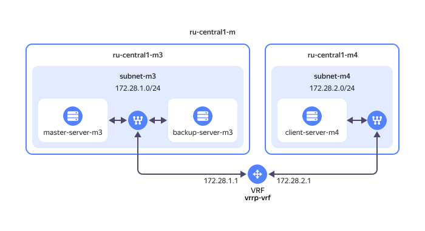

# Настройка VRRP для кластера серверов {{ baremetal-name }} с использованием Keepalived 



Сервис {{ baremetal-full-name }} находится на стадии [Preview](../../overview/concepts/launch-stages.md).



[VRRP](https://ru.wikipedia.org/wiki/VRRP) (Virtual Router Redundancy Protocol) — это сетевой протокол, предназначенный для повышения отказоустойчивости маршрутизаторов, выполняющих роль шлюза по умолчанию. 

Отказоустойчивость достигается за счет объединения в группу двух и более маршрутизаторов в один виртуальный маршрутизатор, который выступает шлюзом по умолчанию для обслуживаемых сегментов сети. Протокол VRRP позволяет создать виртуальный IP-адрес и передавать его между участниками группы, за счет чего повышается доступность шлюза.

В данном руководстве приводится пример организации на [серверах](../../baremetal/concepts/servers.md) {{ baremetal-name }} высокодоступной конфигурации прокси-сервера, в которой функции проксирования симметрично настроены на двух и более узлах [HAProxy](https://ru.wikipedia.org/wiki/HAProxy), а за формирование и передачу виртуального IP-адреса между этими узлами отвечает сервис [Keepalived](https://keepalived.org/).

## Схема решения {#solution-overview}



В зоне доступности `{{ region-id }}-m` вы настроите окружение из двух [приватных подсетей](../../baremetal/concepts/network.md#private-subnet) `subnet-m3` и `subnet-m4`, созданных соответственно в [пулах серверов](../../baremetal/concepts/servers.md#server-pools) `{{ region-id }}-m3` и `{{ region-id }}-m4`. Эти подсети вы объедините в [виртуальный фрагмент сети](../../baremetal/concepts/network.md#vrf-segment) (VRF) `vrrp-vrf`.

В подсети `subnet-m3` вы создадите два сервера {{ baremetal-name }} — `master-server-m3` и `backup-server-m3`, которые соответственно будут выполнять роли `MASTER` и `BACKUP` в VRRP-группе. На двух этих серверах вы запустите сервис Keepalived и настроите с его помощью виртуальный IP-адрес для  группы серверов в пуле `{{ region-id }}-m3`.

В подсети `subnet-m4` в пуле серверов `{{ region-id }}-m4` вы создадите сервер {{ baremetal-name }} `client-server-m4`, который будет выступать в качестве клиента при использовании виртуального IP-адреса, созданного в пуле `{{ region-id }}-m3`.

Данное решение позволяет продемонстрировать комплексную работу клиентского изолированного VRF с маршрутизацией уровня L3 [сетевой модели OSI](https://ru.wikipedia.org/wiki/Сетевая_модель_OSI) между пулами серверов `{{ region-id }}-m3` и `{{ region-id }}-m4`, а также работу широковещательного протокола VRRP на уровне L2 в пуле серверов `{{ region-id }}-m3`.



Распространение широковещательного трафика (на уровне L2 сетевой модели OSI) происходит только в пределах одного пула серверов и только для группы серверов, находящихся в одной и той же сети.



Чтобы настроить отказоустойчивый кластер серверов {{ baremetal-name }} с использованием VRRP:

1. [Подготовьте облако к работе](#before-you-begin).
1. [Создайте виртуальный сетевой сегмент](#create-vrf).
1. [Создайте приватные подсети](#create-subnetworks).
1. [Арендуйте серверы {{ baremetal-name }}](#rent-servers).
1. [Настройте Keepalived на серверах пула {{ region-id }}-m3](#setup-keepalived).
1. [Убедитесь в работоспособности решения](#test-solution).

См. также [Как отказаться от аренды серверов](#clear-out).

## Перед началом работы {#before-you-begin}



### Необходимые платные ресурсы {#paid-resources}

В стоимость предлагаемого решения входит плата за аренду серверов {{ baremetal-name }} (см. [тарифы {{ baremetal-full-name }}](../../baremetal/pricing.md)).

## Создайте виртуальный сетевой сегмент {#create-vrf}

Чтобы связать несколько приватных подсетей на уровне L3 сетевой модели OSI, их необходимо объединить в виртуальный фрагмент сети (VRF).

Создайте новый VRF:



- Консоль управления {#console}

  1. В [консоли управления]({{ link-console-main }}) выберите каталог, в котором вы будете создавать инфраструктуру.
  1. В списке сервисов выберите **{{ ui-key.yacloud.iam.folder.dashboard.label_baremetal }}**.
  1. На панели слева выберите  **{{ ui-key.yacloud.baremetal.label_networks }}** и нажмите кнопку **{{ ui-key.yacloud.baremetal.label_create-network }}**.
  1. В поле **{{ ui-key.yacloud.baremetal.field_name }}** задайте имя VRF: `vrrp-vrf`.
  1. Нажмите кнопку **{{ ui-key.yacloud.baremetal.label_create-network }}**.



## Создайте приватные подсети {#create-subnetworks}

Создайте две приватные подсети в разных [пулах серверов](../../baremetal/concepts/servers.md#server-pools) и добавьте их в созданный ранее виртуальный фрагмент сети:



- Консоль управления {#console}

  1. В [консоли управления]({{ link-console-main }}) выберите каталог, в котором вы создаете инфраструктуру.
  1. В списке сервисов выберите **{{ ui-key.yacloud.iam.folder.dashboard.label_baremetal }}**.
  1. На панели слева выберите  **{{ ui-key.yacloud.baremetal.label_subnetworks }}** и нажмите кнопку **{{ ui-key.yacloud.baremetal.label_create-subnetwork }}**.
  1. В поле **{{ ui-key.yacloud.baremetal.field_server-pool }}** выберите пул серверов `{{ region-id }}-m3`.
  1. В поле **{{ ui-key.yacloud.baremetal.field_name }}** задайте имя подсети: `subnet-m3`.
  1. Включите опцию **{{ ui-key.yacloud.baremetal.title_routing-settings }}**.
  1. В поле **{{ ui-key.yacloud.baremetal.field_network-id }}** выберите созданный ранее сегмент `vrrp-vrf`.
  1. В поле **{{ ui-key.yacloud.baremetal.field_CIDR }}** укажите `172.28.1.0/24`.
  1. Нажмите кнопку **{{ ui-key.yacloud.baremetal.label_create-subnetwork }}**.
  1. Аналогичным образом создайте приватную подсеть `subnet-m4` в пуле серверов `{{ region-id }}-m4` c CIDR `172.28.2.0/24`.



## Арендуйте серверы {{ baremetal-name }} {#rent-servers}



- Консоль управления {#console}

  1. В [консоли управления]({{ link-console-main }}) выберите каталог, в котором вы создаете инфраструктуру.
  1. 
  1. В поле **{{ ui-key.yacloud.baremetal.field_server-pool }}** выберите пул серверов `{{ region-id }}-m3`.
  1. 
  1. 
  1. В блоке **{{ ui-key.yacloud.baremetal.title_section-server-product }}** выберите образ `Ubuntu 24.04`.
  1. 
  1. В блоке **{{ ui-key.yacloud.baremetal.title_section-server-network-settings }}**:

     1. В поле **{{ ui-key.yacloud.baremetal.field_subnet-id }}** выберите созданную ранее подсеть `subnet-m3`.
     1. В поле **{{ ui-key.yacloud.baremetal.field_needed-public-ip }}** выберите `{{ ui-key.yacloud.baremetal.label_public-ip-ephemeral }}`.

  1. В блоке **{{ ui-key.yacloud.baremetal.title_server-access }}**:
  
      

  1. В блоке **{{ ui-key.yacloud.baremetal.title_section-server-info }}** в поле **{{ ui-key.yacloud.baremetal.field_name }}** задайте имя сервера: `master-server-m3`.
  1. 
  1. Аналогичным способом арендуйте еще два сервера: с именем `backup-server-m3` в пуле серверов `{{ region-id }}-m3` и с именем `client-server-m4` и подсетью `subnet-m4` в пуле серверов `{{ region-id }}-m4`.



На открывшейся странице со списком серверов {{ baremetal-name }} отобразится информация обо всех созданных серверах. В поле **{{ ui-key.yacloud.baremetal.field_needed-public-ip }}** таблицы скопируйте публичные IP-адреса серверов — они понадобятся для подключения к серверам по SSH.



Подготовка серверов и установка на них операционных систем может занять до 45 минут — в это время серверы будут находиться в статусе `Provisioning`. После завершения установки ОС серверы перейдут в статус `Ready`.



## Настройте Keepalived на серверах пула {{ region-id }}-m3 {#setup-keepalived}

На этом этапе вы установите, настроите и запустите сервис [Keepalived](https://keepalived.org/) на серверах, созданных в пуле `{{ region-id }}-m3`.

Используйте приведенную ниже инструкцию, чтобы настроить оба сервера — `master-server-m3` и `backup-server-m3`.

1. [Подключитесь](../../compute/operations/vm-connect/ssh.md) к серверу по SSH, использовав сохраненный на предыдущем шаге публичный IP-адрес этого сервера.
1. Установите сервис Keepalived, выполнив команду:

    ```bash
    sudo apt update && sudo apt install keepalived -y
    ```
1. Посмотрите список сетевых интерфейсов сервера:

    ```bash
    ip a
    ```

    Результат:

    ```text
    ...
    5: etx2: <BROADCAST,MULTICAST,UP,LOWER_UP> mtu 1500 qdisc mq state UP group default qlen 1000
        link/ether 00:02:c9:35:fd:31 brd ff:ff:ff:ff:ff:ff
        altname enp6s0d1
        inet 172.28.1.2/24 metric 100 brd 172.28.1.255 scope global dynamic etx2
           valid_lft 3512sec preferred_lft 3512sec
        inet6 fe80::202:c9ff:fe35:fd31/64 scope link
           valid_lft forever preferred_lft forever
    ```

    В выводе команды найдите интерфейс с IP-адресом, относящимся к диапазону `172.28.1.0/24`, назначенному приватной подсети `subnet-m3`. В примере выше это интерфейс с идентификатором `etx2`. Идентификатор интерфейса понадобится далее, при настройке Keepalived.
1. Создайте файл конфигурации Keepalived:

    ```
    sudo nano /etc/keepalived/keepalived.conf
    ```
1. Добавьте в созданный файл следующую конфигурацию:

    

    - Master

      ```text
      vrrp_instance M3_1 {
          state MASTER
          interface etx2
          virtual_router_id 51
          priority 100
          advert_int 1

          authentication {
              auth_type PASS
              auth_pass hGoVjTjSYQq3Epm
          }

          virtual_ipaddress {
              172.28.1.254
          }

          preempt
      }
      ```

    - Backup

      ```text
      vrrp_instance M3_2 {
          state BACKUP
          interface etx2
          virtual_router_id 51
          priority 90
          advert_int 1

          authentication {
              auth_type PASS
              auth_pass hGoVjTjSYQq3Epm
          }

          virtual_ipaddress {
              172.28.1.254
          }

          preempt
      }
      ```

    

    Где:

    * `vrrp_instance` — имя виртуального маршрутизатора:
    
        * для сервера с ролью `MASTER` — `M3_1`
        * для сервера с ролью `BACKUP` — `M3_2`
    * `state` — состояние сервера: `MASTER` или `BACKUP`.
    * `interface` — идентификатор сетевого интерфейса, на котором будет работать виртуальный IP-адрес. В примере выше — `etx2`.
    * `virtual_router_id` — уникальный идентификатор VRRP для группы виртуальных маршрутизаторов. Значение должно совпадать для всех серверов в группе.
    * `priority` — приоритет, позволяющий определить основной и резервный узлы. Установка приоритета на уровне `100` делает сервер основным узлом, на `90` — резервным.
    * `advert_int` — интервал объявления состояния в секундах.
    * `authentication` — секция с настройками аутентификации для обеспечения безопасности. Содержимое секции должно совпадать для всех серверов в группе.
    * `virtual_ipaddress` — виртуальный IP-адрес, который будет управляться этим узлом. Виртуальный IP-адрес:

        * должен относиться к диапазону CIDR, заданному для виртуальной подсети, в которой создана группа северов;
        * должен быть не занят;
        * должен совпадать для всех серверов в группе.
    * `preempt` — позволяет серверу перейти в состояние `MASTER`, если его приоритет оказывается выше чем у текущего мастера в группе.
1. Перезапустите сервис Keepalived:

    ```bash
    systemctl restart keepalived.service
    ```
1. Посмотрите журнал логов сервиса Keepalived, чтобы убедиться, что сервис запущен:

    ```bash
    sudo journalctl -u keepalived.service
    ```

    Результат:

    

    - Master

      ```text
      systemd[1]: keepalived.service - Keepalive Daemon (LVS and VRRP) was skipped because of an unmet condition check (ConditionFileNotEmpty=/etc/keepalived/keepalived.conf).
      systemd[1]: Starting keepalived.service - Keepalive Daemon (LVS and VRRP)...
      Keepalived[4045]: Starting Keepalived v2.2.8 (04/04,2023), git commit v2.2.7-154-g292b299e+
      Keepalived[4045]: Running on Linux 6.8.0-53-generic #55-Ubuntu SMP PREEMPT_DYNAMIC Fri Jan 17 15:37:52 UTC 2025 (built for Linux 6.8.0)
      Keepalived[4045]: Command line: '/usr/sbin/keepalived' '--dont-fork'
      Keepalived[4045]: Configuration file /etc/keepalived/keepalived.conf
      Keepalived[4045]: NOTICE: setting config option max_auto_priority should result in better keepalived performance
      Keepalived[4045]: Starting VRRP child process, pid=4046
      Keepalived_vrrp[4046]: (/etc/keepalived/keepalived.conf: Line 10) Truncating auth_pass to 8 characters
      Keepalived[4045]: Startup complete
      systemd[1]: Started keepalived.service - Keepalive Daemon (LVS and VRRP).
      Keepalived_vrrp[4046]: (M3_1) Entering BACKUP STATE (init)
      Keepalived_vrrp[4046]: (M3_1) Entering MASTER STATE
      ```

    - Backup

      ```text
      systemd[1]: keepalived.service - Keepalive Daemon (LVS and VRRP) was skipped because of an unmet condition check (ConditionFileNotEmpty=/etc/keepalived/keepalived.conf).
      systemd[1]: Starting keepalived.service - Keepalive Daemon (LVS and VRRP)...
      Keepalived[2751]: Starting Keepalived v2.2.8 (04/04,2023), git commit v2.2.7-154-g292b299e+
      Keepalived[2751]: Running on Linux 6.8.0-53-generic #55-Ubuntu SMP PREEMPT_DYNAMIC Fri Jan 17 15:37:52 UTC 2025 (built for Linux 6.8.0)
      Keepalived[2751]: Command line: '/usr/sbin/keepalived' '--dont-fork'
      Keepalived[2751]: Configuration file /etc/keepalived/keepalived.conf
      Keepalived[2751]: NOTICE: setting config option max_auto_priority should result in better keepalived performance
      Keepalived[2751]: Starting VRRP child process, pid=2752
      Keepalived_vrrp[2752]: (/etc/keepalived/keepalived.conf: Line 10) Truncating auth_pass to 8 characters
      Keepalived[2751]: Startup complete
      Keepalived_vrrp[2752]: (M3_2) Entering BACKUP STATE (init)
      ```

    

## Убедитесь в работоспособности решения {#test-solution}

1. Убедитесь, что виртуальный IP-адрес был добавлен к сетевому интерфейсу сервера с ролью `Master`:
    1. [Подключитесь](../../compute/operations/vm-connect/ssh.md) по SSH к серверу `master-server-m3`.
    1. Посмотрите конфигурацию сетевого интерфейса, назначенного приватной подсети `subnet-m3`.

        ```bash
        ip a
        ```

        Результат:

        ```text
        ...
        5: etx2: <BROADCAST,MULTICAST,UP,LOWER_UP> mtu 1500 qdisc mq state UP group default qlen 1000
            link/ether 00:02:c9:35:fd:31 brd ff:ff:ff:ff:ff:ff
            altname enp6s0d1
            inet 172.28.1.2/24 metric 100 brd 172.28.1.255 scope global dynamic etx2
            valid_lft 3575sec preferred_lft 3575sec
            inet 172.28.1.254/32 scope global etx2
            valid_lft forever preferred_lft forever
            inet6 fe80::202:c9ff:fe35:fd31/64 scope link
            valid_lft forever preferred_lft forever
        ```

        Сетевой интерфейс получил дополнительный виртуальный IP-адрес, который был задан в настройках Keepalived — `172.28.1.254/32`.

1. С помощью [ICMP](https://ru.wikipedia.org/wiki/ICMP)-запросов из приватной подсети `subnet-m4` убедитесь в доступности виртуального IP-адреса, расположенного в приватной подсети `subnet-m3`:

    1. [Подключитесь](../../compute/operations/vm-connect/ssh.md) по SSH к серверу `client-server-m4`.
    1. Выполните команду:

        ```bash
        ping 172.28.1.254 -s 1024 -c 5
        ```

        Результат:

        ```text
        PING 172.28.1.254 (172.28.1.254) 1024(1052) bytes of data.
        1032 bytes from 172.28.1.254: icmp_seq=1 ttl=62 time=0.211 ms
        1032 bytes from 172.28.1.254: icmp_seq=2 ttl=62 time=0.242 ms
        1032 bytes from 172.28.1.254: icmp_seq=3 ttl=62 time=0.264 ms
        1032 bytes from 172.28.1.254: icmp_seq=4 ttl=62 time=0.312 ms
        1032 bytes from 172.28.1.254: icmp_seq=5 ttl=62 time=0.273 ms

        --- 172.28.1.254 ping statistics ---
        5 packets transmitted, 5 received, 0% packet loss, time 4117ms
        rtt min/avg/max/mdev = 0.211/0.260/0.312/0.033 ms
        ```

        Использованная команда отправляет и получает пакеты увеличенного размера: все пакеты были доставлены без потерь.

1. Убедитесь в корректной работе балансировщика Keepalived:

    1. [Подключитесь](../../compute/operations/vm-connect/ssh.md) по SSH к серверу `client-server-m4`.
    1. В отдельном окне терминала [подключитесь](../../compute/operations/vm-connect/ssh.md) по SSH к серверу `master-server-m3`.

        Расположите окна терминала так, чтобы одновременно видеть содержимое обоих окон.
    1. В окне терминала с сессией подключения к серверу `client-server-m4` повторно запустите утилиту `ping` без ограничения на количество повторений:

        ```bash
        ping 172.28.1.254 -s 1024
        ```

        В процессе выполнения этого опроса в окне терминала с открытой сессией подключения к серверу `master-server-m3` остановите сервис Keepalived, выполнив команду:
        
        ```bash
        sudo systemctl stop keepalived
        ```
        
        В момент остановки сервиса наблюдайте за окном терминала с сессией подключения к `client-server-m4`. Результатом корректной работы процесса по передаче виртуального IP-адреса должно быть практически бесшовное переключение ICMP-запросов на резервный хост, при этом выполнение команды `ping` не должно прерваться.
        
        

        Допускается минимальная потеря пакетов (1-3), что обусловлено срабатыванием таймера выбора нового `MASTER` в группе и передаче ему виртуального адреса.

        

        Результат:

        ```text
        PING 172.28.1.254 (172.28.1.254) 1024(1052) bytes of data.
        1032 bytes from 172.28.1.254: icmp_seq=1 ttl=62 time=0.249 ms
        ...
        1032 bytes from 172.28.1.254: icmp_seq=56 ttl=62 time=0.224 ms
        1032 bytes from 172.28.1.254: icmp_seq=57 ttl=62 time=0.314 ms
        1032 bytes from 172.28.1.254: icmp_seq=58 ttl=62 time=0.278 ms
        ^C
        --- 172.28.1.254 ping statistics ---
        58 packets transmitted, 55 received, 5.17241% packet loss, time 58368ms
        rtt min/avg/max/mdev = 0.185/0.271/0.326/0.035 ms
        ```
    1. В окне терминала с открытой сессией подключения к серверу `master-server-m3` запустите сервис Keepalived, выполнив команду:

        ```bash
        sudo systemctl start keepalived
        ```
1. Проверьте журнал логов сервиса Keepalived на сервере с ролью `BACKUP`:

    1. [Подключитесь](../../compute/operations/vm-connect/ssh.md) по SSH к серверу `backup-server-m3`.
    1. Посмотрите журнал логов сервиса Keepalived:

        ```bash
        sudo journalctl -u keepalived.service
        ```

        Результат:

        ```text
        ...
        # регистрация события о переключении на MASTER в момент остановки сервиса на исходном основном узле
        Feb 19 07:08:07 backup-server-m3 Keepalived_vrrp[2752]: (M3_2) Entering MASTER STATE

        # регистрация события о переключении на BACKUP при восстановлении работы сервиса на исходном основном узле
        Feb 19 07:08:31 backup-server-m3 Keepalived_vrrp[2752]: (M3_2) Master received advert from 172.28.1.2 with higher priority 100, ours 90
        Feb 19 07:08:31 backup-server-m3 Keepalived_vrrp[2752]: (M3_2) Entering BACKUP STATE
        ...
        ```

        Как видно из журнала работы сервиса и добавленных в него комментариев, после остановки сервиса Keepalived на сервере `master-server-m3`, роль основного узла перешла к серверу `backup-server-m3`. После восстановления работоспособности сервиса на сервере `master-server-m3` роль основного узла была ему возвращена, а сервер `backup-server-m3` вновь стал резервным.

## Как отказаться от аренды серверов {#clear-out}

Удалить серверы {{ baremetal-name }} нельзя. Вместо этого можно отказаться от продления их аренды.

Чтобы перестать платить за созданные ресурсы, [откажитесь](../../baremetal/operations/servers/server-lease-cancel.md) от продления аренды созданных ранее серверов {{ baremetal-name }}.